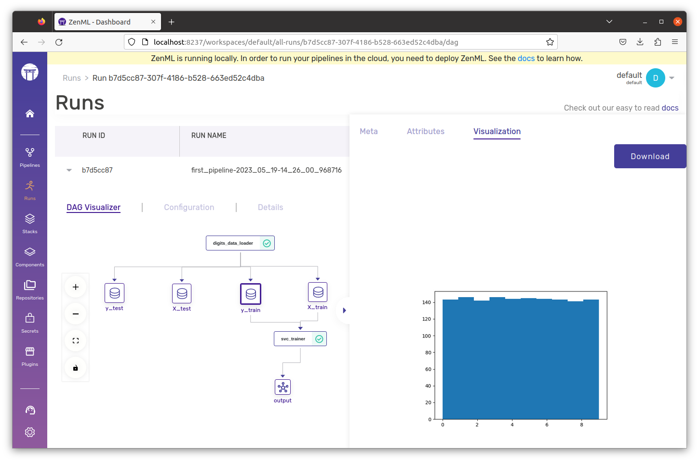

# Create an ML Pipeline

In this section, we build out the first ML pipeline. For this, let's get the imports out of the way first:

```python
import numpy as np

from sklearn.datasets import load_digits
from sklearn.model_selection import train_test_split
from sklearn.base import ClassifierMixin
from sklearn.svm import SVC

from zenml.pipelines.new import pipeline
from zenml.steps import Output, step
```

Make sure to install the requirements as well:

```bash
pip install matplotlib
zenml integration install sklearn
```

In this case, ZenML has an integration with `sklearn` so you can use the ZenML CLI to install the right version directly.

#### Steps with multiple outputs

Sometimes a step will have multiple outputs. In order to give each output a unique name, use the `Output()` Annotation. Here we load an open-source dataset and split it into a train and a test dataset.

<pre class="language-python"><code class="lang-python"><strong>@step
</strong>def digits_data_loader() -> Output(
    X_train=np.ndarray, X_test=np.ndarray, y_train=np.ndarray, y_test=np.ndarray
):
    """Loads the digits dataset and splits it into train and test data."""
    # Load data from the digits dataset
    digits = load_digits()
    # Transform these images into flattened numpy arrays
    data = digits.images.reshape((len(digits.images), -1))
    # Split into datasets
    X_train, X_test, y_train, y_test = train_test_split(
        data, digits.target, test_size=0.2, shuffle=False
    )
    return X_train, X_test, y_train, y_test
</code></pre>

#### Parametrizing a step

Here we are creating a training step for a support vector machine classifier with `sklearn`. As we might want to adjust the hyperparameter `gamma` later on, we define it as an input value to the step as well.

```python
@step
def svc_trainer(
    X_train: np.ndarray,
    y_train: np.ndarray,
    gamma: float = 0.001,
) -> ClassifierMixin:
    """Train a sklearn SVC classifier."""
    
    # instantiate a support vector machine model    
    model = SVC(gamma=gamma)
    # Train on the training dataset
    model.fit(X_train, y_train)
    return model
```


If you want to run the step function outside the context of a ZenML pipeline, all you need to do is call the `.entrypoint()` method with the same input signature. For example:

```python
svc_trainer.entrypoint(X_train=..., y_train=...)
```


Next, we will combine our two steps into a pipeline and run it. As you can see, the parameter gamma is configurable as a pipeline input.

```python
@pipeline
def first_pipeline(gamma: float = 0.002):
    X_train, X_test, y_train, y_test = digits_data_loader()
    svc_trainer(gamma=gamma, X_train=X_train, y_train=y_train)
    
if __name__ == "__main__":
    first_pipeline(gamma=0.0015)
```


Best Practice: Always nest the actual execution of the pipeline inside an `if __name__ == "__main__"` condition. This ensures that loading the pipeline from elsewhere does not also run it.

```python
if __name__ == "__main__":
    first_pipeline()
```


Running it like this `python main.py` should look somewhat like this in the terminal.

<pre class="language-sh" data-line-numbers><code class="lang-sh"><strong>Registered new pipeline with name `first_pipeline`.
</strong>.
.
.
Pipeline run `first_pipeline-2023_04_29-09_19_54_273710` has finished in 0.236s.
</code></pre>

In the dashboard, you should now be able to see this new run, along with its runtime configuration and some visualizations.

<figure><figcaption><p>Run created by the code in this section along with a visualization of the ground-truth distribution.</p></figcaption></figure>

#### Give each pipeline run a name

In the output logs of a pipeline run you will see the name of the run:

```bash
Pipeline run `first_pipeline-2023_04_29-09_19_54_273710` has finished in 0.236s.
```

This name is automatically generated based on the current date and time. To change the name for a run, pass `run_name` as a parameter to the `run()` function:

```python
first_pipeline_instance.run(run_name="custom_pipeline_run_name")
```

Pipeline run names must be unique, so if you plan to run your pipelines multiple times or run them on a schedule, make sure to either compute the run name dynamically or include one of the following placeholders that ZenML will replace:

* `{{date}}` will resolve to the current date, e.g. `2023_02_19`
* `{{time}}` will resolve to the current time, e.g. `11_07_09_326492`

```python
first_pipeline_instance.run(run_name="custom_pipeline_run_name_{{date}}_{{time}}")
```

## Code Example

The following example shows caching in action with the code example from the previous section.

<details>

<summary>Code Example of this Section</summary>

```python
import numpy as np
from sklearn.datasets import load_digits
from sklearn.model_selection import train_test_split
from sklearn.base import ClassifierMixin
from sklearn.svm import SVC

from zenml.pipelines.new import pipeline
from zenml.steps import Output, step


@step
def digits_data_loader() -> Output(
    X_train=np.ndarray, X_test=np.ndarray, y_train=np.ndarray, y_test=np.ndarray
):
    """Loads the digits dataset and splits it into train and test data."""
    # Load data from the digits dataset
    digits = load_digits()
    # transform these images into flattened numpy arrays
    data = digits.images.reshape((len(digits.images), -1))
    # split into datasets
    X_train, X_test, y_train, y_test = train_test_split(
        data, digits.target, test_size=0.2, shuffle=False
    )
    return X_train, X_test, y_train, y_test


@step
def svc_trainer(
        X_train: np.ndarray,
        y_train: np.ndarray,
        gamma: float = 0.001,
) -> ClassifierMixin:
    """Train a sklearn SVC classifier."""

    # instantiate a support vector machine model
    model = SVC(gamma=gamma)
    # Train on the train dataset
    model.fit(X_train, y_train)
    return model


@pipeline
def first_pipeline(gamma: float = 0.002):
    X_train, X_test, y_train, y_test = digits_data_loader()
    svc_trainer(gamma=gamma, X_train=X_train, y_train=y_train)

if __name__ == "__main__":
    first_pipeline()

    # Step one will use cache, step two will rerun due to the decorator config
    first_pipeline()
```

</details>
