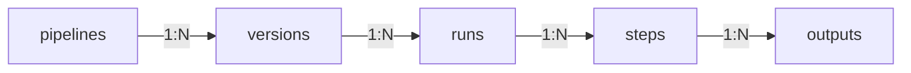


This is an older version of the ZenML documentation. To read and view the latest version please [visit this up-to-date URL](https://docs.zenml.io).



# Fetch runs after execution

Once a pipeline run has been completed, we can interact with it from code using the post-execution utilities. The hierarchy is as follows:



As you can see from the diagram, there are many layers of 1-to-N relationships. To get a specific output you need to know exactly which step in which run of which specific pipeline version to use.

Let us investigate how to traverse this hierarchy level by level:

## Pipelines

ZenML keeps a collection of all created pipelines. With `get_pipeline()` you can get a specific pipeline.

#### List all pipelines

You can also access a list of all your pipelines through the CLI by executing the following command on the terminal:

```shell
zenml pipeline list
```

Or directly from code

```python
from zenml.post_execution import get_pipelines

pipelines = get_pipelines()
```


Pipelines are sorted from oldest to newest. For this sorting, it matters which pipeline had the first **initial** run.


#### Get a pipeline

```python
from zenml.post_execution import get_pipeline

# This way you can get a pipeline by name
pipeline_x = get_pipeline(pipeline="first_pipeline")
```


Instead of passing the name of the pipeline in, you can also directly use the pipeline instance `get_pipeline(pipeline=first_pipeline)`.


## Versions

Each pipeline can have many versions. Let's print out the contents of the `PipelineView`:

```python
print(pipeline_x.versions)
```

This should return the following:

<pre class="language-bash"><code class="lang-bash"><strong>[PipelineVersionView(id=..., name=first_pipeline, version=2),
</strong> PipelineVersionView(id=..., name=first_pipeline, version=1)]
</code></pre>

This is how we'll access one specific version:

```python
latest_version = pipeline_x.versions[0]
```


The sorting of **versions** on a `PipelineView` is from **newest** to **oldest** with the most recent versions at the beginning of the list.


## Runs

#### Getting runs from a fetched pipeline version

Each pipeline version can be executed many times. You can get a list of all runs using the `runs` attribute of a `PipelineVersionView`:

```python
print(latest_version.runs)
```

This should return the following:

<pre class="language-bash"><code class="lang-bash">[PipelineRunView(id=..., name=scipy_example_pipeline-...),
<strong> PipelineRunView(id=..., name=scipy_example_pipeline-...)] ]
</strong></code></pre>

And this is how we access the most recent run

```
last_run = latest_version.runs[0]
```


The sorting of **runs** on a `PipelineVersionView` is from **newest** to **oldest** with the most recent runs at the beginning of the list.


#### Getting runs from a pipeline instance:

Alternatively, you can also access the runs from the pipeline class/instance itself:

```python
from zenml import pipeline


# Definition of pipeline
@pipeline
def example_pipeline(...):
    ...


# Run the pipeline
example_pipeline(...)

# get all runs of the pipeline chronologically ordered
runs = pipe.get_runs()

# get the last run by index, runs are ordered by execution time in ascending order
last_run = runs[0]
```

#### Directly getting a run

Finally, you can also access a run directly with the `get_run(run_name=...)`:

```python
from zenml.post_execution import get_run, get_unlisted_runs

run = get_run(run_name="my_run_name")
run = get_unlisted_runs()[0]  # Get last unlisted run
```

#### Use the CLI

You can also access your runs through the CLI by executing the following command on the terminal:

```shell
zenml pipeline runs list
zenml pipeline runs list -p <MY_PIPELINE_NAME_OR_ID>
```


**Runs configuration**

Each run has a collection of useful metadata which you can access to ensure all runs are reproducible.


#### Git SHA

The [Git commit SHA](https://www.mikestreety.co.uk/blog/the-git-commit-hash/) that the pipeline run was performed on. This will only be set if the pipeline code is in a git repository and there are no uncommitted files when running the pipeline.

```python
commit = run.git_sha
```

#### Status

The status of a pipeline run can also be found here. There are four possible states: failed, completed, running, and cached:

```python
status = run.status
```

#### Configuration

The `pipeline_configuration` is an object that contains all configurations of the pipeline and pipeline run, including [pipeline-level `BaseSettings`](../advanced-guide/configure-steps-pipelines.md), which we will learn more about later. You can also access the settings directly via the `settings` variable.

```python
pipeline_config = run.pipeline_configuration
pipeline_settings = run.settings
```

#### Docstring

If you wrote a docstring into your pipeline function, you can retrieve it here as well:

```python
pipeline_docstring = run.docstring
```

#### Component-specific metadata

Depending on the stack components you use, you might have additional component-specific metadata associated with your run, such as the URL to the UI of a remote orchestrator. You can access this component-specific metadata via the `metadata` attribute:

```python
run_metadata = run.metadata
# The following only works for runs on certain remote orchestrators
orchestrator_url = run_metadata["orchestrator_url"]
```

## Steps

Within a given pipeline run you can now further zoom in on individual steps using the `steps` attribute or by querying a specific step using the `get_step(step=...)` method.

```python
# get all steps of a pipeline for a given run
steps = run.steps

# get the step that was executed first
first_step = steps[0]

# or get a specific step by its name
step = run.get_step(step="first_step")
```


The step `name` refers to the pipeline attribute which might differ from the actual step implementation name.



The steps are ordered by the time of execution. Depending on the [orchestrator](../component-guide/orchestrators/orchestrators.md), steps can be run in parallel. Thus, accessing steps by an index is **unreliable** across different runs. You should access steps by the step class, an instance of the class, or even the name of the step as a string: `get_step(step=...)`instead.


Similar to the run, for reproducibility, you can use the `step` object to access:

* The parameters used to run the step via `step.parameters`,
* The step-level settings via `step.step_configuration`,
* Component-specific step metadata, such as the URL of an experiment tracker or model deployer, via `step.metadata`,
* Input and output artifacts.

## Outputs

Finally, this is how you can inspect the output of a step:

* If there only is a single output, use the `output` attribute
* If there are multiple outputs, use the `outputs` attribute, which is a dictionary that can be indexed using the name of an output:

```python
# The outputs of a step
# If there are multiple outputs they are accessible by name
output = step.outputs["output_name"]

# If there is only one output, use the `.output` property instead 
output = step.output

# read the value into memory
output.read()  
```


The names of the outputs can be found in the `Output` typing of your steps:

```python
from zenml import step
from zenml.steps import Output


@step
def some_step() -> Output(output_name=int):
    ...
```


#### Visualizing Artifacts

ZenML automatically saves visualizations for many common data types. For instance, 3D NumPy Arrays with three channels are automatically visualized as images and data validation reports as embedded HTML visualizations. In Jupyter Notebooks, you can view the visualization of an artifact using the `visualize()` method:

```python
output.visualize()
```


If you want to visualize multiple artifacts generated by the same step or pipeline run, you can also call `visualize()` on the step or run directly:

```python
step.visualize()  # visualizes all outputs of the step
run.visualize()  # visualizes all artifacts produced by this run
```


In all other runtime environments, please open your ZenML dashboard using `zenml up` and view the visualizations by clicking on the respective artifact in the pipeline run DAG.

#### Output Artifact Metadata

All output artifacts saved through ZenML will automatically have certain datatype-specific metadata saved with them. NumPy Arrays, for instance, always have their storage size, `shape`, `dtype`, and some statistical properties saved with them. You can access such metadata via the `metadata` attribute of an output, e.g.:

```python
output_metadata = output.metadata
storage_size = output_metadata["storage_size"]
```

## Code Example

Putting it all together, this is how we can access the output of the last step of our example pipeline from the previous sections:

```python
from zenml.post_execution import get_pipeline

pipeline = get_pipeline(pipeline="first_pipeline")
last_run = pipeline.runs[0]
last_step = last_run.steps[-1]
model = last_step.output.read()
```

or alternatively:

```python
# Definition of pipeline
@pipeline
def example_pipeline(...):
    ...


# Run the pipeline
example_pipeline()

# Get the first step
step_1 = example_pipeline.get_runs()[0].get_step(step="step_1")
output = step_1.output.read()
```

## Final note

While most of this document has been focusing on the so-called post-execution workflow (i.e. fetching objects after a pipeline has been completed), it can also be used within the context of a running pipeline.

This is often desirable in cases where a pipeline is running continuously over time and decisions have to be made according to older runs.

E.g., we can fetch from within a step the last pipeline run for the same pipeline:

```python
from zenml.post_execution import get_pipeline
from zenml.environment import Environment


@step
def my_step():
    # Fetch the current pipeline
    p = get_pipeline('pipeline_name')

    # Fetch an older run
    older_run = p.runs[-2]  # -1 will be the current run

    # Use the older run to make a decision
    ...
```

You can get a lot more metadata within a step as well, something we'll learn in more detail in the [advanced docs](../advanced-guide/fetch-metadata-within-steps.md).
