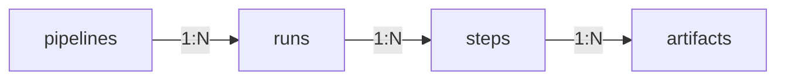

# Fetch runs after execution

Once a pipeline run has been completed, we can access the corresponding
information in code, which enables several use cases:
- Loading artifacts like models or datasets saved by previous runs
- Accessing metadata or config information of previous runs
- Programmatically inspecting the lineage of pipeline runs and their artifacts

The hierarchy of pipelines, runs, steps, and artifacts is as follows:


As you can see from the diagram, there are many layers of 1-to-N relationships. 

Let us investigate how to traverse this hierarchy level-by-level:

## Pipelines

ZenML automatically tracks and versions all pipelines that you run.

### Access Pipeline From Class 

After you have run a pipeline at least once, you can access all the information
associated with this pipeline through the corresponding
[PipelineResponseModel](https://github.com/zenml-io/zenml/blob/main/src/zenml/models/pipeline_models.py)
that you can access via the pipeline's `model` property:

```python
@pipeline
def my_pipeline():
    ...

my_pipeline()

# get the model of the pipeline
pipeline_model = my_pipeline.model

# find information about the pipeline
name = pipeline_model.name
version = pipeline_model.version
...
```

### Get Pipeline via Client

Alternatively, if you don't have the pipeline definition loaded anymore, you 
can also fetch the pipeline model via the
[Client.get_pipeline()](https://apidocs.zenml.io/latest/core_code_docs/core-client/#zenml.client.Client.get_pipeline)
method.

```python
from zenml.client import Client

pipeline_model = Client().get_pipeline("first_pipeline")
```


You can query a pipeline by either ID, full name, or name prefix.


### Discover and List Pipelines

If you're not sure which pipeline you need to fetch, you can find a list of all
registered pipelines in the ZenML dashboard, or list them programmatically 
either via the Client or the CLI.

#### List Pipelines via Client

You can use the 
[Client.list_pipelines()](https://apidocs.zenml.io/latest/core_code_docs/core-client/#zenml.client.Client.list_pipelines) 
method to get a list of all pipelines registered in ZenML:

```python
from zenml.client import Client

pipelines = Client().list_pipelines()
```

#### List Pipelines via CLI

Alternatively, you can also list pipelines with the following CLI command:

```shell
zenml pipelines list
```

## Runs

Each pipeline can be executed many times, resulting in several **Runs**.

### Get Runs of Pipeline

You can get a list of all runs of a pipeline using the `runs` property of the
pipeline model:

```python
runs = pipeline_model.runs
```

The result will be a list of the most recent runs of this pipeline, ordered
from newest to oldest.


Alternatively, you can also use the `pipeline_model.get_runs()` method which 
allows you to specify detailed parameters for filtering or pagination. See the 
[Client.list_pipeline_runs()](https://apidocs.zenml.io/latest/core_code_docs/core-client/#zenml.client.Client.list_pipeline_runs)
method for a comprehensive list of available parameters.


### Get Last Run of Pipeline

To access the most recent run of a pipeline, you can either use the `last_run`
property or access it through the `runs` list:

```
last_run = pipeline_model.last_run  # OR: pipeline_model.runs[0]
```


If your most recent runs have failed and you want to find the last run that has
succeeded, you can use the `last_successful_run` property instead.


### Get Run via Client

If you already know the exact run that you want to fetch (e.g., from looking at
the dashboard), you can use the 
[Client.get_pipeline_run](https://apidocs.zenml.io/0.40.2/core_code_docs/core-client/#zenml.client.Client.get_pipeline_run)
method to fetch the model of the run directly without having to query the
pipeline first:

```python
from zenml.client import Client

pipeline_run = Client().get_pipeline_run("first_pipeline-2023_06_20-16_20_13_274466")
```


Similar to pipelines, you can query runs by either ID, name, or name prefix, and
you can also discover runs through the Client or CLI via the 
[Client.list_pipeline_runs()](https://apidocs.zenml.io/latest/core_code_docs/core-client/#zenml.client.Client.list_pipeline_runs)
or `zenml pipeline runs list` commands.



### Run Information

Each run has a collection of useful information which can help you reproduce
your runs. In the following, you can find a list of some of the most useful 
pipeline run information, but there is much more available. See the 
[PipelineRunResponseModel](https://github.com/zenml-io/zenml/blob/main/src/zenml/models/pipeline_run_models.py)
definition for a comprehensive list.

#### Status

The status of a pipeline run. There are four possible states: failed, completed, running, and cached.

```python
status = run.status
```

#### Configuration

The `pipeline_configuration` is an object that contains all configurations of 
the pipeline and pipeline run, including the 
[pipeline-level `BaseSettings`](../advanced-guide/configure-steps-pipelines.md), 
which we will learn more about later:

```python
pipeline_config = run.config
pipeline_settings = run.config.settings
```

#### Component-Specific Metadata

Depending on the stack components you use, you might have additional 
component-specific metadata associated with your run, such as the URL to the UI
of a remote orchestrator. You can access this component-specific metadata via 
the `metadata` attribute:

```python
run_metadata = run.metadata
# The following only works for runs on certain remote orchestrators
orchestrator_url = run_metadata["orchestrator_url"]
```

## Steps

Within a given pipeline run you can now further zoom in on individual steps using the `steps` attribute:

```python
# get all steps of a pipeline for a given run
steps = run.steps

# get a specific step by its invocation ID
step = run.steps["first_step"]
```


If you're only calling each step once inside your pipeline, the **invocation ID** will be the same as the name of your step. For more complex
pipelines, check out [this page](../advanced-guide/configure-steps-pipelines.md#using-a-custom-step-invocation-id) to learn more about the
invocation ID.


Similar to the run, for reproducibility, you can use the `step` object to access a variety of useful information:

* The parameters used to run the step via `step.config.parameters`,
* The step-level settings via `step.config.settings`,
* Component-specific step metadata, such as the URL of an experiment tracker or model deployer, via `step.metadata`

See the 
[StepRunResponseModel](https://github.com/zenml-io/zenml/blob/main/src/zenml/models/step_run_models.py)
definition for a comprehensive list.

## Outputs

Finally, this is how you can inspect the output of a step:

* If there only is a single output, use the `output` attribute
* If there are multiple outputs, use the `outputs` attribute, which is a dictionary that can be indexed using the name of an output:

```python
# The outputs of a step
# If there are multiple outputs they are accessible by name
output = step.outputs["output_name"]

# If there is only one output, use the `.output` property instead 
output = step.output

# load the output artifact into memory
output.load()  
```


The names of the outputs can be found in the `Output` typing of your steps:

```python
from zenml import step
from zenml.steps import Output


@step
def some_step() -> Output(output_name=int):
    ...
```


#### Visualizing Artifacts

ZenML automatically saves visualizations for many common data types. For instance, 3D NumPy Arrays with three channels are automatically visualized as images and data validation reports as embedded HTML visualizations. In Jupyter Notebooks, you can view the visualization of an artifact using the `visualize()` method:

```python
output.visualize()
```


In all other runtime environments, please open your ZenML dashboard using `zenml up` and view the visualizations by clicking on the respective artifact in the pipeline run DAG.

#### Output Artifact Metadata

All output artifacts saved through ZenML will automatically have certain datatype-specific metadata saved with them. NumPy Arrays, for instance, always have their storage size, `shape`, `dtype`, and some statistical properties saved with them. You can access such metadata via the `metadata` attribute of an output, e.g.:

```python
output_metadata = output.metadata
storage_size = output_metadata["storage_size"]
```

## Code Example

Putting it all together, this is how we can load the model trained by the `svc_trainer` step of our example pipeline from the previous sections:

```python
from zenml.client import Client

pipeline = Client().get_pipeline("first_pipeline")
last_run = pipeline.last_run
trainer_step = last_run.steps["svc_trainer"]
model = trainer_step.output.load()
```

or alternatively:

```python
# Definition of pipeline
@pipeline
def example_pipeline(...):
    ...


# Run the pipeline
example_pipeline()

# Get the model via the pipeline class and load it
last_run = example_pipeline.model.last_run
trainer_step = last_run.steps["svc_trainer"]
model = trainer_step.output.load()
```

## Fetching Runs in Runs

While most of this document has been focused on fetching objects after a pipeline run has been completed, the same logic can also be used within the context of a running pipeline.

This is often desirable in cases where a pipeline is running continuously over time and decisions have to be made according to older runs.

E.g., we can fetch from within a step the last pipeline run of the same pipeline:

```python
from zenml.client import Client
from zenml.environment import Environment


@step
def my_step():
    # Get the name of the current run
    current_run_name = Environment().step_environment.run_name

    # Fetch the current run
    current_run = Client().get_pipeline_run(current_run_name)

    # Fetch the pipeline of the run

    # Fetch the previous run of the same pipeline 
    previous_run = current_run.pipeline.runs[1]  # index 0 is the current run

    # Use the older run to make a decision
    ...
```

You can get a lot more metadata within a step as well, something we'll learn in more detail in the [advanced docs](../advanced-guide/fetch-metadata-within-steps.md).

<!-- For scarf -->
<figure></figure>
