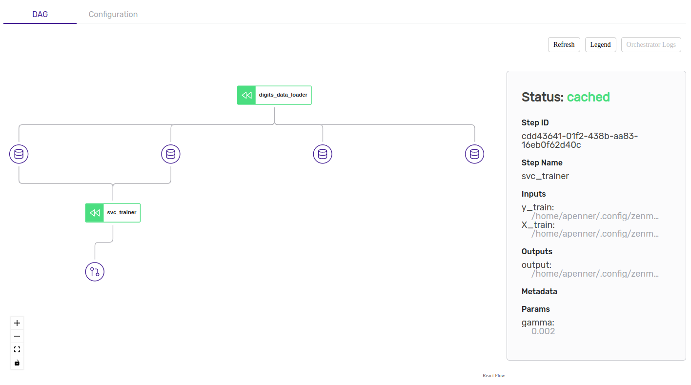

# Iterate on your code

ZenML tries its best to get out of the way as you run your ML pipelines. For this, it has built in pipeline versioning and caching support to help your local work be as fast as possible.

## Versioning Pipelines

You might have noticed that each time you run a pipeline in ZenML with the same name, but with different configurations, it creates a new _version_, noticeable in the version column in the [dashboard](dashboard.md). This turns out to be quite important when iterating over pipelines, but still keeping track of all the work being done. Consider our example pipeline:

```python
@pipeline
def first_pipeline(gamma: float = 0.002):
    X_train, X_test, y_train, y_test = digits_data_loader()
    svc_trainer(gamma=gamma, X_train=X_train, y_train=y_train)
    
if __name__ == "__main__":
    first_pipeline(gamma=0.0015)
```

Running this the first time will create a single `run` for `version 1` of the pipeline called `first_pipeline`.

```
$python main.py
...
Registered pipeline first_pipeline (version 1).
...
```

If you now do it again with different [runtime parameters](parameters.md):

```python
@pipeline
def first_pipeline(gamma: float = 0.002):
    X_train, X_test, y_train, y_test = digits_data_loader()
    svc_trainer(gamma=gamma, X_train=X_train, y_train=y_train)
    
if __name__ == "__main__":
    first_pipeline(gamma=0.0016)
```

This will create _yet another_ `run` for `version 1` of the pipeline called `first_pipeline`. So now the same pipeline has two runs. You can also verify this in the dashboard.

However, now let's change the pipeline configuration itself. You can do this by either modifying the step connections within the `@pipeline` function or by replacing a concrete step with another one. For example lets create an alternative trainer step called `custom_trainer`.

```python
@pipeline
def first_pipeline(gamma: float = 0.002):
    X_train, X_test, y_train, y_test = digits_data_loader()
    custom_trainer(gamma=gamma, X_train=X_test, y_train=y_test)
    
if __name__ == "__main__":
    first_pipeline(gamma=0.0016)
```

```python
$python main.py
...
Registered pipeline first_pipeline (version 1).
...
```

This will now create a single `run` for `version 2` of the pipeline called `first_pipeline`. This way, you can continuously update a pipeline as you iterate, and not lose velocity, all the while ensuring that when you do get to production it should make things easier.

You might also notice that running the above pipelines in that order actually got faster as you went through them. Which brings us to...

## Caching in ZenML

You might have noticed at this point that rerunning the pipeline a second time will use caching:



```bash
Step step_1 has started.
Using cached version of step_1.
Step step_2 has started.
Using cached version of step_2.
```



<figure><figcaption><p>DAG of a cached pipeline run</p></figcaption></figure>



This is because ZenML understands that nothing has changed between subsequent runs, so it re-uses the output of the last run (the outputs are persisted in the [artifact store](broken-reference/). This behavior is known as **caching**.

ZenML comes with caching enabled by default. Since ZenML automatically tracks and versions all inputs, outputs, and parameters of steps and pipelines, ZenML will not re-execute steps within the same pipeline on subsequent pipeline runs as long as there is no change in these three. To learn more about how ZenMLs versions and keeps track of lineage of your artifacts, read the [advanced guide](../advanced-guide/data-versioning-and-lineage.md).


Currently, the caching does not automatically detect changes within the file system or on external APIs. Make sure to set caching to `False` on steps that depend on external inputs or if the step should run regardless of caching.


### Configuring caching behavior of your pipelines

Although caching is desirable in many circumstances, one might want to disable it in certain instances. For example, if you are quickly prototyping with changing step definitions or you have an external API state change in your function that ZenML does not detect.

There are multiple ways to take control of when and where caching is used:

#### Configuring caching for the entire pipeline

On a pipeline level, the caching policy can be set as a parameter within the `@pipeline` decorator as shown below:

```python
@pipeline(enable_cache=False)
def first_pipeline(....):
    """Pipeline with cache disabled"""
```

The setting above will disable caching for all steps in the pipeline, unless a step explicitly sets `enable_cache=True` (see below).


When writing your pipelines, be explicit. This makes it clear when looking at the code if caching is enabled or disabled for any given pipeline.


#### Explicitly set `enable_cache` at the `@pipeline` level

Caching is enabled by default for ZenML Pipelines.&#x20;

#### Configuring caching for individual steps

Caching can also be explicitly configured at a step level via a parameter of the `@step` decorator:

```python
@step(enable_cache=False)
def import_data_from_api(...):
    """Import most up-to-date data from public api"""
    ...
```

The code above turns caching off for this step only. This is very useful in practice since you might want to turn off caching for certain steps that take external input (like fetching data from an API or File IO) without affecting the overall pipeline caching behavior.


You can get a graphical visualization of which steps were cached using the [ZenML Dashboard](broken-reference/).


#### Dynamically configuring caching for a pipeline run

Sometimes you want to have control over caching at runtime instead of defaulting to the hard-coded pipeline and step decorator settings. ZenML offers a way to override all caching settings at runtime:

```python
first_pipeline(step_1=..., step_2=...).run(enable_cache=False)
```

The code above disables caching for all steps of your pipeline, no matter what you have configured in the `@step` or `@parameter` decorators.
