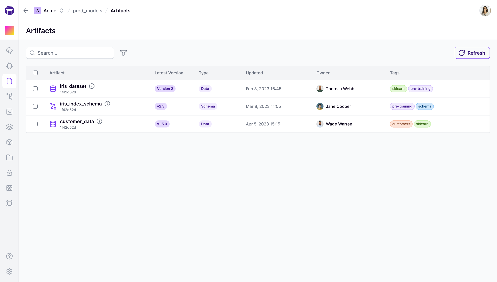
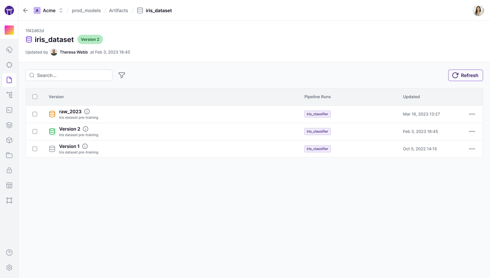
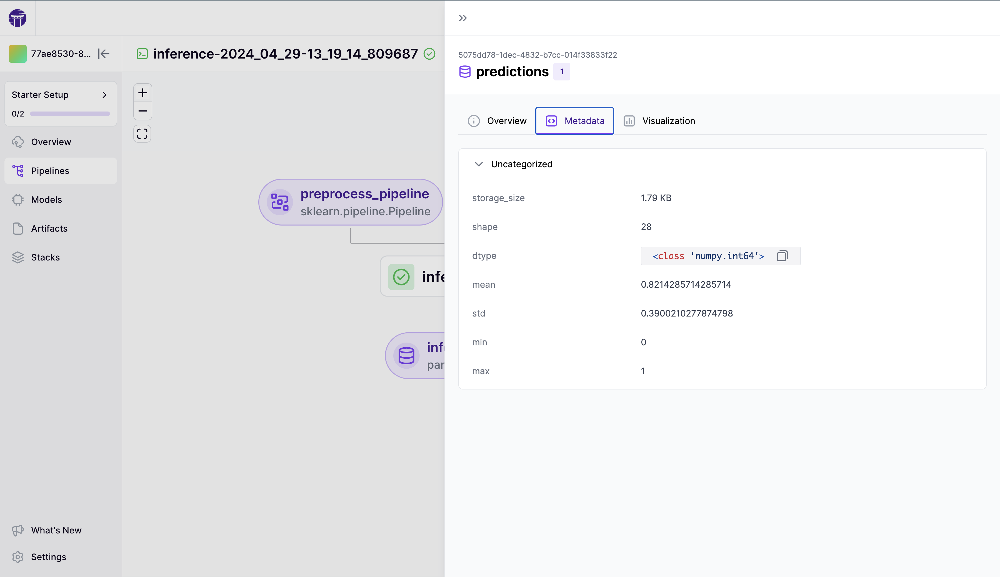
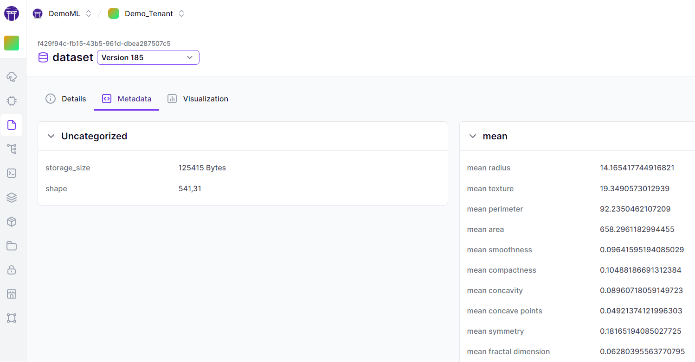
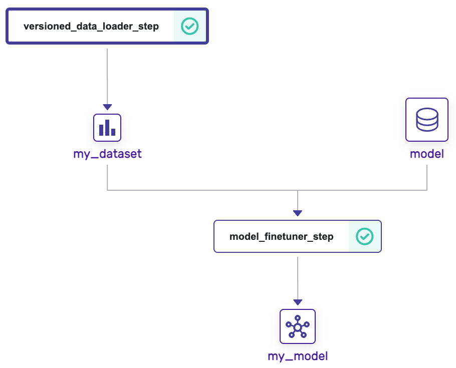
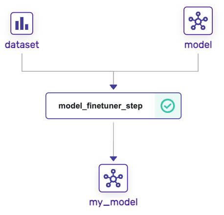

# Manage artifacts

Data sits at the heart of every machine learning workflow. Managing and versioning this data correctly is essential for reproducibility and traceability within your ML pipelines. ZenML takes a proactive approach to data versioning, ensuring that every artifact—be it data, models, or evaluations—is automatically tracked and versioned upon pipeline execution.


This guide will delve into artifact versioning and management, showing you how to efficiently name, organize, and utilize your data with the ZenML framework.

## Managing artifacts produced by ZenML pipelines

Artifacts, the outputs of your steps and pipelines, are automatically versioned and stored in the artifact store. Configuring these artifacts is pivotal for transparent and efficient pipeline development.

### Giving names to your artifacts

Assigning custom names to your artifacts can greatly enhance their discoverability and manageability. As best practice, utilize the `Annotated` object within your steps to give precise, human-readable names to outputs:

```python
from typing_extensions import Annotated
import pandas as pd
from sklearn.datasets import load_iris

from zenml import pipeline, step

# Using Annotated to name our dataset
@step
def training_data_loader() -> Annotated[pd.DataFrame, "iris_dataset"]:
    """Load the iris dataset as pandas dataframe."""
    iris = load_iris(as_frame=True)
    return iris.get("frame")


@pipeline
def feature_engineering_pipeline():
    training_data_loader()


if __name__ == "__main__":
    feature_engineering_pipeline()
```


Unspecified artifact outputs default to a naming pattern of `{pipeline_name}::{step_name}::output`. For visual exploration in the ZenML dashboard, it's best practice to give significant outputs clear custom names.


Artifacts named `iris_dataset` can then be found swiftly using various ZenML interfaces:



To list artifacts: `zenml artifact list`



The [ZenML Pro](https://zenml.io/pro) dashboard offers advanced visualization features for artifact exploration.

<figure><figcaption><p>ZenML Artifact Control Plane.</p></figcaption></figure>


To prevent visual clutter, make sure to assign names to your most important artifacts that you would like to explore visually.




### Versioning artifacts manually

ZenML automatically versions all created artifacts using auto-incremented numbering. I.e., if you have defined a step creating an artifact named `iris_dataset` as shown above, the first execution of the step will create an artifact with this name and version "1", the second execution will create version "2", and so on.

While ZenML handles artifact versioning automatically, you have the option to specify custom versions using the [`ArtifactConfig`](https://sdkdocs.zenml.io/latest/core\_code\_docs/core-model/#zenml.model.artifact\_config.DataArtifactConfig). This may come into play during critical runs like production releases.

```python
from zenml import step, ArtifactConfig

@step
def training_data_loader() -> (
    Annotated[
        pd.DataFrame, 
        # Add `ArtifactConfig` to control more properties of your artifact
        ArtifactConfig(
            name="iris_dataset", 
            version="raw_2023"
        ),
    ]
):
    ...
```

The next execution of this step will then create an artifact with the name `iris_dataset` and version `raw_2023`. This is primarily useful if you are making a particularly important pipeline run (such as a release) whose artifacts you want to distinguish at a glance later.


Since custom versions cannot be duplicated, the above step can only be run once successfully. To avoid altering your code frequently, consider using a [YAML config](../production-guide/configure-pipeline.md) for artifact versioning.


After execution, `iris_dataset` and its version `raw_2023` can be seen using:



To list versions: `zenml artifact version list`



The Cloud dashboard visualizes version history for your review.

<figure><figcaption><p>ZenML Data Versions List.</p></figcaption></figure>



### Add metadata and tags to artifacts

If you would like to extend your artifacts with extra metadata or tags you can do so by following the patterns demonstrated below:

```python
from zenml import step, get_step_context, ArtifactConfig
from typing_extensions import Annotated


# below we annotate output with `ArtifactConfig` giving it a name,
# run_metadata and tags. As a result, the created artifact
# `artifact_name` will get configured with metadata and tags
@step
def annotation_approach() -> (
    Annotated[
        str,
        ArtifactConfig(
            name="artifact_name",
            run_metadata={"metadata_key": "metadata_value"},
            tags=["tag_name"],
        ),
    ]
):
    return "string"


# below we annotate output using functional approach with
# run_metadata and tags. As a result, the created artifact 
# `artifact_name` will get configured with metadata and tags
@step
def annotation_approach() -> Annotated[str, "artifact_name"]:
    step_context = get_step_context()
    step_context.add_output_metadata(
        output_name="artifact_name", metadata={"metadata_key": "metadata_value"}
    )
    step_context.add_output_tags(output_name="artifact_name", tags=["tag_name"])
    return "string"


# below we combine both approaches, so the artifact will get
# metadata and tags from both sources
@step
def annotation_approach() -> (
    Annotated[
        str,
        ArtifactConfig(
            name="artifact_name",
            run_metadata={"metadata_key": "metadata_value"},
            tags=["tag_name"],
        ),
    ]
):
    step_context = get_step_context()
    step_context.add_output_metadata(
        output_name="artifact_name", metadata={"metadata_key2": "metadata_value2"}
    )
    step_context.add_output_tags(output_name="artifact_name", tags=["tag_name2"])
    return "string"
```

### Consuming external artifacts within a pipeline

While most pipelines start with a step that produces an artifact, it is often the case to want to consume artifacts external from the pipeline. The `ExternalArtifact` class can be used to initialize an artifact within ZenML with any arbitrary data type.

For example, let's say we have a Snowflake query that produces a dataframe, or a CSV file that we need to read. External artifacts can be used for this, to pass values to steps that are neither JSON serializable nor produced by an upstream step:

```python
import numpy as np
from zenml import ExternalArtifact, pipeline, step

@step
def print_data(data: np.ndarray):
    print(data)

@pipeline
def printing_pipeline():
    # One can also pass data directly into the ExternalArtifact
    # to create a new artifact on the fly
    data = ExternalArtifact(value=np.array([0]))

    print_data(data=data)


if __name__ == "__main__":
    printing_pipeline()
```

Optionally, you can configure the `ExternalArtifact` to use a custom [materializer](../../how-to/handle-data-artifacts/handle-custom-data-types.md) for your data or disable artifact metadata and visualizations. Check out the [SDK docs](https://sdkdocs.zenml.io/latest/core\_code\_docs/core-artifacts/#zenml.artifacts.external\_artifact.ExternalArtifact) for all available options.


Using an `ExternalArtifact` for your step automatically disables caching for the step.


### Consuming artifacts produced by other pipelines

It is also common to consume an artifact downstream after producing it in an upstream pipeline or step. As we have learned in the [previous section](../../how-to/build-pipelines/fetching-pipelines.md#fetching-artifacts-directly), the `Client` can be used to fetch artifacts directly inside the pipeline code:

```python
from uuid import UUID
import pandas as pd
from zenml import step, pipeline
from zenml.client import Client


@step
def trainer(dataset: pd.DataFrame):
    ...

@pipeline
def training_pipeline():
    client = Client()
    # Fetch by ID
    dataset_artifact = client.get_artifact_version(
        name_id_or_prefix=UUID("3a92ae32-a764-4420-98ba-07da8f742b76")
    )

    # Fetch by name alone - uses the latest version of this artifact
    dataset_artifact = client.get_artifact_version(name_id_or_prefix="iris_dataset")

    # Fetch by name and version
    dataset_artifact = client.get_artifact_version(
        name_id_or_prefix="iris_dataset", version="raw_2023"
    )

    # Pass into any step
    trainer(dataset=dataset_artifact)


if __name__ == "__main__":
    training_pipeline()
```


Calls of `Client` methods like `get_artifact_version` directly inside the pipeline code makes use of ZenML's [late materialization](../../how-to/handle-data-artifacts/load-artifacts-into-memory.md) behind the scenes.


If you would like to bypass materialization entirely and just download the data or files associated with a particular artifact version, you can use the `.download_files` method:

```python
from zenml.client import Client

client = Client()
artifact = client.get_artifact_version(name_id_or_prefix="iris_dataset")
artifact.download_files("path/to/save.zip")
```

Take note that the path must have the `.zip` extension, as the artifact data will be saved as a zip file. Make sure to handle any exceptions that may arise from this operation.

## Managing artifacts **not** produced by ZenML pipelines

Sometimes, artifacts can be produced completely outside of ZenML. A good example of this is the predictions produced by a deployed model.

```python
# A model is deployed, running in a FastAPI container
# Let's use the ZenML client to fetch the latest model and make predictions

from zenml.client import Client
from zenml import save_artifact

# Fetch the model from a registry or a previous pipeline
model = ...

# Let's make a prediction
prediction = model.predict([[1, 1, 1, 1]])

# We now store this prediction in ZenML as an artifact
# This will create a new artifact version
save_artifact(prediction, name="iris_predictions")
```

You can also load any artifact stored within ZenML using the `load_artifact` method:

```python
# Loads the latest version
load_artifact("iris_predictions")
```


`load_artifact` is simply short-hand for the following Client call:

```python
from zenml.client import Client

client = Client()
client.get_artifact("iris_predictions").load()
```


Even if an artifact is created externally, it can be treated like any other artifact produced by ZenML steps - with all the functionalities described above!


It is also possible to use these functions inside your ZenML steps. However, it is usually cleaner to return the artifacts as outputs of your step to save them, or to use External Artifacts to load them instead.


## Linking data **not** produced by ZenML pipelines as a ZenML artifact

Sometimes, data is produced completely outside of ZenML and can be conveniently store on a given storage. A good example of this is the checkpoint files produced as a side-effect of the Deep Learning model training. We know that the intermediate data of the deep learning frameworks is quite big and there is no good reason to move it around again and again, if it can be produced directly in the artifact store boundaries and later just linked to become an artifact of ZenML.

```python
# Here we explore the Pytorch Lightning example
# to fit model and store the checkpoints on remote
# location.

# The important assumption is that active artifact
# store is s3://my_bucket, otherwise the linking
# going to fail with an error.

from zenml.client import Client
from zenml import link_folder_as_artifact
from pytorch_lightning import Trainer

# Define the model and fit it
model = ...
trainer = Trainer(default_root_dir="s3://my_bucket/my_model_data/")
try:
    trainer.fit(model)
finally:
    # We now link those checkpoints in ZenML as an artifact
    # This will create a new artifact version
    link_folder_as_artifact(folder_uri="s3://my_bucket/my_model_data/ckpts", name="my_model_ckpts")
```

Even if an artifact is created and stored externally, it can be treated like any other artifact produced by ZenML steps - with all the functionalities described above!


It is also possible to use these functions inside your ZenML steps.


## Logging metadata for an artifact

One of the most useful ways of interacting with artifacts in ZenML is the ability to associate metadata with them. [As mentioned before](../../how-to/build-pipelines/fetching-pipelines.md#artifact-information), artifact metadata is an arbitrary dictionary of key-value pairs that are useful for understanding the nature of the data.

As an example, one can associate the results of a model training alongside a model artifact, the shape of a table alongside a `pandas` dataframe, or the size of an image alongside a PNG file.

For some artifacts, ZenML automatically logs metadata. As an example, for `pandas.Series` and `pandas.DataFrame` objects, ZenML logs the shape and size of the objects:



```python
from zenml.client import Client

# Get an artifact version (e.g. pd.DataFrame)
artifact = Client().get_artifact_version('50ce903f-faa6-41f6-a95f-ff8c0ec66010')

# Fetch it's metadata
artifact.run_metadata["storage_size"].value  # Size in bytes
artifact.run_metadata["shape"].value  # Shape e.g. (500,20)
```



The information regarding the metadata of an artifact can be found within the DAG visualizer interface on the OSS dashboard:

<figure><figcaption><p>ZenML Artifact Control Plane.</p></figcaption></figure>



The [ZenML Pro](https://zenml.io/pro) dashboard offers advanced visualization features for artifact exploration, including a dedicated artifacts tab with metadata visualization:

<figure><figcaption><p>ZenML Artifact Control Plane.</p></figcaption></figure>



A user can also add metadata to an artifact within a step directly using the `log_artifact_metadata` method:

```python
from zenml import step, log_artifact_metadata

@step
def model_finetuner_step(
    model: ClassifierMixin, dataset: Tuple[np.ndarray, np.ndarray]
) -> Annotated[
    ClassifierMixin, ArtifactConfig(name="my_model", tags=["SVC", "trained"])
]:
    """Finetunes a given model on a given dataset."""
    model.fit(dataset[0], dataset[1])
    accuracy = model.score(dataset[0], dataset[1])

    
    log_artifact_metadata(
        # Artifact name can be omitted if step returns only one output
        artifact_name="my_model",
        # Passing None or omitting this will use the `latest` version
        version=None,
        # Metadata should be a dictionary of JSON-serializable values
        metadata={"accuracy": float(accuracy)}
        # A dictionary of dictionaries can also be passed to group metadata
        #  in the dashboard
        # metadata = {"metrics": {"accuracy": accuracy}}
    )
    return model
```

For further depth, there is an [advanced metadata logging guide](../../how-to/track-metrics-metadata/README.md) that goes more into detail about logging metadata in ZenML.

Additionally, there is a lot more to learn about artifacts within ZenML. Please read the [dedicated data management guide](../../how-to/handle-data-artifacts/) for more information.

## Code example

This section combines all the code from this section into one simple script that you can use easily:

<details>

<summary>Code Example of this Section</summary>

```python
from typing import Optional, Tuple
from typing_extensions import Annotated

import numpy as np
from sklearn.base import ClassifierMixin
from sklearn.datasets import load_digits
from sklearn.svm import SVC
from zenml import ArtifactConfig, pipeline, step, log_artifact_metadata
from zenml import save_artifact, load_artifact
from zenml.client import Client


@step
def versioned_data_loader_step() -> (
    Annotated[
        Tuple[np.ndarray, np.ndarray],
        ArtifactConfig(
            name="my_dataset",
            tags=["digits", "computer vision", "classification"],
        ),
    ]
):
    """Loads the digits dataset as a tuple of flattened numpy arrays."""
    digits = load_digits()
    return (digits.images.reshape((len(digits.images), -1)), digits.target)


@step
def model_finetuner_step(
    model: ClassifierMixin, dataset: Tuple[np.ndarray, np.ndarray]
) -> Annotated[
    ClassifierMixin,
    ArtifactConfig(name="my_model", is_model_artifact=True, tags=["SVC", "trained"]),
]:
    """Finetunes a given model on a given dataset."""
    model.fit(dataset[0], dataset[1])
    accuracy = model.score(dataset[0], dataset[1])
    log_artifact_metadata(metadata={"accuracy": float(accuracy)})
    return model


@pipeline
def model_finetuning_pipeline(
    dataset_version: Optional[str] = None,
    model_version: Optional[str] = None,
):
    client = Client()
    # Either load a previous version of "my_dataset" or create a new one
    if dataset_version:
        dataset = client.get_artifact_version(
            name_id_or_prefix="my_dataset", version=dataset_version
        )
    else:
        dataset = versioned_data_loader_step()

    # Load the model to finetune
    # If no version is specified, the latest version of "my_model" is used
    model = client.get_artifact_version(
        name_id_or_prefix="my_model", version=model_version
    )

    # Finetune the model
    # This automatically creates a new version of "my_model"
    model_finetuner_step(model=model, dataset=dataset)


def main():
    # Save an untrained model as first version of "my_model"
    untrained_model = SVC(gamma=0.001)
    save_artifact(
        untrained_model, name="my_model", version="1", tags=["SVC", "untrained"]
    )

    # Create a first version of "my_dataset" and train the model on it
    model_finetuning_pipeline()

    # Finetune the latest model on an older version of the dataset
    model_finetuning_pipeline(dataset_version="1")

    # Run inference with the latest model on an older version of the dataset
    latest_trained_model = load_artifact("my_model")
    old_dataset = load_artifact("my_dataset", version="1")
    latest_trained_model.predict(old_dataset[0])


if __name__ == "__main__":
    main()
```

This would create the following pipeline run DAGs:

**Run 1:**



**Run 2:**



</details>

<figure><figcaption></figcaption></figure>
