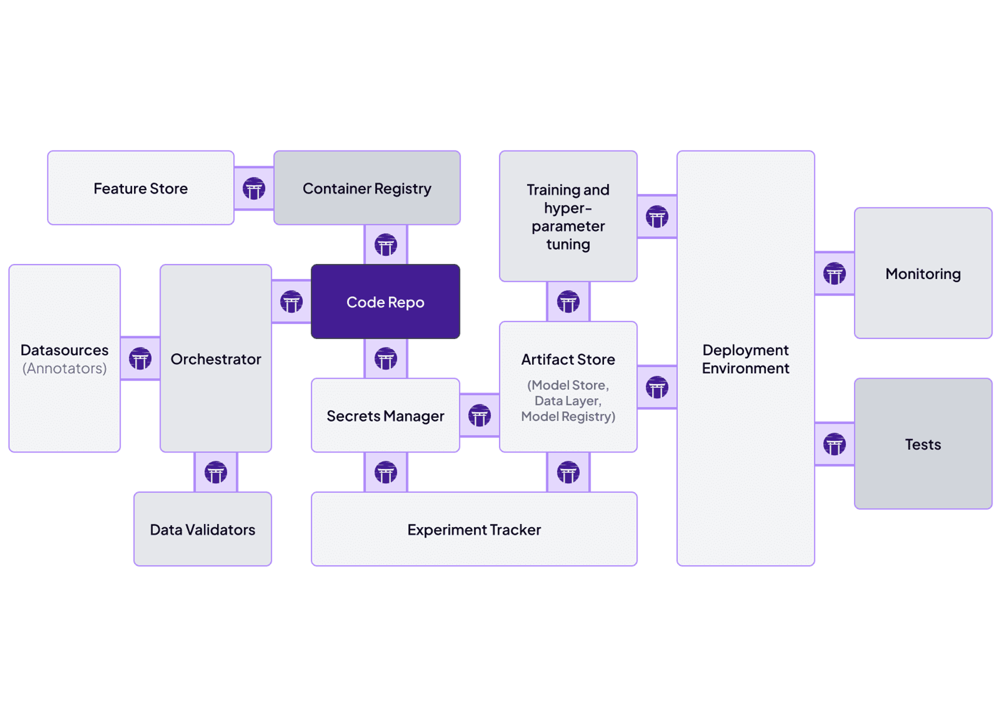

# 🐣 Starter guide

Welcome to the ZenML Starter Guide! If you're an MLOps Engineer aiming to build robust ML platforms, or a Data Scientist interested in leveraging the power of MLOps, this is the perfect place to begin. Our guide is designed to equip you with the foundational knowledge of the ZenML framework and provide you with the initial tools to manage the complexity of machine learning operations.

<figure><figcaption>
Embarking on MLOps can be intricate. ZenML simplifies the journey.
</figcaption></figure>

Throughout this guide, we'll cover essential topics including:

- [Creating your first ML pipeline](create-an-ml-pipeline.md)
- [Understanding caching between pipeline steps](cache-previous-executions.md)
- [Fetching objects after pipelines have run](fetching-pipelines.md)
- [Managing data and data versioning](manage-artifacts.md)
- [Tracking your machine learning models](track-ml-models.md)

Before jumping in, make sure you have a Python environment ready and `virtualenv` installed to follow along with ease.
By the end, you will have completed a [starter project](starter-project.md), marking the beginning of your venture into MLOps with ZenML.

Let this guide be not only your introduction to ZenML but also a foundational asset in your MLOps toolkit. Prepare your development environment, and let's embark on this educational journey together.