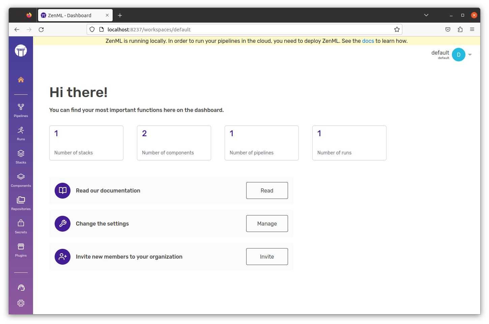
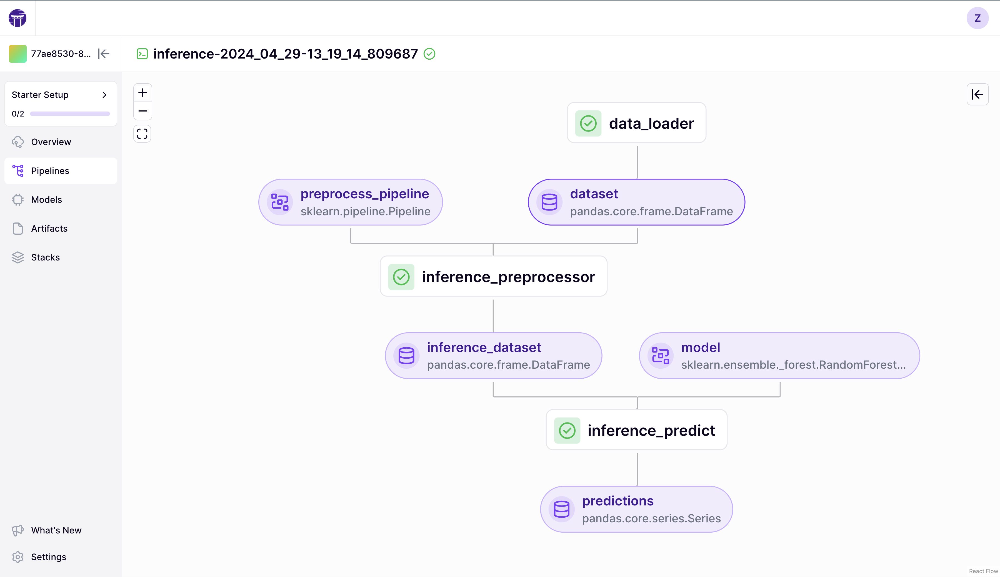

# 🐣 Starter guide

ZenML helps you standardize your ML workflows as **Pipelines** consisting of decoupled, modular **Steps**. This enables you to write portable code that can be moved from experimentation to production in seconds.

## Pipelines & steps

The simplest ZenML pipeline could look like this:

```python
from zenml import pipeline, step


@step
def step_1() -> str:
    """Returns the `world` string."""
    return "world"


@step(enable_cache=False)
def step_2(input_one: str, input_two: str) -> None:
    """Combines the two strings at its input and prints them."""
    combined_str = f"{input_one} {input_two}"
    print(combined_str)


@pipeline
def my_pipeline():
    output_step_one = step_1()
    step_2(input_one="hello", input_two=output_step_one)


if __name__ == "__main__":
    my_pipeline()
```


* **`@step`** is a decorator that converts its function into a step that can be used within a pipeline
* **`@pipeline`** defines a function as a pipeline and within this function, the steps are called and their outputs are routed


Copy this code into a file `run.py` and run it.


```bash
$ python run.py

Registered pipeline my_pipeline (version 1).
Running pipeline my_pipeline on stack default (caching enabled)
Step step_1 has started.
Step step_1 has finished in 0.121s.
Step step_2 has started.
hello world
Step step_2 has finished in 0.046s.
Pipeline run my_pipeline-... has finished in 0.676s.
Pipeline visualization can be seen in the ZenML Dashboard. Run zenml up to see your pipeline!
```


In the output, there's a line with something like this.


```bash
Pipeline visualization can be seen in the ZenML Dashboard. Run zenml up to see your pipeline!
```


ZenML offers you a comprehensive Dashboard to interact with your Pipelines, Artifacts, and Infrastructure. To see it, simply deploy the ZenML server locally in the next section.

## Explore the dashboard

Run `zenml up` in the environment where you have ZenML installed.

After a few seconds, your browser should open the ZenML Dashboard for you at [http://127.0.0.1:8237/](http://127.0.0.1:8237/)

The default user account is **Username**: _**default**_ with **no** **password**.

<figure><figcaption><p>Landing Page of the Dashboard</p></figcaption></figure>

As you can see, the dashboard shows you that there is 1 pipeline and 1 pipeline run. (feel free to ignore the stack and components for the time being) and continue to the run you just executed.

<figure><figcaption><p>Diagram view of the run, with the runtime attributes of step 2.</p></figcaption></figure>

If you navigate to the run that you just executed, you will see a diagram view of the pipeline run, including a visualization of the data that is passed between the steps. Feel free to explore the Run, its steps, and its artifacts.

If you have closed the browser tab with the ZenML dashboard, you can always
reopen it by running `zenml show` in your terminal.

## Recap

#### Step

Steps are functions. These functions have inputs and outputs. For ZenML to work properly, these need to be typed.

```python
@step(enable_cache=False)
def step_2(input_one: str, input_two: str) -> None:
    """Combines the two strings at its input and prints them."""
    combined_str = f"{input_one} {input_two}"
    return combined_str
```

#### Artifacts

The inputs and outputs of a step are called _artifacts._ They are automatically tracked and stored by ZenML in the artifact store. Artifacts are produced by and circulated among steps whenever your step returns an object or a value. This means the data is not passed between steps in memory. Rather at the output of a step they are written to storage and at the input of the step they are loaded from storage.

#### Pipeline

Pipelines are also functions. However, you are only allowed to call steps within this function. The inputs for steps called within a pipeline can either be the outputs of previous steps or alternatively, you can pass in values directly (as long as they're JSON serializable).

```python
@pipeline
def my_pipeline():
    output_step_one = step_1()
    step_2(input_one="hello", input_two=output_step_one)
```

#### Executing the Code

Executing the Pipeline is as easy as just calling the function that you decorated with the `@pipeline` decorator.

```python
if __name__ == "__main__":
    my_pipeline()
```

In the following sections, you will learn more about the following topics:

<table data-card-size="large" data-view="cards"><thead><tr><th></th><th></th><th data-hidden></th></tr></thead><tbody><tr><td><mark style="color:purple;"><strong>Create an ML Pipeline</strong></mark></td><td>Learning how to setup and configure your pipeline.</td><td></td></tr><tr><td><mark style="color:purple;"><strong>Caching previous executions</strong></mark></td><td>Iterating quickly with ZenML through fast caching.</td><td></td></tr><tr><td><mark style="color:purple;"><strong>Version pipelines</strong></mark></td><td>Understanding how and when the version of a pipeline is incremented.</td><td></td></tr><tr><td><mark style="color:purple;"><strong>Fetch runs after execution</strong></mark></td><td>Inspecting a finished pipeline run and its outputs.</td><td></td></tr><tr><td><mark style="color:purple;"><strong>Understand stacks</strong></mark></td><td>Learning how to switch the infrastructure backend of your code.</td><td></td></tr><tr><td><mark style="color:purple;"><strong>Connect to a deployed ZenML</strong></mark></td><td>Learning about the ZenML server.</td><td></td></tr><tr><td><mark style="color:purple;"><strong>Switch to production</strong></mark></td><td>Bringing your pipelines into production using cloud stacks.</td><td></td></tr><tr><td><mark style="color:purple;"><strong>Follow best practices</strong></mark></td><td>Recommended repository structure and best practices.</td><td></td></tr><tr><td><mark style="color:purple;"><strong>ZenML project templates</strong></mark></td><td>Rocketstart your ZenML journey!</td><td></td></tr></tbody></table>

<details>

<summary>Code Example of this Section</summary>

```python
from zenml import pipeline, step


@step
def step_1() -> str:
    """Returns the `world` substring."""
    return "world"


@step(enable_cache=False)
def step_2(input_one: str, input_two: str) -> None:
    """Combines the two strings at its input and prints them."""
    combined_str = input_one + ' ' + input_two
    print(combined_str)


@pipeline
def my_pipeline():
    output_step_one = step_1()
    step_2(input_one="hello", input_two=output_step_one)


if __name__ == "__main__":
    my_pipeline()
```

</details>

<!-- For scarf -->
<figure></figure>

