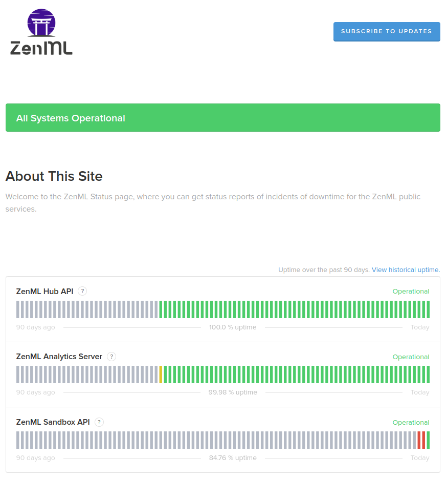


This is an older version of the ZenML documentation. To read and view the latest version please [visit this up-to-date URL](https://docs.zenml.io).



# Switch to production

Transitioning your machine learning pipelines to production means deploying your models on real-world data to make predictions that drive business decisions. To achieve this, you need an infrastructure that can handle the demands of running machine learning models at scale. However, setting up such an infrastructure involves careful planning and consideration of various factors, such as data storage, compute resources, monitoring, and security.

Moving to a production environment offers several benefits over staying local:

1. **Scalability**: Production environments are designed to handle large-scale workloads, allowing your models to process more data and deliver faster results.
2. **Reliability**: Production-grade infrastructure ensures high availability and fault tolerance, minimizing downtime and ensuring consistent performance.
3. **Collaboration**: A shared production environment enables seamless collaboration between team members, making it easier to iterate on models and share insights.

Despite these advantages, transitioning to production can be challenging due to the complexities involved in setting up the needed infrastructure.

This is where ZenML comes in. By providing seamless integration with various [MLOps tools](../component-guide/integration-overview.md) and platforms, ZenML simplifies the process of moving your pipelines into production. One way it does this is by offering a free, limited, and easy-to-use Sandbox environment that allows you to experiment with remote stacks without any setup or configuration.

#### Alternative: Build your own infrastructure

For those who prefer more control over their infrastructure, ZenML offers a more manual approach that still streamlines parts of the deployment process. With the [deploy CLI](../../platform-guide/set-up-your-mlops-platform/deploy-and-set-up-a-cloud-stack/deploy-and-set-up-a-cloud-stack.md), you can quickly set up a full-fledged MLOps stack with just a few commands. You have the option to deploy individual stack components through the [stack-component CLI](../../platform-guide/set-up-your-mlops-platform/deploy-and-set-up-a-cloud-stack/deploy-a-stack-component.md) or [deploy a stack with multiple components](../../platform-guide/set-up-your-mlops-platform/deploy-and-set-up-a-cloud-stack/deploy-a-stack-using-stack-recipes.md) together using Terraform stack recipes. For more information on how to do this, see our [post-sandbox platform guide](../advanced-guide/sandbox.md).

## MLOps Platform Sandbox: a simple and easy starting point

To help you get started with moving your pipelines into production, ZenML offers a managed Sandbox environment with a pre-configured remote stack for users to try out its features without setting up their own infrastructure. The MLOps Platform Sandbox provides an isolated environment where you can experiment with different configurations and learn how to switch between remote stacks.


MLOps Platform Sandbox Demo


### Getting started with the MLOps Platform Sandbox

#### Step 1: Sign up

To start using the MLOps Platform Sandbox, [sign up with your Google account](https://sandbox.zenml.io/). This will create a new sandbox environment for you to explore ZenML and its features.


#### Step 2: Access credentials

After signing up and creating your sandbox, you will be provided with credentials for [Kubeflow](../component-guide/orchestrators/kubeflow.md), [MinIO](../component-guide/artifact-stores/s3.md), [MLflow](../component-guide/experiment-trackers/mlflow.md), and [ZenML Server](connect-to-a-deployed-zenml.md). These credentials will allow you to access and interact with the various applications and services within the sandbox.


#### Step 3: Connect and set the stack

Use the `zenml connect` command to connect your local ZenML installation to the sandbox environment. Then, use the `zenml stack set` command to set the appropriate stack for your sandbox.

```bash
zenml connect --url <sandbox_url> --username <username>
zenml stack set <stack_name>
```


#### Step 4: Explore pre-built pipelines

The MLOps Platform Sandbox provides a repository of pre-built pipelines that users can choose from to run on their sandbox. Users can access these pipelines through the MLOps Platform Sandbox interface and run them using the provided credentials for Kubeflow, MLflow, and ZenML.


#### Step 5: Run pipelines

To run a pipeline in the sandbox, use the `python run.py` command. You can either clone a repository with the pipelines or use a special ZenML command to run them, to be decided.

```bash
python run.py
```

After you have run the pipelines, you can open the ZenML dashboard to see their status:


You can also check the corresponding stack components to see the various services used. For example, Kubeflow would show you a similar DAG as ZenML running on a Kubernetes cluster:


Minio will show you the artifacts used:


And MLflow will show you the experiment metadata tracked as the pipeline ran through:


#### Step 6: Sandbox deletion

Eight hours after registration, your sandbox will be automatically deleted. Make sure to save any important data or results before the sandbox is deleted. While the sandbox is active, you can also manually delete it through the MLOps Platform Sandbox interface.

### MLOps Platform Sandbox service status

The status of the MLOps Platform Sandbox service is being tracked live on [the ZenML status page](https://zenml.statuspage.io/). You can subscribe here to receive notifications about scheduled maintenance windows, unplanned downtime events, and more.

<figure><figcaption><p>The ZenML public services status page</p></figcaption></figure>

## Sandbox FAQ

**Q: Is the sandbox free?**

**A:** Yes, the sandbox is free but time-boxed to 8 hours as we also have to
watch our costs!

**Q: Is it possible to extend the duration of the sandbox?**

**A:** The MLOps Platform Sandbox has an 8-hour limit. You can [create your own sandbox using ZenML stack recipes](https://docs.zenml.io/advanced-guide/practical-mlops/stack-recipes) or integrate ZenML into your existing infrastructure for similar functionality.
If you'd like us to host the MLOps Platform Sandbox for you for longer, [fill out this form](https://zenml.io/extend-sandbox).

**Q: Why use ZenML with MLflow, Kubeflow and Minio?**

**A:** ZenML is an MLOps framework that enables you to manage your MLOps platform using a variety of open-source tools. Kubeflow, MLflow, and Minio were selected to showcase an optimal toolset combination. ZenML offers the flexibility to replace any specific tool based on your needs.

**Q: What are the limitations of the MLOps Platform Sandbox?**

**A:** The Sandbox provides pre-built pipelines for users to run or modify.
However, creating new pipeline builds is not permitted due to the container
registry's read-only access. This limitation is in place to control costs and
demonstrate how MLOps engineers can enforce rules through a central control
plane.

**Q: How can I move from the MLOps Platform Sandbox to deploying my own MLOps Stack?**

**A:** After experimenting with the Sandbox, you can deploy your own MLOps stack tailored to your requirements using [ZenML Stack Recipes](https://docs.zenml.io/advanced-guide/practical-mlops/stack-recipes). These recipes give you a starting point for deploying various MLOps stacks on different cloud providers and with different components. Follow the instructions provided for your desired stack configuration to build a robust, production-ready MLOps platform.

**Q: What kind of support is available for users of the MLOps Platform Sandbox?**

**A:** Our community is here to help you! If you have any questions or need assistance while using the Sandbox, [join our Slack community](https://zenml.io/slack) where you can interact with the team and other users. You can also [consult our GitHub repository](https://github.com/zenml-io/zenml) for further information and updates.

**Q: Can I create more than one sandbox at a time?**

**A:** No. Each user can create only one sandbox at a time. Once your current sandbox is deleted, you can create a new one.

**Q:** **Can I use my own pipelines in the MLOps Platform Sandbox?**

**A:** The MLOps Platform Sandbox is designed for users to explore ZenML using pre-built example pipelines. While it is possible to use your own pipelines, we do not recommend it as the sandbox is not designed for this purpose, since every user is provided with limited resources. (See [this guide](../advanced-guide/sandbox.md) to learn more about running your own pipelines in the sandbox.)

**Q: Are there any model deployment options available in the ZenML Sandbox?**

**A:** At the moment, there are no model deployment tools available in the MLOps Platform Sandbox. However, we are working on adding this feature in the future.
