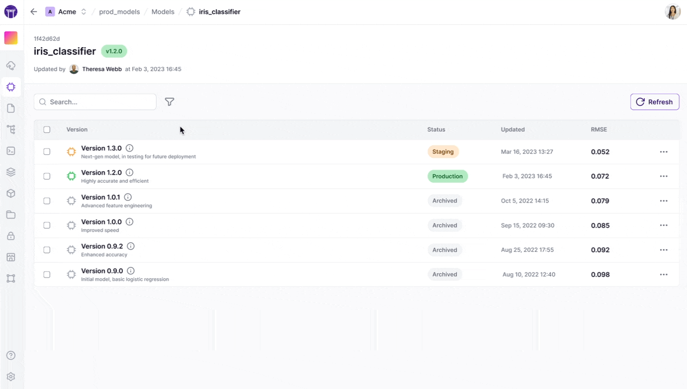
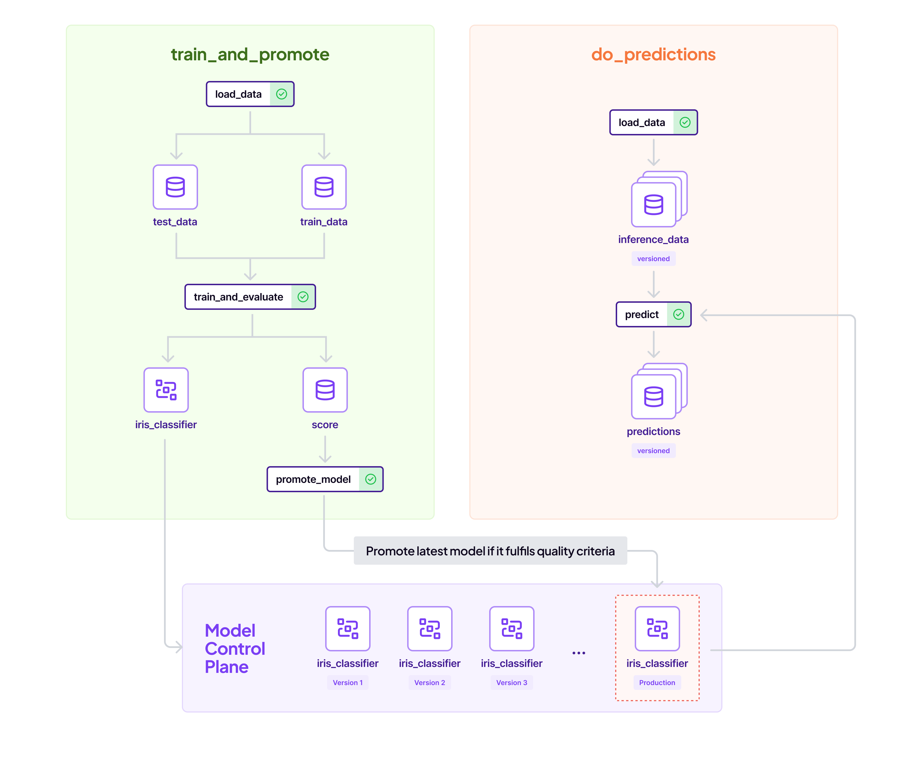

# Keeping track of ML models in ZenML

A machine learning model undergoes many different iterations throughout its lifecycle. For example, let's say you are working on a classification model. This model will probably undergo dozens of changes until it arrives at a point when its ready to be deployed. ZenML helps in tracking this lifecycle.

As discussed in the [Core Concepts](../../getting-started/core-concepts.md), ZenML also contains the notion of a `Model`, which consists of many `ModelVersions` (the iterations of the model). These concepts are exposed in the `Model Control Plane` (MCP for short).

## What is a ZenML Model?


Before diving in, let's take some time to build an understanding of what we mean when we say a `Model` in ZenML. A `Model` is simply an entity that groups pipelines, artifacts, metadata, and other crucial business data into a unified entity. Please note that one of the most common artifacts that is associated with a Model in ZenML is the so-called technical model, which is the actualy model file/files that holds the weight and parameters of a machine learning training result. However, this is not the only artifact that is relevant; artifacts such as the training data and the predictions this model produces in production are also linked inside a ZenML Model. In this sense, a ZenML Model is a concept that more broadly encapsulates your ML products business logic.

Models are a first-class citizen in ZenML and as such
viewing and using them is unified and centralized in the ZenML API, client as
well as on the [ZenML Cloud](https://zenml.io/cloud) dashboard.

A Model captures lineage information and more. Within a Model, different Model
Versions can be staged. For example, you can rely on your predictions at a
specific stage, like `Production`, and decide whether the Model Version should
be promoted based on your business rules during training. Plus, accessing data
from other Models and their Versions is just as simple.

The Model Control Plane is how you manage your models through this unified
interface. It allows you to combine the logic of your pipelines, artifacts and
crucial business data along with the actual 'technical model'.

These models can be viewed within ZenML:




`zenml model list` can be used to list all models.




The [ZenML Cloud](https://zenml.io/cloud) dashboard has additional capabilities, that include visualizing these models in the dashboard.

<figure><figcaption><p>ZenML Model Control Plane.</p></figcaption></figure>




## Utilizing a Model and its Model Versions

The easiest way to use a ZenML model is to pass a model version object as part of a pipeline run. This can be done easily at a pipeline or a step level, or via a 
[YAML config](../production-guide/configure-pipeline.md).

Once you configure a pipeline this way, **all** artifacts generated during pipeline runs are automatically linked to the specified model version. This connecting of artifacts provides lineage tracking and transparency into what data and models are used during training, evaluation, and inference.

```python
from zenml import pipeline
from zenml.model import ModelVersion

model_version = ModelVersion(
    # The name uniquely identifies this model
    # It usually represents the business use-case
    name="iris_classifier",
    # The version specifies the version
    # If None or an unseen version is specified, it will be created
    # Otherwise, a version will be fetched.
    version=None, 
    # Some other properties may be specified
    license="Apache 2.0",
    description="A classification model for the iris dataset.",
)

# The step configuration will take precedence over the pipeline
@step(model_version=model_version)
def svc_trainer(...) -> ...:
    ...

# This configures it for all steps within the pipeline
@pipeline(model_version=model_version)
def training_pipeline(gamma: float = 0.002):
    # Now this pipeline will have the `iris_classifier` model active.
    X_train, X_test, y_train, y_test = training_data_loader()
    svc_trainer(gamma=gamma, X_train=X_train, y_train=y_train)

if __name__ == "__main__":
    training_pipeline()

# In the YAML the same can be done, in this case the 
#  passing to the decorators is not needed
# model_version: 
  # name: iris_classifier
  # license: "Apache 2.0"
  # description: "A classification model for the iris dataset."

```

The above will estabilish a **link between all artifacts that pass through this ZenML pipeline and this model**. This includes the **technical model** which is what comes out of the `svc_trainer` step. You will be able to see all associated artifacts and pipeline runs all within one view.

Further, this pipeline run, and all other pipeline runs that are configured with this model version will be linked to this model as well. 

You can see all versions of a model, and associated artifacts and run like this:




`zenml model version list <MODEL_NAME>` can be used to list all versions of a particular model.

The following commands can be used to list the various pipeline runs associated with a model:

* `zenml model version runs <MODEL_NAME> <MODEL_VERSIONNAME>`

The following commands can be used to list the various artifacts associated with a model:

* `zenml model version data_artifacts <MODEL_NAME> <MODEL_VERSIONNAME>`
* `zenml model version model_artifacts <MODEL_NAME> <MODEL_VERSIONNAME>`
* `zenml model version deployment_artifacts <MODEL_NAME> <MODEL_VERSIONNAME>`




The [ZenML Cloud](https://zenml.io/cloud) dashboard has additional capabilities, that include visualizing all associated runs and artifacts for a model version:

<figure><figcaption><p>ZenML Model Versions List.</p></figcaption></figure>




### Fetching the model version in a pipeline

When configured at the pipeline or step level, the model version will be available through the [StepContext](../advanced-guide/pipelining-features/fetch-metadata-within-pipeline.md) or [PipelineContext](../advanced-guide/pipelining-features/fetch-metadata-within-pipeline.md).

```python
from zenml import get_step_context, get_pipeline_context, step, pipeline

@step
def svc_trainer(
    X_train: pd.DataFrame,
    y_train: pd.Series,
    gamma: float = 0.001,
) -> Annotated[ClassifierMixin, "trained_model"]:
    # This will return the model version specified in the 
    # @pipeline decorator. In this case, the production version of 
    # the `iris_classifier` will be returned in this case.
    model_version = get_step_context().model_version
    ...

@pipeline(
    model_version=ModelVersion(
        # The name uniquely identifies this model
        name="iris_classifier",
        # Pass the stage you want to get the right model
        version="production", 
    ),
)
def training_pipeline(gamma: float = 0.002):
    # Now this pipeline will have the production `iris_classifier` model active.
    model_version = get_pipeline_context().model_version

    X_train, X_test, y_train, y_test = training_data_loader()
    svc_trainer(gamma=gamma, X_train=X_train, y_train=y_train)
```

### Logging metadata to the `ModelVersion` object

Once a `ModelVersion` is fetched within a step, there are numerous use cases. For example, one can associate metadata like metrics to the model version or its associated artifacts:

```python
from zenml import get_step_context, step, log_model_version_metadata 

@step
def svc_trainer(
    X_train: pd.DataFrame,
    y_train: pd.Series,
    gamma: float = 0.001,
) -> Annotated[ClassifierMixin, "sklearn_classifier"],:
    # This will return the model version specified in the 
    # @pipeline decorator. In this case, the production version of 
    # the `iris_classifier` will be returned in this case.
    model_version = get_step_context().model_version
    
```

## Logging metadata for a model version

One of the most useful way's of interacting with artifacts in ZenML is the ability
to associate metadata with them. [As mentioned before](fetching-pipelines.md#artifact-information), artifact metadata is an arbitary dictionary of key-value pairs that are useful to understand the nature of the data.

As an example, one can associate the results of a model training alongside a model artifact,
the shape of a table alongside a `pandas` dataframe, or a size of an image alongside a PNG
file.

For some artifacts, ZenML automatically logs metadata. As an example, for `pandas.Series`
and `pandas.Dataframe` objects, ZenML logs the shape and size of the objects:




```python
from zenml.client import Client

# Get an artifact version (e.g. pd.Dataframe)
artifact = Client().get_artifact_version('50ce903f-faa6-41f6-a95f-ff8c0ec66010')

# Fetch it's metadata
artifact.run_metadata["storage_size"].value  # Size in bytes
artifact.run_metadata["shape"].value  # Shape e.g. (500,20)
```




The information for an artifacts metadata can be found within the DAG visualizer interface on the OSS dashboard:

<figure><figcaption><p>ZenML Artifact Control Plane.</p></figcaption></figure>




The [ZenML Cloud](https://zenml.io/cloud) dashboard offers advanced visualization features for artifact exploration, including a dedicated artifacts tab with metadata visualization:

<figure><figcaption><p>ZenML Artifact Control Plane.</p></figcaption></figure>




A user can also add metadata to an artifact within a step directly using the
`log_artifact_metadata` method:

```python
from zenml import step, log_artifact_metadata

@step
def model_finetuner_step(
    model: ClassifierMixin, dataset: Tuple[np.ndarray, np.ndarray]
) -> Annotated[
    ClassifierMixin, ArtifactConfig(name="my_model", tags=["SVC", "trained"])
]:
    """Finetunes a given model on a given dataset."""
    model.fit(dataset[0], dataset[1])
    accuracy = model.score(dataset[0], dataset[1])

    
    log_artifact_metadata(
        # Artifact name can be omitted if step returns only one output
        artifact_name="my_model",
        # Passing None or omitting this will use the `latest` version
        version=None,
        # Metadata should be a dictionary of JSON-serializable values
        metadata={"accuracy": float(accuracy)}
        # A dictionary of dictionaries can also be passed to group metadata
        #  in the dashboard
        # metadata = {"metrics": {"accuracy": accuracy}}
    )
    return model
```

For further depth, there is an [advanced metadata logging guide](../advanced-guide/data-management/logging-metadata.md) that goes more into detail about logging metadata in ZenML.

Additionally, there is a lot more to learn about artifacts within ZenML. Please read
the [dedicated data management guide](../advanced-guide/data-management/) for more information.

## Using the stages of a model

A models versions can exist in various stages. These are meant to signify their lifecycle state:

* `staging`: This version is staged for production.
* `production`: This version is running in a production setting.
* `latest`: The latest version of the model.
* `archived`: This is archived and no longer relevant. This stage occurs when a model moves out of any other stage.



```python
from zenml.model import ModelVersion

# Get latest model version
model_version = ModelVersion(
    name="iris_classifier",
    version="latest"
)

# Get a model from a version
model_version = ModelVersion(
    name="iris_classifier",
    version="my_version",
)

# Pass the stage into the version field
# to get the model by stage
model_version = ModelVersion(
    name="iris_classifier",
    version="staging",
)

# This will set this version to production
model_version.set_stage(stage="production", force=True)
```



```shell
# List staging models
zenml model version list <MODEL_NAME> --stage staging 

# Update to production
zenml model version update <MODEL_NAME> <MODEL_VERSIONNAME> -s production 
```


The [ZenML Cloud](https://zenml.io/cloud) dashboard has additional capabilities, that include easily changing the stage:






## Associating different types of artifacts with a model

A ZenML model supports linking three types of artifacts:

* `Data artifacts`: These are the default artifacts. If nothing is specified, all artifacts are grouped under this category.
* `Model artifacts`: If there is a physical model artifact like a `.pkl` file or a model neural network weights file, it should be grouped in this category.
* `Deployment artifacts`: These artifacts are to do with artifacts related to the endpoints and deployments of the models.

In order to tell ZenML which artifact belongs to which type, one must pass in additional configuration to your artifacts:

```python
from zenml import get_step_context, step
from zenml.model import DataArtifactConfig, ModelArtifactConfig

@step
def svc_trainer(
    X_train: pd.DataFrame,
    y_train: pd.Series,
    gamma: float = 0.001,
) -> Tuple[
    # This third argument marks this as a Model Artifact
    Annotated[ClassifierMixin, "trained_model", ModelArtifactConfig()],
    # This third argument marks this as a Data Artifact
    Annotated[float, "training_acc", DataArtifactConfig()],
]:
    ...
```

## Facilitating Artifacts Exchange Between Pipelines Using MCP

A ZenML Model spans multiple pipelines, and is a key concept that brings disparate pipelines together. A simple example is illustrated below:

<figure><figcaption><p>A simple example of two pipelines interacting between each other.</p></figcaption></figure>

Each time the `train_and_promote` pipeline runs, it creates a new `iris_classifier`. However, it only promotes the created model to `production` if a certain accuracy threshold is met. The `do_predictions` pipeline simply picks up the latest promoted model and runs batch inference on it. That way these two pipelines can independently be run, but can rely on each other's output.

One way of achieving this is to fetch the model directly in your step:

```python
from zenml import step, get_step_context

# IMPORTANT: Cache needs to be disabled to avoid unexpected behavior
@step(enable_cache=False)
def predict(
    data: pd.DataFrame,
) -> Annotated[pd.Series, "predictions"]:
    # model_name and model_version derived from pipeline context
    model_version = get_step_context().model_version

    # Fetch the model directly from the model control plane
    model = model_version.get_model_artifact("trained_model")

    # Make predictions
    predictions = pd.Series(model.predict(data))
    return predictions
```

However, this approach has the downside that if the step is cached, then it could lead to unexpected results. You could simply disable the cache in the above step or corresponding pipeline. However, one other way of achieving this would be to resolve the artifact at the pipeline level:

```python
from typing_extensions import Annotated
from zenml import get_pipeline_context, pipeline, ExternalArtifact
from zenml.enums import ModelStages
from zenml.model import ModelVersion
import pandas as pd
from sklearn.base import ClassifierMixin


@step
def predict(
    model: ClassifierMixin,
    data: pd.DataFrame,
) -> Annotated[pd.Series, "predictions"]:
    predictions = pd.Series(model.predict(data))
    return predictions

@pipeline(
    model_config=ModelVersion(
        name="iris_classifier",
        # Using the production stage
        version=ModelStages.PRODUCTION,
    ),
)
def do_predictions():
    # model_name and model_version derived from pipeline context
    model_version = get_pipeline_context().model_version
    inference_data = load_data()
    predict(
        # Here, we load in the `trained_model` from a trainer step
        model=model_version.get_model_artifact("trained_model"),  
        data=inference_data,
    )


if __name__ == "__main__":
    do_predictions()
```

Ultimately, both approaches are fine. Users should decide which one to use based on their own preference.

ZenML Model and Model Versions are some of the most powerful features in ZenML. To understand them in a deeper way, read the [dedicated Model Management](../advanced-guide/data-management/model-management.md).
guide.

<!-- For scarf -->
<figure></figure>