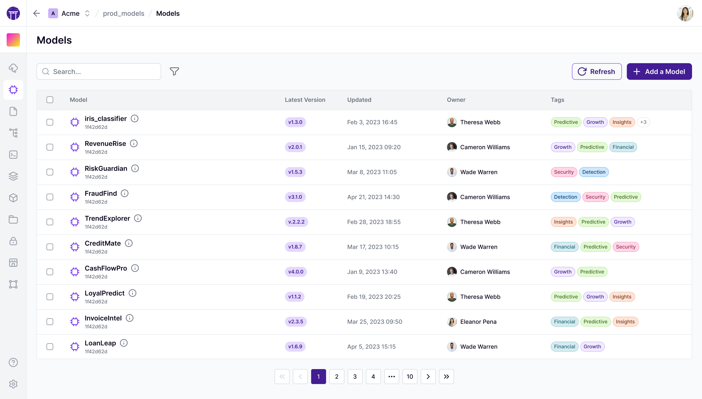
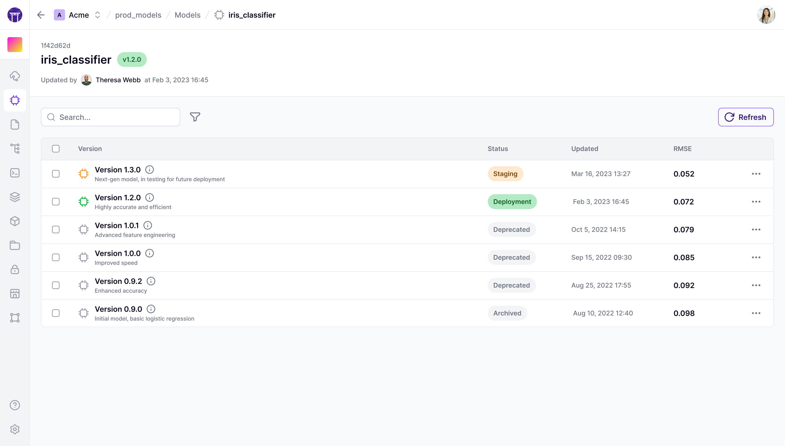

# Track ML models


As discussed in the [Core Concepts](../../getting-started/core-concepts.md), ZenML also contains the notion of a `Model`, which consists of many model versions (the iterations of the model). These concepts are exposed in the `Model Control Plane` (MCP for short).

## What is a ZenML Model?

Before diving in, let's take some time to build an understanding of what we mean when we say `Model` in ZenML terms. A `Model` is simply an entity that groups pipelines, artifacts, metadata, and other crucial business data into a unified entity. In this sense, a ZenML Model is a concept that more broadly encapsulates your ML product's business logic. You may even think of a ZenML Model as a "project" or a "workspace"


Please note that one of the most common artifacts that is associated with a Model in ZenML is the so-called technical model, which is the actually model file/files that holds the weight and parameters of a machine learning training result. However, this is not the only artifact that is relevant; artifacts such as the training data and the predictions this model produces in production are also linked inside a ZenML Model.


Models are first-class citizens in ZenML and as such viewing and using them is unified and centralized in the ZenML API, the ZenML client as well as on the [ZenML Pro](https://zenml.io/pro) dashboard.

These models can be viewed within ZenML:



`zenml model list` can be used to list all models.



The [ZenML Pro](https://zenml.io/pro) dashboard has additional capabilities, that include visualizing these models in the dashboard.

<figure><figcaption><p>ZenML Model Control Plane.</p></figcaption></figure>



## Configuring a model in a pipeline

The easiest way to use a ZenML model is to pass a `Model` object as part of a pipeline run. This can be done easily at a pipeline or a step level, or via a [YAML config](../production-guide/configure-pipeline.md).

Once you configure a pipeline this way, **all** artifacts generated during pipeline runs are automatically **linked** to the specified model. This connecting of artifacts provides lineage tracking and transparency into what data and models are used during training, evaluation, and inference.

```python
from zenml import pipeline
from zenml import Model

model = Model(
    # The name uniquely identifies this model
    # It usually represents the business use case
    name="iris_classifier",
    # The version specifies the version
    # If None or an unseen version is specified, it will be created
    # Otherwise, a version will be fetched.
    version=None, 
    # Some other properties may be specified
    license="Apache 2.0",
    description="A classification model for the iris dataset.",
)

# The step configuration will take precedence over the pipeline
@step(model=model)
def svc_trainer(...) -> ...:
    ...

# This configures it for all steps within the pipeline
@pipeline(model=model)
def training_pipeline(gamma: float = 0.002):
    # Now this pipeline will have the `iris_classifier` model active.
    X_train, X_test, y_train, y_test = training_data_loader()
    svc_trainer(gamma=gamma, X_train=X_train, y_train=y_train)

if __name__ == "__main__":
    training_pipeline()

# In the YAML the same can be done; in this case, the 
#  passing to the decorators is not needed
# model: 
  # name: iris_classifier
  # license: "Apache 2.0"
  # description: "A classification model for the iris dataset."

```

The above will establish a **link between all artifacts that pass through this ZenML pipeline and this model**. This includes the **technical model** which is what comes out of the `svc_trainer` step. You will be able to see all associated artifacts and pipeline runs, all within one view.

Furthermore, this pipeline run and all other pipeline runs that are configured with this model configuration will be linked to this model as well.

You can see all versions of a model, and associated artifacts and run like this:



`zenml model version list <MODEL_NAME>` can be used to list all versions of a particular model.

The following commands can be used to list the various pipeline runs associated with a model:

* `zenml model version runs <MODEL_NAME> <MODEL_VERSIONNAME>`

The following commands can be used to list the various artifacts associated with a model:

* `zenml model version data_artifacts <MODEL_NAME> <MODEL_VERSIONNAME>`
* `zenml model version model_artifacts <MODEL_NAME> <MODEL_VERSIONNAME>`
* `zenml model version deployment_artifacts <MODEL_NAME> <MODEL_VERSIONNAME>`



The [ZenML Pro](https://zenml.io/pro) dashboard has additional capabilities, that include visualizing all associated runs and artifacts for a model version:

<figure><figcaption><p>ZenML Model versions List.</p></figcaption></figure>



## Fetching the model in a pipeline

When configured at the pipeline or step level, the model will be available through the [StepContext](../../how-to/model-management-metrics/track-metrics-metadata/fetch-metadata-within-pipeline.md) or [PipelineContext](../../how-to/model-management-metrics/track-metrics-metadata/fetch-metadata-within-pipeline.md).

```python
from zenml import get_step_context, get_pipeline_context, step, pipeline

@step
def svc_trainer(
    X_train: pd.DataFrame,
    y_train: pd.Series,
    gamma: float = 0.001,
) -> Annotated[ClassifierMixin, "trained_model"]:
    # This will return the model specified in the 
    # @pipeline decorator. In this case, the production version of 
    # the `iris_classifier` will be returned in this case.
    model = get_step_context().model
    ...

@pipeline(
    model=Model(
        # The name uniquely identifies this model
        name="iris_classifier",
        # Pass the stage you want to get the right model
        version="production", 
    ),
)
def training_pipeline(gamma: float = 0.002):
    # Now this pipeline will have the production `iris_classifier` model active.
    model = get_pipeline_context().model

    X_train, X_test, y_train, y_test = training_data_loader()
    svc_trainer(gamma=gamma, X_train=X_train, y_train=y_train)
```

## Logging metadata to the `Model` object

[Just as one can associate metadata with artifacts](manage-artifacts.md#logging-metadata-for-an-artifact), models too can take a dictionary of key-value pairs to capture their metadata. This is achieved using the `log_model_metadata` method:

```python
from zenml import get_step_context, step, log_model_metadata 

@step
def svc_trainer(
    X_train: pd.DataFrame,
    y_train: pd.Series,
    gamma: float = 0.001,
) -> Annotated[ClassifierMixin, "sklearn_classifier"],:
    # Train and score model
    ...
    model.fit(dataset[0], dataset[1])
    accuracy = model.score(dataset[0], dataset[1])

    model = get_step_context().model
    
    log_model_metadata(
        # Model name can be omitted if specified in the step or pipeline context
        model_name="iris_classifier",
        # Passing None or omitting this will use the `latest` version
        version=None,
        # Metadata should be a dictionary of JSON-serializable values
        metadata={"accuracy": float(accuracy)}
        # A dictionary of dictionaries can also be passed to group metadata
        #  in the dashboard
        # metadata = {"metrics": {"accuracy": accuracy}}
    )
```



```python
from zenml.client import Client

# Get an artifact version (in this the latest `iris_classifier`)
model_version = Client().get_model_version('iris_classifier')

# Fetch it's metadata
model_version.run_metadata["accuracy"].value
```



The [ZenML Pro](https://zenml.io/pro) dashboard offers advanced visualization features for artifact exploration, including a dedicated artifacts tab with metadata visualization:

<figure><figcaption><p>ZenML Artifact Control Plane.</p></figcaption></figure>



Choosing [log metadata with artifacts](manage-artifacts.md#logging-metadata-for-an-artifact) or model versions depends on the scope and purpose of the information you wish to capture. Artifact metadata is best for details specific to individual outputs, while model version metadata is suitable for broader information relevant to the overall model. By utilizing ZenML's metadata logging capabilities and special types, you can enhance the traceability, reproducibility, and analysis of your ML workflows.

Once metadata has been logged to a model, we can retrieve it easily with the client:

```python
from zenml.client import Client
client = Client()
model = client.get_model_version("my_model", "my_version")
print(model.run_metadata["metadata_key"].value)
```

For further depth, there is an [advanced metadata logging guide](../../how-to/model-management-metrics/track-metrics-metadata/README.md) that goes more into detail about logging metadata in ZenML.

## Using the stages of a model

A model's versions can exist in various stages. These are meant to signify their lifecycle state:

* `staging`: This version is staged for production.
* `production`: This version is running in a production setting.
* `latest`: The latest version of the model.
* `archived`: This is archived and no longer relevant. This stage occurs when a model moves out of any other stage.



```python
from zenml import Model

# Get the latest version of a model
model = Model(
    name="iris_classifier",
    version="latest"
)

# Get `my_version` version of a model
model = Model(
    name="iris_classifier",
    version="my_version",
)

# Pass the stage into the version field
# to get the `staging` model
model = Model(
    name="iris_classifier",
    version="staging",
)

# This will set this version to production
model.set_stage(stage="production", force=True)
```



```shell
# List staging models
zenml model version list <MODEL_NAME> --stage staging 

# Update to production
zenml model version update <MODEL_NAME> <MODEL_VERSIONNAME> -s production 
```



The [ZenML Pro](https://zenml.io/pro) dashboard has additional capabilities, that include easily changing the stage:





ZenML Model and versions are some of the most powerful features in ZenML. To understand them in a deeper way, read the [dedicated Model Management](../../how-to/model-management-metrics/model-control-plane/README.md) guide.

<figure><figcaption></figcaption></figure>
