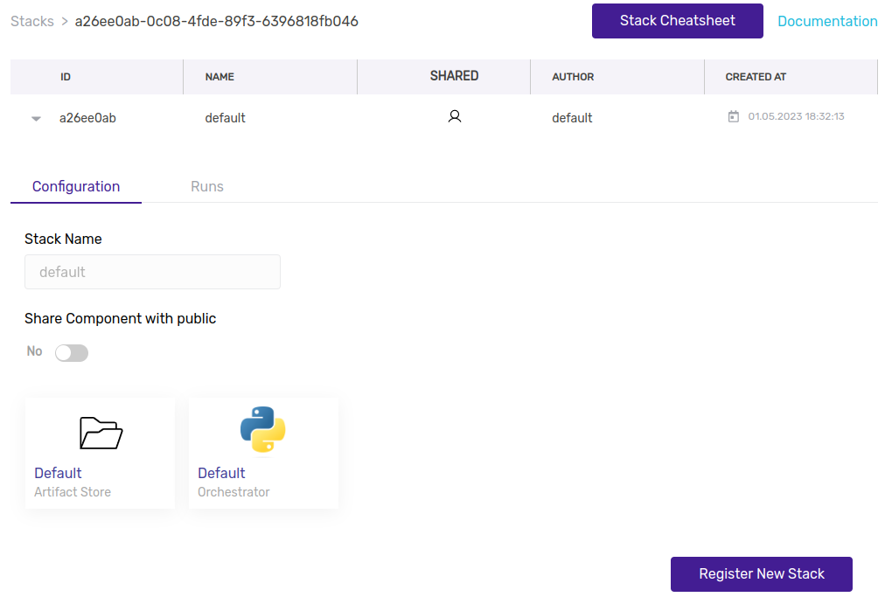

# Understand the default stack

<details>

<summary>Notes</summary>

* Shorter introduction?
* Link to all the different types of stack components here?
* I Propose the following flow -> Point to the line in the logs that mentions the default stack when running a pipeline -> explain what stacks are -> show where they live in the cli and on the dashboard ->&#x20;

</details>

### Stack

In the previous section you might have already noticed the term `stack` in the logs and on the dashboard.

A `stack` is the combination of tools and infrastructure that your pipelines can run on. When you get started with ZenML this will be the default stack. Let's explore what this is.



`zenml stack describe` lets you find out details about your active stack:

```bash
...
        Stack Configuration        
┏━━━━━━━━━━━━━━━━┯━━━━━━━━━━━━━━━━┓
┃ COMPONENT_TYPE │ COMPONENT_NAME ┃
┠────────────────┼────────────────┨
┃ ARTIFACT_STORE │ default        ┃
┠────────────────┼────────────────┨
┃ ORCHESTRATOR   │ default        ┃
┗━━━━━━━━━━━━━━━━┷━━━━━━━━━━━━━━━━┛
     'default' stack (ACTIVE)      
Stack 'default' with id '...' is owned by user default and is 'private'.
...
```

`zenml stack list` lets you see all stacks that are registered in your zenml deployment.

```bash
...
┏━━━━━━━━┯━━━━━━━━━━━━┯━━━━━━━━━━━┯━━━━━━━━┯━━━━━━━━━┯━━━━━━━━━━━━━━━━┯━━━━━━━━━━━━━━┓
┃ ACTIVE │ STACK NAME │ STACK ID  │ SHARED │ OWNER   │ ARTIFACT_STORE │ ORCHESTRATOR ┃
┠────────┼────────────┼───────────┼────────┼─────────┼────────────────┼──────────────┨
┃   👉   │ default    │ ...       │ ➖     │ default │ default        │ default      ┃
┗━━━━━━━━┷━━━━━━━━━━━━┷━━━━━━━━━━━┷━━━━━━━━┷━━━━━━━━━┷━━━━━━━━━━━━━━━━┷━━━━━━━━━━━━━━┛
...
```


As you can see a stack can be active on your client. This simply means that any pipeline you run, will be using the active stack as its environment.




You can explore all your stacks in the dashboard. When you click on a specific one you can see its configuration and all the pipeline runs that were executed using this stack.

<figure><figcaption><p>The default stack on the Dashboard</p></figcaption></figure>



### Components of the Stack

As you can see in the section above, a stack consists of multiple components. All stacks have at minimum an **orchestrator** and an **artifact store**.&#x20;

#### Orchestrator

The **orchestrator** is responsible for executing the pipeline code. In the simplest case, this will be a simple python thread on your machine. Let's explore this default orchestrator.



`zenml orchestrator list` lets you see all orchestrators that are registered in your zenml deployment.

```bash
┏━━━━━━━━┯━━━━━━━━━┯━━━━━━━━━━━━━━┯━━━━━━━━┯━━━━━━━━┯━━━━━━━━━┓
┃ ACTIVE │ NAME    │ COMPONENT ID │ FLAVOR │ SHARED │ OWNER   ┃
┠────────┼─────────┼──────────────┼────────┼────────┼─────────┨
┃   👉   │ default │ ...          │ local  │ ➖     │ default ┃
┗━━━━━━━━┷━━━━━━━━━┷━━━━━━━━━━━━━━┷━━━━━━━━┷━━━━━━━━┷━━━━━━━━━┛
```







#### Artifact Store

The **artifact store** is responsible for persisting the step outputs. As we learned in the previous section, the step outputs are not passed along in memory, rather the outputs of each step are stored in the **artifact store** and then loaded from there when the next step needs them. By default this will also be on your own machine:



`zenml artifact-store list` lets you see all artifact stores that are registered in your zenml deployment.

```bash
┏━━━━━━━━┯━━━━━━━━━┯━━━━━━━━━━━━━━┯━━━━━━━━┯━━━━━━━━┯━━━━━━━━━┓
┃ ACTIVE │ NAME    │ COMPONENT ID │ FLAVOR │ SHARED │ OWNER   ┃
┠────────┼─────────┼──────────────┼────────┼────────┼─────────┨
┃   👉   │ default │ ...          │ local  │ ➖     │ default ┃
┗━━━━━━━━┷━━━━━━━━━┷━━━━━━━━━━━━━━┷━━━━━━━━┷━━━━━━━━┷━━━━━━━━━┛
```







There are many more components that you can add to your stacks, like experiment trackers, model deployers. You can see all supported stack component types in a single table view [here](broken-reference/)

### Separating Code from Configuration and Infrastructure

When you want to proceed into a production setting, all you need to do is set up a production stack with the necessary tools and infrastructure. The stack will act as the backend that your code runs on.


But before proceeding to that part, find out more about the ZenML server in the next section.

###
