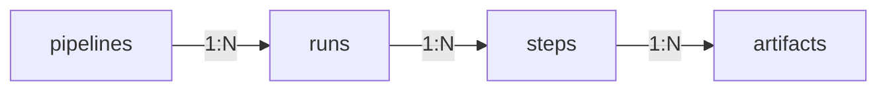


This is an older version of the ZenML documentation. To read and view the latest version please [visit this up-to-date URL](https://docs.zenml.io).



# Inspecting past pipeline runs

## Introduction

Ever trained a model yesterday and forgotten where its artifacts are stored? This tutorial shows you how to:

* List pipelines and discover their runs in Python or via the CLI
* Drill down into an individual run to inspect steps, settings and metadata
* Load output artifacts such as models or datasets straight back into your code

We'll work our way down the ZenML object hierarchy—from pipelines → runs → steps → artifacts—giving you a complete guide to accessing your past work.

## Prerequisites

Before starting this tutorial, make sure you have:

1. ZenML installed and configured
2. At least one pipeline that has been run at least once
3. Basic understanding of [ZenML pipelines and steps](https://docs.zenml.io/getting-started/core-concepts)

## Understanding the Object Hierarchy

The hierarchy of pipelines, runs, steps, and artifacts is as follows:



As you can see from the diagram, there are many layers of 1-to-N relationships.

Let's investigate how to traverse this hierarchy level by level:

## Step 1: Working with Pipelines

### Getting a Pipeline via the Client

After you have run a pipeline at least once, you can fetch the pipeline via the [`Client.get_pipeline()`](https://sdkdocs.zenml.io/latest/core_code_docs/core-client.html#zenml.client.Client) method:

```python
from zenml.client import Client

pipeline_model = Client().get_pipeline("first_pipeline")
```


Check out the [ZenML Client Documentation](https://docs.zenml.io/reference/python-client) for more information on the `Client` class and its purpose.


### Discovering and Listing All Pipelines

If you're not sure which pipeline you need to fetch, you can find a list of all registered pipelines in the ZenML dashboard, or list them programmatically either via the Client or the CLI.



You can use the [`Client.list_pipelines()`](https://sdkdocs.zenml.io/latest/core_code_docs/core-client.html#zenml.client.Client) method to get a list of all pipelines registered in ZenML:

```python
from zenml.client import Client

pipelines = Client().list_pipelines()

# Display some basic info about each pipeline
for pipeline_model in pipelines:
    print(f"Pipeline: {pipeline_model.name}")
    print("-" * 40)
```



Alternatively, you can also list pipelines with the following CLI command:

```shell
zenml pipeline list
```



## Step 2: Accessing Pipeline Runs

Each pipeline can be executed many times, resulting in several **Runs**. Let's explore how to access them.

### Getting All Runs of a Pipeline

You can get a list of all runs of a pipeline using the `runs` property of the pipeline:

```python
runs = pipeline_model.runs
```

The result will be a list of the most recent runs of this pipeline, ordered from newest to oldest.


Alternatively, you can also use the `pipeline_model.get_runs()` method which allows you to specify detailed parameters for filtering or pagination. See the [ZenML SDK Docs](https://docs.zenml.io/reference/python-client#list-of-resources) for more information.


### Getting the Last Run of a Pipeline

To access the most recent run of a pipeline, you can either use the `last_run` property or access it through the `runs` list:

```python
last_run = pipeline_model.last_run  # OR: pipeline_model.runs[0]

# Print basic information about the run
print(f"Run ID: {last_run.id}")
print(f"Status: {last_run.status}")
print(f"Created at: {last_run.created}")
```


If your most recent runs have failed, and you want to find the last run that has succeeded, you can use the `last_successful_run` property instead:

```python
successful_run = pipeline_model.last_successful_run
```


### Getting the Latest Run from a Pipeline

Calling a pipeline executes it and then returns the response of the freshly executed run:

```python
run = training_pipeline()
```


The run that you get back is the model stored in the ZenML database at the point of the method call. This means the pipeline run is still initializing and no steps have been run. To get the latest state, you can get a refreshed version from the client:

```python
from zenml.client import Client

Client().get_pipeline_run(runs[0].id) # to get a refreshed version
```


### Getting a Run via the Client

If you already know the exact run that you want to fetch (e.g., from looking at the dashboard), you can use the [`Client.get_pipeline_run()`](https://sdkdocs.zenml.io/latest/core_code_docs/core-client.html#zenml.client.Client) method to fetch the run directly without having to query the pipeline first:

```python
from zenml.client import Client

pipeline_run = Client().get_pipeline_run("first_pipeline-2023_06_20-16_20_13_274466")
```


Similar to pipelines, you can query runs by either ID, name, or name prefix, and you can also discover runs through the Client or CLI via the [`Client.list_pipeline_runs()`](https://sdkdocs.zenml.io/latest/core_code_docs/core-client.html#zenml.client.Client) or `zenml pipeline runs list` commands.


## Step 3: Examining Run Information

Each run has a collection of useful information which can help you reproduce your runs. In the following, you can find a list of some of the most useful pipeline run information, but there is much more available. See the [`PipelineRunResponse`](https://sdkdocs.zenml.io/latest/core_code_docs/core-models.html#zenml.models.v2) definition for a comprehensive list.

### Status

The status of a pipeline run. There are five possible states: initialized, failed, completed, running, and cached.

```python
run = runs[0]
status = run.status
```

### Configuration

The `pipeline_configuration` is an object that contains all configurations of the pipeline and pipeline run, including the [pipeline-level settings](https://docs.zenml.io/user-guides/production-guide/configure-pipeline):

```python
pipeline_config = run.config
pipeline_settings = run.config.settings

# Example: Check if Docker settings are configured
docker_settings = pipeline_settings.get('docker', {})
print(f"Docker settings: {docker_settings}")
```

### Component-Specific Metadata

Depending on the stack components you use, you might have additional component-specific metadata associated with your run, such as the URL to the UI of a remote orchestrator. You can access this component-specific metadata via the `run_metadata` attribute:

```python
run_metadata = run.run_metadata

# Example: Get the orchestrator URL (works for certain remote orchestrators)
if "orchestrator_url" in run_metadata:
    orchestrator_url = run_metadata["orchestrator_url"].value
    print(f"Orchestrator UI URL: {orchestrator_url}")
```

## Step 4: Working with Steps

Within a given pipeline run you can further zoom in on individual steps using the `steps` attribute:

```python
# Get all steps of a pipeline for a given run
steps = run.steps

# Get a specific step by its invocation ID
step = run.steps["first_step"]

# Print information about each step
for step_name, step_info in steps.items():
    print(f"Step name: {step_name}")
    print(f"Status: {step_info.status}")
    print(f"Started at: {step_info.start_time}")
    print(f"Completed at: {step_info.end_time}")
    print("-" * 40)
```


If you're only calling each step once inside your pipeline, the **invocation ID** will be the same as the name of your step. For more complex pipelines, check out [this page](https://docs.zenml.io/concepts/steps_and_pipelines/advanced_features#custom-step-invocation-ids) to learn more about the invocation ID.


### Inspecting Pipeline Runs with VS Code Extension


If you are using [our VS Code extension](https://marketplace.visualstudio.com/items?itemName=ZenML.zenml-vscode), you can easily view your pipeline runs by opening the sidebar (click on the ZenML icon). You can then click on any particular pipeline run to see its status and some other metadata. If you want to delete a run, you can also do so from the same sidebar view.

### Step Information

Similar to the run, you can use the `step` object to access a variety of useful information:

* The parameters used to run the step via `step.config.parameters`
* The step-level settings via `step.config.settings`
* Component-specific step metadata, such as the URL of an experiment tracker or model deployer, via `step.run_metadata`

```python
# Get a specific step
step = run.steps["trainer_step"]

# Access step parameters
parameters = step.config.parameters
print(f"Step parameters: {parameters}")

# Access step settings
settings = step.config.settings
print(f"Step settings: {settings}")

# Access step metadata
step_metadata = step.run_metadata
print(f"Step metadata: {step_metadata}")
```

See the [`StepRunResponse`](https://github.com/zenml-io/zenml/blob/main/src/zenml/models/v2/core/step_run.py) definition for a comprehensive list of available information.

## Step 5: Working with Artifacts

Each step of a pipeline run can have multiple output and input artifacts that we can inspect via the `outputs` and `inputs` properties.

### Accessing Output Artifacts

To inspect the output artifacts of a step, you can use the `outputs` attribute, which is a dictionary that can be indexed using the name of an output. Alternatively, if your step only has a single output, you can use the `output` property as a shortcut:

```python
# The outputs of a step are accessible by name
output = step.outputs["output_name"]

# If there is only one output, you can use the `.output` property instead 
output = step.output

# Use the `.load()` method to load the artifact into memory
my_pytorch_model = output.load()

# Print information about the artifact
print(f"Artifact ID: {output.id}")
print(f"Artifact type: {output.type}")
print(f"Artifact version: {output.version}")
```

Similarly, you can use the `inputs` and `input` properties to get the input artifacts of a step:

```python
# Access a specific input artifact
input_data = step.inputs["input_name"]

# If there is only one input, use the shortcut
input_data = step.input

# Load the input data
data = input_data.load()
```


Check out [this page](https://docs.zenml.io/user-guides/starter-guide/manage-artifacts#giving-names-to-your-artifacts) to see what the output names of your steps are and how to customize them.


Note that the output of a step corresponds to a specific artifact version.

### Fetching Artifacts Directly

If you'd like to fetch an artifact or an artifact version directly, it is easy to do so with the `Client`:

```python
from zenml.client import Client

# Get artifact
artifact = Client().get_artifact('iris_dataset')
artifact.versions  # Contains all the versions of the artifact
output = artifact.versions['2022']  # Get version name "2022" 

# Get artifact version directly:

# Using version name:
output = Client().get_artifact_version('iris_dataset', '2022')

# Using UUID
output = Client().get_artifact_version('f429f94c-fb15-43b5-961d-dbea287507c5')
loaded_artifact = output.load()
```

### Artifact Information

Regardless of how one fetches it, each artifact contains a lot of general information about the artifact as well as datatype-specific metadata and visualizations.

#### Metadata

All output artifacts saved through ZenML will automatically have certain datatype-specific metadata saved with them. NumPy Arrays, for instance, always have their storage size, `shape`, `dtype`, and some statistical properties saved with them. You can access such metadata via the `run_metadata` attribute of an output:

```python
output_metadata = output.run_metadata
storage_size_in_bytes = output_metadata["storage_size"].value

# For numpy arrays, access shape and dtype
if "shape" in output_metadata:
    shape = output_metadata["shape"].value
    print(f"Array shape: {shape}")
    
if "dtype" in output_metadata:
    dtype = output_metadata["dtype"].value
    print(f"Data type: {dtype}")
```

You can read more about metadata in [these docs](https://docs.zenml.io/concepts/metadata).

#### Visualizations

ZenML automatically saves visualizations for many common data types. Using the `visualize()` method you can programmatically show these visualizations in Jupyter notebooks:

```python
output.visualize()
```



If you're not in a Jupyter notebook, you can simply view the visualizations in the ZenML dashboard by running `zenml login --local` and clicking on the respective artifact in the pipeline run DAG instead. Check out the [artifact visualization page](https://docs.zenml.io/how-to/data-artifact-management/visualize-artifacts) to learn more about how to build and view artifact visualizations in ZenML!


## Step 6: Fetching Information During Run Execution

While most of this tutorial has focused on fetching objects after a pipeline run has been completed, the same logic can also be used within the context of a running pipeline.

This is often desirable in cases where a pipeline is running continuously over time and decisions have to be made according to older runs.

For example, this is how we can fetch the last pipeline run of the same pipeline from within a ZenML step:

```python
from zenml import get_step_context
from zenml.client import Client

@step
def my_step():
    # Get the name of the current pipeline run
    current_run_name = get_step_context().pipeline_run.name

    # Fetch the current pipeline run
    current_run = Client().get_pipeline_run(current_run_name)

    # Fetch the previous run of the same pipeline 
    previous_run = current_run.pipeline.runs[1]  # index 0 is the current run
    
    # Do something with the previous run data
    # For example, compare metrics with current run
    if "evaluator" in previous_run.steps:
        prev_metrics = previous_run.steps["evaluator"].output.load()
        print(f"Previous run metrics: {prev_metrics}")
```


As shown in the example, we can get additional information about the current run using the `StepContext`, which is explained in more detail in the [advanced docs](https://docs.zenml.io/how-to/model-management-metrics/track-metrics-metadata/fetch-metadata-within-steps).


## Complete Working Example

Putting it all together, here's a complete example that demonstrates how to load the model trained by the `svc_trainer` step of an example pipeline:

```python
from typing import Tuple, Annotated
import pandas as pd
from sklearn.datasets import load_iris
from sklearn.model_selection import train_test_split
from sklearn.base import ClassifierMixin
from sklearn.svm import SVC

from zenml import pipeline, step
from zenml.client import Client


@step
def training_data_loader() -> Tuple[
    Annotated[pd.DataFrame, "X_train"],
    Annotated[pd.DataFrame, "X_test"],
    Annotated[pd.Series, "y_train"],
    Annotated[pd.Series, "y_test"],
]:
    """Load the iris dataset as tuple of Pandas DataFrame / Series."""
    iris = load_iris(as_frame=True)
    X_train, X_test, y_train, y_test = train_test_split(
        iris.data, iris.target, test_size=0.2, shuffle=True, random_state=42
    )
    return X_train, X_test, y_train, y_test


@step
def svc_trainer(
    X_train: pd.DataFrame,
    y_train: pd.Series,
    gamma: float = 0.001,
) -> Tuple[
    Annotated[ClassifierMixin, "trained_model"],
    Annotated[float, "training_acc"],
]:
    """Train a sklearn SVC classifier and log to MLflow."""
    model = SVC(gamma=gamma)
    model.fit(X_train.to_numpy(), y_train.to_numpy())
    train_acc = model.score(X_train.to_numpy(), y_train.to_numpy())
    print(f"Train accuracy: {train_acc}")
    return model, train_acc


@pipeline
def training_pipeline(gamma: float = 0.002):
    X_train, X_test, y_train, y_test = training_data_loader()
    svc_trainer(gamma=gamma, X_train=X_train, y_train=y_train)


if __name__ == "__main__":
    # Execute the pipeline first if not already done
    training_pipeline(gamma=0.005)
    
    # METHOD 1: You can run the pipeline and get the run object directly
    last_run = training_pipeline()
    print(f"Last run ID: {last_run.id}")

    # METHOD 2: You can also use the class directly with the `model` object
    last_run = training_pipeline.model.last_run
    print(f"Last run ID via model: {last_run.id}")

    # METHOD 3: OR you can fetch it after execution is finished:
    pipeline = Client().get_pipeline("training_pipeline")
    last_run = pipeline.last_run
    print(f"Last run ID via client: {last_run.id}")

    # You can now fetch the model
    trainer_step = last_run.steps["svc_trainer"]
    model = trainer_step.outputs["trained_model"][0].load()
    accuracy = trainer_step.outputs["training_acc"][0].load()
    
    print(f"Model type: {type(model).__name__}")
    print(f"Model parameters: {model.get_params()}")
    print(f"Training accuracy: {accuracy}")
    
    # You can use the model for inference
    # new_data = ...
    # predictions = model.predict(new_data)
```

## Troubleshooting Common Issues

Here are solutions for common issues you might encounter when working with pipeline runs and artifacts:

### "Run Not Found" Error

If you get an error indicating a run was not found:

```python
# Make sure you're using the correct run ID format
# Run IDs typically follow the pattern: pipeline_name-YYYY_MM_DD-HH_MM_SS_XXXXXX

# List recent runs to find the correct ID
recent_runs = Client().list_pipeline_runs(size=5)
for run in recent_runs:
    print(f"ID: {run.id}, Created: {run.created}")
```

### Finding the Right Output Artifact Name

If you're not sure what the output name of a step is:

```python
# List all outputs of a step
step = run.steps["step_name"]
print(f"Available outputs: {list(step.outputs.keys())}")
```

## Next Steps

Now that you know how to inspect and retrieve information from past pipeline runs, you can:

1. Build pipelines that make decisions based on previous runs
2. Create comparison reports between different experiment configurations
3. Load trained models for evaluation or deployment
4. Extract and analyze metrics across multiple runs
5. Combine with [hyperparameter tuning](hyper-parameter-tuning.md) to compare model variants
6. Explore [managing datasets](datasets.md) for more advanced data handling
7. Learn about [handling big data](manage-big-data.md) for scaling your pipelines