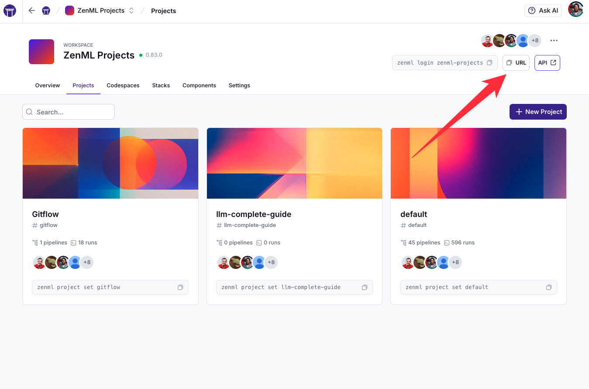

# Triggering Pipelines from External Systems

This tutorial demonstrates practical approaches to triggering ZenML pipelines from external systems. We'll explore multiple methods, from ZenML Pro's [Run Templates](https://docs.zenml.io/how-to/trigger-pipelines) to open-source alternatives using custom APIs, serverless functions, and GitHub Actions.

## Introduction: The Pipeline Triggering Challenge

In development environments, you typically run your ZenML pipelines directly from Python code. However, in production, pipelines often need to be triggered by external systems:

- Scheduled retraining of models based on a time interval
- Batch inference when new data arrives
- Event-driven ML workflows responding to data drift or performance degradation
- Integration with CI/CD pipelines and other automation systems
- Invocation from custom applications via API calls

Each scenario requires a reliable way to trigger the right version of your pipeline with the correct parameters, while maintaining security and operational standards.


For our full reference documentation on pipeline triggering, see the [Trigger a Pipeline (Run Templates)](https://docs.zenml.io/how-to/trigger-pipelines) page.


## Prerequisites

Before starting this tutorial, make sure you have:

1. ZenML installed and configured
2. Basic understanding of [ZenML pipelines and steps](https://docs.zenml.io/getting-started/core-concepts)
3. A simple pipeline to use for triggering examples

## Creating a Sample Pipeline for External Triggering

First, let's create a basic pipeline that we'll use throughout this tutorial. This pipeline takes a dataset URL and model type as inputs, then performs a simple training operation:

```python
from typing import Dict, Any, Union
from zenml import pipeline, step
import numpy as np
import pandas as pd
from sklearn.ensemble import RandomForestClassifier, GradientBoostingClassifier
from sklearn.model_selection import train_test_split
from sklearn.metrics import accuracy_score

@step
def load_data(data_url: str) -> pd.DataFrame:
    """Load data from a URL (simulated for this example)."""
    # For demonstration, we'll create synthetic data
    np.random.seed(42)
    n_samples = 1000
    
    print(f"Loading data from: {data_url}")
    # In a real scenario, you'd load from data_url
    # E.g., pd.read_csv(data_url)
    
    data = pd.DataFrame({
        'feature_1': np.random.normal(0, 1, n_samples),
        'feature_2': np.random.normal(0, 1, n_samples),
        'feature_3': np.random.normal(0, 1, n_samples),
        'target': np.random.choice([0, 1], n_samples)
    })
    return data

@step
def preprocess(data: pd.DataFrame) -> Dict[str, Any]:
    """Split data into train and test sets."""
    X = data.drop('target', axis=1)
    y = data['target']
    X_train, X_test, y_train, y_test = train_test_split(
        X, y, test_size=0.2, random_state=42
    )
    return {
        'X_train': X_train, 
        'X_test': X_test, 
        'y_train': y_train, 
        'y_test': y_test
    }

@step
def train_model(
    datasets: Dict[str, Any], 
    model_type: str = "random_forest"
) -> Union[RandomForestClassifier, GradientBoostingClassifier]:
    """Train a model based on the specified type."""
    X_train = datasets['X_train']
    y_train = datasets['y_train']
    
    if model_type == "random_forest":
        model = RandomForestClassifier(n_estimators=100, random_state=42)
    elif model_type == "gradient_boosting":
        model = GradientBoostingClassifier(random_state=42)
    else:
        raise ValueError(f"Unknown model type: {model_type}")
    
    print(f"Training a {model_type} model...")
    model.fit(X_train, y_train)
    return model

@step
def evaluate(
    datasets: Dict[str, Any], 
    model: Union[RandomForestClassifier, GradientBoostingClassifier]
) -> Dict[str, float]:
    """Evaluate the model and return metrics."""
    X_test = datasets['X_test']
    y_test = datasets['y_test']
    
    y_pred = model.predict(X_test)
    accuracy = accuracy_score(y_test, y_pred)
    
    print(f"Model accuracy: {accuracy:.4f}")
    return {'accuracy': float(accuracy)}


@pipeline
def training_pipeline(
    data_url: str = "s3://example-bucket/data.csv",
    model_type: str = "random_forest"
):
    """A configurable training pipeline that can be triggered externally."""
    data = load_data(data_url)
    datasets = preprocess(data)
    model = train_model(datasets, model_type)
    metrics = evaluate(datasets, model)

# For local execution during development
if __name__ == "__main__":
    # Run with default parameters
    training_pipeline()
```

This pipeline is designed to be configurable with parameters that might change between runs:
- `data_url`: Where to find the input data
- `model_type`: Which algorithm to use

These parameters make it an ideal candidate for external triggering scenarios where we want to run the same pipeline with different configurations.

## Method 1: Using Run Templates (ZenML Pro)


This is a [ZenML Pro](https://zenml.io/pro)-only feature. Please [sign up here](https://zenml.io/book-your-demo) to get access.



**Important: Workspace API vs ZenML Pro API**

Run Templates use your **Workspace API** (your individual workspace URL), not the ZenML Pro API (cloudapi.zenml.io). This distinction is crucial for authentication - you'll need Workspace API credentials (like service accounts), not ZenML Pro API tokens.



Production authentication (ZenML Pro)

For production automation in Pro (triggering run templates from CI/CD or external systems), prefer **organization‑level service accounts and API keys** over temporary user tokens. Set `ZENML_STORE_URL` to your workspace URL and `ZENML_STORE_API_KEY` to your org service account API key. See [Pro Service Accounts](https://docs.zenml.io/pro/core-concepts/service-accounts).


[Run Templates](https://docs.zenml.io/how-to/trigger-pipelines) are the most straightforward way to trigger pipelines externally in ZenML. They provide a pre-defined, parameterized configuration that can be executed via multiple interfaces.

### Creating a Run Template

First, we need to create a template based on our pipeline. This requires having a remote stack with at least a remote orchestrator, artifact store, and container registry.

#### Using Python:

```python
from zenml.client import Client

# First get the pipeline by name
pipeline = Client().get_pipeline("training_pipeline")

# Get the most recent runs for this pipeline
runs = Client().list_pipeline_runs(
    pipeline_id=pipeline.id, 
    sort_by="desc:created", 
    size=1
)

if runs:
    # Use the most recent run
    # assumes this run was run on a remote stack
    latest_run = runs[0]
    
    config = {
        "steps": {
            "load_data": {
                "parameters": {
                    "data_url": "s3://production-bucket/latest-data.csv"
                }
            }
        }
    }
    # Create a template from this run
    template = latest_run.create_run_template(
        name="production-training-template",
        deployment_id=latest_run.deployment_id,
        config=config
    )
    
    print(f"Created template: {template.name} with ID: {template.id}")
```

#### Using CLI:

```bash
# The source path is the module path to your pipeline
zenml pipeline create-run-template training_pipeline \
    --name=production-training-template
```

You can even pass a config file and specify a stack when using the `create-run-template` command:

```bash
# Create a config file
echo "steps:
  load_data:
    parameters:
      data_url: s3://production-bucket/latest-data.csv" > config.yaml

zenml pipeline create-run-template <PIPELINE_SOURCE_PATH> \
    --name=<TEMPLATE_NAME> \
    --config=<PATH_TO_CONFIG_YAML> \
    --stack=<STACK_ID_OR_NAME>
```

### Triggering a Template

Once you have created a template, there are [multiple ways](https://docs.zenml.io/how-to/trigger-pipelines) to trigger it, either programmatically with the Python client or via REST API for external systems.

#### Using the Python Client:

```python
from zenml.client import Client

# Find templates for a specific pipeline
pipeline = Client().get_pipeline("training_pipeline")
templates = Client().list_run_templates()
templates = [t for t in templates if t.pipeline.id == pipeline.id]

if templates:
    # Use the first matching template
    template = templates[0]
    print(f"Using template: {template.name} (ID: {template.id})")
    
    # Get the template's configuration
    config = template.config_template
    
    # Update the configuration with step parameters
    # Note: Parameters must be set at the step level rather than pipeline level
    config["steps"] = {
        "load_data": {
            "parameters": {
                "data_url": "s3://test-bucket/latest-data.csv",
            }
        },
        "train_model": {
            "parameters": {
                "model_type": "gradient_boosting",
            }
        }
    }
    
    # Trigger the pipeline with the updated configuration
    run = Client().trigger_pipeline(
        template_id=template.id,
        run_configuration=config,
    )
    
    print(f"Triggered pipeline run with ID: {run.id}")
```

#### Using the REST API:

For this you'll need a URL for a ZenML server. For those with a ZenML Pro
account, you can find the URL in the dashboard in the following location:



You can also find the URL via the CLI by running:

```bash
zenml status | grep "API:" | awk '{print $2}'
```


**Important: Use Workspace API, Not ZenML Pro API**

Run templates are triggered via your **Workspace API** (your individual workspace URL), not the ZenML Pro API (cloudapi.zenml.io). Make sure you're using the correct URL from your workspace dashboard.


The REST API is ideal for external system integration, allowing you to trigger pipelines from non-Python environments:

```bash
# Step 1: Get the pipeline ID
curl -X 'GET' \
  'https://<YOUR_ZENML_SERVER>/api/v1/pipelines?name=training_pipeline' \
  -H 'accept: application/json' \
  -H 'Authorization: Bearer <YOUR_TOKEN>'

# Step 2: Get the template ID using the pipeline_id
curl -X 'GET' \
  'https://<YOUR_ZENML_SERVER>/api/v1/run_templates?pipeline_id=<PIPELINE_ID>' \
  -H 'accept: application/json' \
  -H 'Authorization: Bearer <YOUR_TOKEN>'

# Step 3: Trigger the pipeline with custom parameters
curl -X 'POST' \
  'https://<YOUR_ZENML_SERVER>/api/v1/run_templates/<TEMPLATE_ID>/runs' \
  -H 'accept: application/json' \
  -H 'Content-Type: application/json' \
  -H 'Authorization: Bearer <YOUR_TOKEN>' \
  -d '{
    "steps": {
      "load_data": {
        "parameters": {
          "data_url": "s3://production-bucket/latest-data.csv"
        }
      },
      "train_model": {
        "parameters": {
          "model_type": "gradient_boosting"
        }
      }
    }
  }'
```

> Note: When using the REST API, you need to specify parameters at the step level, not at the pipeline level. This matches how parameters are configured in the Python client.

### Security Considerations for API Tokens

When using the REST API for external systems, proper token management is critical:


**Best Practice: Use Service Accounts for Automation**

For production run template triggering, **always use service accounts with API keys** instead of personal access tokens. Personal tokens expire after 1 hour and are tied to individual users, making them unsuitable for automation.


```python
from zenml.client import Client

# Create a service account for automated triggers
service_account = Client().create_service_account(
    name="pipeline-trigger-service",
    description="Service account for external pipeline triggering"
)

# Generate API token with appropriate permissions
token = Client().create_service_account_token(
    service_account.id,
    name="production-trigger-token",
    description="Token for production pipeline triggers"
)

print(f"Store this token securely: {token.token}")
# Make sure to save this token value securely
```

**Why service accounts are better for automation:**
- **Long-lived**: Tokens don't expire automatically like user tokens (1 hour)
- **Dedicated**: Not tied to individual team members who might leave
- **Secure**: Can be granted minimal permissions needed for the task
- **Traceable**: Clear audit trail of which system performed actions

Use this token in your API calls, and store it securely in your external system
(e.g., as a GitHub Secret, AWS Secret, or environment variable). Read more
about [service accounts and tokens](https://docs.zenml.io/api-reference/oss-api/getting-started#using-a-service-account-and-an-api-key).

## Method 2: Building a Custom Trigger API (Open Source)

If you're using the open-source version of ZenML or prefer a customized
solution, you can create your own API wrapper around pipeline execution. This
approach gives you full control over how pipelines are triggered and can be integrated
into your existing infrastructure.

The custom trigger API solution consists of the following components:

1. **Pipeline Definition Module** - Contains your pipeline code
2. **FastAPI Web Server** - Provides HTTP endpoints for triggering pipelines
3. **Dynamic Pipeline Loading** - Loads and executes pipelines on demand
4. **Authentication** - Secures the API with API key authentication
5. **Containerization** - Packages everything for deployment

### Creating a Pipeline Module

First, create a module containing your pipeline definitions. This will be imported by the API service:

```python
# common.py
from typing import Dict, Any, Union
from zenml import pipeline, step
import numpy as np
import pandas as pd
from sklearn.ensemble import RandomForestClassifier, GradientBoostingClassifier
from sklearn.model_selection import train_test_split
from sklearn.metrics import accuracy_score
from zenml.config import DockerSettings

@step
def load_data(data_url: str) -> pd.DataFrame:
    """Load data from a URL (simulated for this example)."""
    # For demonstration, we'll create synthetic data
    np.random.seed(42)
    n_samples = 1000
    
    print(f"Loading data from: {data_url}")
    # In a real scenario, you'd load from data_url
    # E.g., pd.read_csv(data_url)
    
    data = pd.DataFrame({
        "feature_1": np.random.normal(0, 1, n_samples),
        "feature_2": np.random.normal(0, 1, n_samples),
        "feature_3": np.random.normal(0, 1, n_samples),
        "target": np.random.choice([0, 1], n_samples),
    })
    return data

@step
def preprocess(data: pd.DataFrame) -> Dict[str, Any]:
    """Split data into train and test sets."""
    X = data.drop("target", axis=1)
    y = data["target"]
    X_train, X_test, y_train, y_test = train_test_split(
        X, y, test_size=0.2, random_state=42
    )
    return {
        "X_train": X_train,
        "X_test": X_test,
        "y_train": y_train,
        "y_test": y_test,
    }

@step
def train_model(
    datasets: Dict[str, Any], model_type: str = "random_forest"
) -> Union[RandomForestClassifier, GradientBoostingClassifier]:
    """Train a model based on the specified type."""
    X_train = datasets["X_train"]
    y_train = datasets["y_train"]
    
    if model_type == "random_forest":
        model = RandomForestClassifier(n_estimators=100, random_state=42)
    elif model_type == "gradient_boosting":
        model = GradientBoostingClassifier(random_state=42)
    else:
        raise ValueError(f"Unknown model type: {model_type}")
    
    print(f"Training a {model_type} model...")
    model.fit(X_train, y_train)
    return model

@step
def evaluate(
    datasets: Dict[str, Any],
    model: Union[RandomForestClassifier, GradientBoostingClassifier],
) -> Dict[str, float]:
    """Evaluate the model and return metrics."""
    X_test = datasets["X_test"]
    y_test = datasets["y_test"]
    
    y_pred = model.predict(X_test)
    accuracy = accuracy_score(y_test, y_pred)
    
    print(f"Model accuracy: {accuracy:.4f}")
    return {"accuracy": float(accuracy)}

# Define Docker settings for the pipeline
docker_settings = DockerSettings(
    requirements="requirements.txt",
    required_integrations=["sklearn"],
)

@pipeline(settings={"docker": docker_settings})
def training_pipeline(
    data_url: str = "example-data-source", model_type: str = "random_forest"
):
    """A configurable training pipeline that can be triggered externally."""
    data = load_data(data_url)
    datasets = preprocess(data)
    model = train_model(datasets, model_type)
    metrics = evaluate(datasets, model)
    return metrics
```

### Creating a Requirements File

Create a `requirements.txt` file with the necessary dependencies:

```plaintext
# Requirements for pipeline trigger API
fastapi>=0.95.0
uvicorn>=0.21.0
requests>=2.28.0
# Core dependencies
scikit-learn>=1.0.0
pandas>=1.3.0
numpy>=1.20.0
# ZenML
zenml>=0.80.1
```

### Creating a FastAPI Wrapper

Next, create the `pipeline_api.py` file with the FastAPI application:

```python
import os
import sys
import importlib.util
from typing import Dict, Any, Optional
import threading
from fastapi import FastAPI, HTTPException, Depends, Security
from fastapi.security import APIKeyHeader
from pydantic import BaseModel
import uvicorn

# Import the training pipeline from the common module
from common import training_pipeline

# Setup FastAPI app
app = FastAPI(title="ZenML Pipeline Trigger API")

# Simple API key authentication
# This environment variable serves as a security token to protect your API endpoints
# In production, use a strong, randomly generated key stored securely
API_KEY = os.environ.get("PIPELINE_API_KEY", "your-secure-api-key")
api_key_header = APIKeyHeader(name="X-API-Key")

async def get_api_key(api_key: str = Security(api_key_header)):
    if api_key != API_KEY:
        raise HTTPException(status_code=401, detail="Invalid API key")
    return api_key

# Request model for pipeline parameters
class StepParameter(BaseModel):
    parameters: Dict[str, Any]

class PipelineRequest(BaseModel):
    pipeline_name: str
    steps: Dict[str, StepParameter] = {}
    config_path: Optional[str] = None

# Import a pipeline dynamically
def import_pipeline(pipeline_name):
    """Import a pipeline function from available modules."""
    # First try to import from known pipelines
    if pipeline_name == "training_pipeline":
        return training_pipeline
    
    # Try importing from other modules
    try:
        spec = importlib.util.find_spec("common")
        if spec is None:
            raise ImportError(f"Module 'common' not found")
            
        module = importlib.util.module_from_spec(spec)
        spec.loader.exec_module(module)
        
        if not hasattr(module, pipeline_name):
            raise AttributeError(f"Pipeline '{pipeline_name}' not found in module")
            
        return getattr(module, pipeline_name)
    except Exception as e:
        raise HTTPException(status_code=404, detail=f"Pipeline not found: {str(e)}")

@app.post("/trigger", status_code=202)
async def trigger_pipeline(
    request: PipelineRequest, 
    api_key: str = Depends(get_api_key)
):
    """Trigger a pipeline asynchronously."""
    # Start a background task and return immediately
    
    def run_pipeline():
        try:
            pipeline_func = import_pipeline(request.pipeline_name)
            if request.config_path:
                configured_pipeline = pipeline_func.with_options(
                    config_path=request.config_path
                )
            else:
                configured_pipeline = pipeline_func
                
            # Extract parameters from steps
            step_parameters = {}
            if request.steps:
                for step_name, step_config in request.steps.items():
                    if step_config.parameters:
                        step_parameters.update(step_config.parameters)
                        
            configured_pipeline(**step_parameters)
            print(f"Async pipeline '{request.pipeline_name}' completed")
        except Exception as e:
            print(f"Async pipeline '{request.pipeline_name}' failed: {str(e)}")
            
    # Start the pipeline in a background thread
    thread = threading.Thread(target=run_pipeline)
    thread.start()
    
    return {
        "status": "accepted",
        "message": "Pipeline triggered asynchronously",
    }

if __name__ == "__main__":
    print(f"Starting API server with API key: {API_KEY}")
    print("To trigger a pipeline, use:")
    print(
        'curl -X POST "http://localhost:8000/trigger" \\\n'
        '  -H "Content-Type: application/json" \\\n'
        f'  -H "X-API-Key: {API_KEY}" \\\n'
        '  -d \'{"pipeline_name": "training_pipeline", "steps": {"load_data": {"parameters": {"data_url": "custom-data-source"}}, "train_model": {"parameters": {"model_type": "gradient_boosting"}}}}\''
    )
    uvicorn.run(app, host="0.0.0.0", port=8000)
```

### Containerizing Your API

Create a `Dockerfile` to containerize your API:

```dockerfile
FROM python:3.9-slim

WORKDIR /app

# Install ZenML and other dependencies
COPY requirements.txt .
RUN pip install -U pip uv && uv pip install --system --no-cache-dir -r requirements.txt

# Copy your code
COPY . .

# Set environment variables
ENV PYTHONPATH=/app

# Define build arguments
ARG ZENML_ACTIVE_STACK_ID
ARG PIPELINE_API_KEY
ARG ZENML_STORE_URL
ARG ZENML_STORE_API_KEY

# Set environment variables from build args
ENV ZENML_ACTIVE_STACK_ID=${ZENML_ACTIVE_STACK_ID}
ENV PIPELINE_API_KEY=${PIPELINE_API_KEY}
ENV ZENML_STORE_URL=${ZENML_STORE_URL}
ENV ZENML_STORE_API_KEY=${ZENML_STORE_API_KEY}

# Export and install stack requirements
RUN if [ -n "$ZENML_ACTIVE_STACK_ID" ]; then \
    zenml stack set $ZENML_ACTIVE_STACK_ID && \
    zenml stack export-requirements $ZENML_ACTIVE_STACK_ID --output-file stack_requirements.txt && \
    uv pip install --system -r stack_requirements.txt; \
    else echo "Warning: ZENML_ACTIVE_STACK_ID not set, skipping stack requirements"; \
    fi

# Expose the port
EXPOSE 8000

# Run the API
CMD ["python", "pipeline_api.py"]
```

This Dockerfile includes several important features:

1. Building with the `uv` package installer for faster builds
2. Support for passing ZenML configuration via build arguments
3. Automatic installation of stack-specific requirements
4. Setting up environment variables for ZenML configuration

### Running Your API Locally

To test the API server locally:

```bash
# Install the required dependencies
pip install -r requirements.txt

# Set the API key
export PIPELINE_API_KEY="your-secure-api-key"

# If using a remote ZenML server, set these as well
export ZENML_STORE_URL="https://your-zenml-server-url"
export ZENML_STORE_API_KEY="your-zenml-api-key"

# If you want to use a specific stack
export ZENML_ACTIVE_STACK_ID="your-stack-id"

# Start the API server
python pipeline_api.py
```

### Deploying Your API

Build and deploy your containerized API:

```bash
# Build the Docker image
docker build -t zenml-pipeline-api \
  --build-arg ZENML_ACTIVE_STACK_ID="your-stack-id" \
  --build-arg PIPELINE_API_KEY="your-secure-api-key" \
  --build-arg ZENML_STORE_URL="https://your-zenml-server" \
  --build-arg ZENML_STORE_API_KEY="your-zenml-api-key" .

# Run the container
docker run -p 8000:8000 zenml-pipeline-api
```

For production deployment, you can:
- Deploy to Kubernetes with a proper Ingress and TLS
- Deploy to a cloud platform supporting Docker containers
- Set up CI/CD for automated deployments

### Triggering Pipelines via the API

You can trigger pipelines through the custom API with this endpoint:

```bash
curl -X 'POST' \
  'http://your-api-server:8000/trigger' \
  -H 'accept: application/json' \
  -H 'X-API-Key: your-secure-api-key' \
  -H 'Content-Type: application/json' \
  -d '{
    "pipeline_name": "training_pipeline",
    "steps": {
      "load_data": {
        "parameters": {
          "data_url": "s3://some-bucket/new-data.csv"
        }
      },
      "train_model": {
        "parameters": {
          "model_type": "gradient_boosting"
        }
      }
    }
  }'
```

This method starts the pipeline in a background thread and returns immediately with a status code of 202 (Accepted), making it suitable for asynchronous execution from external systems.

### Extending the API

You can extend this API to support additional features:

1. **Pipeline Discovery**: Add endpoints to list available pipelines
2. **Run Status Tracking**: Add endpoints to check the status of pipeline runs
3. **Webhook Notifications**: Implement callbacks when pipelines complete
4. **Advanced Authentication**: Implement JWT or OAuth2 for better security
5. **Pipeline Scheduling**: Add endpoints to schedule pipeline runs

### Handling Concurrent Pipeline Execution


**Important Limitation: ZenML Prevents Concurrent Pipeline Execution**

ZenML's current implementation uses shared global state (like active stack and active pipeline), which prevents running multiple pipelines concurrently in the same process. If you attempt to trigger multiple pipelines simultaneously, subsequent calls will be blocked with the error:

```
Preventing execution of pipeline '<pipeline_name>'. If this is not intended behavior, make sure to unset the environment variable 'ZENML_PREVENT_PIPELINE_EXECUTION'.
```


The FastAPI example above uses threading, but due to ZenML's architecture, concurrent pipeline execution will fail. For production environments that need to handle concurrent pipeline requests, consider deploying your pipeline triggers through container orchestration platforms.

#### Recommended Solutions for Concurrent Execution

For production deployments, consider using:

1. **Kubernetes Jobs**: Deploy each pipeline execution as a separate Kubernetes Job for resource management and scaling
2. **Docker Containers**: Use a container orchestration platform like Docker Swarm or ECS to run separate container instances
3. **Cloud Container Services**: Leverage services like AWS ECS, Google Cloud Run, or Azure Container Instances
4. **Serverless Functions**: Deploy pipeline triggers as serverless functions (AWS Lambda, Azure Functions, etc.)

These approaches ensure each pipeline runs in its own isolated environment, avoiding the concurrency limitations of ZenML's shared state architecture.

### Security Considerations

When deploying this API in production:

1. **Use Strong API Keys**: Generate secure, random API keys. The `PIPELINE_API_KEY` in the code example is a simple authentication token that protects your API endpoints. Do not use the default value in production.
2. **HTTPS/TLS**: Always use HTTPS for production deployments
3. **Least Privilege**: Use ZenML service accounts with minimal permissions
4. **Rate Limiting**: Implement rate limiting to prevent abuse
5. **Secret Management**: Use a secure secrets manager for API keys and credentials
6. **Logging & Monitoring**: Implement proper logging for security audits

## Best Practices & Troubleshooting

### Tag Run Templates

You should tag your run templates to make them easier to find and manage. It is
currently only possible using the Python SDK:

```python
from zenml import add_tags

add_tags(tags=["my_tag"], run_template="run_template_name_or_id")
```

### Parameter Stability Best Practices

When triggering pipelines externally, it's crucial to maintain parameter stability to prevent unexpected behavior:

1. **Document Parameter Changes**: Keep a changelog of parameter modifications and their impact on pipeline behavior
2. **Version Control Parameters**: Store parameter configurations in version-controlled files (e.g., YAML) alongside your pipeline code
3. **Validate Parameter Changes**: Consider implementing validation checks to ensure new parameter values are compatible with existing pipeline steps
4. **Consider Upstream Impact**: Before modifying step parameters, analyze how changes might affect:
   - Downstream steps that depend on the step's output
   - Cached artifacts that might become invalid
   - Other pipelines that might be using this step
5. **Use Parameter Templates**: Create parameter templates for different scenarios (e.g., development, staging, production) to maintain consistency

### Security Best Practices

1. **API Keys**: Always use API keys or tokens for authentication
2. **Principle of Least Privilege**: Grant only necessary permissions to service accounts
3. **Key Rotation**: Rotate API keys regularly
4. **Secure Storage**: Store credentials in secure locations (not in code)
5. **TLS**: Use HTTPS for all API endpoints

### Monitoring and Observability

Implement monitoring for your trigger mechanisms:

```python
import logging
from datetime import datetime

# Set up logging
logging.basicConfig(level=logging.INFO)
logger = logging.getLogger("pipeline-trigger")

def log_trigger_attempt(pipeline_name, parameters, source):
    """Log pipeline trigger attempts."""
    timestamp = datetime.now().isoformat()
    logger.info(f"TRIGGER_ATTEMPT|{timestamp}|{pipeline_name}|{source}|{parameters}")

def log_trigger_success(pipeline_name, run_id, source):
    """Log successful pipeline triggers."""
    timestamp = datetime.now().isoformat()
    logger.info(f"TRIGGER_SUCCESS|{timestamp}|{pipeline_name}|{source}|{run_id}")

def log_trigger_failure(pipeline_name, error, source):
    """Log failed pipeline triggers."""
    timestamp = datetime.now().isoformat()
    logger.error(f"TRIGGER_FAILURE|{timestamp}|{pipeline_name}|{source}|{error}")

# Use in your trigger code
try:
    log_trigger_attempt("training_pipeline", parameters, "rest_api")
    run = Client().trigger_pipeline(
        pipeline_name_or_id="training_pipeline",
        run_configuration=run_config
    )
    log_trigger_success("training_pipeline", run.id, "rest_api")
except Exception as e:
    log_trigger_failure("training_pipeline", str(e), "rest_api")
    raise
```

## Conclusion: Choosing the Right Approach

The best approach for triggering pipelines depends on your specific needs:

1. **ZenML Pro Run Templates**: Ideal for teams that need a complete, managed solution with UI support and centralized management

2. **Custom API**: Best for teams that need full control over the triggering mechanism and want to embed it within their own infrastructure

Regardless of your approach, always prioritize:
- Security (authentication and authorization)
- Reliability (error handling and retries)
- Observability (logging and monitoring)

## Next Steps

Now that you understand how to trigger ZenML pipelines from external systems, consider exploring:

1. [Managing scheduled pipelines](managing-scheduled-pipelines.md) for time-based execution
2. Implementing [comprehensive CI/CD](https://docs.zenml.io/user-guides/production-guide/ci-cd) for your ML workflows
3. Setting up [monitoring and alerting](https://docs.zenml.io/stacks/alerters) for pipeline failures
