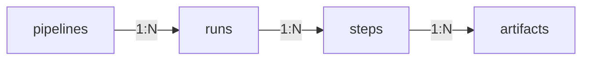

Once a pipeline run has been completed, we can access the corresponding information in code, which enables the following:

* Loading artifacts like models or datasets saved by previous runs
* Accessing metadata or configurations of previous runs
* Programmatically inspecting the lineage of pipeline runs and their artifacts

The hierarchy of pipelines, runs, steps, and artifacts is as follows:

As you can see from the diagram, there are many layers of 1-to-N relationships.

Let us investigate how to traverse this hierarchy level by level:

## Pipelines

### Get a pipeline via the client

After you have run a pipeline at least once, you can also fetch the pipeline via the [Client.get\_pipeline()](https://sdkdocs.zenml.io/latest/core%5Fcode%5Fdocs/core-client/#zenml.client.Client.get%5Fpipeline) method.


```py
from zenml.client import Client

pipeline_model = Client().get_pipeline("first_pipeline")
```

Check out the [ZenML Client Documentation](versions/0.66.0/reference/python-client) for more information on the `Client` class and its purpose.

### Discover and list all pipelines

If you're not sure which pipeline you need to fetch, you can find a list of all registered pipelines in the ZenML dashboard, or list them programmatically either via the Client or the CLI.
<Tabs>
    <Tab title="Python">
You can use the [Client.list\_pipelines()](https://sdkdocs.zenml.io/latest/core%5Fcode%5Fdocs/core-client/#zenml.client.Client.list%5Fpipelines) method to get a list of all pipelines registered in ZenML:
```py
from zenml.client import Client

pipelines = Client().list_pipelines()
```
    </Tab>
    <Tab title="CLI">

Alternatively, you can also list pipelines with the following CLI command:

```bash
zenml pipeline list
```
    </Tab>
</Tabs>


## Runs

Each pipeline can be executed many times, resulting in several **Runs**.

### Get all runs of a pipeline

You can get a list of all runs of a pipeline using the `runs` property of the pipeline:

```Bash
runs = pipeline_model.runs
```

The result will be a list of the most recent runs of this pipeline, ordered from newest to oldest.

<Info>
    Alternatively, you can also use the `pipeline_model.get_runs()` method which allows you to specify detailed parameters for filtering or pagination. See the [ZenML SDK Docs](versions/0.66.0/reference/python-client#list-of-resources) for more information.
</Info>

### Get the last run of a pipeline

To access the most recent run of a pipeline, you can either use the `last_run` property or access it through the `runs` list:

```bash
last_run = pipeline_model.last_run  # OR: pipeline_model.runs[0]
```

<Info>
    If your most recent runs have failed, and you want to find the last run that has succeeded, you can use the `last_successful_run` property instead.
</Info>

### Get the latest run from a pipeline

Calling a pipeline executes it and then returns the response of the freshly executed run.

```bash
run = training_pipeline()
```

<Note>
The run that you get back is the model stored in the ZenML database at the point of the method call. This means the pipeline run is still initializing and no steps have been run. To get the latest state can get a refreshed version from the client:

```py
from zenml.client import Client

Client().get_pipeline_run(run.id) # to get a refreshed version
```

</Note>
### Get a run via the client

If you already know the exact run that you want to fetch (e.g., from looking at the dashboard), you can use the [Client.get\_pipeline\_run()](https://sdkdocs.zenml.io/latest/core%5Fcode%5Fdocs/core-client/#zenml.client.Client.get%5Fpipeline%5Frun) method to fetch the run directly without having to query the pipeline first:

```py
from zenml.client import Client

pipeline_run = Client().get_pipeline_run("first_pipeline-2023_06_20-16_20_13_274466")
```

<Info>
    Similar to pipelines, you can query runs by either ID, name, or name prefix, and you can also discover runs through the Client or CLI via the [Client.list\_pipeline\_runs()](https://sdkdocs.zenml.io/latest/core%5Fcode%5Fdocs/core-client/#zenml.client.Client.list%5Fpipeline%5Fruns) or `zenml pipeline runs list` commands.
</Info>

### Run information

Each run has a collection of useful information which can help you reproduce your runs. In the following, you can find a list of some of the most useful pipeline run information, but there is much more available. See the [PipelineRunResponse](https://sdkdocs.zenml.io/latest/core%5Fcode%5Fdocs/core-models/#zenml.models.v2.core.pipeline%5Frun.PipelineRunResponse) definition for a comprehensive list.

#### Status

The status of a pipeline run. There are five possible states: initialized, failed, completed, running, and cached.

```py
status = run.status
```

#### Configuration

The `pipeline_configuration` is an object that contains all configurations of the pipeline and pipeline run, including the [pipeline-level settings](/versions/0.66.0/user-guide/production-guide/configure-pipeline), which we will learn more about later:

```Bash
pipeline_config = run.config
pipeline_settings = run.config.settings
```

#### Component-Specific metadata

Depending on the stack components you use, you might have additional component-specific metadata associated with your run, such as the URL to the UI of a remote orchestrator. You can access this component-specific metadata via the `run_metadata` attribute:

```Bash

run_metadata = run.run_metadata
# The following only works for runs on certain remote orchestrators
orchestrator_url = run_metadata["orchestrator_url"].value

## Steps

Within a given pipeline run you can now further zoom in on individual steps using the `steps` attribute:

```python
# get all steps of a pipeline for a given run
steps = run.steps

# get a specific step by its invocation ID
step = run.steps["first_step"]
```

<Info>
    If you're only calling each step once inside your pipeline, the **invocation ID** will be the same as the name of your step. For more complex pipelines, check out [this page](/versions/0.66.0/how-to/build-pipelines/using-a-custom-step-invocation-id) to learn more about the invocation ID.
</Info>

### Inspect pipeline runs with our VS Code extension
<Frame caption="GIF of our VS code extension, showing some of the uses of the sidebar">
    
</Frame>

If you are using [our VS Code extension](https://marketplace.visualstudio.com/items?itemName=ZenML.zenml-vscode), you can easily view your pipeline runs by opening the sidebar (click on the ZenML icon). You can then click on any particular pipeline run to see its status and some other metadata. If you want to delete a run, you can also do so from the same sidebar view.

### Step information

Similar to the run, you can use the `step` object to access a variety of useful information:

* The parameters used to run the step via `step.config.parameters`,
* The step-level settings via `step.config.settings`,
* Component-specific step metadata, such as the URL of an experiment tracker or model deployer, via `step.run_metadata`

See the [StepRunResponse](https://github.com/zenml-io/zenml/blob/main/src/zenml/models/v2/core/step%5Frun.py) definition for a comprehensive list of available information.

## Artifacts

Each step of a pipeline run can have multiple output and input artifacts that we can inspect via the `outputs` and `inputs` properties.

To inspect the output artifacts of a step, you can use the `outputs` attribute, which is a dictionary that can be indexed using the name of an output. Alternatively, if your step only has a single output, you can use the `output` property as a shortcut directly:

```Bash
# The outputs of a step are accessible by name
output = step.outputs["output_name"]

# If there is only one output, you can use the `.output` property instead
output = step.output

# use the `.load()` method to load the artifact into memory
my_pytorch_model = output.load()
```

Similarly, you can use the `inputs` and `input` properties to get the input artifacts of a step instead.

<Info>
    Check out [this page](/versions/0.66.0/user-guide/starter-guide/manage-artifacts#giving-names-to-your-artifacts) to see what the output names of your steps are and how to customize them.
</Info>

Note that the output of a step corresponds to a specific artifact version.

### Fetching artifacts directly

If you'd like to fetch an artifact or an artifact version directly, it is easy to do so with the `Client`:

```py
from zenml.client import Client

# Get artifact
artifact = Client().get_artifact('iris_dataset')
artifact.versions  # Contains all the versions of the artifact
output = artifact.versions['2022']  # Get version name "2022"

# Get artifact version directly:

# Using version name:
output = Client().get_artifact_version('iris_dataset', '2022')

# Using UUID
output = Client().get_artifact_version('f429f94c-fb15-43b5-961d-dbea287507c5')
loaded_artifact = output.load()
```

### Artifact information

Regardless of how one fetches it, each artifact contains a lot of general information about the artifact as well as datatype-specific metadata and visualizations.

#### Metadata

All output artifacts saved through ZenML will automatically have certain datatype-specific metadata saved with them. NumPy Arrays, for instance, always have their storage size, `shape`, `dtype`, and some statistical properties saved with them. You can access such metadata via the `run_metadata` attribute of an output, e.g.:

```Bash
output_metadata = output.run_metadata
storage_size_in_bytes = output_metadata["storage_size"].value
```

We will talk more about metadata [in the next section](/versions/0.66.0/user-guide/starter-guide/manage-artifacts#logging-metadata-for-an-artifact).

#### Visualizations

ZenML automatically saves visualizations for many common data types. Using the `visualize()` method you can programmatically show these visualizations in Jupyter notebooks:

```Bash
output.visualize()
```

<Frame caption="output.visualize() Output">
    
</Frame>
<Info>
    If you're not in a Jupyter notebook, you can simply view the visualizations in the ZenML dashboard by running `zenml up` and clicking on the respective artifact in the pipeline run DAG instead. Check out the [artifact visualization page](/versions/0.66.0/how-to/visualize-artifacts) to learn more about how to build and view artifact visualizations in ZenML!
</Info>

## Fetching information during run execution

While most of this document has focused on fetching objects after a pipeline run has been completed, the same logic can also be used within the context of a running pipeline.

This is often desirable in cases where a pipeline is running continuously over time and decisions have to be made according to older runs.

For example, this is how we can fetch the last pipeline run of the same pipeline from within a ZenML step:

```py
from zenml import get_step_context
from zenml.client import Client

@step
def my_step():
    # Get the name of the current pipeline run
    current_run_name = get_step_context().pipeline_run.name

    # Fetch the current pipeline run
    current_run = Client().get_pipeline_run(current_run_name)

    # Fetch the previous run of the same pipeline
    previous_run = current_run.pipeline.runs[1]  # index 0 is the current run
```

<Info>
    As shown in the example, we can get additional information about the current run using the `StepContext`, which is explained in more detail in the [advanced docs](/versions/0.66.0/how-to/track-metrics-metadata/fetch-metadata-within-steps).
</Info>

## Code example

This section combines all the code from this section into one simple script that you can use to see the concepts discussed above:
<Accordion
    title="Code Example of this Section"
>
Putting it all together, this is how we can load the model trained by the `svc_trainer` step of our example pipeline from the previous sections:
```py
from typing_extensions import Tuple, Annotated
import pandas as pd
from sklearn.datasets import load_iris
from sklearn.model_selection import train_test_split
from sklearn.base import ClassifierMixin
from sklearn.svm import SVC

from zenml import pipeline, step
from zenml.client import Client


@step
def training_data_loader() -> Tuple[
    Annotated[pd.DataFrame, "X_train"],
    Annotated[pd.DataFrame, "X_test"],
    Annotated[pd.Series, "y_train"],
    Annotated[pd.Series, "y_test"],
]:
    """Load the iris dataset as tuple of Pandas DataFrame / Series."""
    iris = load_iris(as_frame=True)
    X_train, X_test, y_train, y_test = train_test_split(
        iris.data, iris.target, test_size=0.2, shuffle=True, random_state=42
    )
    return X_train, X_test, y_train, y_test


@step
def svc_trainer(
    X_train: pd.DataFrame,
    y_train: pd.Series,
    gamma: float = 0.001,
) -> Tuple[
    Annotated[ClassifierMixin, "trained_model"],
    Annotated[float, "training_acc"],
]:
    """Train a sklearn SVC classifier and log to MLflow."""
    model = SVC(gamma=gamma)
    model.fit(X_train.to_numpy(), y_train.to_numpy())
    train_acc = model.score(X_train.to_numpy(), y_train.to_numpy())
    print(f"Train accuracy: {train_acc}")
    return model, train_acc


@pipeline
def training_pipeline(gamma: float = 0.002):
    X_train, X_test, y_train, y_test = training_data_loader()
    svc_trainer(gamma=gamma, X_train=X_train, y_train=y_train)


if __name__ == "__main__":
    # You can run the pipeline and get the run object directly
    last_run = training_pipeline()
    print(last_run.id)

    # You can also use the class directly with the `model` object
    last_run = training_pipeline.model.last_run
    print(last_run.id)

    # OR you can fetch it after execution is finished:
    pipeline = Client().get_pipeline("training_pipeline")
    last_run = pipeline.last_run
    print(last_run.id)

    # You can now fetch the model
    trainer_step = last_run.steps["svc_trainer"]
    model = trainer_step.outputs["trained_model"].load()
```
</Accordion>

