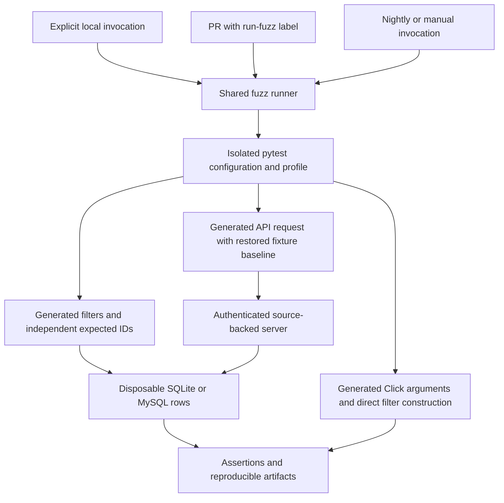
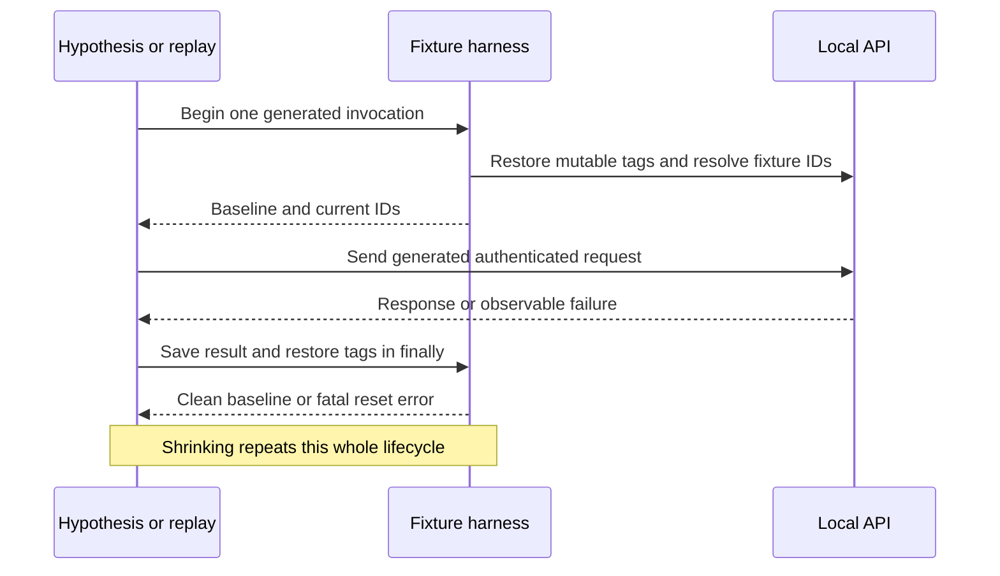
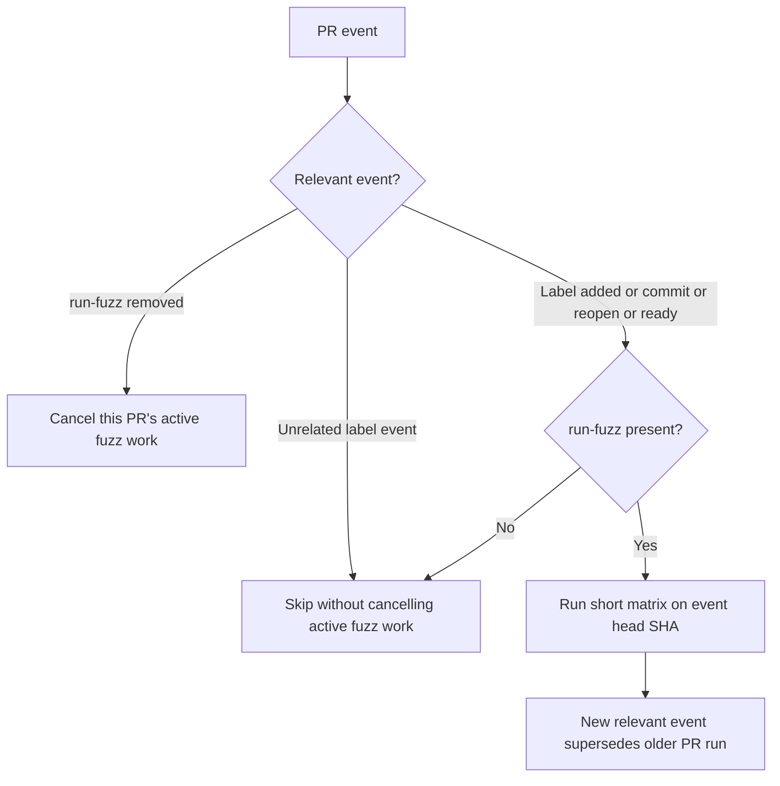
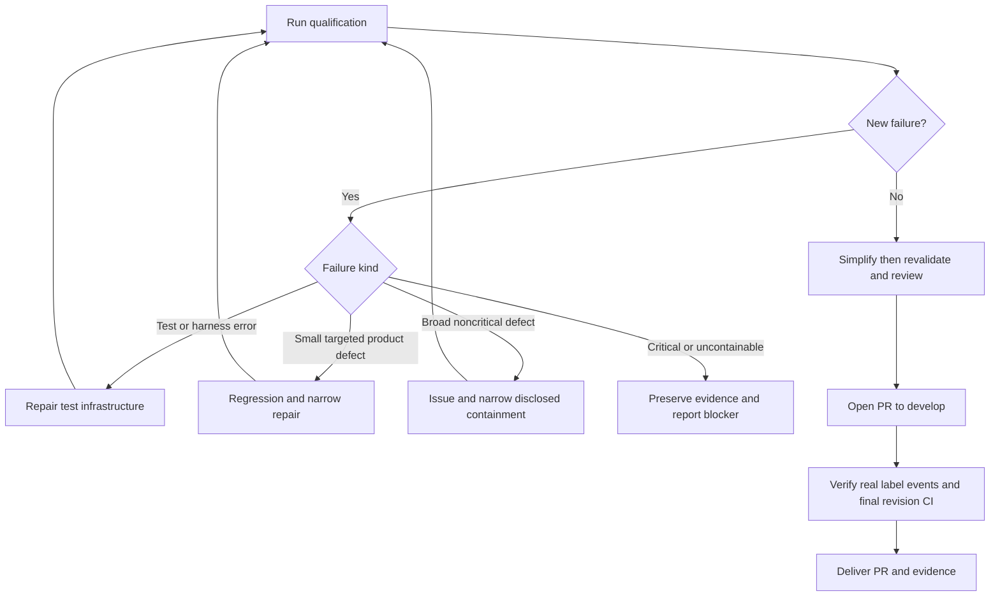

# Optional ZenML Fuzzing - Plan

## Goal Capsule

- **Objective:** ZenML maintainers can discover and reproduce input-handling defects before users encounter them, without making ordinary PR checks slower.
- **Means:** Optional Hypothesis filter and CLI suites, plus a focused Schemathesis API suite, sharing local and CI execution paths (KTD1-KTD5).
- **Working baseline:** `develop` is the branch for new work, the PR target, and the source tested nightly.
- **Authority:** The user's current instructions and repository `AGENTS.md` take precedence. Requirements govern behavior; technical decisions govern implementation within those requirements.
- **Execution profile:** Once execution is requested, proceed through the dependency-ordered units autonomously, including relevant fixes, validation, simplification, review, and PR delivery. Use independent agents for separable implementation and review; keep shared harness edits coordinated.
- **Finish and ship:** The implementing agent completes U1-U8, opens the PR after the pre-PR verification gate, and follows its checks to a final result. Opening the PR alone is not completion.
- **Stop conditions:** A required environment or permission remains unavailable, a discovered fix needs a breaking contract or migration, or a critical finding cannot be safely contained. Preserve reproductions and continue independent work. Do not claim a skipped, cancelled, timed-out, or unavailable check passed.
- **Delivery boundary:** Open the PR; do not merge, publish a release, change the repository's default branch, or write directly to `main`.

---

## Product Contract

### Summary

Add three opt-in fuzzing suites for SQL filters, REST endpoints, and CLI parsing. Contributors can run the same suites locally, request a short PR run with a label, and receive longer nightly exploration with reproducible findings.

### Problem Frame

Existing example-based tests cannot cover the combinations of malformed values, filter operators, argument layouts, and database behavior that ZenML accepts. Some failures produce incorrect results without raising an exception. Existing CI is already expensive, so broader input exploration must have a separate cost budget.

### Requirements

**Coverage**

- R1. Use Hypothesis to test filter parsing and actual query results against a small independent reference calculation on both SQLite and MySQL.
- R2. Use Schemathesis against a real authenticated local ZenML server, initially covering tags CRUD/list and project, pipeline, and run listing.
- R3. Use Hypothesis to test CLI argument parsing and CLI-to-filter equivalence without starting a server.
- R4. Keep every new generated suite explicitly opt-in; ordinary test runs must not import its modules, install its optional dependencies, or provision its services.

**Execution and reproducibility**

- R5. Provide one documented local entry point with suite, backend, profile, and reproduction selection that CI also uses.
- R6. Adding `run-fuzz` to a PR starts short fuzzing; subsequent commits run while the label remains, with no fuzz jobs on unlabeled PRs.
- R7. Provide a separate nightly workflow that tests `develop`, gives MySQL the larger API budget, and also exercises SQLite; support manual dispatch when GitHub recognizes the workflow.
- R8. Bound cost with explicit generation budgets, wall-clock backstops, limited concurrency, and isolated disposable resources.
- R9. Preserve enough evidence to reproduce failures locally, including generated input, prerequisite state, source revision, backend configuration, and tool versions.
- R10. Require successful authenticated exercises of every allowed API operation so a suite of rejection responses cannot count as useful coverage.

**Findings and delivery**

- R11. Triage each new failure as a product defect, incorrect test expectation, or infrastructure failure; record its disposition without masking unrelated failures.
- R12. Validate the implementation locally on both backends, then run the `simplify` skill before opening a PR and rerun checks invalidated by changes.
- R13. Open a reviewed PR targeting `develop`, verify its label-triggered fuzz checks on the final revision, and report remaining activation limits explicitly.

### Key Decisions

- **Optional exploration:** Protect ordinary CI latency. Governs R4, R6, R7. (session-settled: user-approved; chosen over automatic fuzzing on every PR because existing CI is already slow.)
- **Both database backends:** Keep quick SQLite feedback and real MySQL coverage. Governs R1, R7. (session-settled: user-approved; chosen over SQLite-only validation because database behavior is part of the test target.)
- **Focused CLI coverage:** Exercise parsing without executing arbitrary commands. Governs R3. (session-settled: user-approved; chosen over broad CLI execution to keep tests fast and independent of integrations.)

### Acceptance Examples

- AE1. **Covers R4, R6:** An unlabeled PR runs the existing checks with no new fuzz runner or database startup. Adding `run-fuzz` starts the short matrix.
- AE2. **Covers R1:** A generated membership filter is evaluated over known rows; returning extra or missing IDs fails even when the query executes without error.
- AE3. **Covers R2, R9, R10:** A generated tag update fails; the saved reproduction starts a fresh database, recreates the baseline tag, maps its ID, and reaches the same failure.
- AE4. **Covers R3:** A value containing `=`, `:`, or Unicode survives CLI parsing with the same meaning as direct filter construction.
- AE5. **Covers R11, R12:** A small confirmed filter defect receives a deterministic regression and a narrow fix; the regression, affected properties, and simplification checks pass before the PR opens.
- AE6. **Covers R7, R13:** The nightly profile passes in the disposable environment, while calendar activation remains explicitly pending until the scheduled workflow is available on GitHub's default branch.

### Scope Boundaries

This work covers the three suites and the infrastructure needed to run, diagnose, and maintain them. Existing Hypothesis tests retain their current behavior. Cheap deterministic regressions from confirmed findings join ordinary test coverage.

#### Deferred to Follow-Up Work

Full-API stateful exploration, resource-pool and scheduling state machines, integration fuzzing, migrations fuzzing, additional database versions, and broader OS/Python matrices are follow-up candidates.

Large or unrelated defects discovered during execution follow KTD8. They do not silently expand this implementation into an architecture or migration project.

---

## Planning Contract

### Assumptions

These are planning defaults the executor should apply unless the user redirects them:

- **Finding policy:** Small, directly related fixes belong in this PR; broad or contract-changing findings get a separate issue and reproduction. KTD8 defines the boundary and evidence required. This resolves the user's open question as a recommendation, not a claim that every discovered bug is already authorized for unlimited repair.
- **Runtime budget:** Start with the profile caps in KTD6 and calibrate example counts from measured runtime. The budgets are ceilings, not measured performance predictions.
- **Initial environment:** Linux with Python 3.11 and MySQL 8.0 is sufficient for dedicated CI. New repository code remains Python 3.10-compatible.
- **Reporting:** Use failed checks, job summaries, and downloadable artifacts. Do not add an automatic issue-creation bot or routine PR comments.
- **Planning boundary:** This document prepares autonomous execution. No production changes, generated tests, or runtime validation have been performed while authoring it.

### Key Technical Decisions

- KTD1. **Separate collection and dependencies.** Put generated tests under `tests/fuzz/`. Add a lightweight default exclusion in `tests/conftest.py`, plus an explicit opt-in guard in the fuzz configuration. The dedicated runner cuts parent fixture discovery at `tests/fuzz/` using pytest's `--confcutdir`; it must not load the session-autouse deployment fixture or integration requirement resolver. A marker alone does not satisfy R4. Keep fuzz tools in a dedicated test requirements input and resolved lock, installed beside the editable checkout and only the server extra when needed. Do not copy Kitaru's dependency-group layout or ZenML's broad development installer. The [pytest collection reference](https://docs.pytest.org/en/stable/reference/reference.html#confcutdir-dir) defines the fixture-discovery boundary.

- KTD2. **One runner with explicit outcomes.** `scripts/fuzz.py` selects an allowlisted suite/backend/profile, prepares a run-owned output directory, invokes pytest, and returns a nonzero result for test failure, setup failure, reset failure, empty collection, or hard timeout. Disable automatic pytest reruns and unrelated ordering plugins within this runner. Keep filter, CLI, and API invocations independently reproducible. Never convert process termination into a passing result.

- KTD3. **Test SQL semantics, not compilation alone.** Generate small tables and filters, execute `BaseFilter.apply_filter`, and compare IDs with an independently written Python predicate. Start with equality, membership, AND/OR, finite small numeric values, and explicit SQL NULL behavior. Use an unambiguous string alphabet for exact ordering and LIKE-oracle assertions. Run additional Unicode, wildcard, cast, and long-value probes under explicitly documented dialect behavior; do not assume SQLite and MySQL have identical collation, trailing-space, or coercion rules. The implementation must not change product semantics merely to agree with the oracle.

- KTD4. **Use an actual source-backed server with disposable state.** Start a subprocess running the editable checkout's Uvicorn app and normal lifespan, bound to loopback. Use a run-owned SQLite file or a dedicated MySQL database on a test service. Preserve isolated configuration, analytics-off settings, exception-safe teardown, and authenticated HTTP behavior from existing harness patterns without building the full server image. The runner must create or positively identify its disposable database; never accept the active user's ZenML connection as a cleanup target. Record the loaded source path and revision. Authentication remains enabled, and credentials exist only within the temporary test environment.

- KTD5. **Control API state at every generated invocation.** The API suite uses independent generated requests, not unrestricted automatic stateful exploration. Each generated invocation, including shrinking and replay, begins with immutable project/pipeline/snapshot/run seeds plus freshly recreated baseline tags. The harness clears mutable tags in its exclusive database and maps symbolic fixture IDs to current IDs. Cleanup runs in `finally`; a cleanup failure stops the contaminated run. HTTP writes commit independent sessions, so a transaction around the test cannot provide isolation. Load OpenAPI from the running server and distinguish schema-valid exploration from semantically valid cases. UUID-like tag names can fail a validator absent from OpenAPI, and ignored extra fields are not automatically bugs.

- KTD6. **Bound profiles and retain exploratory diversity.** Define `local`, `pr`, and `nightly` profiles in the fuzz configuration. Use a saved example database and fresh generation across nightly runs; record explicit seeds when supplied for reproduction. Start with small example counts, increase them after timing, and never treat `max_examples` as a wall-clock limit. For extended exploration, repeat bounded batches under the runner's deadline, reserving time for shrinking and artifacts. A normal budget stop occurs between completed batches; interruption during an unfinished test is incomplete, not passing. [Hypothesis settings](https://hypothesis.readthedocs.io/en/latest/reference/api.html) govern profiles and example reuse. The [Schemathesis configuration reference](https://schemathesis.readthedocs.io/en/stable/reference/configuration/) distinguishes CLI settings from pytest execution; do not assume CLI time-limit options control the pytest suite.

- KTD7. **Isolate GitHub events, refs, and credentials.** Use a PR workflow and a separate nightly/manual workflow, with all expensive jobs gated before checkout or service allocation. PR events use the immutable head SHA; nightly resolves `develop` once for the whole matrix; manual runs record the selected ref's resolved SHA. A matrix run must not independently resolve a moving branch per job. Keep ordinary PR credentials read-only, disable persisted checkout credentials, and use no repository/cloud secrets. Never run PR code through `pull_request_target`. Share the runner and dependency lock, not the current unit workflow, whose `git-ref` input is not honored by its checkout.

- KTD8. **Fix narrowly and preserve every finding.** Apply the finding policy below. A confirmed defect begins with a minimized deterministic regression, then a small behavior-preserving repair where scope permits. Fixes use separate focused commits within the implementation branch. Do not put blanket xfails on generated properties or skip complete endpoint families.

- KTD9. **Use revision-specific delivery gates.** U8 separates local qualification, simplification and review, PR creation, and hosted event verification. Re-run any gate invalidated by edits. Use the user's `simplify` skill for all four cleanup angles, then correctness/security review appropriate to the actual diff. Simplification does not substitute for code review.

### Profile and Cost Contract

These are generation/execution budgets, excluding installation and service startup. Each suite process has a separate hard timeout: 15 minutes for the local/PR profiles and at most 60 minutes for the nightly profile, including when that profile runs locally. CI job timeouts also leave bounded room for setup and artifact upload. Increase these only after a measured reason is documented.

| Suite/backend | Local | PR | Nightly | Service requirement |
|---|---:|---:|---:|---|
| Filters / SQLite | 1 minute | 3 minutes | 10 minutes | SQLite only |
| Filters / MySQL | 1 minute | 3 minutes | 10 minutes | MySQL 8.0 |
| API / SQLite | 3 minutes | 5 minutes | 10 minutes | Local server |
| API / MySQL | 3 minutes | 5 minutes | 40 minutes | Local server and MySQL 8.0 |
| CLI / none | 1 minute | 2 minutes | 5 minutes | No database/server |

This makes the initial nightly generation allowance 75 runner-minutes across five jobs. Limit each workflow to two parallel matrix jobs and one worker per database. Do not add integration installation, server-image builds, or a platform-version matrix.

A failed batch remains failed even if later inputs pass. Do not use retries to turn a fuzz failure green. Complete all mandatory operation/property smoke checks before extended exploration.

### API Allowlist and Baseline

| Path | Methods | Required baseline |
|---|---|---|
| `/api/v1/tags` | GET, POST | Two known synthetic tags, explicit colors |
| `/api/v1/tags/{tag_id}` | GET, PUT, DELETE | Fresh tag ID mapped per example |
| `/api/v1/projects` | GET | A synthetic project |
| `/api/v1/pipelines` | GET | A pipeline attached to that project |
| `/api/v1/runs` | GET | A persisted snapshot and run, without executing a pipeline |

Use the snapshot/run creation pattern in `tests/integration/functional/zen_stores/utils.py`; a real pipeline launch is unnecessary. Keep seeds immutable except for the test-owned tags. Explicitly verify nonempty seeded responses on list routes.

Every operation gets an authenticated success smoke check, generated schema exploration, and semantically valid examples. Check no unexpected 5xx, documented response shape/content type, and rejection of inputs whose invalidity is established by the contract. Do not require every schema-generated positive request to succeed. Do not assume DELETE returns 204; inspect the actual documented ZenML contract.

The allowlist excludes workspace aliases, workload execution, outbound integrations, and unrelated administrative mutation. Unexpected new operations do not silently join the suite.

### Finding Disposition

| Finding | Action during execution | Evidence that permits continuing |
|---|---|---|
| Generator/oracle mistakes an intentional behavior for a bug | Correct the test expectation and document the governing contract | Original input plus a focused check of the corrected expectation |
| Harness, dependency, auth, reset, or CI setup failure | Fix the test infrastructure in this branch | The previously failing setup and affected suite pass |
| Small reproducible defect in targeted filter/parser/API behavior | Fix in this branch, in a focused commit | Deterministic regression fails before the fix and passes after it |
| Large, unrelated, breaking, or migration-requiring defect | File a focused GitHub issue with a sanitized reproduction; keep the broad repair out of this PR | Issue link, exact impact, and narrowly scoped containment only if safe |
| Critical security/data-integrity defect or failure that cannot be contained narrowly | Preserve the reproduction and report the blocker; use private reporting for sensitive details | No all-green claim or broad suppression |

For a deferred, noncritical defect, retain a deterministic strict xfail that matches the exact expected failure, alongside an issue-linked exclusion of only the known input domain when the generated suite needs one. An unexpected exception or unexpected pass must fail. Report the exclusion and remaining coverage in the PR; “passes with documented known exclusions” is different from “no known failures.” If the defect affects the core promised coverage, fix it or leave qualification blocked.

Do not create an issue for every duplicate failing example. Deduplicate by root cause. Do not automatically create follow-up PRs for broad repairs.

### Failure Artifacts

Preserve the suite/backend/profile, source SHA and loaded path, exact invocation, Python and resolved dependency versions, database engine/version/collation, seed, example database, minimized input, fixture baseline recipe and symbolic ID mapping, pytest report, server logs, and cleanup outcome.

Use separate example stores and artifact names for each suite/backend. The corpus is a discovery aid, not the durable regression test. Reproduction must work in a fresh disposable environment using the recorded dependency set. Store no bearer tokens, real user configuration, or credentials in logs or exported HTTP transcripts.

Upload artifacts on failure as well as success, with 14-day retention and bounded log sizes. Summaries distinguish product findings, infrastructure errors, known exclusions, timeouts, and cancellation. An absent or partially uploaded artifact must not make a failed run look successful.

Treat these artifacts as public: [GitHub permits users with repository read access to download them](https://docs.github.com/en/actions/how-tos/manage-workflow-runs/download-workflow-artifacts). Sanitization removes credentials; it does not make an unknown vulnerability reproduction confidential. Once a finding is identified as sensitive, keep its reproduction out of public issues, PR text, and subsequent public CI reruns; continue diagnosis locally and use private reporting. This public fuzzing setup does not promise confidential discovery before triage.

### High-Level Technical Design

**Execution and data flow (KTD1-KTD7):**

**API example lifecycle (KTD5):**

**PR event decisions (R6, KTD7):**

Handle `labeled`, `unlabeled`, `opened`, `synchronize`, `reopened`, and `ready_for_review`. Explicit labeling also works on drafts. Unrelated label events must have a different/no-op concurrency group so an all-skipped run does not cancel useful work. Nightly/manual groups are separate from PR groups.

**Finding and shipping gates (KTD8-KTD9):**

### Implementation Constraints and Rollout

- Follow `AGENTS.md`, subsystem instructions for any production repair, and the repository workflow skill. New Python remains compatible with 3.10 and typed.
- Reuse source patterns without importing heavyweight test harness modules into the pure suites. SQL-only tables use SQLModel/SQLAlchemy; no production schema changes are planned.
- Never globally change current Hypothesis settings, normal pytest retry policy, integration fixtures, or ordinary CI installation to serve fuzzing.
- Resolve compatible tool versions in the dedicated fuzz environment. Kitaru currently uses Schemathesis 4.x, but its exact dependency set and Python requirement are not a ZenML lockfile.
- On 2026-09-12 GitHub repository metadata reported `main` as the repository-level default, while `AGENTS.md` designates `develop` for working branches and PRs. Recheck metadata during delivery. If unchanged, calendar scheduling and first-time manual dispatch need the workflow definition to reach `main` through the normal release process. The workflow still checks out `develop`; do not change the working baseline or default-branch setting. See [GitHub workflow events](https://docs.github.com/en/actions/reference/workflows-and-actions/events-that-trigger-workflows#schedule).
- The PR verifies its own short event path. The complete nightly profile is exercised locally before delivery, and can be exercised through manual dispatch once available. Actual calendar activation is a post-merge/release observation, not evidence the implementation can manufacture before opening its PR.

---

## Implementation Units

### U1. Establish opt-in collection, dependencies, and the shared runner

**Goal:** Make generated testing explicitly selectable and keep ordinary test behavior unchanged.

**Requirements:** R4, R5, R8, R9; AE1.

**Dependencies:** None.

**Files:** Create `scripts/fuzz.py`, `tests/fuzz/conftest.py`, `tests/fuzz/requirements.in`, `tests/fuzz/requirements.txt`, and `tests/fuzz/test_runner.py`. Modify `tests/conftest.py` and `.gitignore` only for collection/output isolation. Add `tests/unit/test_fuzz_collection.py` for a small deterministic exclusion check.

**Approach:**

1. Implement KTD1-KTD2 with dedicated fixture discovery and a resolved optional tool set.
2. Keep profile configuration and run metadata inside the fuzz directory. Validate allowed selections before creating resources.
3. Make missing optional dependencies an actionable error for an explicitly requested suite.
4. Test normal exclusion in a controlled collection subprocess; use a small fixture tree to avoid broad ordinary-suite collection.

**Patterns to follow:** `pyproject.toml` test settings, existing analytics environment flags, and `scripts/test-coverage-xml.sh` as evidence of default collection/retry behavior to avoid.

**Test scenarios:**

1. Covers AE1. Ordinary selection does not import a sentinel fuzz module or require Schemathesis.
2. Explicit filter and CLI selections collect only their suites without loading the parent deployment fixtures.
3. A typo in suite/backend/profile fails before a process, file database, or service starts.
4. Empty collection, missing dependency, subprocess failure, and hard timeout each produce nonzero outcomes with run metadata.
5. A clean bounded batch completes; a failure in an earlier batch remains failed.
6. Interrupting a run terminates owned subprocesses and preserves its evidence directory.

**Verification:** Opt-in and opt-out behavior is demonstrated without running the whole suite. The runner has meaningful deterministic failure-path tests.

### U2. Add Hypothesis filter properties with real database execution

**Goal:** Detect malformed input handling and silently incorrect SQL results.

**Requirements:** R1, R5, R8, R9; AE2.

**Dependencies:** U1.

**Files:** Create `tests/fuzz/test_filters.py`, `tests/fuzz/filter_strategies.py`, and `tests/fuzz/database.py`. Use `tests/unit/models/test_filter_models.py` for deterministic regressions discovered here.

**Approach:**

1. Extend the small filter-model pattern from existing unit tests with a deliberately small independent dataset and oracle.
2. Generate valid filters and malformed boundary inputs separately.
3. Execute queries and compare IDs on both engines under KTD3.
4. Reset test-owned rows for each generated example and record dialect configuration.

**Patterns to follow:** `src/zenml/models/v2/base/filter.py` (`list_of_filters`, `StrFilter`, `NumericFilter`, `apply_filter`) and `tests/unit/models/test_filter_models.py`.

**Test scenarios:**

1. Equality and nonempty membership return exactly the expected rows.
2. Empty membership, duplicate members, empty strings, and NULL combinations follow the established contract.
3. AND/OR combinations preserve logical meaning.
4. Finite values around zero and negative values compare correctly; malformed list members fail in a controlled way.
5. Unicode, long strings, wildcards, numeric strings, and trailing spaces receive the documented backend-specific checks.
6. A deliberately incorrect oracle/returned-ID fixture proves that successful query execution alone cannot pass the test.
7. Replaying a minimized input in a fresh SQLite/MySQL environment reproduces the same assertion.

**Execution note:** Treat empty membership, zero-valued string casts, and nested list members as candidate probes, not established bugs. Confirm the intended contract before repairing production code.

**Verification:** Both engines execute the same portable properties successfully, dialect-sensitive behavior is explicit, and the suite detects a known injected result mismatch during harness qualification.

### U3. Add Hypothesis CLI parsing and filter equivalence properties

**Goal:** Detect lost, corrupted, or unexpectedly rejected CLI values without running production commands.

**Requirements:** R3-R5, R8, R9; AE4.

**Dependencies:** U1.

**Files:** Create `tests/fuzz/test_cli.py`. Add focused deterministic regressions in `tests/unit/cli/test_fuzz_regressions.py` only when actual defects require them.

**Approach:**

1. Use a small Click command decorated with `list_options`; its callback constructs a filter model and returns captured values for comparison.
2. Compare CLI-derived filters against direct Python construction.
3. Exercise `parse_name_and_extra_arguments` with file expansion disabled and a copied argument list.
4. Keep strategy helpers local unless shared generation makes the tests clearer.

**Patterns to follow:** `src/zenml/cli/utils.py` and `tests/integration/functional/cli/test_utils.py`.

**Test scenarios:**

1. Covers AE4. Embedded equals signs, colons, JSON quotes, empty values, and Unicode retain their values.
2. Zero, one, and repeated filter options normalize as the documented decorator expects.
3. Duplicate keys preserve the existing last-value rule.
4. Unknown options and malformed inputs receive controlled usage/validation errors.
5. Failed parsing does not alter the original generated input used by the direct-construction comparison.
6. No server process, database, file expansion, browser, or network request is required.

**Verification:** Short and nightly profiles exercise real parsing and decorator behavior, with fixture/process evidence that the suite stays independent of deployments.

### U4. Build the disposable authenticated API fixture

**Goal:** Start the current source against either backend and recreate a useful baseline reliably.

**Requirements:** R2, R5, R8-R10; AE3.

**Dependencies:** U1, U2's database lifecycle helper.

**Files:** Create `tests/fuzz/api_server.py`, `tests/fuzz/api_fixtures.py`, and `tests/fuzz/test_api_harness.py`. Extend `tests/fuzz/database.py` only for shared database lifecycle behavior.

**Approach:**

1. Implement KTD4 without the full test-environment provisioning path.
2. Start Uvicorn directly with password-bearer authentication explicitly configured, a fixed privileged fixture user, readiness checks, and a real login token. Do not inherit the daemon deployer's no-auth override.
3. Seed a project, pipeline, snapshot, and completed run through existing creation APIs; create baseline tags with explicit colors.
4. Implement KTD5 resets around each generated invocation, not only around pytest test functions. Use a fixed privileged control identity, independent of generated headers and payloads, to enumerate/delete test-owned tags by ID and restore the baseline. Reset outside the measured request, including after assertion failures; stop and destroy the disposable instance if restoration fails.
5. Preserve both the original failure and cleanup errors, then terminate all owned resources in exception-safe teardown.

**Patterns to follow:** `tests/harness/deployment/client_sqlite.py`, `client_mysql.py`, `server_sqlite.py`, `src/zenml/zen_server/deploy/daemon/daemon_zen_server.py`, and `tests/integration/functional/zen_stores/utils.py`.

**Test scenarios:**

1. SQLite and MySQL startup load the intended source revision and expose live OpenAPI.
2. Anonymous protected requests reject access; the test login succeeds.
3. Every list baseline is populated without a pipeline execution.
4. Create, rename, delete, and duplicate-name attempts cannot contaminate the next example.
5. Covers AE3. Replaying after different prior requests reconstructs the same logical baseline.
6. Partial startup, failed authentication, cleanup exception, and forced process exit preserve useful diagnostics and release owned resources.
7. A supplied non-test database or active user configuration is rejected before destructive cleanup.

**Verification:** A deterministic API smoke/reset test passes on both backends; no generated API suite is trusted before this fixture proves isolation.

### U5. Add the bounded Schemathesis API suite

**Goal:** Exercise real validation, query execution, and response serialization with generated requests.

**Requirements:** R2, R5, R8-R10; AE3.

**Dependencies:** U4.

**Files:** Create `tests/fuzz/test_api.py` and `tests/fuzz/api_strategies.py`; extend `tests/fuzz/test_api_harness.py` for coverage and replay assertions.

**Approach:**

1. Load the live schema and select exactly the operations in the API allowlist.
2. Integrate baseline restoration with each generated call, including shrink/replay attempts.
3. Add semantic-valid strategies and fixture-ID substitution alongside broad schema-positive/negative exploration.
4. Validate response contracts and unexpected 5xx, then report operation execution/success counts.
5. Capture sanitized request/response evidence and original server exceptions when available.

**Patterns to follow:** `tests/integration/functional/test_zen_server_api.py` and the current endpoint/model contracts. Kitaru's API fuzz pattern is inspiration, not a copied committed schema or blanket exclusion list.

**Test scenarios:**

1. Every allowed operation gets successful authenticated execution in each backend job.
2. Invalid UUIDs, unsupported filters, page boundaries, long tag names, invalid colors, and unusual text do not cause unexpected 5xx.
3. UUID-like tag names and ignored extra fields are classified according to ZenML validators.
4. Hydrated and nonhydrated responses satisfy their actual schemas.
5. Deliberately broken response validation or injected server failure makes the suite fail.
6. A missing allowlisted operation, stale schema, failed seed, or zero-case run fails qualification.
7. A replay rebuilds prerequisites and reproduces the same failure without using the old database.

**Verification:** Both backend suites pass the PR profile and an extended nightly-profile run; every operation's coverage is reported.

### U6. Resolve discovered defects and preserve regressions

**Goal:** Make findings actionable without allowing unbounded branch scope or false-green fuzzing.

**Requirements:** R11-R13; AE5.

**Dependencies:** Starts as soon as U2, U3, or U5 finds a reproducible failure; complete before U8.

**Files:** Only affected production files and their ordinary deterministic test files. Likely candidates are `src/zenml/models/v2/base/filter.py`, `src/zenml/cli/utils.py`, and relevant tag models/routes/store methods. Add `tests/fuzz/known_failures.md` only if a deferred finding needs documented containment.

**Approach:**

1. Preserve the original minimized input and source/backend receipt before modifying the test or code.
2. Follow KTD8 and the disposition table.
3. Confirm API export/caller compatibility and load applicable directory instructions for each production repair.
4. Re-run targeted deterministic tests and affected fuzz properties after each fix.
5. Keep issue titles technical and reproductions synthetic; use private reporting for sensitive vulnerabilities.

**Test scenarios:**

1. Covers AE5. A confirmed small defect fails a deterministic test before the repair and passes afterward.
2. Existing accepted behavior remains covered.
3. A narrow known-failure rule recognizes only the documented failure; a different exception and an unexpected pass remain visible.
4. A new input outside a known exclusion still reaches the property and fails normally.
5. An infrastructure failure is reported separately from a product defect.

**Verification:** Every observed failure has evidence and a disposition. No required operation is hidden behind a blanket skip, and no deferred critical defect is represented as successful qualification.

### U7. Add PR/nightly workflows and contributor documentation

**Goal:** Expose controlled CI entry points without adding ordinary PR execution cost.

**Requirements:** R4-R9, R13; AE1, AE6.

**Dependencies:** U1-U5.

**Files:** Create `.github/workflows/fuzz-pr.yml`, `.github/workflows/fuzz-nightly.yml`, `tests/fuzz/README.md`, and `tests/fuzz/test_workflow_contract.py`. Modify `CONTRIBUTING.md` only to link the local fuzz guide.

**Approach:**

1. Implement KTD7 and the event/concurrency design with SHA-pinned actions and job-level gates.
2. Install the dedicated requirements and editable source; MySQL jobs use only the upstream test database service.
3. Apply KTD6 budgets, separate caches/artifacts, and run summaries.
4. Schedule nightly away from the top of the hour and document its UTC time.
5. Document exact supported local commands, installation, replay, label behavior, costs, and KTD8 finding policy.
6. Validate workflow conditions against the exact YAML expressions, not a second handwritten model of their logic.

**Patterns to follow:** Existing action pins and `.github/zizmor.yml`; `.github/workflows/weekly-agent-pipelines-test.yml` for explicit scheduled `develop` checkout. Preserve the existing CI and nightly publishing workflows.

**Test scenarios:**

1. Covers AE1. Unlabeled PR jobs skip before service or dependency setup; adding the label starts the short matrix.
2. A labeled draft works; subsequent commits use the new head SHA.
3. An unrelated label neither launches nor cancels fuzzing; removing `run-fuzz` cancels its own PR work.
4. Reopening a labeled PR triggers; manual and nightly runs cannot cancel PR runs.
5. All jobs in a scheduled run use one resolved `develop` SHA.
6. Failure/timeout yields a failed or incomplete summary and retained artifacts; missing artifacts cannot erase the failure.
7. No path through the workflow grants repository secrets/write credentials to PR-controlled code.
8. Covers AE6. The shared runner executes the extended profile locally even before GitHub registers the new schedule.

**Verification:** Workflow syntax/security checks pass; event gates are covered deterministically; U8 supplies the hosted-event evidence after PR creation.

### U8. Qualify, simplify, review, and deliver the PR

**Goal:** Deliver a tested, reviewable PR and a truthful account of what ran.

**Requirements:** R11-R13.

**Dependencies:** U1-U7, including disposition of all findings.

**Files:** Review the complete task diff and `.github/pull_request_template.md`; edit only files whose fixes or documentation are needed for this scope.

**Approach:**

1. Qualify every suite locally according to the Verification Contract.
2. Run the user-requested `simplify` skill over the full task diff: reuse, simplification, efficiency, and altitude. Apply worthwhile behavior-preserving cleanup and retain a receipt for all four angles.
3. Re-run invalidated checks, then review correctness, tests, CI security, and public API compatibility wherever production fixes touched them.
4. Open a concise PR targeting `develop`, using the repository template and exactly one release-notes label. Use `release-notes` if user-visible fixes warrant it, otherwise `no-release-notes`.
5. Reuse or create the `run-fuzz` label and add it to the PR. Wait until a fuzz job is active, then apply an unrelated existing label and verify that the same run continues. Remove `run-fuzz` while work is still active and verify cancellation. Preserve run IDs and event timestamps; do not change the release-notes classification for this check.
6. Re-add `run-fuzz` and wait for the full final-revision matrix to pass. Validate subsequent-commit behavior when a genuine post-open fix occurs; do not fabricate production changes solely to trigger an event. If none occurs, report `synchronize` as deterministically checked but not observed on GitHub. That disclosed limit does not block delivery after the live label/cancellation path and final-revision matrix pass.
7. Follow required CI to completion, repair in-scope failures, and report exact unresolved limitations. If post-open fixes alter the code materially, repeat simplification on the changed scope and revalidate.

**Test scenarios:**

1. All pre-PR gates pass on the version that will be pushed.
2. Simplification changes invalidate and rerun the appropriate checks.
3. Actual PR fuzz jobs test the final head revision and cover the expected backend/suite matrix.
4. An old green run cannot qualify a newer commit.
5. Cancelled, missing, timed-out, or setup-failed runs remain unresolved.
6. Schedule activation is reported using live repository metadata, without writing to `main` or changing the default branch.

**Verification:** The PR URL, final revision, local receipts, CI results, simplification/review outcomes, fixed issues, and known exclusions are available. The PR remains open for human review.

---

## Verification Contract

### Required Gates

| Gate | Applies to | Required evidence |
|---|---|---|
| Optional collection and lightweight startup | U1, U3, U7 | No fuzz module import/service startup under normal selection; dedicated CLI/filter fixture graph excludes parent deployment setup |
| Deterministic harness tests | U1, U4, U7 | Selection, nonzero exits, reset, teardown, auth, and actual workflow-condition checks pass |
| Filter semantics | U2 | PR profile and one full nightly-budget run on SQLite and MySQL 8.0 with result-oracle assertions |
| CLI parsing | U3 | PR profile and nightly profile pass without a server or database |
| API behavior | U4-U5 | Both backend profiles pass; successful authenticated coverage for every allowed operation and nonempty seeded list responses |
| Reproduction | U2-U6 | A deliberately introduced failure is captured and replayed in a fresh environment, then the deliberate fault is removed |
| Discovered-defect regression | U6 | Each fixed bug's deterministic test and affected existing tests pass; narrow unresolved findings are disclosed |
| Formatting, lint, types, workflow security | Entire diff | Repository quality checks pass, including new runner/harness files |
| Simplification and final review | U8 | All four simplify angles completed; worthwhile changes validated; no unresolved material code-review finding |
| Hosted PR verification | U7-U8 | Real label trigger, source SHA, matrix, and cancellation evidence; final revision's applicable CI checks pass |
| Schedule activation | Rollout | Definition/source configuration checked before PR; actual calendar trigger checked after GitHub activation, reported separately |

The repository's required quality commands are `bash scripts/format.sh` and `bash scripts/lint.sh`. Formatting can touch unrelated files, so inspect and retain only task-related changes. Run targeted existing tests such as `tests/unit/models/test_filter_models.py` and the relevant CLI/tag tests for changed behavior; do not run the entire test suite by default.

The dedicated runner's exact command recipes belong in `tests/fuzz/README.md` once implemented. Install required test dependencies in a task-owned environment using the resolved fuzz lock. Do not invoke the broad development installer in every fuzz job.

A full nightly-budget qualification is a bounded search, not proof that no bugs remain. Record actual duration, completed examples/operations, failures, exclusions, and backend version. At least one complete mandatory batch must finish per property/operation; a backstop killing the process is not evidence of successful exploration.

### Pre-PR and Post-PR Evidence

Before opening the PR: both database environments, all three suites, full local qualification, reproduction, disposition, formatting/lint/types, simplify, and final review must pass.

After opening the PR: verify real label-triggered execution and final-revision CI. A newly introduced workflow may not support manual dispatch or scheduling until GitHub recognizes it on the default branch. Keep that release-time activation note explicit; it does not permit omitting local nightly-profile qualification.

If a genuine blocker prevents a required gate, return the specific missing evidence and saved reproduction. Do not silently substitute SQLite for MySQL, a mock for the real server, or a short smoke run for extended qualification.

---

## Definition of Done

- U1-U7 satisfy their Verification outcomes and each requirement is supported by the gates above.
- All three suites are optional, locally reproducible, and available through the dedicated CI definitions.
- Both database backends were exercised against the intended source; every API operation reached successful authenticated execution.
- Every discovered failure has a documented disposition; small fixes have deterministic regressions and broader findings have reproducible tracking.
- No blanket skip, global exception catch, or retry policy hides new defects.
- U8's simplify and final code-review passes are complete, and every check invalidated by later edits has been rerun.
- Abandoned experiments, injected faults, debug output, credentials, transient databases, and generated reports are absent from the tracked diff.
- A PR is open against `develop` with the correct release-notes label, final-revision CI evidence, and known limitations stated accurately.
- Actual schedule activation remains a clearly named rollout observation if the workflow has not reached GitHub's default branch; no claim of calendar execution is made without evidence.
- No merge, release, direct `main` write, or default-branch change occurred.

---

## Sources and Research

**ZenML patterns**

- `AGENTS.md` and `.agents/skills/zenml-repo-workflows/SKILL.md`: working branch, targeted checks, compatibility, security, and production-change constraints.
- `tests/conftest.py`, `pyproject.toml`, `scripts/test-coverage-xml.sh`, and `scripts/install-zenml-dev.sh`: ordinary fixture provisioning, dependency breadth, collection defaults, and retries.
- `src/zenml/models/v2/base/filter.py` and `tests/unit/models/test_filter_models.py`: filter syntax and existing example-based coverage.
- `src/zenml/cli/utils.py` and `tests/integration/functional/cli/test_utils.py`: parser and list-option normalization contracts.
- `tests/harness/deployment/`, `tests/integration/functional/test_zen_server_api.py`, and `tests/integration/functional/zen_stores/utils.py`: server, authentication, disposable store, and run/snapshot seed patterns.
- `src/zenml/zen_server/routers/tags_endpoints.py`, `projects_endpoints.py`, `pipelines_endpoints.py`, `runs_endpoints.py`, and `src/zenml/models/v2/core/tag.py`: current allowlist, validation, and response contracts.
- `.github/workflows/unit-test.yml` and `weekly-agent-pipelines-test.yml`: ref-handling differences that the dedicated workflows must account for.

**Kitaru inspiration**

In the Kitaru repository, `tests/server/test_fuzz_filters.py`, `tests/server/test_fuzz_api.py`, `tests/server/fuzz_server.py`, `tests/conftest.py`, and `.github/workflows/fuzz-nightly.yml` demonstrate property generation, live API tests, profiles, and failure artifacts. ZenML must add stricter opt-in collection and per-example API state restoration instead of copying those files wholesale.

**External contracts**

- [Hypothesis settings and example databases](https://hypothesis.readthedocs.io/en/latest/reference/api.html).
- [Schemathesis pytest integration](https://schemathesis.readthedocs.io/en/latest/explanations/pytest/).
- [Schemathesis configuration](https://schemathesis.readthedocs.io/en/stable/reference/configuration/).
- [pytest fixture discovery and collection](https://docs.pytest.org/en/stable/reference/reference.html).
- [GitHub workflow events and scheduling](https://docs.github.com/en/actions/reference/workflows-and-actions/events-that-trigger-workflows).
