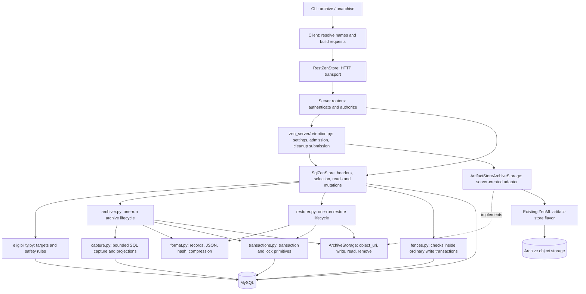
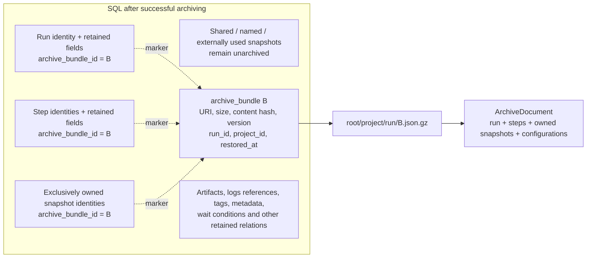
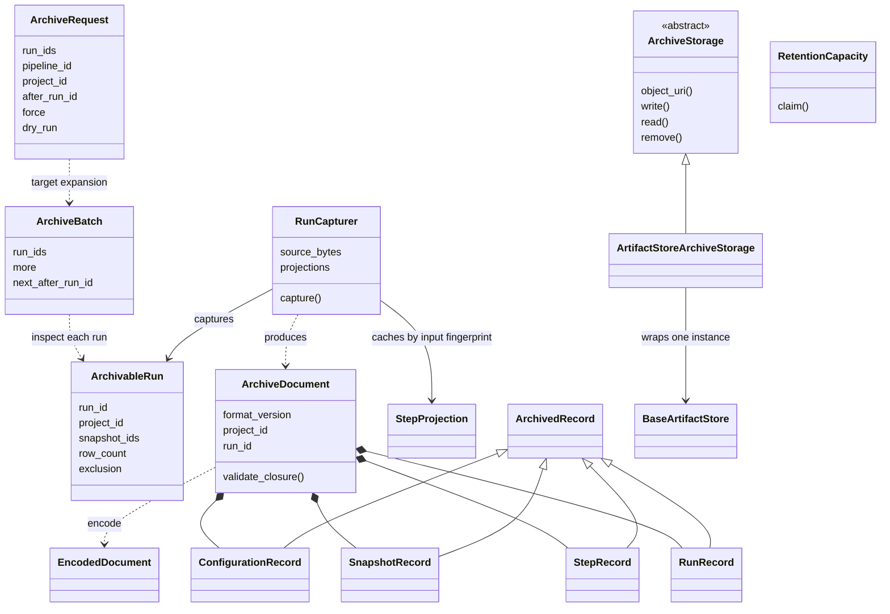
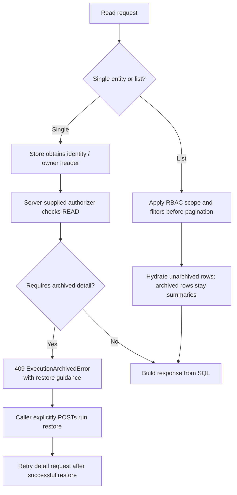
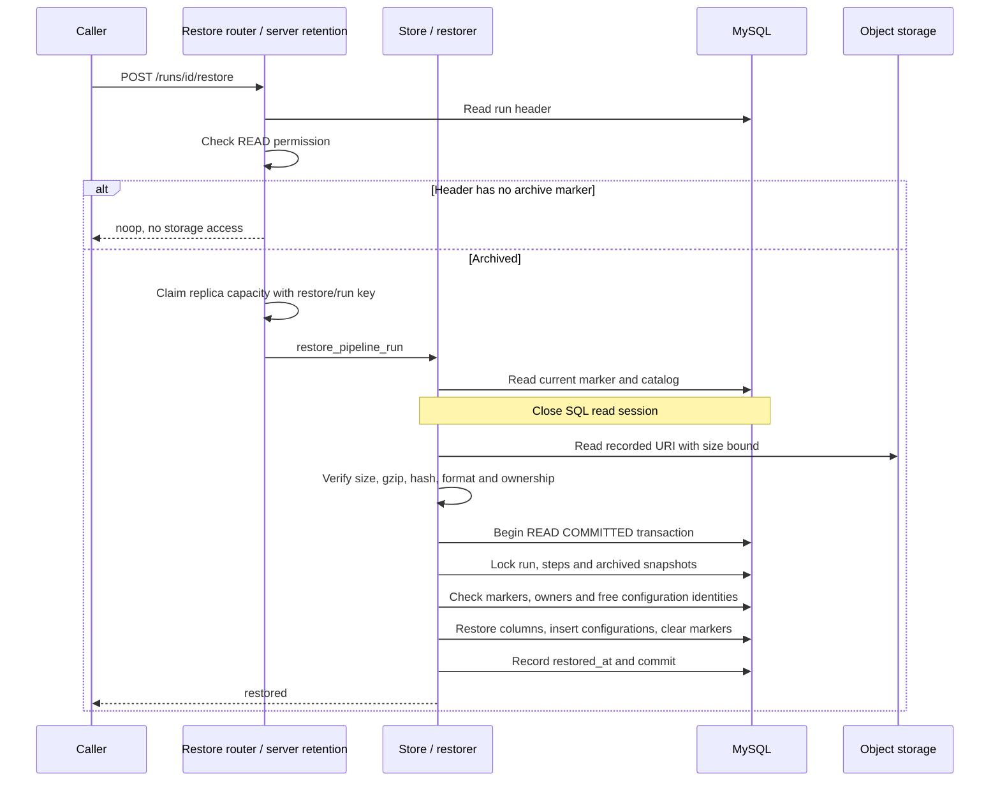

# PR #5290: execution retention architecture and review workbook

**Source snapshot:** local `feature/execution-retention-v1` at
`a6ed4ec434ed8e6254098a954a912ff098d8be35`, compared with
`feature/execution-retention-prep` at
`8ae3f7d7d4a6fad175f23b92b0c9af467fdc5c0b`.
**Written:** September 23, 2026. This describes the current local implementation;
it does not establish the current GitHub head or a release-readiness verdict.

This is a development review workbook. Comment using a diagram ID (`D1`),
review stop (`R01`), or impact item (`I01`) so we can revise individual decisions.
Source links point into this checkout at the snapshot above; function names
remain the navigation reference if later edits move lines.

**Contents:** [Diagrams](#1-diagrams-how-the-implementation-works) ·
[Review roadmap](#2-review-roadmap-file-by-file-function-by-function) ·
[Feedback and evidence](#3-feedback-and-evidence-ledger) ·
[Impact assessment](#4-impact-on-existing-code-and-behavior--final-review-priorities).

## How to use this guide

1. Read the diagrams and the data inventory first.
2. Follow the review stops in order. Each stop gives the exact functions to read,
   a question to resolve, and a suggested place to pause.
3. Finish with the impact assessment. It includes existing behavior that changes,
   design trade-offs, and concrete follow-ups rather than treating the current
   implementation as automatically correct.

**The feature in one sentence:** move selected execution detail from SQL into a
verified compressed object, retain identities and summaries in SQL, and explicitly
restore the detail before operations that need it.

### Vocabulary

| Term | Meaning in this PR |
| --- | --- |
| Hot / unarchived | Execution detail is available in SQL. |
| Archived / cold | Selected detail is in object storage; identity rows still exist in SQL. |
| Bundle | One archive attempt's compressed JSON object **plus its SQL catalog record**. It covers one run, its steps, exclusively owned snapshots, and associated configuration rows. It is not a batch of runs. |
| Marker | `archive_bundle_id` on a run, step, or snapshot. A non-null value says which bundle currently owns that entity's archived detail. |
| Retirement | The SQL transaction that records the bundle, clears detail, deletes archived configuration rows, and sets markers. |
| Summary | Retained SQL fields exposed through `body.summary`, independent of whether the entity is archived. |
| Unarchive / restore | The CLI calls it `unarchive`; the SDK method and HTTP route still use `restore`. It restores one run's bundle, not its child runs recursively. |
| Hydrate | Ask for metadata/detail in a response. Single-entity archived detail requests fail with 409; lists can contain archived summaries alongside hydrated unarchived entries. |

## 1. Diagrams: how the implementation works

### D1 — Architecture and responsibility boundaries



The server constructs the storage adapter and passes it into the store. The store
does not import the server. Permission policy belongs to the server; the store
owns database invariants and transactions. Ordinary writes use the same database
locks as retirement. An ordinary read does not go through the archive adapter.

**Review question:** does each boundary own a real responsibility, or merely pass
arguments through? The thin store entry points integrate the feature into
`SqlZenStore`; the internal modules contain its implementation. This is a design
choice to inspect, not a requirement to add another service layer.

### D2 — Where the data goes



Marker arrows are **logical references, not foreign keys**. The new marker
columns have neither foreign keys nor indexes. The catalog's `run_id` and
`project_id` are nullable foreign keys with `ON DELETE SET NULL`, so deletion
preserves the URI for later cleanup. A catalog row remains after restore;
**catalog existence alone does not mean a run is currently archived**.

| Entity | Detail copied into the document and cleared from SQL | What stays / important qualification |
| --- | --- | --- |
| Pipeline run | `orchestrator_environment`, `exception_info`, `pipeline_configuration`, `client_environment` | Identity, ownership, status, times, relationships and other retained fields stay. Cleared columns become null. |
| Step run | `exception_info`, `step_configuration`, `source_code`, `docstring` | Identity, status/times, links and cache-related fields stay. Derived `step_type` and `substitutions` are written into retained SQL columns. |
| Exclusively owned snapshot | `pipeline_configuration`, `client_environment`, `pipeline_spec`, `source_code`, `description` | Identity and other retained fields stay. The first two columns become `{}` because they are required; the others become null. |
| Step configuration | Complete rows, including identity, timestamps, index/name/config and owner | Rows are deleted during retirement and recreated during restore. Includes step-owned rows and rows belonging to archived snapshots. |
| Shared snapshot | No snapshot detail is removed | It and its configuration can still be read as inputs for step projections, without becoming archived records. |
| Artifact files, log contents, tags, run metadata, wait conditions, hook invocations | Outside this archive payload | Their existing storage/lifecycle continues. Keeping an artifact link does not guarantee the external artifact still exists. |

Sources: [format.py → RunRecord](/Users/safoine/zenml-io/zenml/src/zenml/zen_stores/retention/format.py:55), [format.py → StepRecord](/Users/safoine/zenml-io/zenml/src/zenml/zen_stores/retention/format.py:72),
[format.py → SnapshotRecord](/Users/safoine/zenml-io/zenml/src/zenml/zen_stores/retention/format.py:96), [format.py → ConfigurationRecord](/Users/safoine/zenml-io/zenml/src/zenml/zen_stores/retention/format.py:114),
[archiver.py → _clear_detail](/Users/safoine/zenml-io/zenml/src/zenml/zen_stores/retention/archiver.py:367).

**Snapshot example:** if runs A and B both reference snapshot S, archiving A can
archive A's own detail while S stays in SQL. S is excluded even if B is already
archived. A deployment, run template, trigger, derived snapshot, name, or legacy
schedule can also keep S in SQL. See [eligibility.py → _owned_snapshots](/Users/safoine/zenml-io/zenml/src/zenml/zen_stores/retention/eligibility.py:362).

### D3 — Actual classes and their roles



This is a selected class map, not an inheritance diagram of all ZenML models.
`ArchiveRequest`/responses cross HTTP; `ArchiveBatch` and `ArchivableRun` are
internal coordination values; record classes define the persisted archive format.
`RunCapturer` has real per-capture state. `RetentionCapacity` owns process-local
concurrency state. **There is no `RunArchiver` class after the cleanup**: archive
orchestration is a function. Constants and small pure functions do not need
classes simply to make all files look uniform.

### D4 — Archive sequence and transaction boundaries

```mermaid
sequenceDiagram
    participant U as CLI / SDK
    participant R as Archive router
    participant P as Server retention
    participant S as Store / archiver
    participant D as MySQL
    participant O as Object storage
    U->>R: ArchiveRequest
    R->>D: Check owner permission, select batch, load headers
    R->>R: Authorize every selected run
    R->>P: archive_batch(request, authorized batch)
    alt dry_run
        P->>S: preview_archive
        S->>D: Eligibility and row counts only
        S-->>U: Eligible / refused counts + continuation
    else archive
        P->>P: Require storage + enabled, claim capacity
        P->>S: archive_runs
        loop Each run, sequentially
            S->>D: Inspect eligibility
            S->>D: First capture in a read session
            Note over S,D: Close read session before storage I/O
            S->>S: Canonical JSON, hash, gzip
            S->>O: Write uniquely named object
            S->>O: Read it back
            S->>S: Compare exact compressed bytes
            S->>D: Begin READ COMMITTED retirement transaction
            S->>D: Lock run, steps, referenced snapshots, configurations
            S->>D: Recheck eligibility; recapture
            S->>S: Require content hash to match first capture
            S->>D: Insert bundle, clear detail, set markers
            S->>D: Commit
        end
        S-->>U: Counts + capped refusals + continuation
    end
```

The two captures protect against concurrent changes during upload. Rechecking
only `updated` would not detect every relevant change. There is no transaction
covering both MySQL and object storage: ordering and failure handling bridge
that boundary. A batch is **not atomic across runs**; a later failure does not
undo earlier successful runs.

| Failure point | Database effect | Object handling / result |
| --- | --- | --- |
| Ineligible at inspection | No retirement | Refusal; no upload. |
| Capture too large | No retirement | `oversized`; no upload. |
| Upload or read-back verification fails | No retirement started | Attempt to remove this attempt's object; count failure. |
| Recapture changed / eligibility changed | Retirement rolls back | Remove object after confirmed rollback; normally count skipped. |
| Deadlock / lock timeout with confirmed rollback | Retirement rolls back | Remove object; count skipped. |
| Commit succeeded, acknowledgement lost | Archived | A new lookup finds the bundle; report archived and keep object. |
| Commit outcome unknown; lookup absent or fails | Cannot establish outcome | Keep object; normally count failure. Absence of a row is not rollback proof. |
| Process dies after upload and before catalog commit | May leave unarchived SQL | Can leave an uncataloged orphan object; normal catalog cleanup cannot discover it. |

Sources: [archiver.py → _archive_run](/Users/safoine/zenml-io/zenml/src/zenml/zen_stores/retention/archiver.py:174), [archiver.py → _bundle_committed](/Users/safoine/zenml-io/zenml/src/zenml/zen_stores/retention/archiver.py:454),
[transactions.py → transaction](/Users/safoine/zenml-io/zenml/src/zenml/zen_stores/retention/transactions.py:34). `ArchiveStorage.remove()` is best effort: a
cleanup attempt is not proof the object was removed.

Per-run archive exceptions are generally translated into result counters, so an
HTTP response can succeed while `ArchiveResponse.failed` is nonzero. The CLI
checks that count and fails the command. Do not equate HTTP success with every
run having been archived.

### D5 — Lifecycle state

```mermaid
stateDiagram-v2
    [*] --> SQLDetail
    SQLDetail --> UploadVerified: capture and verified upload
    UploadVerified --> Archived: locked recapture matches and SQL commits
    UploadVerified --> SQLDetail: confirmed rollback and cleanup attempt
    UploadVerified --> Uncertain: commit response fails
    Uncertain --> Archived: positive committed-bundle evidence
    Uncertain --> OutcomeUnknown: no positive evidence; keep object
    Archived --> SQLDetail: explicit restore commits
    SQLDetail --> SQLDetail: restore returns noop
    SQLDetail --> RunDeleted: delete commits
    Archived --> SQLDetail: deletion first restores detail
    RunDeleted --> CleanupPending: catalog run_id becomes null
    CleanupPending --> ObjectRemoved: storage removal succeeds; catalog deleted
    CleanupPending --> CleanupPending: busy / failed / interrupted cleanup
```



`UploadVerified`, `Uncertain`, and `OutcomeUnknown` describe operation knowledge;
they are not persisted status fields. `SQLDetail` after restore can still have
old catalog rows and objects. Re-archiving creates a new bundle ID. No grace
period excludes a recently restored run from a later manual archive.

### D6 — Reads, authorization, and explicit unarchive



This diagram describes permission/error ordering, not a promise that every SQL
query loads only header columns. Some getters eager-load relationships before
calling the authorizer; review their query cost separately. They must authorize
before exposing the archived-state error or its restore locator.

Step permissions use the owning pipeline run. An individual archived snapshot
lookup resolves its restore run through the catalog and checks that run's READ
permission too. Snapshot lists omit the restore-run locator.

| Error escaping to the HTTP layer | Response |
| --- | --- |
| Archived detail requested, or retention state conflict | 409 |
| Replica capacity or duplicate restore key is busy | 429 |
| Archive storage unavailable | 503, with `Retry-After: 30` |
| Archive integrity verification failed | 500 |

Per-run errors absorbed into archive result counters follow D4 instead of this
HTTP mapping. These statuses also do not replace ordinary authentication,
authorization, missing-resource or request-validation errors.

### D7 — Restore sequence



The store checks state again: another restore may have won, yielding `noop`.
A changed marker, missing row, changed owner, or configuration collision aborts
the whole restore. Restoring leaves the object and catalog in place. A failure
before/during validation leaves SQL unchanged; a lost commit response still
requires checking current state on retry rather than assuming nothing committed.

### D8 — Why ordinary writes participate

```mermaid
sequenceDiagram
    participant W as Existing writer
    participant D as MySQL row locks
    participant A as Archiver
    alt Writer obtains the relevant lock first
        W->>D: Lock and check unarchived owner
        W->>D: Update detail / add snapshot use; commit
        A->>D: Acquire retirement locks
        A->>D: Recheck ownership and recapture
        Note over A,D: Reject stale capture, or archive only still-eligible data
    else Archiver obtains the relevant lock first
        A->>D: Lock, recheck, clear detail, set marker; commit
        W->>D: Acquire lock and read current marker
        D-->>W: Archived
        W-->>W: Reject protected mutation with restore guidance
    end
```

This applies to writes that would use or alter archived detail. It does not
imply a blanket ban on tags, metadata, or permitted retained-field updates.
Snapshot-use creation locks the snapshot; run/step updates and insertions protect
their corresponding owners. Some ordinary writers can acquire locks in another
order, so deadlocks remain possible and must have safe rollback behavior.

### D9 — Run deletion and object cleanup

```mermaid
sequenceDiagram
    participant U as Caller
    participant R as Delete router / server retention
    participant D as MySQL store
    participant M as Existing maintenance executor
    participant O as Object storage
    U->>R: Delete run
    R->>R: Check DELETE permission using header
    R->>D: delete_run under owner lock
    alt Run is archived
        D-->>R: ExecutionArchivedError
        R->>R: Restore run through retention lifecycle
        Note over R,D: Snapshot detail is now in SQL and can survive run deletion
        R->>D: Retry delete_run; commit
    else Run is unarchived
        D->>D: Delete and commit
    end
    Note over D: Catalog survives with run_id = null
    R->>M: schedule_archive_cleanup
    R-->>U: Database deletion succeeded
    M->>D: Read bounded pending catalog entries; close session
    M->>O: Remove objects outside SQL transaction
    M->>D: Delete successful catalog entries; age failed entries for retry
```

Project deletion uses existing database deletion/cascades, then schedules the
same cleanup. It does not individually restore runs whose project is being
deleted. Cleanup can include older pending deletions, not just the triggering
run. There is no durable cleanup scheduler: a busy executor or failure can leave
objects pending until another run/project deletion triggers a pass.

## 2. Review roadmap: file by file, function by function

Follow one stop at a time. Check a box when we have explained/reviewed that area;
checking it does not imply every design choice is approved. Keep tests beside
the relevant question rather than reading the entire test directory first.

| Stop | Main file / area | What we should understand before advancing |
| --- | --- | --- |
| [R01](#r01--start-with-the-public-contract) | Request/response models, settings | What users can ask for and what results mean. |
| [R02](#r02--understand-persistence-before-algorithms) | Schemas, migration, format records | Exactly what moves and what stays. |
| [R03](#r03--enter-through-the-server-and-follow-one-authorized-batch) | Router → server retention → SQL store | Permissions and operation ownership. |
| [R04](#r04--selection-and-eligibility) | `eligibility.py` | Selection, exclusions and snapshot ownership. |
| [R05](#r05--read-the-archive-lifecycle-without-diving-into-helpers-yet) | `archiver.py` | Overall operation and failures. |
| [R06](#r06--capture-the-largest-internal-implementation) | `capture.py` | Configuration resolution, projections and bounded reads. |
| [R07](#r07--codec-and-the-storage-trust-boundary) | `format.py` | Persistent format and verification. |
| [R08](#r08--the-destructive-transaction) | `transactions.py` → retirement SQL | Why clearing data is safe. |
| [R09](#r09--restore-as-the-inverse-operation) | `restorer.py` | Why restore is all-or-nothing. |
| [R10](#r10--existing-reads-and-response-compatibility) | Models, schemas, getters, RBAC | Existing read contracts and lazy access. |
| [R11](#r11--writes-snapshot-reuse-replay-and-cache) | Store writers, `fences.py`, cache | Concurrent writes and execution behavior. |
| [R12](#r12--storage-adapter-and-reuse-of-existing-zenml-facilities) | `archive_storage.py` / `storage.py` | Existing artifact-store reuse and its extra code. |
| [R13](#r13--delete-and-retryable-object-cleanup) | Deletion routes and SQL cleanup | Object lifetime and retry delivery. |
| [R14](#r14--close-the-loop-through-cli-transport-startup-and-related-routes) | CLI, client, transport, startup | End-to-end behavior and remaining integration changes. |

### R01 — Start with the public contract

**Read in order:**

1. [retention.py → ArchiveRequest](/Users/safoine/zenml-io/zenml/src/zenml/models/v2/misc/retention.py:24) → `_validate_target`.
2. [retention.py → ArchiveResponse](/Users/safoine/zenml-io/zenml/src/zenml/models/v2/misc/retention.py:69) → `ArchiveRefusal` → `RestoreResponse` → `RetentionStatusResponse`.
3. [server_config.py → ArchiveSettings](/Users/safoine/zenml-io/zenml/src/zenml/config/server_config.py:98) → `configured` → `new_archives_enabled` → URI validation.
4. [exceptions.py → ExecutionArchivedError](/Users/safoine/zenml-io/zenml/src/zenml/exceptions.py:106) and the retention exception classes below it.

**Establish:** exactly one target; explicit IDs capped at 100; owner scans capped
separately at 200; `force` only overrides age; dry-run does not promise byte-size
eligibility. `pending` means another target batch exists, not a background job.
`noop` means detail is already in SQL, not a failed restore.

**Question:** are these the smallest useful API controls and results for v1?
Keep the `restore`/`unarchive` naming mismatch visible as a product decision.

- [ ] R01 explained and reviewed. **Comment / decision:**

### R02 — Understand persistence before algorithms

**Read in order:**

1. [archive_bundle_schemas.py → ArchiveBundleSchema](/Users/safoine/zenml-io/zenml/src/zenml/zen_stores/schemas/archive_bundle_schemas.py:32).
2. [archivable_schemas.py → ArchivableSchema](/Users/safoine/zenml-io/zenml/src/zenml/zen_stores/schemas/archivable_schemas.py:28) → `require_hot` → `not_archived`.
3. [c3f5a9e1d7b2_add_execution_archive.py → upgrade](/Users/safoine/zenml-io/zenml/src/zenml/zen_stores/migrations/versions/c3f5a9e1d7b2_add_execution_archive.py:26) → `downgrade`.
4. [format.py → ArchivedRecord](/Users/safoine/zenml-io/zenml/src/zenml/zen_stores/retention/format.py:44) → `RunRecord` → `StepRecord` → `SnapshotRecord` → `ConfigurationRecord` → `ArchiveDocument.validate_closure`.

**Establish:** which fields move, which identities stay, who points at the
catalog, and why configuration rows are recreated. Compare the archived-column
lists to D2 and eventually to `_clear_detail` / `_write_back`.

**Questions:** are marker-without-FK consistency and deferred marker indexes
acceptable? How will a future SQL schema change continue reading existing v1
objects? Do not mistake successful current-version round trips for cross-version
compatibility proof.

- [ ] R02 explained and reviewed. **Comment / decision:**

### R03 — Enter through the server and follow one authorized batch

**Read in order:**

1. [retention_endpoints.py → archive_runs](/Users/safoine/zenml-io/zenml/src/zenml/zen_server/routers/retention_endpoints.py:77).
2. [sql_zen_store.py → SqlZenStore.select_runs_to_archive](/Users/safoine/zenml-io/zenml/src/zenml/zen_stores/sql_zen_store.py:14661) → `get_run_headers`.
3. Return to the router's per-run permission check.
4. [retention.py → archive_batch](/Users/safoine/zenml-io/zenml/src/zenml/zen_server/retention.py:166) → `RetentionCapacity.claim` → `archive_settings` / `archive_storage`.
5. [sql_zen_store.py → SqlZenStore.archive_runs](/Users/safoine/zenml-io/zenml/src/zenml/zen_stores/sql_zen_store.py:14697) and `preview_archive` as integration points.

**Establish:** target permission is not permission on all child runs. Preview
requires READ; mutation requires UPDATE; force requires admin. Authorization
finishes before payload work. Capacity is four operations **per process**;
one sequential archive batch occupies one slot. It is admission control, not a
cluster-wide mutex or durable queue.

**Question:** can any denied caller trigger payload work or discover a restore
locator before permission checks? A batch containing an unauthorized run fails
authorization as a batch; it is not silently filtered into partial permission.

- [ ] R03 explained and reviewed. **Comment / decision:**

### R04 — Selection and eligibility

**Read in order:**

1. [eligibility.py → expand_target](/Users/safoine/zenml-io/zenml/src/zenml/zen_stores/retention/eligibility.py:128) → `_finished_unarchived`.
2. [eligibility.py → inspect_run](/Users/safoine/zenml-io/zenml/src/zenml/zen_stores/retention/eligibility.py:186) → `_first_exclusion` → `_resumable_failed`.
3. [eligibility.py → _count_rows](/Users/safoine/zenml-io/zenml/src/zenml/zen_stores/retention/eligibility.py:409) → `_owned_snapshots`.
4. Return later from `_retire_run` to verify it calls the same `inspect_run`.

**Establish:** owner scans walk `(created, id)`, while age uses `end_time`.
Selection is broader than eligibility. Explicit IDs are deduplicated and then
inspected. A continuation run must still exist and belong to the same target.
Snapshot ownership means no outside use, not merely matching project/run IDs.

**Questions:** does every exclusion protect a real execution use? Are model-linked
runs intentionally included? Can pagination skip a newly eligible run until the
next scan? What is the cost of scanning many already archived or ineligible rows?

- [ ] R04 explained and reviewed. **Comment / decision:**

### R05 — Read the archive lifecycle without diving into helpers yet

**Read in order:**

1. [archiver.py → archive_runs](/Users/safoine/zenml-io/zenml/src/zenml/zen_stores/retention/archiver.py:83).
2. [archiver.py → _archive_run](/Users/safoine/zenml-io/zenml/src/zenml/zen_stores/retention/archiver.py:174), top to bottom.
3. [archiver.py → _bundle_committed](/Users/safoine/zenml-io/zenml/src/zenml/zen_stores/retention/archiver.py:454).
4. `_conflict_attempt` → `_failed_attempt` → `_tally` → `_record_refusals`.
5. [archiver.py → preview_runs](/Users/safoine/zenml-io/zenml/src/zenml/zen_stores/retention/archiver.py:127) to compare preview with mutation.

**Establish:** one outcome per attempted run, failures do not undo earlier runs,
refusals are capped at 100, object names are unique per attempt, cleanup depends
on rollback evidence. Follow every `except` branch against the D4 failure table.

**Question:** can you explain this function in lifecycle order without opening
five files? If not, identify the exact confusing dependency before proposing a
new abstraction. The recent cleanup removed the dependency-only class and
rollback exception wrapper.

- [ ] R05 explained and reviewed. **Comment / decision:**

### R06 — Capture: the largest internal implementation

**Read in two passes:**

1. [capture.py → capture_run](/Users/safoine/zenml-io/zenml/src/zenml/zen_stores/retention/capture.py:619) → `RunCapturer.__init__` → `RunCapturer.capture`.
2. `RunCapturer._capture_snapshots` → `_capture_configurations` → `_capture_steps`.
3. `RunCapturer._derive_projection` → `_snapshot_digest` → `StepProjection`.
4. Only then read [capture.py → RunCapturer._read_table](/Users/safoine/zenml-io/zenml/src/zenml/zen_stores/retention/capture.py:210) → `_read_page` → `source_row_bytes` / `_raise_source_oversized`.

**Establish:** static snapshot configuration, dynamic step-owned configuration,
and legacy inline configuration all contribute to the capture. Shared snapshot
inputs can affect a retained projection without being archived themselves.
The projection cache is local to this archive attempt and reused only when its
input fingerprint matches on recapture.

**Questions:** is configuration resolution reusing ZenML's
`merge_step_configuration` / `run_pipeline_configuration` correctly? Why does
each class field need to survive across phases? Does SQL prevent oversized
payloads entering the driver, or merely detect them after fetching?

**Bounds to verify:** 50,000 archived records; 64 MiB decoded document; 128 MiB
source text/binary per capture; ordinary pages target 50 rows / 1 MiB, allowing
one larger first row within the remaining source budget. These are not total
process-memory guarantees.

- [ ] R06 explained and reviewed. **Comment / decision:**

### R07 — Codec and the storage trust boundary

**Read in order:**

1. [format.py → encode](/Users/safoine/zenml-io/zenml/src/zenml/zen_stores/retention/format.py:298) → `_serialize_and_hash` → `canonical_json`.
2. [format.py → compute_content_hash](/Users/safoine/zenml-io/zenml/src/zenml/zen_stores/retention/format.py:282).
3. [format.py → decode](/Users/safoine/zenml-io/zenml/src/zenml/zen_stores/retention/format.py:317) → `_unique_keys` / `_reject_constant` → `ArchiveDocument.validate_closure`.

**Establish:** the SQL hash covers canonical **decompressed** JSON. Upload
verification compares compressed bytes. Decode bounds decompression before
parsing and rejects malformed gzip, duplicate keys, non-finite numbers, unknown
fields, wrong format versions, cross-project records, and invalid relationships.

**Question:** are the checks defending a specific persisted-data invariant?
Distinguish essential format validation from duplicate validation performed only
for convenience. The hash detects mismatch with trusted SQL metadata; it is not
a signature protecting against an actor who can rewrite both stores.

- [ ] R07 explained and reviewed. **Comment / decision:**

### R08 — The destructive transaction

**Read in order:**

1. [transactions.py → transaction](/Users/safoine/zenml-io/zenml/src/zenml/zen_stores/retention/transactions.py:34) → `rollback_was_confirmed` → `is_transient_lock_error`.
2. [archiver.py → _retire_run](/Users/safoine/zenml-io/zenml/src/zenml/zen_stores/retention/archiver.py:262) → `transactions.lock_ids` → `inspect_run` → `capture_run` → `compute_content_hash`.
3. [archiver.py → _clear_detail](/Users/safoine/zenml-io/zenml/src/zenml/zen_stores/retention/archiver.py:367), comparing every write with the format records.

**Establish:** `READ COMMITTED`; run → steps → referenced snapshots →
configuration locks; locked eligibility/ownership recheck; matching content;
bundle insertion and clearing in one commit. No object-store call happens while
this mutation transaction is open. Retirement preserves execution `updated`
timestamps instead of pretending archiving was an execution update.

**Questions:** does any return/exception claim rollback after COMMIT started?
Are all configuration owners protected against new concurrent uses? Does the
hash cover all values retirement removes and all inputs needed for retained
projections? This is the first place to demand evidence before simplifying.

- [ ] R08 explained and reviewed. **Comment / decision:**

### R09 — Restore as the inverse operation

**Read in order:**

1. [runs_endpoints.py → restore_pipeline_run](/Users/safoine/zenml-io/zenml/src/zenml/zen_server/routers/runs_endpoints.py:1065) → [retention.py → restore_pipeline_run](/Users/safoine/zenml-io/zenml/src/zenml/zen_server/retention.py:208).
2. [sql_zen_store.py → SqlZenStore.restore_pipeline_run](/Users/safoine/zenml-io/zenml/src/zenml/zen_stores/sql_zen_store.py:14726) → [restorer.py → restore_run](/Users/safoine/zenml-io/zenml/src/zenml/zen_stores/retention/restorer.py:42).
3. [restorer.py → _apply](/Users/safoine/zenml-io/zenml/src/zenml/zen_stores/retention/restorer.py:104) → `_require_rows` → `_require_free_configurations`.
4. [restorer.py → _write_back](/Users/safoine/zenml-io/zenml/src/zenml/zen_stores/retention/restorer.py:266) → `_archived_values`.

**Establish:** READ authorization is deliberate even though restore writes SQL;
it restores the caller's readable data. Read/verify occurs before the mutation
transaction. Existing identities/owners/markers must match; configurations must
be free. A concurrent completed restore can produce `noop`. Objects are retained.

**Questions:** can a mismatch produce partial restoration? Do retained fields
changed after archiving survive restore? Are older archive formats guaranteed
readable after future schema changes, or is that still a maintenance obligation?

- [ ] R09 explained and reviewed. **Comment / decision:**

### R10 — Existing reads and response compatibility

**Read in order:**

1. [execution.py → ExecutionArchiveDescriptor](/Users/safoine/zenml-io/zenml/src/zenml/models/v2/base/execution.py:50) → `ArchivableResponseBody` → `ArchivableFilter.apply_filter`.
2. [pipeline_run.py → PipelineRunSummary](/Users/safoine/zenml-io/zenml/src/zenml/models/v2/core/pipeline_run.py:280) and `PipelineRunResponse._get_summary`; the equivalent step/snapshot summary classes and accessors.
3. [pipeline_run_schemas.py → PipelineRunSchema.to_model](/Users/safoine/zenml-io/zenml/src/zenml/zen_stores/schemas/pipeline_run_schemas.py:686) → [step_run_schemas.py → StepRunSchema.to_model](/Users/safoine/zenml-io/zenml/src/zenml/zen_stores/schemas/step_run_schemas.py:517) → [pipeline_snapshot_schemas.py → PipelineSnapshotSchema.to_model](/Users/safoine/zenml-io/zenml/src/zenml/zen_stores/schemas/pipeline_snapshot_schemas.py:525).
4. [sql_zen_store.py → SqlZenStore.get_run](/Users/safoine/zenml-io/zenml/src/zenml/zen_stores/sql_zen_store.py:7393) → `get_run_step` → `get_snapshot` → `get_pipeline_run_dag`.
5. [endpoint_utils.py → verify_permissions_and_get_entity](/Users/safoine/zenml-io/zenml/src/zenml/zen_server/rbac/endpoint_utils.py:211) → `verify_read_permission_for_model`; return to each getter's `authorizer` call.
6. [sql_zen_store.py → SqlZenStore.list_runs](/Users/safoine/zenml-io/zenml/src/zenml/zen_stores/sql_zen_store.py:7737) → `list_run_steps` → `list_snapshots` → `_populate_archived_run_summaries` / `_populate_archived_step_summaries`.
7. [client.py → Client.get_pipeline_run](/Users/safoine/zenml-io/zenml/src/zenml/client.py:5221), including its name/prefix-resolution fallback.

**Establish:** the marker, archive descriptor, and summary have different jobs.
Summary properties should not trigger cold-detail reads. Older responses without
the new summary retain their metadata fallback. Full step metadata still requires
a snapshot UUID; legacy steps with none remain unsupported for full-detail reads.

**Questions:** what does `hydrate=True` mean for a mixed list versus an individual
GET? Does a summary miss cause another SQL-only request or a forbidden detail
fetch? Is `is_archived` filtering applied before pagination? Check raw payloads
as well as SDK convenience properties.

- [ ] R10 explained and reviewed. **Comment / decision:**

### R11 — Writes, snapshot reuse, replay and cache

**Read in order:**

1. [fences.py → protect_run](/Users/safoine/zenml-io/zenml/src/zenml/zen_stores/retention/fences.py:27) → [fences.py → lock_unarchived_snapshot](/Users/safoine/zenml-io/zenml/src/zenml/zen_stores/retention/fences.py:55).
2. [sql_zen_store.py → SqlZenStore.create_run_step](/Users/safoine/zenml-io/zenml/src/zenml/zen_stores/sql_zen_store.py:12491) and `_create_run` / `get_or_create_run`.
3. [sql_zen_store.py → SqlZenStore.update_run](/Users/safoine/zenml-io/zenml/src/zenml/zen_stores/sql_zen_store.py:7791) → `update_run_step` → `_update_pipeline_run_status_no_commit` → `_get_schema_by_id(for_update=True)`.
4. Snapshot users: `create_snapshot`, `update_snapshot`, `create_deployment`, `update_deployment`, `create_run_template`, `attach_trigger_to_snapshot`.
5. [sql_zen_store.py → SqlZenStore.replay_run](/Users/safoine/zenml-io/zenml/src/zenml/zen_stores/sql_zen_store.py:5968) → [runs_endpoints.py → _verify_replay_permissions](/Users/safoine/zenml-io/zenml/src/zenml/zen_server/routers/runs_endpoints.py:738) → `replay_run`; [utils.py → prepare_snapshot_run](/Users/safoine/zenml-io/zenml/src/zenml/zen_server/pipeline_execution/utils.py:391).
6. [cache_utils.py → get_cached_step_run](/Users/safoine/zenml-io/zenml/src/zenml/orchestrators/cache_utils.py:226).

**Establish:** protected checks execute in the mutation transaction. An
intermediate commit releases locks: `_create_run` must re-protect the snapshot
after index allocation, and `update_run` reacquires current state after the
existing status-update commit. Supported retained-field updates stay possible.
Cache lookup excludes archived candidates and converts a hydration race into a
miss, while a fully loaded usable candidate can still be returned.

**Questions:** which writes really need a lock/check? Are we guarding after the
last intermediate commit? Is any retained-field update unnecessarily rejected?
What happens to repeated execution costs when old cache sources are archived?

- [ ] R11 explained and reviewed. **Comment / decision:**

### R12 — Storage adapter and reuse of existing ZenML facilities

**Read in order:**

1. [storage.py → ArchiveStorage](/Users/safoine/zenml-io/zenml/src/zenml/zen_stores/retention/storage.py:17) and its four method contracts.
2. [archive_storage.py → ArtifactStoreArchiveStorage.from_uri](/Users/safoine/zenml-io/zenml/src/zenml/zen_server/archive_storage.py:109) → `_flavor_for` → `_artifact_store_flavors`.
3. `ArtifactStoreArchiveStorage.object_uri` → `write` → `read` → `_store_for` → `remove`.
4. [base_artifact_store.py → BaseArtifactStore.__init__](/Users/safoine/zenml-io/zenml/src/zenml/artifact_stores/base_artifact_store.py:458), specifically `register_filesystem`.
5. [retention.py → archive_storage](/Users/safoine/zenml-io/zenml/src/zenml/zen_server/retention.py:143) → `initialize_retention`.

**Establish:** storage uses installed artifact-store flavors and ambient server
credentials; no service connector option. Calls go directly to the owned store
instance. Former archive roots use their recorded URI and a matching store
instance. Startup validates configuration/database support without probing storage.

**Questions:** what is the minimum adapter code required? Should the generic
artifact-store constructor change be split into a separate PR, as discussed?
Are root selection, caching, local-file access, and provider-specific timeout
behavior clear enough to support? S3 socket timeouts are not a whole-operation
deadline and do not imply equivalent bounds for every provider.

- [ ] R12 explained and reviewed. **Comment / decision:**

### R13 — Delete and retryable object cleanup

**Read in order:**

1. [runs_endpoints.py → delete_run](/Users/safoine/zenml-io/zenml/src/zenml/zen_server/routers/runs_endpoints.py:388) → [retention.py → delete_pipeline_run](/Users/safoine/zenml-io/zenml/src/zenml/zen_server/retention.py:230) → [sql_zen_store.py → SqlZenStore.delete_run](/Users/safoine/zenml-io/zenml/src/zenml/zen_stores/sql_zen_store.py:7928).
2. [projects_endpoints.py → delete_project](/Users/safoine/zenml-io/zenml/src/zenml/zen_server/routers/projects_endpoints.py:218) and [sql_zen_store.py → SqlZenStore.delete_snapshot](/Users/safoine/zenml-io/zenml/src/zenml/zen_stores/sql_zen_store.py:5889).
3. [retention.py → schedule_archive_cleanup](/Users/safoine/zenml-io/zenml/src/zenml/zen_server/retention.py:248) → existing `submit_maintenance_task`.
4. [sql_zen_store.py → SqlZenStore.delete_unused_archive_objects](/Users/safoine/zenml-io/zenml/src/zenml/zen_stores/sql_zen_store.py:14744) → `ArchiveStorage.remove`.
5. Return to the catalog's `ON DELETE SET NULL` foreign keys.

**Establish:** run deletion restores first if necessary, preserving surviving
snapshot detail. A project deletion does not need that per-run restoration.
External deletion starts after database deletion commits. Failed removals retain
catalog entries; successful removals allow catalog deletion.

**Questions:** is best-effort cleanup with retry on a later deletion sufficient?
Who clears a backlog if no later deletion occurs? What about upload orphans with
no catalog row? Each pass attempts at most 200 objects and stops starting calls
after 30 seconds; neither limit guarantees completion within 30 seconds.

- [ ] R13 explained and reviewed. **Comment / decision:**

### R14 — Close the loop through CLI, transport, startup and related routes

**Read in order:**

1. [server.py → archive_runs](/Users/safoine/zenml-io/zenml/src/zenml/cli/server.py:834) → `retention_status`; [pipeline.py → unarchive_pipeline_run](/Users/safoine/zenml-io/zenml/src/zenml/cli/pipeline.py:1194).
2. [client.py → Client.archive_runs](/Users/safoine/zenml-io/zenml/src/zenml/client.py:1160) → `restore_pipeline_run` → `_retention_store`; run/step/snapshot list filters.
3. [rest_zen_store.py → RestZenStore.archive_runs](/Users/safoine/zenml-io/zenml/src/zenml/zen_stores/rest_zen_store.py:4118) → `restore_pipeline_run` → `_retention_route` → `_new_session` → `_request`.
4. [zen_server_api.py → lifespan](/Users/safoine/zenml-io/zenml/src/zenml/zen_server/zen_server_api.py:159) and retention router mounting; workload-router mounting in run/snapshot endpoints.
5. [exceptions.py → http_exception_from_error](/Users/safoine/zenml-io/zenml/src/zenml/zen_server/exceptions.py:136) and retention exception/status mapping; `get_retention_status` and server-info capability reporting.
6. The changed permission reads in logs, run metadata, curated visualization and trigger endpoints. Verify they use headers when detail is unnecessary.

**Finishing pass for supporting diffs:** `enums.py` (outcomes/exclusions),
`constants.py` (route constant), `models/__init__.py` and
`zen_stores/schemas/__init__.py` (exports), `models/v2/misc/server_models.py`
(capability flag), `cli/utils.py` (display behavior), migration `README.md`,
and the changed operator documentation/TOC. These complete the wiring; read
their changed hunks after understanding the lifecycle rather than starting here.

**Establish:** CLI loops through continuation batches; SDK returns one batch.
Archive/restore requests use a 300-second timeout and disable HTTP-status retry
behavior, while transport retries remain. Existing request idempotency matters.
Restore remains mounted without a workload manager; replay/run-execution routes
remain gated. Unsupported older-server routes get a clearer client error.

**Questions:** could the shared HTTP-session changes alter unrelated calls? Does
the user see partial progress and a failing exit code? Could a timed-out request
still finish on the server? What requires a server restart versus taking effect
per request?

- [ ] R14 explained and reviewed. **Comment / decision:**

## 3. Feedback and evidence ledger

Use this small template for comments; leave implementation decisions explicit:

```text
Reference: R__/D__/I__
Question or concern:
Concrete scenario / affected caller:
Desired behavior:
Decision: keep / simplify / change / split / needs evidence
Verification needed:
```

### Existing evidence to consult at the relevant stop

| Question | Existing evidence entry points |
| --- | --- |
| Can archive and restore preserve detail? | `test_archive_restore_round_trip` in `tests/unit/zen_stores/retention/test_archive_restore.py`. |
| Does failed retirement keep SQL intact and handle uncertain commit safely? | `test_interrupted_retirement`, `test_unknown_retirement_outcome_keeps_uploaded_object`. |
| Does capture detect changed shared inputs and obey byte bounds? | `test_shared_configuration_change_invalidates_projections`, `test_capture_bounds_aggregate_multibyte_pages`, `test_capture_guards_payload_before_driver_buffering`. |
| Are both writer/archive orderings safe? | `test_writer_racing_archive_preserves_committed_detail`, `test_write_after_retirement_fails_with_the_restore_command`. |
| Are shared snapshots retained? | `test_snapshot_in_other_use_stays_hot` in `test_eligibility.py`. |
| Are permissions checked before archived-detail behavior is exposed? | `test_denied_before_detail_storage_or_dispatch`, `test_related_endpoints_authorize_archived_owners`, `test_snapshot_restore_locator_requires_run_permission` in `test_api.py`. |
| Are reads/cache and legacy response guarantees preserved? | `test_reads.py`, `test_execution_summaries.py`, existing cache tests. |
| Are SQL deletion and object removal ordered safely? | Run/project deletion and cleanup cases in `test_api.py`; catalog FK case in `test_capabilities.py`. |
| Are transport defaults and opt-out behavior preserved? | Retention cases in `tests/unit/zen_stores/test_rest_zen_store.py`. |

The last archiver cleanup ran **17 existing local MySQL cases** covering round
trips, shared-input changes, interruptions/commit ambiguity and both write-race
orderings. Ruff, pydoclint and focused mypy passed. This document does not turn
that result into full-suite, cloud-provider, dashboard, rolling-upgrade, or
performance proof. No Python tests were needed for writing this guide itself.

## 4. Impact on existing code and behavior — final review priorities

### I01 — Reading runs, steps, snapshots and DAGs

**Change:** new archive markers/descriptors and `body.summary` cross SQL schemas,
response models, getters, lists, client resolution and endpoint authorization.
Archived single-entity detail reads return 409. Mixed detailed lists remain
usable by returning summaries for archived rows. DAG/configuration access needs
unarchive. Ordinary reads do not download archive objects.

**Preserved intention:** retained identities, metadata, links, status and times
remain usable. Unarchived metadata fields and older-response fallbacks remain.

**Feedback focus:** trace a real dashboard/API/SDK consumer that assumes every
`hydrate=True` list item has metadata. Check extra SQL requests caused by lazy
summary completion and ensure batching does not become per-row queries.

### I02 — Existing execution writes, snapshot sharing and replay

**Change:** ordinary store operations now take additional locks/check markers.
Protected archived mutations and replay need unarchive. Creating a new snapshot
use must serialize with the ownership decision that allows snapshot archiving.
Snapshot response/filter logic also excludes archived snapshots from operations
that require runnable or deployable detail.

**Cost / risk:** locking begins earlier in some update paths. Lock duration,
query count and contention can change even for unarchived runs. Protection relies
on each mutation retaining or reacquiring its lock after intermediate commits.

**Feedback focus:** R11 is essential integration review, not incidental plumbing.
Use the concrete write paths instead of introducing a generic mutation framework.
No throughput improvement is established by the current tests.

### I03 — Cache behavior and execution cost

**Change:** archived steps cannot serve as new cache candidates. A racing archive
can turn candidate hydration into a cache miss. A fully loaded candidate may
remain usable after retirement because the required data is already present.

**Impact:** jobs may execute again where they previously reused old cached steps.
This is a user-visible trade-off of retention and can increase compute cost.

**Feedback focus:** ensure the documentation states this clearly; consider whether
the chosen archive age is consistent with expected cache usefulness.

### I04 — Deletion now crosses SQL and object storage

**Change:** deleting an archived run can download, validate and restore its whole
bundle first. If that fails, the run remains. After SQL deletion, catalog rows
drive best-effort asynchronous object deletion. Project deletion triggers cleanup
without restoring all runs.

**Impact:** archived run deletion has new latency, storage and capacity dependencies.
Unarchive alone keeps objects; repeated archive/unarchive cycles can retain several
bundles for a live run. A successful DELETE response confirms SQL deletion, not
completion of object cleanup.

**Feedback focus:** decide whether later-deletion-triggered retries are sufficient
for v1. The catalog provides retry information, but there is no guaranteed worker
delivery or periodic retry. Uncataloged upload orphans are a separate problem.

### I05 — Security and ownership boundaries

**Change:** getters accept a server-supplied authorizer so archived-detail errors
follow permission checks. Steps authorize through their run. Snapshot restore
locators need additional run permission. READ users may restore; UPDATE users may
archive subject to policy; only admins may force or inspect retention status.

**Impact:** restoring is a storage/CPU/SQL operation available to readers.
Replica-local admission limits simultaneous work but is not a tenant quota or
cluster-wide budget. Header authorization and response dehydration still solve
different problems and both need to remain correct.

**Feedback focus:** keep store code independent of RBAC policy while making it
hard for a server endpoint to omit the callback. Review `authorize_in_store`
and its loosely typed callable contract for clarity; do not assume the flag
proves all future callers are safe.

### I06 — HTTP retries, timeouts and naming

**Change:** archive/restore use an isolated HTTP session with status retries
disabled, a longer timeout, and the existing idempotency machinery. The shared
session-construction/request code changes for this capability. Transport retries
are still possible. The CLI follows pages; SDK/API callers follow them explicitly.

**Impact:** 429/503 reaches callers without the usual automatic status retry.
A timeout or interrupted CLI does not establish that server-side work stopped.
Archive batches can partially succeed before the command reports a failure.

**Feedback focus:** verify unrelated requests keep their existing retry defaults.
Resolve the remaining naming decision: CLI `unarchive`, SDK
`restore_pipeline_run`, HTTP `/restore`, and `RestoreOutcome` currently coexist.
The route name is new in this PR, so pre-existing compatibility alone is not a
reason to keep it.

### I07 — Configuration, process state and provider integrations

**Change:** three archive settings remain: URI, enabled, minimum age. URI/provider
validation happens when the adapter is initialized; startup checks configuration
and database support without object I/O. The adapter reuses artifact stores,
uses ambient credentials, and supports old roots through recorded URIs.

**Impact:** bad credentials or unavailable storage can first fail on use.
`enabled=false` pauses new archives while preserving restore; removing URI
prevents access to existing archives. Settings and cached storage are deployment
configuration, intended to change with a restart. Server image integrations and
credentials must keep supporting former roots.

**Feedback focus:** the generic `register_filesystem=False` constructor change
still exists and is a candidate for the separate PR previously discussed.
`_capacity`, `_storage`, and the former-store cache are actual mutable process
state; distinguish these from harmless module constants. Their initialization,
lifecycle and test isolation deserve explicit review against ZenML conventions.

### I08 — Database size, memory and operational costs

**Change:** SQL detail shrinks logically while identities, metadata, links,
indexes and shared snapshots remain. New catalog rows and step projections add
some SQL data. Archiving captures payload twice and performs upload plus read-back;
restore downloads and writes it back. Work is bounded by rows/bytes/batches.

**Impact:** this does not shrink a database volume automatically. CPU, memory,
network and object-store requests are exchanged for lower retained SQL detail.
The 64/128 MiB caps exclude Python object overhead and other working copies;
four concurrent operations are not a 256/512 MiB process-memory guarantee.
Multiple replicas multiply local capacity.

**Feedback focus:** measure representative large runs, owner scans, and lock
duration before claiming savings or throughput. Marker predicates lack dedicated
indexes; cleanup sorts catalog rows by `updated, id` while the added catalog
index is on `run_id`. Check plans on realistic data before adding indexes or
claiming the existing ones are sufficient.

### I09 — Migration, rollout and durable format compatibility

**Change:** migration adds a catalog, three nullable markers, and step projection
columns. New code understands cleared detail; old code does not. Downgrade is
refused while any catalog row exists, including retained rows after restore.

**Operational requirement:** upgrade all readers/writers before enabling actual
archiving. Keep archive storage available and preserve readable formats across
future upgrades. Database and object-store backup/restore procedures must agree;
restoring a database to a marker whose object no longer exists cannot recover
that detail.

**Feedback focus:** the format is a durable contract even while its API is new.
Current tests do not establish every mixed-version or older-object scenario.
Legacy steps without snapshots can round-trip their SQL data while still failing
full-detail response validation, preserving the pre-existing required-UUID
contract rather than adding legacy support in this PR.

### I10 — Documentation and evidence that need reconciliation

**Confirmed documentation mismatch:** the existing execution-retention page's
“Archive compatibility” section still says frozen static, dynamic and legacy
compatibility fixtures are tested. Those fixtures and `test_compatibility.py`
were removed in our test cleanup. That claim needs to be updated or the evidence
deliberately restored later; it should not remain as an unsupported guarantee.

**External behavior requiring separate verification:** the page describes a
bundled dashboard that restores during deliberate detail loading. This PR's
changed files contain server/client support, but no dashboard implementation
change. Treat that as a documented integration expectation until the relevant
dashboard version and its behavior are verified.

**Suggested feedback order:** first R08/R09 data integrity, then R10/R11 existing
read/write behavior, then R13 cleanup delivery. After those, decide which naming,
storage-adapter, state-management and documentation cleanups improve v1 enough
to include. Keep each proposed change attached to a concrete scenario and an
owner; avoid turning this review into another framework-building exercise.
