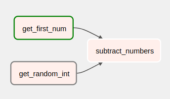

# 🏃 Run pipelines in production with Airflow

ZenML pipelines can be executed natively as Airflow DAGs. This brings together
the power of the Airflow orchestration with the ML-specific benefits of ZenML
pipelines. Each ZenML step can be run as an Airflow
[`PythonOperator`](https://airflow.apache.org/docs/apache-airflow/stable/howto/operator/python.html),
and executes Airflow natively. We will use a very simplified pipeline that consist of only three steps.
The pipeline performs a very simple operation. The subtraction of a random integer from a given integer.



Note that this tutorial installs and deploys Airflow locally on your machine,
but in a production setting you might be already have a deployed Airflow instance. 

# 🖥 Run it locally

## ⏩ SuperQuick `airflow_local` run

If you're really in a hurry and just want to see this example pipeline run
without wanting to fiddle around with all the individual installation and
configuration steps, just run the following:

```shell
zenml example run airflow_orchestration
```


## 👣 Step-by-Step
### 📄 Prerequisites 

In order to run this example, you need to install and initialize ZenML and
Airflow.

```bash
# install CLI
pip install zenml

# install ZenML integrations
zenml integration install airflow

# pull example
zenml example pull airflow_orchestration
cd zenml_examples/airflow_orchestration

# Initialize ZenML repo
zenml init
```

### 🥞 Create a new Airflow Stack

```bash
zenml orchestrator register airflow_orchestrator --flavor=airflow
zenml stack register airflow_stack \
    -m default \
    -a default \
    -o airflow_orchestrator \
    --set
```

### 🏁️ Starting up Airflow

ZenML takes care of configuring Airflow, all we need to do is run:

```bash
zenml stack up
```

This will bootstrap Airflow, start up all the necessary components and run them
in the background. When the setup is finished, it will print username and
password for the Airflow webserver to the console.

 If you can't find the password on the console, you
can navigate to the
`<APP_DIR>/zenml/airflow_root/<ORCHESTRATOR_UUID>/standalone_admin_password.txt`
file. The username will always be `admin`.

- APP_DIR will depend on your OS. See which path corresponds to your OS
  [here](https://click.palletsprojects.com/en/8.0.x/api/#click.get_app_dir).
- ORCHESTRATOR_UUID will be the unique id of the airflow orchestrator. There will be only one
  folder here, so you can just navigate to the one that is present.
  

### 📆 Run or schedule the airflow DAG

```bash
python run.py
```

Sometimes you don't want to run your pipeline only once, instead you want to schedule them with a predefined frequency.
To schedule the DAG to run every 3 minutes for the next 9 minutes, simply open `run.py` and uncomment the lines at the 
end of the file.

After a few seconds, you should be able to see the executed dag
[here](http://0.0.0.0:8080/tree?dag_id=airflow_example_pipeline)

### 🧽 Clean up

In order to clean up, tear down the Airflow stack and delete the remaining ZenML
references.

```shell
zenml stack down --force
rm -rf zenml_examples
```

# 📜 Learn more

If you want to learn more about orchestrators in general or about how to build your orchestrators in ZenML
check out our [docs](https://docs.zenml.io/mlops-stacks/orchestrators).
