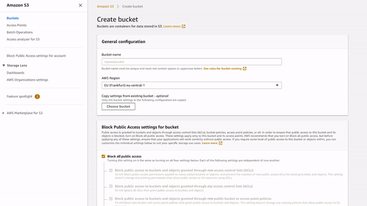

# Run pipelines on the cloud cheaply
You can easily run zenml pipelines on a cloud VM instance if local compute is not powerful enough. With this ability, it 
is simple to run on cheap preemptible/spot instances to save costs.

## Adding an orchestration backend to a pipeline
The pattern to add a backend to the pipeline is:

```python
backend = ...  # define the orchestrator backend you want to use
pipeline.run(backend=backend)  # you can also do this at construction time
```

## Running a pipeline a AWS-EC2 Instance
This example utilizes [Amazon Elastic Compute Cloud (EC2)](https://aws.amazon.com/ec2/) to launch an EC2 instance on 
 AWS, which then runs the specified pipeline.

### Pre-requisites
In order to run this example, you need to clone the zenml repo.

```bash
git clone https://github.com/maiot-io/zenml.git
```

Before continuing, either [install the zenml pip package](https://docs.zenml.io/getting-started/installation.html) or 
install it [from the cloned repo](../../zenml/README.md). In both cases, make sure to also install the 
`aws` extension (e.g. with pip: `pip install zenml[aws]`)

```
cd zenml
zenml init
cd examples/aws_orchestrated
```

Before running the example, there are a few steps that you need to complete in order to set up your cloud environment:

### Create a S3 bucket for your artifact store

The first step is to create your own bucket S3 which would serve as the base for your artifact store. You can block all 
public access.



### Create an RDS database for your metadata store

The second step is to create a database on RDS which will serve as your metadata store. For this example, we will be 
using a MySQL 5.7.31 database with the free-tier template.


Once you created the database, you need to configure the corresponding security group. In more detail, you need to add 
a new inbound rule which will allow you to connect to your metadata store. In order to achieve this:

1. Go to your `Databases` page on your RDS and select the database with the right identifier
2. Under `Connectivity and Security` you will see the security group of your database, select it
3. Once you are on the `Security Groups` page, your security group will be selected, on the bottom go to `Inbound Rules`
4. Go to `Edit Inbound Rules` and click on `Add Rule`
5. Choose the `Type` as `MYSQL/Aurora` and the `Source Type` as `Anywhere` and click on `Save rules`.

### Create a IAM role for your instance

In the next step, you need to create a new IAM role in order to make your EC2 instance access the previously 
created artifact store (through the `AmazonS3FullAccess`) and metadata store (`AmazonRDSFullAccess`). Additionally, you 
can add `AmazonEC2FullAccess` to your role, so that your instance can shut itself down once the pipeline finishes 
its execution.


### Make sure that you are set up locally

Your cloud setup is completed. Before running the pipeline, you still need to make sure that you are authorized 
on your local setup:

```bash
aws configure
```

and ultimately, set some environmental variables:

```bash
export S3_BUCKET="s3://my-zenml-artifact-store"
export IAM_ROLE="my-zenml-iam-role"

export MYSQL_DB='metadata'
export MYSQL_USER='username'
export MYSQL_PWD='password'
export MYSQL_HOST='host'
export MYSQL_PORT='port'
```

### Run the project
Now we're ready. Execute:

```bash
python run.py
```
This will launch an EC2 instance on your AWS that will run the entire pipeline.

## Caveats
Unlike all `ProcessingBackend` and `TrainingBackend` cases, there is no need to create a custom image if you have 
any custom code in your pipeline to use this `OrchestratorBackend` (at least for the one used in this example). 
The only time you would need to use it if you use a custom dependency which is not present the standard Docker image from 
zenml.

## Next Steps
This example serves as a quickstart example for AWS and it aims to show you the quickest way to run some pipelines on 
AWS. However, it is not ideal for a fully fledged production setting and one of the most obvious differences comes from the 
metadata store. Following this tutorial, we will have a bit deeper look into our AWS orchestrator and show you how you can 
use a custom security group and make use of a private metadata store on RDS [WIP].