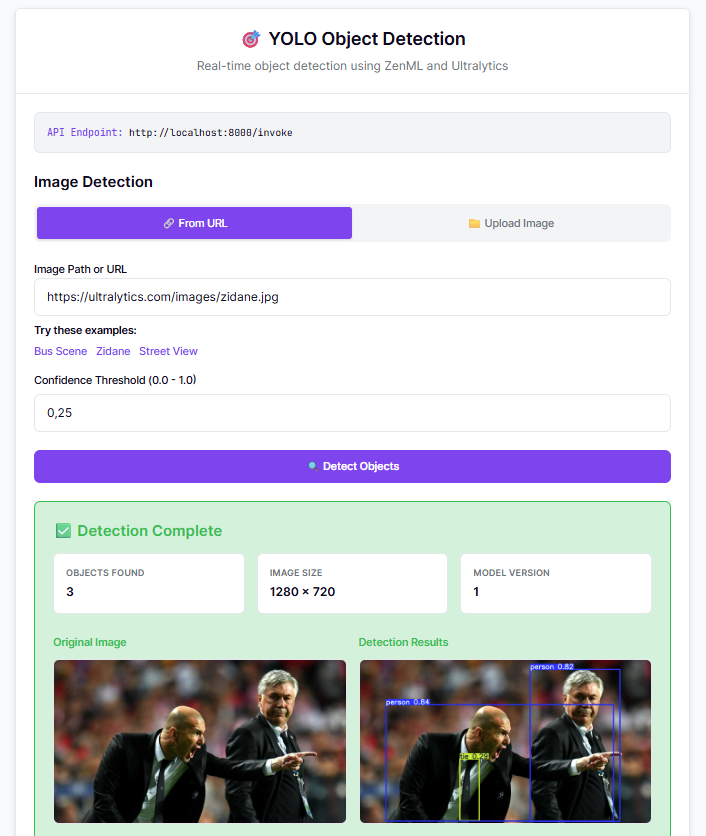
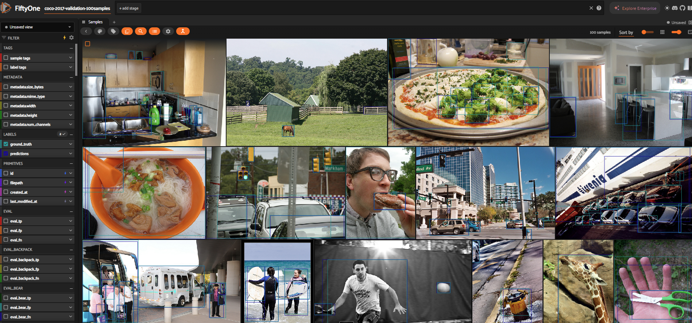

# Train and deploy YOLO Object Detection with ZenML, Ultralytics, and FiftyOne

Learn how to build a production-ready computer vision pipeline with YOLOv8, FiftyOne dataset management, and deploy it as a warm HTTP service with an interactive web interface. This example showcases the complete **FiftyOne annotation workflow loop**: export → train → predict → import → analyze → visualize.

## 🎯 What You'll Build



- **Complete FiftyOne Annotation Workflow**: Export COCO data → Train YOLO → Run inference on original FiftyOne dataset → Import predictions back → Analyze performance → Interactive dashboard visualization
- **Production-Ready Training**: YOLOv8 model training with automatic artifact versioning and performance tracking via ZenML
- **Real-Time Inference Service**: Deploy as warm HTTP service with sub-second latency using ZenML's deployment system
- **Interactive Web UI**: Upload images or use URLs for instant object detection testing with visual results
- **Dataset-Model Lineage**: Full traceability linking FiftyOne datasets to ZenML model artifacts and predictions
- **Visual Performance Analysis**: Side-by-side comparison of predictions vs ground truth in FiftyOne's interactive dashboard

## 🏃 Quickstart

```bash
pip install -r requirements.txt
zenml init
zenml login
```

**Train with FiftyOne analysis** ([see code](pipelines/training_pipeline.py)):

```bash
# Full workflow: training + FiftyOne analysis
python run.py --train --samples 50 --epochs 3

# Fast training (skip FiftyOne analysis)
python run.py --train --samples 50 --epochs 3 --disable-fiftyone-analysis
```

This downloads 50 COCO validation images via FiftyOne, trains a YOLOv8 nano model for 3 epochs, runs inference on the original FiftyOne dataset, and provides interactive analysis capabilities.

**Deploy as a real-time service** ([see code](pipelines/inference_pipeline.py)):

```bash
zenml pipeline deploy pipelines.inference_pipeline.object_detection_inference_pipeline
```

Visit `http://localhost:8000` for the interactive UI ([see code](ui/index.html)).

**Test batch inference locally**:

The inference step supports multiple image input formats:

```bash
# Using image URL
python run.py --predict --image https://ultralytics.com/images/bus.jpg

# Using local file path
python run.py --predict --image /path/to/local/image.jpg

# Using base64 data URI (useful for programmatic usage)
python run.py --predict --image "data:image/jpeg;base64,/9j/4AAQSkZJRgABAQEA..."
```

**Make predictions via API**:

```bash
# Using image URL
curl -X POST http://localhost:8000/invoke \
  -H "Content-Type: application/json" \
  -d '{
    "parameters": {
      "image_path": "https://ultralytics.com/images/bus.jpg",
      "confidence_threshold": 0.25
    }
  }'

# Using local file path
curl -X POST http://localhost:8000/invoke \
  -H "Content-Type: application/json" \
  -d '{
    "parameters": {
      "image_path": "/path/to/local/image.jpg",
      "confidence_threshold": 0.25
    }
  }'

# Using base64 data URI (useful for web apps)
curl -X POST http://localhost:8000/invoke \
  -H "Content-Type: application/json" \
  -d '{
    "parameters": {
      "image_path": "data:image/jpeg;base64,/9j/4AAQSkZJRgABAQEA...",
      "confidence_threshold": 0.25
    }
  }'
```

**Explore with FiftyOne Dashboard**:



After training, the pipeline creates persistent FiftyOne datasets linked to your ZenML model artifacts. Launch the dashboard to analyze results:

```bash
# Easy way - automatically finds datasets with predictions
python launch_fiftyone.py

# Manual way
fiftyone app launch
# Then in Python: fo.load_dataset('coco-2017-validation-50samples')
```

**Dataset-Artifact Connection**: Each FiftyOne dataset (named by parameters like `coco-2017-validation-50samples`) stores predictions from your latest ZenML run. Re-running pipelines overwrites predictions while preserving ground truth, so the dashboard always shows your current model's performance.

In the FiftyOne dashboard you can:
- Compare predictions vs ground truth side-by-side
- Filter by confidence levels and object classes
- Analyze per-class performance metrics
- Identify false positives and negatives
- Export problematic samples for retraining

**Use the ZenML Deployment Playground**

The ZenML dashboard includes a built-in playground for deployed pipelines, allowing you to test your service directly from the UI. Navigate to your deployment in the dashboard, fill in the image URL and confidence threshold, and see real-time detection results with visualizations.

## 🏗️ What's Inside

```
computer_vision/
├── pipelines/
│   ├── training_pipeline.py      - Train YOLO + optional FiftyOne analysis
│   ├── inference_pipeline.py     - Real-time detection service
│   └── hooks.py                  - Warm model loading at startup/shutdown
├── steps/
│   ├── data_loader.py            - COCO dataset loading via FiftyOne
│   ├── model_trainer.py          - YOLO model training
│   ├── evaluate.py               - Model evaluation metrics
│   ├── inference.py              - Fast object detection (supports base64 uploads)
│   └── fiftyone_analysis.py      - Complete annotation workflow loop
├── materializers/
│   └── ultralytics_materializer.py  - Custom YOLO model serialization
├── ui/
│   └── index.html                - Interactive web interface with image upload
├── run.py                        - CLI for training and testing
├── launch_fiftyone.py            - Easy FiftyOne dashboard launcher
└── requirements.txt              - Dependencies
```

## 🔑 Important Notes

### **Custom Materializers**

This example features a [custom ZenML materializer](https://docs.zenml.io/how-to/types-and-materializers/materializers) for YOLO models that handles model weight serialization and artifact versioning, ensuring seamless model tracking across pipeline runs. ZenML automatically manages and version-controls model artifacts, making them accessible throughout your pipeline lifecycle.

- 📖 [ZenML Materializers Documentation](https://docs.zenml.io/concepts/artifacts/materializers)
- 📄 [View YOLO model materializer code](./materializers/ultralytics_materializer.py)

### 🎨 Customization

**Use a different dataset**: To use your own dataset (in YOLO format), modify the dataset loading logic in [`run.py`](./run.py) and/or the relevant pipeline step (e.g., `load_coco_dataset` in [`steps/data_loader.py`](./steps/data_loader.py)) to point to your images, labels, and `data.yaml`.

**Use a larger model**: For better accuracy, use `yolov8s.pt`, `yolov8m.pt`, `yolov8l.pt`, or `yolov8x.pt`:

```bash
python run.py --train --model yolov8m.pt --epochs 10
```

**Run training on cloud**: Use ZenML's remote orchestrators for scalable training:

```bash
# Kubernetes orchestrator
zenml orchestrator register k8s --flavor=kubernetes
zenml stack update -o k8s

# Then run training remotely
python run.py --train --samples 500 --epochs 20 --model yolov8m.pt
```

**Deploy inference to cloud**: Use ZenML's cloud deployers:

```bash
# AWS App Runner
zenml deployer register aws --flavor=aws-app-runner --region=us-east-1
zenml stack update -d aws
zenml pipeline deploy pipelines.inference_pipeline.object_detection_inference_pipeline
```

## 📚 Learn More

- [Pipeline Deployments Guide](https://docs.zenml.io/how-to/deployment/deployment)
- [Deployment Settings](https://docs.zenml.io/how-to/deployment/deployment_settings)
- [Pipeline Hooks](https://docs.zenml.io/how-to/steps-pipelines/advanced_features#pipeline-and-step-hooks)
- [Ultralytics Documentation](https://docs.ultralytics.com/)
- [FiftyOne Documentation](https://docs.voxel51.com/)
- [Related Example: Deploying ML Models](../deploying_ml_model/README.md)
