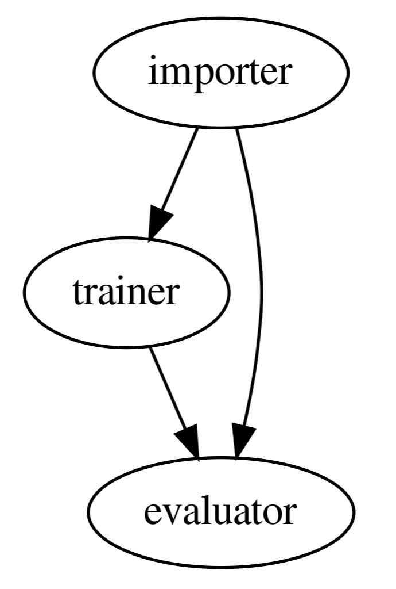

# Visualize statistics

This examples show-cases the `PipelineRunDagVisualizer` using the
[Graphviz](https://graphviz.readthedocs.io/en/stable/manual.html) library to
visualize a ZenML pipeline run, in the form a DAG (a directed acyclic graph).

## Visualizers

Visualizers are Python classes that take post-execution view objects (e.g.
`PipelineView`, `PipelineRunView`, `StepView`, etc.) and create visualizations
for them. ZenML will support many standard ones but one can always extend them
using the `BaseVisualization` classes.

## Overview

Here, we are using the
[Boston Housing Price Regression](https://keras.io/api/datasets/boston_housing/)
dataset. We create a simple pipeline that returns two pd.DataFrames, one for the
training data and one for the test data. In the post-execution workflow we then
plug in the visualization class that visualizes the latest pipeline run for us.

This visualization is produced with the following code:

```python
from zenml.repository import Repository
from zenml.integrations.graphviz.visualizers.pipeline_run_dag_visualizer import (
    PipelineRunDagVisualizer,
)

def visualizer_graph():
    repo = Repository()
    pipe = repo.get_pipelines()[-1]
    latest_run = pipe.runs[-1]
    PipelineRunDagVisualizer().visualize(latest_run)

visualizer_graph()
```

It produces the following visualization:



## Run it locally

### Pre-requisites

In order to run this example, you need to install and initialize ZenML:

```shell
# install CLI
pip install zenml

# install ZenML integrations
zenml integration install tensorflow
zenml integration install graphviz

# pull example
zenml example pull dag_visualizer
cd zenml_examples/dag_visualizer

# initialize
zenml init
```

### Run the project

Now we're ready. Execute:

```bash
python run_visualize.py
```

### Clean up

In order to clean up, delete the remaining ZenML references.

```shell
rm -rf zenml_examples
```

## SuperQuick `dag_visualizer` run

If you're really in a hurry and you want just to see this example pipeline run,
without wanting to fiddle around with all the individual installation and
configuration steps, just run the following:

```shell
zenml example run dag_visualizer
```
