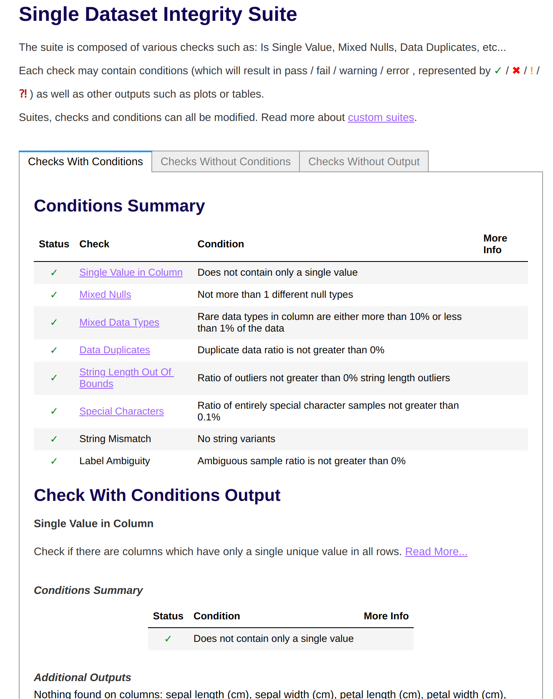

# 🏎 Validate your data with Deepchecks
In data-centric machine learning development, data quality is critical not only
to achieve good initial results but also to keep data drift and concept drift
at bay as your models are deployed to production and interact with live data.

Data validation tools can be employed early on in your machine learning
pipelines to generate data quality profiles and to run data validation checks
that can be used to continuously validate the data being ingested at various
points in the pipeline. For example, data quality reports and checks can be
run on the training and validation datasets used during model training, or on
the inference data used for batch predictions. This is one good way of detecting
training-serving skew.

## 🗺 Overview
This example uses [Deepchecks](https://github.com/deepchecks/deepchecks), a
feature-rich data validation open-source library to painlessly do data validation.
Deepchecks can do a variety of data validation tasks, from data integrity checks
that work with a single dataset to data+model evaluation to data drift analyses.
All this can be done with minimal configuration input from the user, or
customized with specialized conditions that the validation checks should perform.

At its core, the Deepchecks data validation library takes in a target dataset and
an optional model and reference dataset and generates a data validation check
result in the form of a `SuiteResult` object that can be analyzed programmatically
or visualized in a notebook or in the browser as a HTML web page. 
Datasets come in the form of `pandas` dataframes and models can be anything
that implement a `predict` method for regression tasks and also a `predict_proba`
method for classification tasks.

## 🧰 How the example is implemented
In this example, we showcase the full range of available categories of Deepchecks
validations at various points of a model training pipeline that used the Iris
dataset and a scikit-learn model:

* data integrity checks on the training Iris dataset
* data drift checks comparing the train and validation dataset slices
* model validation checks on the model and the training dataset
* model performance comparison checks that compare how the model performs on
the training vs. the training dataset

Here you can see that defining the steps is extremely simple using our
builtin Deepchecks steps and utilities, and then you just have to plug them into
your pipeline:

```python
from zenml.integrations.deepchecks.steps import (
    DeepchecksDataIntegrityCheckStepConfig,
    deepchecks_data_integrity_check_step,
)

LABEL_COL = "target"

data_validator = deepchecks_data_integrity_check_step(
    step_name="data_validator",
    config=DeepchecksDataIntegrityCheckStepConfig(
        dataset_kwargs=dict(label=LABEL_COL, cat_features=[]),
    ),
)
```

We even allow you to use the Deepchecks visualization tool easily to display the 
report in your browser or within a Jupyter notebook:



# ☁️ Run in Colab
If you have a Google account, you can get started directly with Colab - [](https://colab.research.google.com/github/github/zenml-io/zenml/blob/main/examples/deepchecks_data_validation/deepchecks.ipynb)

# 🖥 Run it locally

## 👣 Step-by-Step
### 📄 Prerequisites 
In order to run this example, you need to install and initialize ZenML:

```shell
# install CLI
pip install zenml

# install ZenML integrations
zenml integration install deepchecks sklearn -y

# pull example
zenml example pull deepchecks_data_validation
cd zenml_examples/deepchecks_data_validation

# Initialize ZenML repo
zenml init
```

### 🥞 Set up your stack for Deepchecks

You need to have a Deepchecks Data Validator component to your stack to be able to
use Deepchecks data validation in your ZenML pipelines. Creating such a stack is
easily accomplished:

```shell
zenml data-validator register deepchecks -f deepchecks
zenml stack register deepchecks_stack -o default -a default -m default -dv deepchecks --set
```

### ▶️ Run the Code
Now we're ready. Execute:

```bash
python run.py
```

### 🧽 Clean up
In order to clean up, delete the remaining ZenML references.

```shell
rm -rf zenml_examples
```
