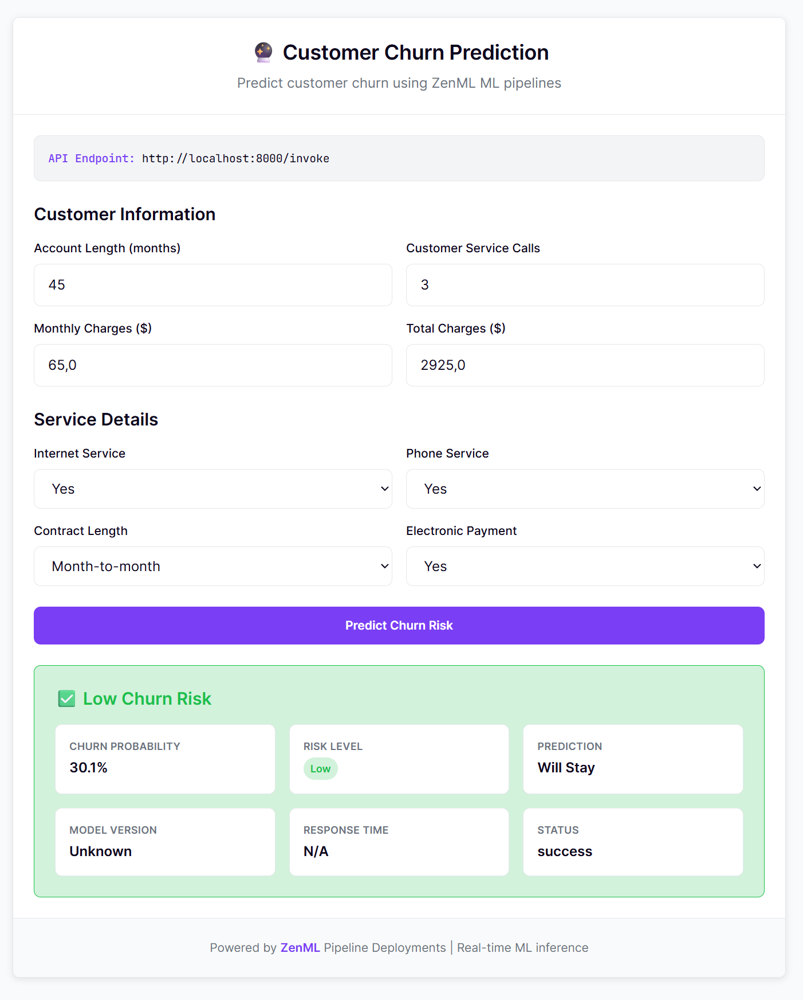

# From Training to Production in One Pipeline: Customer Churn Prediction

*Real-time ML serving with warm containers and full lineage*

**The Problem**: You've trained a great churn prediction model. Now what? Most teams face the dreaded "model-to-production" gap—wrapping models in FastAPI/Flask apps, managing Docker containers, handling scaling, losing lineage tracking, and praying deployments don't break.

**The Solution**: Deploy your training pipeline *as* your inference service. Same code, same artifacts, same observability—but now serving real-time predictions with millisecond latency.

## Why Pipeline Deployments Matter

The usual objection: **"Why not just wrap my model in FastAPI and call it a day?"**

Fair question. FastAPI is excellent. But as ML systems grow from single-model inference to multi-step orchestration, you need more than a web framework. You need:

- **Warm state management** - Models loaded once, kept in memory, no cold start latency
- **Artifact lineage** - Every prediction traced back to training data and model version
- **Unified observability** - The same tools for batch training and real-time serving
- **Production-ready infrastructure** - Built-in scaling, health checks, and CORS handling

This example shows how ZenML's [**Pipeline Deployments**](https://docs.zenml.io/concepts/deployment) deliver exactly this: your familiar pipeline becomes a production-ready HTTP service with a single command.



*Interactive web interface served alongside the API—backend, frontend, and ML pipeline all from one deployment*

## The Use Case: Customer Churn Prediction

Predict whether customers will cancel their subscription based on usage patterns:

**Input Features**:
- Account length, customer service calls, monthly charges
- Service usage (internet, phone), contract terms, payment method

**Output**:
- Churn probability (0-100%)
- Binary prediction (Will Stay / Will Churn)
- Risk level (Low/Medium/High) with confidence metrics

**Business Value**: Early identification of at-risk customers enables proactive retention campaigns.

## Quick Start: From Zero to Production

### 1. Train Your Model

```bash
# Generate synthetic data and train a Random Forest classifier
python run.py --train
```

**What happens**:
- Generates 1000 realistic customer records with correlated features
- Trains Random Forest with feature scaling and hyperparameter tuning
- Evaluates on held-out test data (~85-90% accuracy)
- Tags model as "production" and logs all metadata to ZenML

**Output**: `churn-model` artifact ready for deployment

### 2. Deploy as Real-Time Service

```bash
# Turn your pipeline into a warm HTTP service
zenml pipeline deploy pipelines.inference_pipeline.churn_inference_pipeline
```

**What you get**:
- 🔥 **Warm containers** - Model loaded once at startup, ~50ms inference latency
- 🌐 **Interactive frontend** - Beautiful web UI at `http://localhost:8000/`
- 📊 **API documentation** - Swagger docs at `http://localhost:8000/docs`
- 🔒 **Production-ready** - Auth, CORS, health checks, and error handling
- 📈 **Full observability** - Every request creates a traceable ZenML run

### 3. Make Predictions

**Via Web Interface**: Open `http://localhost:8000/` for an interactive form with smart defaults and real-time predictions.

**Via API**:
```bash
curl -X POST http://localhost:8000/invoke \
  -H "Authorization: Bearer <YOUR_AUTH_KEY>" \
  -H "Content-Type: application/json" \
  -d '{
    "parameters": {
      "customer_features": {
        "account_length": 24,
        "customer_service_calls": 2,
        "monthly_charges": 45.0,
        "total_charges": 1080.0,
        "has_internet_service": 1,
        "has_phone_service": 1,
        "contract_length": 12,
        "payment_method_electronic": 0
      }
    }
  }'
```

**Response**:
```json
{
  "success": true,
  "outputs": {
    "prediction": {
      "churn_probability": 0.23,
      "churn_prediction": 0,
      "model_status": "success"
    }
  },
  "execution_time": 0.047,
  "metadata": {
    "model_version": "1",
    "run_id": "abc123...",
    "deployment_name": "churn_inference_pipeline"
  }
}
```

## Common Questions Answered

### "How is this different from MLflow/BentoML/etc.?"

**MLflow**: Great for experiment tracking, but deployment is an afterthought. No warm containers, limited lineage in production.

**BentoML**: Excellent for model packaging, but doesn't handle multi-step pipelines or provide end-to-end lineage.

**ZenML Pipeline Deployments**: Keeps your familiar pipeline structure while adding real-time serving. You get model serving *plus* full workflow orchestration with warm state management.

### "What about cold start latency?"

Traditional model serving pays startup costs on every request:
- Load model weights: 5-10 seconds
- Initialize preprocessing: 2-3 seconds
- Connect to external services: 1-2 seconds

**Total**: 8-15 seconds per request 😱

With warm containers, these happen once at deployment startup. Per-request latency drops to 50-200ms ⚡

### "Do I lose FastAPI flexibility?"

Not at all. Under the hood, this *is* FastAPI. Through `DeploymentSettings`, you can:
- Add custom middleware and routes
- Configure CORS, authentication, and security headers
- Serve static files (like our frontend) alongside the API
- Inject your own OAuth, rate limiting, or monitoring

### "What happens when my model updates?"

Deploy a new version instantly:
```bash
# Retrain with new data
python run.py --train --samples 5000

# Deploy the updated model (zero-downtime)
zenml pipeline deploy pipelines.inference_pipeline.churn_inference_pipeline
```

## Architecture: How It Works

```python
# 1. Initialization Hook (runs once at startup)
def init_model(model_name: str = "churn-model") -> Pipeline:
    """Load model once, keep warm in memory"""
    client = Client()
    model_artifact = client.get_artifact_version(name_id_or_prefix=model_name)
    return model_artifact.load()  # 🔥 Stays warm

# 2. Inference Step (runs per request)
@step
def predict_churn(customer_features: Dict[str, float]) -> Dict[str, Any]:
    """Fast prediction using pre-loaded model"""
    step_context = get_step_context()
    model = step_context.pipeline_state  # Model already in memory!

    features_df = pd.DataFrame([customer_features])
    churn_probability = float(model.predict_proba(features_df)[0, 1])

    return {
        "churn_probability": round(churn_probability, 3),
        "churn_prediction": int(churn_probability > 0.5),
        "model_status": "success"
    }

# 3. Pipeline (becomes HTTP service)
@pipeline(
    on_init=init_model,        # 🔥 Warm startup
    on_cleanup=cleanup_model,  # 🧹 Clean shutdown
    settings={
        "deployment": DeploymentSettings(
            app_title="Customer Churn Prediction Service",
            dashboard_files_path="ui",  # 🌐 Serve web UI
        )
    }
)
def churn_inference_pipeline(customer_features: Dict[str, float]) -> Dict[str, Any]:
    return predict_churn(customer_features=customer_features)
```

## Interactive Web Interface

The deployment automatically serves a beautiful web UI at the root URL (`http://localhost:8000/`) alongside your API. This frontend is built with vanilla HTML/CSS/JavaScript and connects directly to your deployed pipeline.

**Key Features**:
- **Smart form inputs** with realistic defaults for all customer features
- **Real-time predictions** with sub-second response times
- **Visual risk assessment** with color-coded probability indicators
- **Response details** showing model version, execution time, and full metadata
- **Auto-calculated fields** that update based on your inputs (e.g., total charges from monthly × account length)

The UI automatically detects your deployment endpoint and includes proper authentication headers. It's a complete, production-ready interface that you can use immediately or customize for your needs.

```html
<!-- The frontend connects seamlessly to your deployed pipeline -->
<script>
const response = await fetch(apiUrl, {
    method: 'POST',
    headers: {
        'Content-Type': 'application/json',
        'Authorization': 'Bearer <auto-configured-auth-key>'
    },
    body: JSON.stringify({
        parameters: { customer_features: formData }
    })
});
</script>
```

## Monitoring and Observability

Every prediction request creates a ZenML run with full lineage:

```bash
# View recent predictions
zenml pipeline runs list --pipeline churn_inference_pipeline

# Debug a specific prediction
zenml pipeline runs describe abc123-def456-...

# Track model performance over time
zenml artifact versions list --name churn-model
```

## What This Enables

Once your ML pipeline becomes a real-time service, new possibilities open up:

**🤖 Compound AI Systems**: Chain multiple models and tools in one pipeline, all serving real-time with shared warm state.

**📊 Live Dashboards**: Embed predictions directly into business applications with sub-second latency.

**🔄 Continuous Learning**: Deploy retraining pipelines that automatically update serving models based on performance feedback.

**🌐 Full Applications**: Ship complete AI products—ML backend, web frontend, and APIs—all from one codebase.

## File Structure

```
deploying_ml_model/
├── pipelines/
│   ├── training_pipeline.py     # Batch training workflow
│   ├── inference_pipeline.py    # Real-time serving (THIS BECOMES YOUR API)
│   └── hooks.py                 # Warm startup/shutdown logic
├── steps/
│   ├── data.py                  # Synthetic data generation
│   ├── train.py                 # Model training with eval
│   └── inference.py             # Fast prediction step
├── ui/
│   └── index.html               # Interactive web interface
├── run.py                       # CLI for training/testing
└── requirements.txt             # Dependencies
```

## Next Steps

**Extend the Example**:
- Add more sophisticated features (text, images, time series)
- Integrate with real data sources (databases, APIs, streaming)
- Implement A/B testing with multiple model versions

**Scale to Production**:
- Deploy to cloud platforms (GCP Cloud Run, AWS App Runner)
- Add model monitoring and drift detection
- Implement automated retraining workflows

**Explore Advanced Patterns**:
- [Weather Agent](../weather_agent/) - LLM-powered agent deployments
- [Quickstart](../quickstart/) - Hybrid batch + real-time workflows

---

## The Bigger Picture

This example demonstrates a fundamental shift in how we think about ML infrastructure. Instead of treating training and serving as separate concerns, **Pipeline Deployments** unify them under one abstraction.

You keep the benefits of structured ML workflows—versioning, lineage, reproducibility—while getting production-grade serving capabilities. No more "throw it over the fence" between data scientists and ML engineers.

The future of ML infrastructure isn't just faster models—it's **smarter deployment patterns** that eliminate the friction between experimentation and production.

**Ready to deploy your own models?**

```bash
pip install "zenml[server]>=0.90.1"
zenml init
python run.py --train
zenml pipeline deploy pipelines.inference_pipeline.churn_inference_pipeline
```

**Questions?** Join our [Slack community](https://zenml.io/slack) or check the [Pipeline Deployments documentation](https://docs.zenml.io/how-to/deployments).