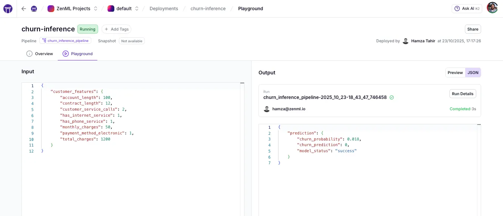

# Deploy Classical ML Models as Real-Time Services

Learn how to deploy a trained scikit-learn model as a production-ready HTTP service with warm model loading and an interactive web UI.

## 🎯 What You'll Learn


- Create training and inference pipelines for customer churn prediction
- Deploy a pipeline as a warm, long-running HTTP service with sub-100ms latency
- Load models once at startup to eliminate cold-start delays
- Serve an interactive web interface alongside your REST API
- Track every prediction with full ZenML lineage and artifacts

## 🏃 Quickstart

```bash
pip install -r requirements.txt
zenml init
zenml login
```

First train the model ([see code](pipelines/training_pipeline.py)). This will train a scikit-learn based churn prediction model on sample data, and tag the resulting artifact as `production`.

```bash
python run.py --train
```

Deploy the tagged model as a real-time FastAPI service ([see code](pipelines/inference_pipeline.py)):

```bash
# See deployment with custom frontend at http://localhost:8000
zenml pipeline deploy pipelines.inference_pipeline.churn_inference_pipeline
```

You can also run batch inference:

```bash
python run.py --predict      # Run inference on sample customer data
python run.py --predict --features '{"account_length": 50, ...}'  # Custom prediction
```

Visit `http://localhost:8000` for the interactive UI ([see code](ui/index.html)).

**Make predictions via API**

```bash
curl -X POST http://localhost:8000/invoke \
  -H "Content-Type: application/json" \
  -d '{
    "parameters": {
      "customer_features": {
        "account_length": 24,
        "customer_service_calls": 2,
        "monthly_charges": 45.0,
        "total_charges": 1080.0,
        "has_internet_service": 1,
        "has_phone_service": 1,
        "contract_length": 12,
        "payment_method_electronic": 0
      }
    }
  }'
```

**Use the ZenML Deployment Playground**



The ZenML dashboard includes a built-in playground for deployed pipelines, allowing you to test your service directly from the UI without writing any code. Simply navigate to your deployment in the dashboard, fill in the input parameters interactively, and send requests to see real-time predictions. This makes it easy to validate your deployment, debug issues, and share working examples with your team—all without leaving the browser or crafting curl commands.

**View API documentation**
Visit `http://localhost:8000/docs` for interactive Swagger documentation.

## 🏗️ What's Inside

```
deploying_ml_model/
├── pipelines/
│   ├── training_pipeline.py    - Generate synthetic data and train model
│   ├── inference_pipeline.py   - Real-time prediction service
│   └── hooks.py                - Warm model loading at startup/shutdown
├── steps/
│   ├── data.py                 - Customer data generation
│   ├── train.py                - Model training and evaluation
│   └── inference.py            - Fast prediction step
├── ui/
│   └── index.html              - Interactive web form
├── run.py                      - CLI for training and testing
└── requirements.txt            - Dependencies
```

**How it works**: The training pipeline generates synthetic customer data and trains a Random Forest classifier. The inference pipeline loads this model once at deployment startup (via `on_init` hook) and uses it for fast per-request predictions. The web UI connects directly to the deployed service for real-time predictions.

## 🔑 Key Concepts

### **Pipeline Deployments**

ZenML allows you to deploy pipelines in a real-time API Just decorate your pipeline with `DeploymentSettings`:

```python
from zenml.pipelines import pipeline
from zenml.config import DeploymentSettings

@pipeline(
    settings={
        "deployment": DeploymentSettings(
            app_title="Churn Prediction API",
            dashboard_files_path="ui",
            cors={"allow_origins": ["*"]},
        ),
    }
)
def churn_inference_pipeline(customer_features: Dict) -> Dict:
    return predict_churn(customer_features)
```

You can configure various different deployers in your active stack to push the deployed pipeline onto your infrastructure (e.g. AWS [App Runner Deployer](https://docs.zenml.io/component-guide/deployers/aws-app-runner), GCP [Cloud Run Deployer](https://docs.zenml.io/component-guide/deployers/gcp-cloud-run), [Docker Deployer](https://docs.zenml.io/component-guide/deployers/docker), [Local Deployer](https://docs.zenml.io/component-guide/deployers/local)))

### **Warm Container Pattern**

The `on_init` hook runs once when your pipeline deploys, loading the model into memory. This stays warm for all requests, eliminating the 8-15 second cold start typical of serverless ML solutions:

```python
@pipeline(
    on_init=init_model,        # Runs once at startup
    on_cleanup=cleanup_model,  # Clean shutdown
)
def churn_inference_pipeline(customer_features: Dict) -> Dict:
    return predict_churn(customer_features=customer_features)
```

### **Pipeline Deployment Configuration**

Use `DeploymentSettings` to configure your HTTP service, including authentication, CORS, and static file serving:

```python
settings={
    "deployment": DeploymentSettings(
        app_title="Churn Prediction API",
        dashboard_files_path="ui",  # Serve web UI at root
        cors=CORSConfig(allow_origins=["*"]),
    ),
}
```

## 📚 Learn More

- [Pipeline Deployments Guide](https://docs.zenml.io/how-to/deployment/deployment)
- [Deployment Settings](https://docs.zenml.io/how-to/deployment/deployment_settings)
- [Pipeline Hooks](https://docs.zenml.io/how-to/steps-pipelines/advanced_features#pipeline-and-step-hooks)
- [Custom Steps Guide](https://docs.zenml.io/how-to/steps-pipelines/steps_and_pipelines)
- [Related Example: Quickstart](../quickstart/README.md)
