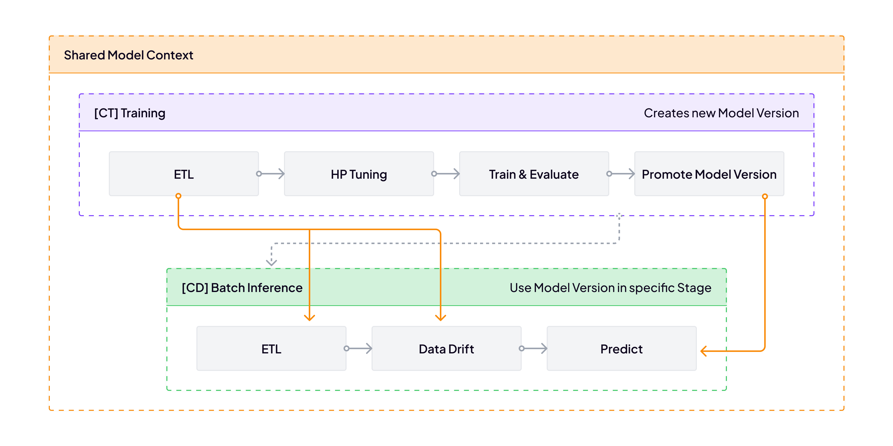

# Supply Chain Forecasting

This is a comprehensive supervised ML project built with the
ZenML framework and its integration. The project trains one or more
scikit-learn classification models to make predictions on the tabular
classification datasets provided by the scikit-learn library. The project was
generated from the [E2E Batch ZenML project template](https://github.com/zenml-io/template-e2e-batch)
with the following properties:
- Project name: Supply Chain Forecasting
- Technical Name: supply_chain_forecasting
- Version: `0.0.1`
- Licensed with none to ZenML GmbH<>
- Deployment environment: `production`

Settings of your project are:
- Fixed model architecture defined in `config.py`
- Trained model promotion to `production` based on accuracy metric vs currently deployed model
- Data drift checks based on Evidently report
- All notifications disabled

> [!NOTE]
> If you are coming from [our production guide](https://docs.zenml.io/user-guide/production-guide), 
> you can apply the same principles that you have seen in the guide to this project. 
> You can [connect it to remote storage](https://docs.zenml.io/user-guide/production-guide/remote-storage),
> [run it with a cloud orchestrator](https://docs.zenml.io/user-guide/production-guide/cloud-orchestration),
> [attach a git repository to it](https://docs.zenml.io/user-guide/production-guide/connect-code-repository),
> and much more. If you are looking to try these steps with a simpler example,
> feel free to take a look at [our starter template](https://github.com/zenml-io/template-starter)
> as well.

## 👋 Introduction

Welcome to your newly generated "Supply Chain Forecasting" project! This is
a great way to get hands-on with ZenML using production-like template. 
The project contains a collection of standard and custom ZenML steps, 
pipelines and other artifacts and useful resources that can serve as a 
solid starting point for your smooth journey with ZenML.

What to do first? You can start by giving the project a quick run. The
project is ready to be used and can run as-is without any further code
changes! You can try it right away by installing ZenML, the needed
ZenML integration and then calling the CLI included in the project. We also
recommend that you start the ZenML UI locally to get a better sense of what
is going on under the hood:

```bash
# Set up a Python virtual environment, if you haven't already
python3 -m venv .venv
source .venv/bin/activate
# Install requirements & integrations
make setup
# Optionally, provision default local stack
make install-stack-local
# Start the ZenML UI locally (recommended, but optional)
zenml login --local
# Run the pipeline included in the project
python run.py
```

When the pipelines are done running, you can check out the results in the ZenML
UI by following the link printed in the terminal (or you can go straight to
the [ZenML UI pipelines run page](http://127.0.0.1:8237/workspaces/default/all-runs?page=1).

Next, you should:

* look at the CLI help to see what you can do with the project:
```bash
python run.py --help
```
* go back and [try out different parameters](https://github.com/zenml-io/template-e2e-batch#-template-parameters)
for your generated project. For example, you could disable hyperparameters
tuning and use your favorite model architecture or promote every trained model,
if you haven't already!
* take a look at [the project structure](#-project-structure) and the code
itself. The code is heavily commented and should be easy to follow.
* read the [ZenML documentation](https://docs.zenml.io) to learn more about
various ZenML concepts referenced in the code and to get a better sense of
what you can do with ZenML.
* start building your own ZenML project by modifying this code

## 📦 What's in the box?

The Supply Chain Forecasting project demonstrates how the most important steps of 
the ML Production Lifecycle can be implemented in a reusable way remaining 
agnostic to the underlying infrastructure, and how to integrate them together 
into pipelines serving Training and Batch Inference purposes.

This template uses 
[the Breast Cancer Dataset](https://scikit-learn.org/stable/modules/generated/sklearn.datasets.load_breast_cancer.html)
to demonstrate how to perform major critical steps for Continuous Training (CT)
and Continuous Delivery (CD).

It consists of three pipelines with the following high-level setup:
<p align="center">
  
</p>

All pipelines are leveraging the Model Control Plane to bring all parts together - the training pipeline creates and promotes a new Model Control Plane version with a trained model object in it, deployment pipeline uses the inference Model Control Plane version (the one promoted during training) to create a deployment service and inference pipeline using deployment service from the inference Model Control Plane version and store back new set of predictions as a versioned data artifact for future use. This makes those pipelines closely connected while ensuring that only quality-assured Model Control Plane versions are used to produce predictions delivered to stakeholders.
* [CT] Training
  * Load, split, and preprocess the training dataset
  * Search for an optimal model object architecture and tune its hyperparameters
  * Train the model object and evaluate its performance on the holdout set
  * Compare a recently trained model object with one promoted earlier
  * If a recently trained model object performs better - stage it as a new inference model object in model registry
  * On success of the current model object - stage newly created Model Control Plane version as the one used for inference
* [CD] Deployment
  * Deploy a new prediction service based on the model object connected to the inference Model Control Plane version.
* [CD] Batch Inference
  * Load the inference dataset and preprocess it reusing object fitted during training
  * Perform data drift analysis reusing training dataset of the inference Model Control Plane version as a reference
  * Run predictions using a model object from the inference Model Control Plane version
  * Store predictions as an versioned artifact and link it to the inference Model Control Plane version

In [the repository documentation](https://github.com/zenml-io/template-e2e-batch#-how-this-template-is-implemented),
you can find more details about every step of this template.

The project code is meant to be used as a template for your projects. For
this reason, you will find several places in the code specifically marked
to indicate where you can add your code:

```python
### ADD YOUR OWN CODE HERE - THIS IS JUST AN EXAMPLE ###
...
### YOUR CODE ENDS HERE ###
```

## 📜 Project Structure

The project loosely follows [the recommended ZenML project structure](https://docs.zenml.io/how-to/setting-up-a-project-repository/best-practices):

```
.
├── configs                   # pipelines configuration files
│   ├── deployer_config.yaml  # the configuration of the deployment pipeline
│   ├── inference_config.yaml # the configuration of the batch inference pipeline
│   └── train_config.yaml     # the configuration of the training pipeline
├── pipelines                 # `zenml.pipeline` implementations
│   ├── batch_inference.py    # [CD] Batch Inference pipeline
│   ├── deployment.py         # [CD] Deployment pipeline
│   └── training.py           # [CT] Training Pipeline
├── steps                     # logically grouped `zenml.steps` implementations
│   ├── alerts                # alert developer on pipeline status
│   ├── deployment            # deploy trained model objects
│   ├── data_quality          # quality gates built on top of drift report
│   ├── etl                   # ETL logic for dataset
│   ├── hp_tuning             # tune hyperparameters and model architectures
│   ├── inference             # inference on top of the model from the registry
│   ├── promotion             # find if a newly trained model will be new inference
│   └── training              # train and evaluate model
├── utils                     # helper functions
├── .dockerignore
├── Makefile                  # helper scripts for quick start with integrations
├── README.md                 # this file
├── requirements.txt          # extra Python dependencies 
└── run.py                    # CLI tool to run pipelines on ZenML Stack
```
