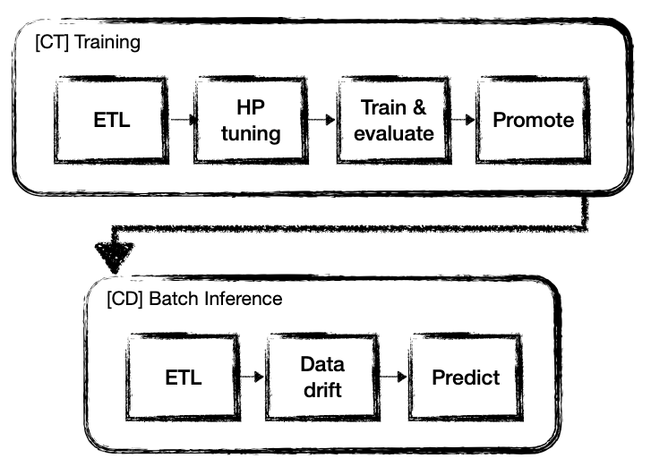
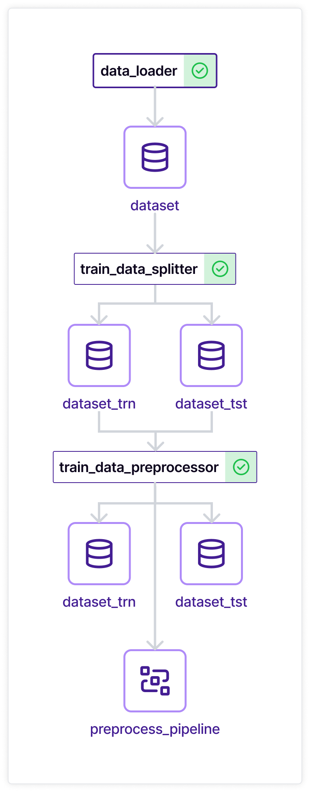
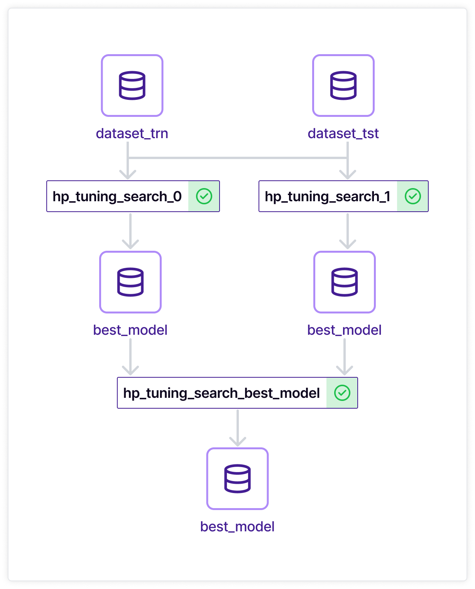
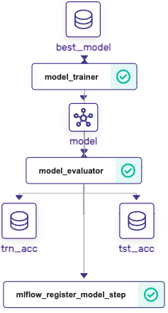
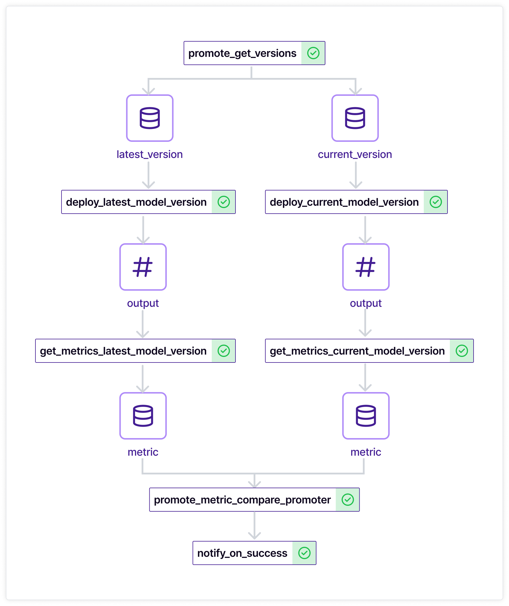
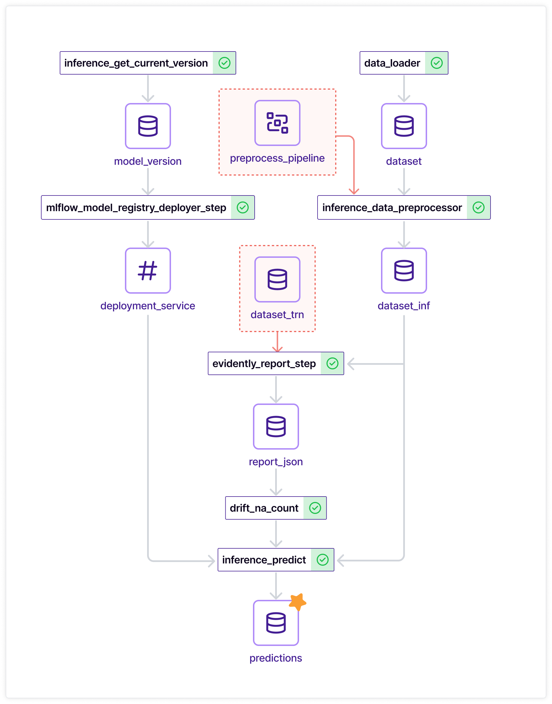

<!-- Remove these comments -->
<!-- markdown-link-check-disable -->

# 💫 Bringing all MLOps stack components together to build an end-to-end data product with ZenML
ZenML is an extensible, open-source MLOps framework for creating portable, production-ready machine learning pipelines. By decoupling infrastructure from code, ZenML enables developers across your organization to collaborate more effectively as they develop to production.

While [extensive documentation of ZenML](https://docs.zenml.io/getting-started/introduction) is a great support for exploring specific components and integrations, seeing the big picture of all components integrated and working together is not usually covered by any documentation. This example comes in handy to fill this gap!

It demonstrates how the most important steps of the ML Production Lifecycle can be implemented in a reusable way remaining agnostic to the underlying infrastructure, and how to integrate them together into pipelines serving Training and Batch Inference purposes.

Follow along this example and you would get a functionally rich pipeline bringing your ML models to production today!
<p align="center">
  
</p>

## Table of Contents

1. [Overview](#-overview)
2. [How the example is implemented](#-how-the-example-is-implemented)

    a. [[Continuous Training] Training Pipeline](#continuous-training-training-pipeline-etl-steps)
    * [ETL steps](#continuous-training-training-pipeline-etl-steps)
    * [Model architecture search and hyperparameter tuning](#continuous-training-training-pipeline-model-architecture-search-and-hyperparameter-tuning)
    * [Model training and evaluation](#continuous-training-training-pipeline-model-training-and-evaluation)
    * [Model promotion](#continuous-training-training-pipeline-model-promotion)

    b. [[Continuous Deployment] Batch Inference](#continuous-deployment-batch-inference)
    * [ETL Steps](#continuous-deployment-batch-inference-etl-steps)
    * [Drift reporting](#continuous-deployment-batch-inference-drift-reporting)
    * [Inference](#continuous-deployment-batch-inference-inference)
3. [Run it locally](#-run-it-locally)

## 🗺 Overview

[Back to Table of Contents](#table-of-contents)

This example uses [the Breast Cancer Dataset](https://scikit-learn.org/stable/modules/generated/sklearn.datasets.load_breast_cancer.html) to demonstrate how to perform major critical steps for Continuous Training (CT) and Continuous Delivery (CD).

It consists of two pipelines with the following high-level steps:
<p align="center">
  
</p>

* [CT] Training
  * Load, split and preprocess the training dataset
  * Search an optimal model architecture and tune its' hyperparameters
  * Train the model and evaluate its performance on the holdout set
  * Compare recently trained model with one used for inference and trained earlier
  * If recently trained model - label it as a new inference model
* [CD] Batch Inference
  * Load the inference dataset and preprocess it in exactly the same fashion as during the training
  * Perform data drift analysis
  * Run predictions using a model labeled as an inference model
  * Store predictions as an artifact for future use

In the next section, we will dive into the implementation details of each step.

<details>
  <summary>Overview of folder structure 🤓</summary>

For better readability, we need to describe the folder structure used in this example:
```
.
├── pipelines               # `zenml.pipeline` implementations
│   ├── batch_inference.py  # [CD] Batch Inference pipeline
│   └── training.py         # [CT] Training Pipeline
├── steps                   # logically grouped `zenml.steps` implementations
│   ├── alerts              # alert developer on pipeline status
│   ├── data_quality        # quality gates built on top of drift report
│   ├── etl                 # ETL logic for dataset
│   ├── hp_tuning           # tune hyperparameters and model architectures
│   ├── inference           # inference on top of the model from the registry
│   ├── promotion           # find if a newly trained model will be new inference
│   └── training            # train and evaluate model
└── utils                   # helper functions
├── config.py               # default configuration of Pipelines
├── run.py                  # CLI tool to run pipelines on ZenML Stack
```
</details>


## 🧰 How the example is implemented

[Back to Table of Contents](#table-of-contents)

We will be going section by section diving into implementation details and sharing tips and best practices along this journey.

### [Continuous Training] Training Pipeline: ETL steps

[Back to Table of Contents](#table-of-contents) | [📂 Code folder](steps/etl/)
<p align="center">
  
</p>

Usually at the very beginning of every training pipeline developers are acquiring data to work with in later stages. In this example, we are using [the Breast Cancer Dataset](https://scikit-learn.org/stable/modules/generated/sklearn.datasets.load_breast_cancer.html) to showcase steps but avoid high computational costs.

The first `data_loader` step is downloading data, which is passed to the `train_data_splitter` step responsible for splitting into train and test to avoid target leakage on data cleaning. The next `train_data_preprocess` step is preparing a `sklearn.Pipeline` object based on the training dataset and applying it also on the testing set to form ready-to-use datasets.

We also output `preprocess_pipeline` as an output artifact from `train_data_preprocess` - it will be passed into the inference pipeline later on, to prepare the inference data using the same fitted pipeline from training. Sklearn `Pipeline` comes really handy to perform consistent repeatable data manipulations on top of pandas `DataFrame` or similar structures.

### [Continuous Training] Training Pipeline: Model architecture search and hyperparameter tuning

[Back to Table of Contents](#table-of-contents) | [📂 Code folder](steps/hp_tuning/)
<p align="center">
  
</p>

To ensure the high quality of ML models many ML Engineers go for automated hyperparameter tuning or even automated model architecture search. In this example, we are using prepared data from ETL to spin up a search of the best model parameters for different architectures in parallel.

To create parallel processing of computationally expensive operations we use a loop over predefined potential architectures and respective parameters search grid and create one step for each candidate. After the steps are created we need to collect results (one best model per each search step) in a `hp_tuning_select_best_model` step to define the final winner and pass it to training. To ensure that collection goes smoothly and in full we use an `after` statement populated with all search steps names, so the selector job will wait for the completion of all searches.

You can find more information about the current state of [Hyperparameter Tuning using ZenML in documentation](https://docs.zenml.io/user-guide/advanced-guide/pipelining-features/hyper-parameter-tuning).

Another important concept introduced at this stage is [Custom Materializers](https://docs.zenml.io/user-guide/advanced-guide/artifact-management/handle-custom-data-types#custom-materializers): `hp_tuning_single_search` produce an output containing best parameters as a normal python dictionary and model architecture as a sklearn model class. Implementation of `ModelInfoMaterializer` is [here](utils/sklearn_materializer.py).

Later on, this materializer class is passed into steps to create such an output explicitly.
<details>
  <summary>Code snippet 💻</summary>

```python
@step(output_materializers=ModelInfoMaterializer)
def hp_tuning_select_best_model(
    search_steps_prefix: str,
) -> Annotated[Dict[str, Any], "best_model"]:
  ...
```
</details>


### [Continuous Training] Training Pipeline: Model training and evaluation

[Back to Table of Contents](#table-of-contents) | [📂 Code folder](steps/training/)
<p align="center">
  
</p>

Having the best model architecture and its' hyperparameters defined in the previous stage makes it possible to train a quality model. Also, model training is the right place to bring an[Experiment Tracker](https://docs.zenml.io/user-guide/component-guide/experiment-trackers) into the picture - we will log all metrics and model itself into the [Experiment Tracker](https://docs.zenml.io/user-guide/component-guide/experiment-trackers), so we can register our model in a [Model Registry](https://docs.zenml.io/user-guide/component-guide/model-registries) and pass it down to a [Model Deployer](https://docs.zenml.io/user-guide/component-guide/model-deployers) easily and traceable. We will use information from Active Stack to make implementation agnostic of the underlying infrastructure.
<details>
  <summary>Code snippet 💻</summary>

```python
experiment_tracker = Client().active_stack.experiment_tracker
@step(experiment_tracker=experiment_tracker.name)
def model_trainer(
    ...
) -> Annotated[ClassifierMixin, "model"]:
  ...
```
</details>
Even knowing that the hyperparameter tuning step happened we would like to ensure that our model meets at least minimal quality standards - this quality gate is on the evaluation step. In case the model is of low-quality metric-wise an Exception will be raised and the pipeline will stop.

To notify maintainers of our Data Product about failures or successful completion of a pipeline we use [Alerter](https://docs.zenml.io/user-guide/component-guide/alerters) of the active stack. For failures it is convenient to use pipeline hook `on_failure` and for successes, a step notifying about it added as a last step of the pipeline comes in handy.
<details>
  <summary>Code snippet 💻</summary>

```python
alerter = Client().active_stack.alerter

def notify_on_failure() -> None:
    alerter.post(message=build_message(status="failed"))

@step(enable_cache=False)
def notify_on_success() -> None:
    alerter.post(message=build_message(status="succeeded"))

@pipeline(on_failure=notify_on_failure)
def e2e_example_training(...):
  ...
  promote_metric_compare_promoter(...)
  notify_on_success(after=["promote_metric_compare_promoter"])
```
</details>


### [Continuous Training] Training Pipeline: Model promotion

[Back to Table of Contents](#table-of-contents) | [📂 Code folder](steps/promotion/)
<p align="center">
  
</p>

Once the model is trained and evaluated on meeting basic quality standards, we would like to understand whether it is good enough to beat the existing model used in production. This is a very important step, as promoting a weak model in production might result in huge losses at the end of the day.

In this example, we are implementing metric compare promotion to decide on the spot and avoid more complex approaches like Champion/Challengers shadow deployments. In other projects, other promotion techniques and strategies can vary.

To achieve this we would retrieve the model version from [Model Registry](https://docs.zenml.io/user-guide/component-guide/model-registries): latest (the one we just trained) and current (the one having a proper tag). Next, we need to deploy both models using [Model Deployer](https://docs.zenml.io/user-guide/component-guide/model-deployers) and run predictions on the testing set for both of them. Next, we select which one of the model versions has a better metric value and associate it with the inference tag. By doing so we ensure that the best model version would be used for inference later on.

### [Continuous Deployment] Batch Inference

[Back to Table of Contents](#table-of-contents)
<p align="center">
  
</p>

### [Continuous Deployment] Batch Inference: ETL Steps

[Back to Table of Contents](#table-of-contents) | [📂 Code folder](steps/etl)

The process of loading data is similar to training, even the same step function is used, but with the `is_inference` flag.

But inference flow has an important difference - there is no need to fit preprocessing `Pipeline`, rather we need to reuse one fitted during training on the train set, to ensure that model gets the expected input. To do so we will use [ExternalArtifact](https://docs.zenml.io/user-guide/advanced-guide/pipelining-features/configure-steps-pipelines#pass-any-kind-of-data-to-your-steps) with lookup by `pipeline_name` and `artifact_name` - it will return ensure that required artifact is properly passed in inference preprocessing.
<details>
  <summary>Code snippet 💻</summary>

```python
########## ETL stage  ##########
df_inference, target = data_loader(is_inference=True)
df_inference = inference_data_preprocessor(
    dataset_inf=df_inference,
    preprocess_pipeline=ExternalArtifact(
        pipeline_name=MetaConfig.pipeline_name_training,
        artifact_name="preprocess_pipeline",
    ),
    target=target,
)
```
</details>


### [Continuous Deployment] Batch Inference: Drift reporting

[Back to Table of Contents](#table-of-contents) | [📂 Code folder](steps/data_quality/)

On the drift reporting stage we will use [standard step](https://docs.zenml.io/user-guide/component-guide/data-validators/evidently#how-do-you-use-it) `evidently_report_step` to build Evidently report to assess certain data quality metrics. `evidently_report_step` has reach set of options, but for this example, we will build only `DataQualityPreset` metrics preset to get a number of NA values in reference and current datasets.

After the report is built we execute another quality gate using the `drift_na_count` step, which assesses if a significant drift in NA count is observed. If so, execution is stopped with an exception.

You can follow [Data Validators docs](https://docs.zenml.io/user-guide/component-guide/data-validators) to get more inspiration on how and when to use drift detection in your pipelines.

### [Continuous Deployment] Batch Inference: Inference

[Back to Table of Contents](#table-of-contents) | [📂 Code folder](steps/inference)

As a last step concluding all work done so far, we will calculate predictions on the inference dataset and persist them in [Artifact Store](https://docs.zenml.io/user-guide/component-guide/artifact-stores) for reuse.

As we performed promotion as part of the training pipeline it is very easy to fetch the needed model version from [Model Registry](https://docs.zenml.io/user-guide/component-guide/model-registries) and deploy it for inference with [Model Deployer](https://docs.zenml.io/user-guide/component-guide/model-deployers).

Once the model version is deployed the only thing left over is to call `.predict()` on the deployment service object and put those predictions as an output of the predictions step, so it is automatically stored in [Artifact Store](https://docs.zenml.io/user-guide/component-guide/artifact-stores) with zero effort.
<details>
  <summary>Code snippet 💻</summary>

```python
@step
def inference_predict(
    deployment_service: MLFlowDeploymentService,
    dataset_inf: pd.DataFrame,
) -> Annotated[pd.Series, "predictions"]:
    predictions = deployment_service.predict(request=dataset_inf)
    predictions = pd.Series(predictions, name="predicted")
    return predictions
```
</details>


## 🖥 Run it locally

[Back to Table of Contents](#table-of-contents)

### 📄 Prerequisites

In order to run this example, you need to install and initialize ZenML:

```shell
# install CLI
pip install "zenml[server]"

# install ZenML integrations
zenml integration install sklearn mlflow slack evidently
zenml experiment-tracker register -f mlflow mlflow
zenml model-deployer register -f mlflow mlflow
zenml model-registry register -f mlflow mlflow
zenml data-validator register -f evidently evidently
zenml alerter register -f slack --slack_token=${SLACK_TOKEN} --default_slack_channel_id=${SLACK_CHANNEL} slack

# compose ZenML stack
zenml stack register e2e_example_local\
    -o default\
    -a default\
    -r mlflow\
    -d mlflow\
    -e mlflow\
    -al slack\
    -dv evidently\
    --set
zenml stack up

# clone repo
git clone https://github.com/zenml-io/zenml
cd zenml/examples/e2e

# Initialize ZenML repo
zenml init

# Start the ZenServer to enable dashboard access
zenml up
```

### ▶️ Run the Code

Now we're ready. Execute:

```bash
python run.py
```
