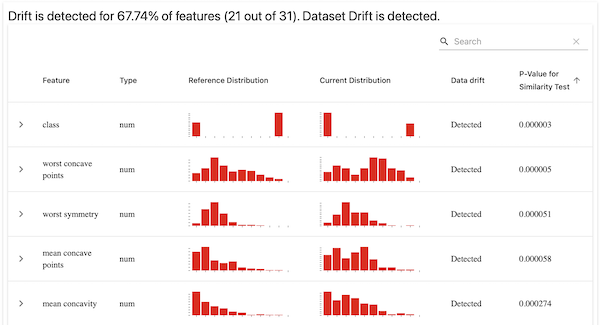

# 🏎 Explore Drift Detection
Data drift is something you often want to guard against in your pipelines.
Machine learning pipelines are built on top of data inputs, so it is worth
checking for drift if you have a model that was trained on a certain
distribution of data.

## 🗺 Overview
This example uses [`evidently`](https://github.com/evidentlyai/evidently), a
useful open-source library to painlessly check for data drift (among other
features). At its core, Evidently's drift detection takes in a reference data
set and compares it against another comparison dataset. These are both input in
the form of a `pandas` dataframe, though CSV inputs are also possible. You can receive these results in the form of a standard dictionary object containing all the relevant information, or as a visualization. We support both outputs.

ZenML implements this functionality in the form of a standard `EvidentlyProfileStep` step.
You select which of the profile sections you want to use in your step by passing
a string into the `EvidentlyProfileConfig`. Possible options supported by
Evidently are:

- "datadrift"
- "categoricaltargetdrift"
- "numericaltargetdrift"
- "dataquality"
- "classificationmodelperformance"
- "regressionmodelperformance"
- "probabilisticmodelperformance"

## 🧰 How the example is implemented
In this example, we compare two separate slices of the same dataset as an easy
way to get an idea for how `evidently` is making the comparison between the two
dataframes. We chose [the University of Wisconsin breast cancer diagnosis
dataset](https://archive.ics.uci.edu/ml/datasets/Breast+Cancer+Wisconsin+(Diagnostic))
to illustrate how it works.

```python
from zenml.integrations.evidently.steps import (
    EvidentlyColumnMapping,
    EvidentlyProfileConfig,
    evidently_profile_step,
)

drift_detector = evidently_profile_step(
    step_name="drift_detector",
    config=EvidentlyProfileConfig(
        column_mapping=EvidentlyColumnMapping(
            target="class", prediction="class"
        ),
        profile_sections=[
            "dataquality",
            "categoricaltargetdrift",
            "numericaltargetdrift",
            "datadrift",
        ],
        verbose_level=1,
    ),
)

```

Here you can see that defining the step is extremely simple using our
builtin steps and included utility, and then you just have to pass in the two
dataframes for the comparison to take place.

We even allow you to use the Evidently visualization tool easily to display data
drift diagrams in your browser or within a Jupyter notebook:



# ☁️ Run in Colab
If you have a google account, you can get started directly with google colab - [](https://colab.research.google.com/github/zenml-io/zenml/blob/main/examples/evidently_drift_detection/evidently.ipynb)

# 🖥 Run it locally

## 👣 Step-by-Step
### 📄 Prerequisites 
In order to run this example, you need to install and initialize ZenML:

```shell
# install CLI
pip install zenml

# install ZenML integrations
zenml integration install evidently sklearn -y

# pull example
zenml example pull evidently_drift_detection
cd zenml_examples/evidently_drift_detection

# Initialize ZenML repo
zenml init
```

### 🥞 Set up your stack for Evidently

You need to have an Evidently Data Validator component to your stack to be able to
use Evidently data profiling in your ZenML pipelines. Creating such a stack is
easily accomplished:

```shell
zenml data-validator register evidently -f evidently
zenml stack register evidently_stack -o default -a default -m default -dv evidently --set
```

### ▶️ Run the Code
Now we're ready. Execute:

```bash
python run.py
```

Alternatively, if you want to run based on the config.yaml you can run with:

```bash
zenml pipeline run pipelines/drift_detection_pipeline/drift_detection_pipeline.py -c config.yaml
```

### 🧽 Clean up
In order to clean up, delete the remaining ZenML references.

```shell
rm -rf zenml_examples
```
