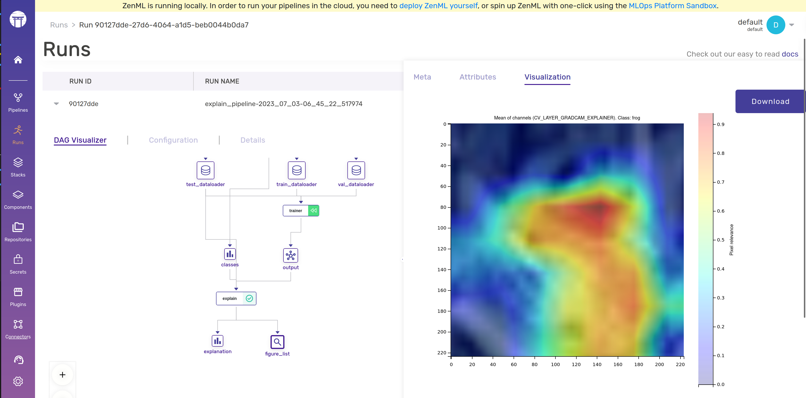

# 🔦 Using FoXAI with ZenML

This example demonstrate how we can use ZenML and FoXAI to build, train, 
test and explain ML models.

[FoXAI](https://github.com/softwaremill/FoXAI) is an open-source machine learning
framework for explainable AI.

# 🖥 Run it locally

## 👣 Step-by-Step

### 📄 Prerequisites

```shell
# install CLI
pip install "zenml[server]"

# install ZenML integrations
zenml integration install pytorch
pip install -r requirements.txt  # for torchvision

# initialize
zenml init

# Start the ZenServer to enable dashboard access
zenml up
```

### ▶️ Run the Code

Now we're ready. Execute the pipeline:

```shell
# sequence-classification
python run.py
```

This will load pre-trained model trained on ImageNet from torchvision hub,
finetune it on CIFAR10 for few epochs, and explain the model against the
testset. As a result pixel importances are computed, saved and visualized to
help ML engineers to investigate training process and gain trust in the
model.

Example of LayerGradCAM explainer in action:
