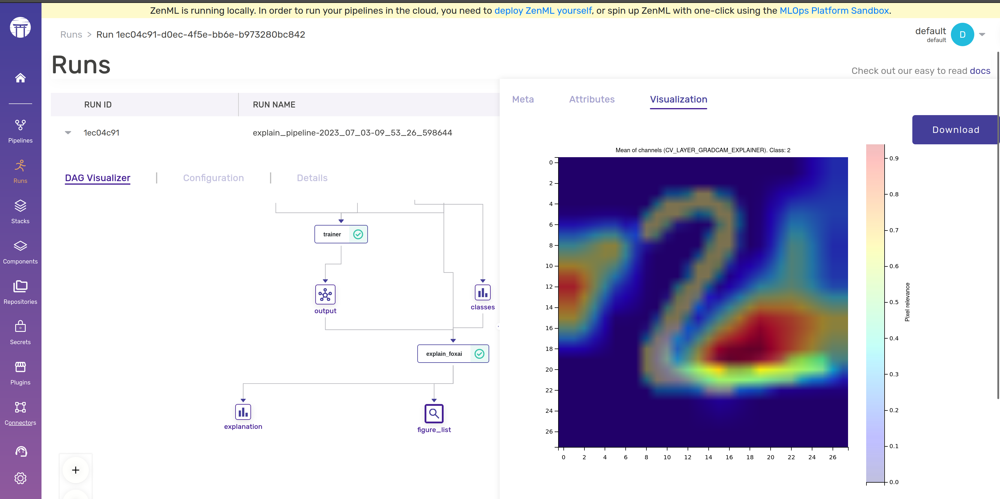

# 🔦 Using FoXAI with ZenML

This example demonstrate how we can use ZenML FoXAI and SHAP to build, train, 
test and explain ML models.

Code is based on SHAP [example](https://shap.readthedocs.io/en/latest/example_notebooks/image_examples/image_classification/PyTorch%20Deep%20Explainer%20MNIST%20example.html).

[FoXAI](https://github.com/softwaremill/FoXAI) is an open-source machine learning
framework for explainable AI using broad range of algorithms focues on computer
vision supporting PyTorch.

[SHAP](https://github.com/slundberg/shap) is open-source machine learning
framework for explainable AI using Shapley values for NLP, CV and tabular data that
supports multiple ML frameworks.

# 🖥 Run it locally

## 👣 Step-by-Step

### 📄 Prerequisites

```shell
# install CLI
pip install "zenml[server]"

# install ZenML integrations
zenml integration install pytorch
pip install -r requirements.txt  # for torchvision, foxai, and shap

# initialize
zenml init

# Start the ZenServer to enable dashboard access
zenml up
```

### ▶️ Run the Code

Now we're ready. Execute the pipeline:

```shell
# sequence-classification
python run.py
```

This will create simple model, finetune it on MNIST dataset for few epochs, and explain the model against the testset. As a result pixel importances for each
sample are computed, saved and visualized to help ML engineers to investigate
training process and gain trust in the model.

Example of LayerGradCAM explainer in action:
