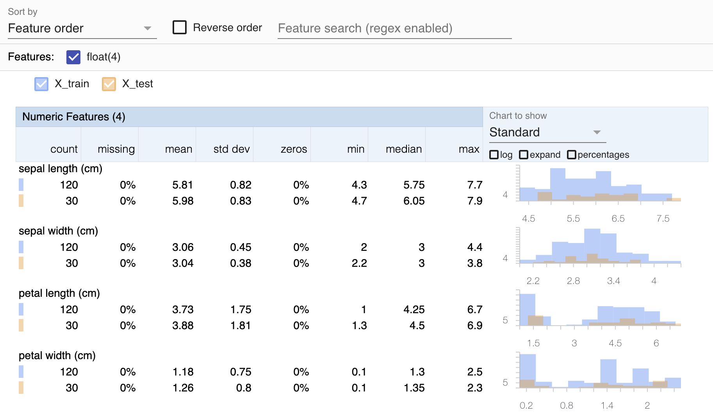

# 📊 Visualize statistics
This examples show-cases the built-in `FacetsMaterializer` using the 
[Facets Overview](https://pypi.org/project/facets-overview/) integration. 
[Facets](https://pair-code.github.io/facets/) is an awesome project that 
helps users visualize large amounts of data in a coherent way.

## 🗺 Overview
We create a simple pipeline that returns two `pd.DataFrames`, one for training
data and one for the test data. Then we use the `facets_visualization_step` to
compare the summary statistics of the two datasets using Facets.

It produces the following visualization:



# 🖥 Run it locally

## ⏩ SuperQuick `statistics` run

If you're really in a hurry and just want to see this example pipeline run
without wanting to fiddle around with all the individual installation and
configuration steps, just run the following:

```shell
zenml example run facets_visualize_statistics
```

Then, open your ZenML dashboard using `zenml up`, navigate to the details page
of the pipeline run and click on the output of the `facets_visualization_step`
to see the Facets visualization.

## 👣 Step-by-Step
### 📄 Prerequisites 
In order to run this example, you need to install and initialize ZenML:

```shell
# install CLI
pip install "zenml[server]"

# install ZenML integrations
zenml integration install sklearn facets

# pull example
zenml example pull facets_visualize_statistics
cd zenml_examples/facets_visualize_statistics

# Initialize ZenML repo
zenml init

# Start the ZenServer to enable dashboard access
zenml up
```

### ▶️ Run the Code

#### Option 1 (*Recommended*) - Interactively explore the example using Jupyter Notebook

```bash
pip install notebook
jupyter notebook
# open notebooks/facets_visualize_statistics.ipynb
```

With this option, the Facets visualizations can be viewed directly inside the 
Jupyter notebook.

#### Option 2 - Execute the whole ML pipeline from a Python script

```bash
python run.py
```

With this option, you can view the Facets visualizations in the dashboard by
navigating to the details page of the pipeline run and clicking on the output 
of the `facets_visualization_step`.

### 🧽 Clean up
In order to clean up, delete the remaining ZenML references.

```shell
rm -rf zenml_examples
```
