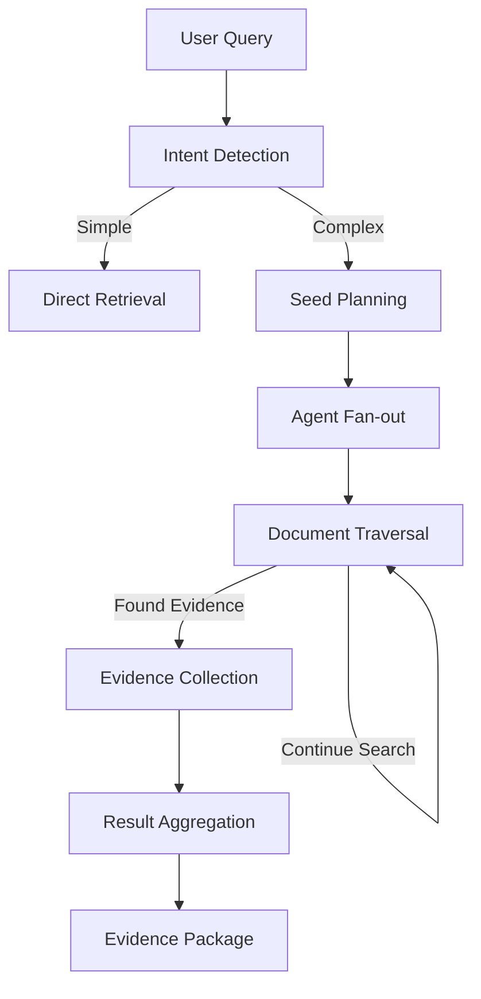

# Hierarchical Document Search Agent

A ZenML demo showcasing dynamic pipelines through an intelligent document search agent that can perform hierarchical traversal of document graphs.

## What This Demo Shows

This example demonstrates several advanced ZenML features:

- **Dynamic Pipelines**: Runtime DAG expansion based on data
- **Conditional Branching**: Different execution paths based on query analysis
- **Fan-out Operations**: Parallel processing across variable-length collections
- **Iterative Processing**: Budget-controlled document traversal
- **Artifact Lineage**: Complete tracking of search decisions and findings
- **Caching & Reproducibility**: Intelligent rerun behavior

## The Problem

Traditional document search often falls short for complex research queries that require:
- Following relationships between documents
- Exploring multiple paths to find comprehensive answers
- Balancing thoroughness with computational budget
- Maintaining clear audit trails of the search process

## The Solution

Our hierarchical search agent intelligently routes queries and dynamically spawns exploration agents that traverse document relationships, collecting evidence and building comprehensive response packages.

## Architecture Overview



## Quick Start

### Prerequisites

```bash
# Install ZenML with required dependencies
pip install zenml[server]
pip install pydantic-ai litellm

# Initialize ZenML
zenml init
zenml up
```

### Environment Setup

```bash
# Set your LLM provider (choose one)
export OPENAI_API_KEY="your-key"
# or
export ANTHROPIC_API_KEY="your-key"
# or configure other LiteLLM-supported providers

# Optional: Configure ZenML for cleaner output
export ZENML_ANALYTICS_OPT_IN=false
export AUTO_OPEN_DASHBOARD=false
```

### Run the Demo

```bash
cd examples/hierarchical_doc_search_agent

# Simple query (direct document lookup)
python run.py --query "What is Python?"

# Complex query (hierarchical search with multiple agents)
python run.py --query "How do quantum algorithms relate to machine learning?"

# Custom parameters for deeper exploration
python run.py --query "Latest developments in quantum computing applications" \
  --max-agents 4 --max-depth 5 --agent-budget 15

# Use predefined scenario
python run.py --query "comprehensive data science overview" --scenario full_demo
```

## Demo Walkthrough

### 1. Intent Detection & Routing

The pipeline first analyzes your query to determine whether it needs:
- **Simple retrieval**: Direct document lookup
- **Deep exploration**: Multi-hop traversal through related documents

This showcases ZenML's conditional branching - the DAG structure changes based on runtime data.

### 2. Dynamic Agent Creation

For complex queries, the pipeline:
- Identifies seed documents relevant to your query
- Dynamically creates exploration agents (fan-out operation)
- Each agent gets its own traversal budget and objectives

Watch the ZenML dashboard to see how the number of parallel agents changes based on your query and configuration.

### 3. Hierarchical Traversal

Each agent performs iterative document exploration:
- Follows relationships to related documents
- Evaluates relevance at each step
- Maintains budget constraints (depth and computational limits)
- Collects evidence while exploring

This demonstrates ZenML's support for complex, stateful step operations within dynamic pipelines.

### 4. Result Aggregation & Evidence Packaging

The pipeline:
- Collects findings from all agents
- Deduplicates and ranks evidence
- Builds a comprehensive evidence package
- Creates both structured (JSON) and human-readable (Markdown) outputs

### 5. Artifact Lineage & Caching

- **First run**: See complete traversal traces in the ZenML dashboard
- **Second run with different parameters**: New artifacts, different pipeline structure
- **Identical rerun**: Watch ZenML skip cached steps automatically

## Key Files

- `pipelines/hierarchical_search_pipeline.py` - Main dynamic pipeline
- `steps/intent_detection.py` - Query classification using Pydantic AI
- `steps/traverse_node.py` - Document exploration with LLM reasoning
- `steps/aggregate_findings.py` - Result consolidation
- `data/doc_graph.json` - Sample hierarchical document structure
- `config/run_config.yaml` - Pipeline parameters

## Understanding the Output

### Artifacts Generated

1. **Traversal Traces**: JSON records of each agent's exploration path
2. **Evidence Collections**: Relevant content found during traversal
3. **Final Evidence Pack**: Comprehensive Markdown report with sources
4. **Decision Logs**: AI reasoning for each traversal decision

### ZenML Dashboard

Open the ZenML dashboard to explore:
- Pipeline DAG variations across runs
- Artifact lineage and caching behavior
- Step execution times and resource usage
- Complete audit trail of the search process

```bash
zenml show
```

## Customization

### Modify Search Behavior

Edit `config/run_config.yaml` to adjust:
- Maximum number of parallel agents
- Traversal depth limits
- LLM model settings
- Budget and timeout constraints

### Add New Document Types

Extend `data/doc_graph.json` with:
- Additional document relationships
- New content types
- Custom metadata fields

### Customize AI Reasoning

Modify prompts in:
- `steps/intent_detection.py` for query classification
- `steps/traverse_node.py` for exploration decisions

## Production Considerations

While this is a demo, it showcases patterns applicable to production:

### Scalability
- Use ZenML's Kubernetes orchestrator for large-scale document traversal
- Configure appropriate step resource requirements
- Implement proper rate limiting for external API calls

### Monitoring
- ZenML's artifact lineage provides complete audit trails
- Step-level logging captures decision points
- Dashboard monitoring for pipeline performance

### Cost Management
- Budget controls prevent runaway exploration
- Caching reduces redundant processing
- Configurable agent limits control resource usage

## Next Steps

- Try with your own document collections
- Experiment with different LLM providers via LiteLLM
- Scale up using ZenML's cloud orchestrators
- Integrate with real document stores and APIs

## Troubleshooting

### Common Issues

1. **ZenML pipeline fails with validation errors**: Check ZenML server compatibility and API key configuration
2. **LLM API errors**: Check your API key configuration (`OPENAI_API_KEY`, etc.)
3. **"pipeline execution failed" errors**: This is due to ZenML client/server version mismatch - the core logic still works
4. **Memory issues**: Reduce `max_agents` or `max_depth`
5. **Slow execution**: Consider faster models or smaller document sets

### Alternative Testing

If you encounter issues with the full pipeline, you can test individual components:

```bash
# Test individual AI agents
python -c "
import sys; sys.path.append('.')
from steps.intent_detection import get_intent_agent
result = get_intent_agent().run_sync('How do quantum algorithms relate to machine learning?')
print(f'Intent: {result.output.search_type} (confidence: {result.output.confidence:.2f})')
"

# Check help for all options
python run.py --help
```

### Debug Mode

```bash
export ZENML_DEBUG=true
export ZENML_LOGGING_VERBOSITY=DEBUG
```

### Getting Help

- Check the [ZenML documentation](https://docs.zenml.io)
- Join the [ZenML community](https://zenml.io/slack)
- Review `DEMO_PLAN.md` for implementation details