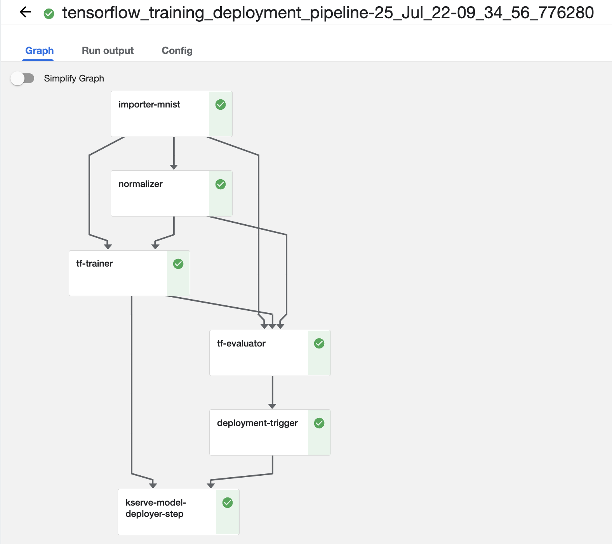
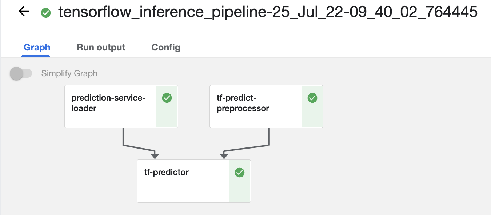
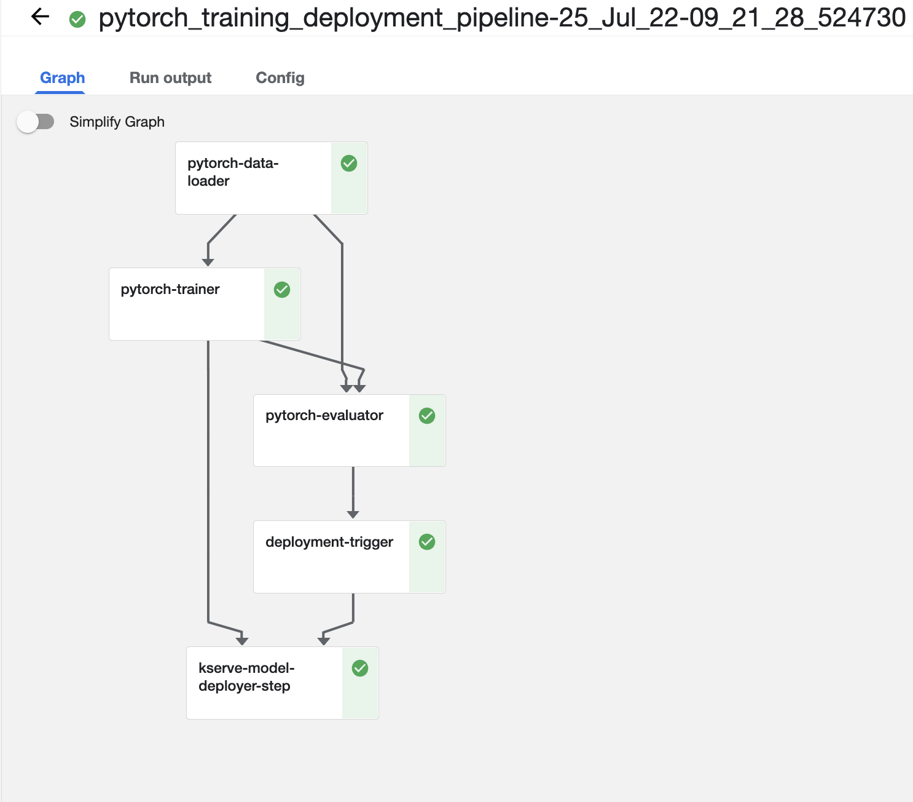
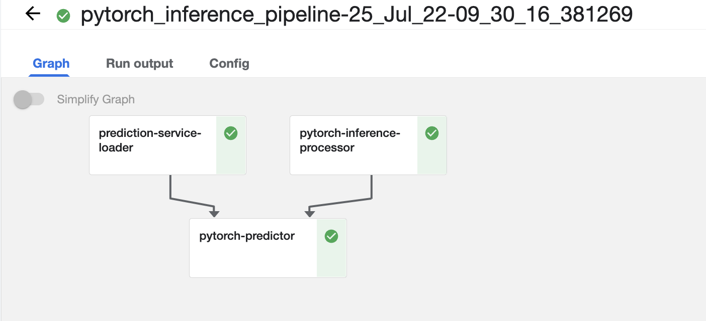

# 🚀 KServe Deployment Example - TensorFlow and Pytorch Examples 🚀

[KServe](https://kserve.github.io/website) is a Kubernetes-based model inference platform
built for highly scalable deployment use cases. It provides a standardized inference protocol 
across ML frameworks while supporting a serverless architecture with autoscaling including Scale to Zero on GPUs.
KServe uses a simple and pluggable production serving architecture for production ML serving that includes 
prediction, pre-/post-processing, monitoring and explainability.

Following the model deployment story within ZenML, and to make it easier to deploy models with other serving tools, 
we have created an Integration for KServe. But how does KServe differ from the already-integrated [Seldon Core](../seldon_deployment/)?

* __**Supported frameworks**__: Standard ML frameworks like TensorFlow, PyTorch, Scikit-learn, XGBoost, Keras, MXNet, etc... are first-class citizens in KServe and can be fairly easily used. While Seldon Core has support for the majority of these ML frameworks, it lacks support for Pytorch even though it could be still used using the custom deployment, albeit with some extra upfront work.
* __**Custom Deployment**__: Both Seldon Core and KServe have support for custom deployment.
However Seldon Core offers an extra inference graph that includes custom [TRANSFORMER](https://docs.seldon.io/projects/seldon-core/en/latest/workflow/overview.html) and [ROUTER](https://docs.seldon.io/projects/seldon-core/en/latest/analytics/routers.html?highlight=routers#) which can be used to build more powerful inference graphs.
* __**Autoscaling**__: KServe has more advanced autoscaling features than Seldon Core.
With the Knative autoscaling, it is possible to scale up and down the number of replicas of the model deployment based on the number of requests received.
* __**Predictions interfaces**__: Seldon Core and KServe have built-in support for HTTP-based protocols, However only Seldon Core has support for GRPC-based protocols. While it still can be configured for KServe it requires using manual, custom deployment.

Now that we have a clear understanding of the different features of KServe compared to Seldon Core, we will go through the deployment process of the model with KServe and focus more on how to deploy the PyTorch model.
## 🗺 Overview

The example uses the [digits dataset](https://keras.io/api/datasets/mnist/) 
to train a classifier using both [TensorFlow](https://www.tensorflow.org/)
and [PyTorch](https://pytorch.org/).
Different hyperparameter values (e.g. the number of epochs and learning rate) 
can be supplied as command-line arguments to the `run.py` Python script. 

The example contains three pipelines:
* `pytorch_training_deployment_pipeline`: trains a classifier using TensorFlow and deploys it to KServe with the TFServing Runtime Server.
* `pytorch_inference_pipeline`: run some predictions using the deployed PyTorch model.

* `tensorflow_training_deployment_pipeline`: trains a classifier using PyTorch and deploys it to KServe with TorchServe Runtime Server.
* `tensorflow_inference_pipeline`: runs predictions on the Tensorflow served models.

Running the pipelines to train the classifiers and then deploying them to 
KServe requires preparing them into an exact format that is expected 
by the runtime server, then storing them into remote storage or a persistent volume 
in the cluster and giving the path to KServe as the model URI with the right permissions to be able to retrieve the model artifacts. 
By default, ZenML's KServe integration will try to handle that for you 
by automatically loading, preparing and then saving files to the same active Artifact Store 
within the ZenML stack. However, for some frameworks (e.g. PyTorch) you will still need 
to provide some additional files that Runtime Server needs to be able to run the model.

Note: Pytorch models are deployed with TorchServe Runtime Server. Read more about how to deploy Pytorch models with TorchServe Runtime Server [KServe Pytorch](https://kserve.github.io/website/0.9/modelserving/v1beta1/torchserve/) or in [TorchServe Official documentation](https://pytorch.org/serve/).

The KServe deployment server is provisioned remotely as a Kubernetes
resource that continues to run after the deployment pipeline run is complete.
Subsequent runs of the deployment pipeline will reuse the existing deployment
server and merely update it to serve the more recent model version.

The deployment pipeline has caching enabled to avoid re-training and
re-deploying the model if the training data and hyperparameter values don't
change. When a new model is trained that passes the accuracy threshold
validation, the pipeline automatically updates the currently running KServe
deployment server so that the new model is being served instead of the old one.

The inference pipeline loads the image from the local filesystem and performs 
online predictions on the running KServe inference service.


# 🖥 Cloud Stack

### 📄 Prerequisites 

To run this example, you need to install and initialize ZenML:

```shell
# install CLI
pip install zenml

# install ZenML integrations
zenml integration install pytorch tensorflow kserve

# pull example
zenml example pull kserve_deployment
cd zenml_examples/kserve_deployment

# initialize a local ZenML Repository
zenml init
```

For the ZenML KServe deployer to work, these things are required:
1. Access to a running [Kubernetes cluster](https://kubernetes.io/). The example accepts a `--kubernetes-context` command-line argument. This Kubernetes context needs to point to the Kubernetes cluster where KServe model servers will be deployed. If the context is not explicitly supplied to the example, it defaults to using the locally active context.

2. KServe must be installed and running on the Kubernetes cluster (More information about how to install KServe can be found below or on the [KServe documentation](https://kserve.github.io/website/)).

3. KServe must be able to access whatever storage is used by ZenML to save the artifact. Since  KServe is installed in the Kubernetes cluster, local filesystem storage can't be used. We recommend using a persistent volume or a remote storage service. (e.g. AWS S3, GCS, Azure Blob Storage, etc.).

 
### 🚅 That seems like a lot of infrastructure work. Is there a Zen 🧘 way to run this example?

Yes! With [ZenML Stack Recipes](../../docs/book/stack-deployment-guide/stack-recipes.md), you can now provision all the infrastructure you need to run your ZenML pipelines with just a few simple commands.

The flow to get started for this example can be the following:

1. Pull the `gcp-kubeflow-kserve` recipe to your local system. Learn more about what this recipe does from its README.

    ```shell
    zenml stack recipe pull gcp-kubeflow-kserve
    ```
2. (Optional) 🎨 Customize your deployment by editing the default values in the `locals.tf` file.

3. 🚀 Deploy the recipe with this simple command.

    ```shell
    zenml stack recipe deploy gcp-kubeflow-kserve
    ```
    > **Note**
    > This command can also automatically import the resources created as a ZenML stack for you. Just run it with the `--import` flag and optionally provide a `--stack-name` and you're set! Keep in mind, in that case, you'll need all integrations for this example installed before you run this command.

    > **Note**
    > You should also have [kubectl](https://kubernetes.io/docs/tasks/tools/#kubectl) and [docker](https://docs.docker.com/engine/install/) installed on your local system with the local [docker client authorized](https://cloud.google.com/sdk/gcloud/reference/auth/configure-docker) to push to your cloud registry.
    
4. You'll notice that a ZenML stack configuration file gets created 🤯! You can run the following command to import the resources as a ZenML stack, manually.

    ```shell
    zenml stack import <STACK_NAME> -f <PATH_TO_THE_CREATED_STACK_CONFIG_YAML>

    # set the imported stack as the active stack
    zenml stack set <STACK_NAME>
    ```

5. You should now create a secret for the CloudSQL instance that will allow ZenML to connect to it. Use the following command:

    ```bash
    zenml secrets-manager secret register gcp_mysql_secret --schema=mysql --user=<DB_USER> --password=<PWD> \
      --ssl_ca=@</PATH/TO/DOWNLOADED/SERVER-CERT> \
      --ssl_cert=@</PATH/TO/DOWNLOADED/CLIENT-CERT> \
      --ssl_key=@</PATH/TO/DOWNLOADED/CLIENT-KEY>
    ```

    The values for the username and password can be obtained by running the following commands inside your recipe directory.

    ```bash
    terraform output metadata-db-username

    terraform output metadata-db-password
    ```

    For the certificates, visit the Google Cloud Console to [create a certificate and download the files](https://cloud.google.com/sql/docs/mysql/configure-ssl-instance#:~:text=Cloud%20SQL%20Instances-,To%20open%20the%20Overview%20page%20of%20an%20instance%2C%20click%20the,Click%20Create%20client%20certificate.) to your system.


You can now skip directly to the [part of this guide where you define ZenML secrets](#gcp-authentication-with-kserve_gs-secret-schema) for your Kserve component! 


### Installing KServe (e.g. in an GKE cluster)

This section is a trimmed-up version of the serverless installation guide for KServe,
[official KServe installation instructions](https://kserve.github.io/website/0.9/admin/serverless/#recommended-version-matrix), applied to a particular type of Kubernetes cluster, GKE in this case. It assumes that a GKE cluster is already set up and accessible.

To configure GKE cluster access locally, e.g:

```bash
gcloud container clusters get-credentials KUBERNETES_CLUSTER_NAME --zone ZONE --project PROJECT_ID
```

1. Install Istio:

We need to download [istioctl](https://istio.io/latest/docs/setup/getting-started/#download) 
Install Istio v1.12.1 (required for the latest KServe version):

```bash
curl -L https://istio.io/downloadIstio | ISTIO_VERSION=1.12.1  sh -
cd istio-1.12.1
export PATH=$PWD/bin:$PATH
# Installing Istio without sidecar injection
istioctl install -y
```

2. Installing the Knative Serving component:

```bash
# Install the required custom resources
kubectl apply -f https://github.com/knative/serving/releases/download/knative-v1.6.0/serving-crds.yaml
# Install the core components of Knative Serving
kubectl apply -f https://github.com/knative/serving/releases/download/knative-v1.6.0/serving-core.yaml
```

Install an Istio networking layer:

```bash
# Install a properly configured Istio
kubectl apply -l knative.dev/crd-install=true -f https://github.com/knative/net-istio/releases/download/knative-v1.6.0/istio.yaml
kubectl apply -f https://github.com/knative/net-istio/releases/download/knative-v1.6.0/istio.yaml
# Install the Knative Istio controller
kubectl apply -f https://github.com/knative/net-istio/releases/download/knative-v1.6.0/net-istio.yaml
# Fetch the External IP address or CNAME
kubectl --namespace istio-system get service istio-ingressgateway
```

Verify the installation:

```bash
kubectl get pods -n knative-serving

"""
activator-59bff9d7c8-2mgdv               1/1     Running     0          11h
autoscaler-c574c9455-x7rfn               1/1     Running     0          3d
controller-59f84c584-mm4pp               1/1     Running     0          3d
domain-mapping-75c659dbc7-hbgnl          1/1     Running     0          3d
domainmapping-webhook-6d9f5996f9-hcvcb   1/1     Running     0          3d
net-istio-controller-76bf75d78f-652fm    1/1     Running     0          11h
net-istio-webhook-9bdb8c6b9-nzf86        1/1     Running     0          11h
webhook-756688c869-79pqh                 1/1     Running     0          2d22h
"""
```
3. Install Cert Manager:

```bash
kubectl apply -f https://github.com/cert-manager/cert-manager/releases/download/v1.9.1/cert-manager.yaml
```

4. Finally, install KServe:

```bash
# Install KServe
kubectl apply -f https://github.com/kserve/kserve/releases/download/v0.9.0/kserve.yaml
# Install KServe Built-in ClusterServingRuntimes
kubectl apply -f https://github.com/kserve/kserve/releases/download/v0.9.0/kserve-runtimes.yaml
```

### Testing the KServe deployment

To test that the installation is functional, you can use this sample KServe
deployment:

1. Create a namespace:

```bash
kubectl create namespace kserve-test
```

2. Create an InferenceService:

```bash
kubectl apply -n kserve-test -f - <<EOF
apiVersion: "serving.kserve.io/v1beta1"
kind: "InferenceService"
metadata:
  name: "sklearn-iris"
spec:
  predictor:
    model:
      modelFormat:
        name: sklearn
      storageUri: "gs://kfserving-examples/models/sklearn/1.0/model"
EOF
```

3. Check InferenceService status:

```bash
kubectl get inferenceservices sklearn-iris -n kserve-test

"""
NAME           URL                                                 READY   PREV   LATEST   PREVROLLEDOUTREVISION   LATESTREADYREVISION                    AGE
sklearn-iris   http://sklearn-iris.kserve-test.example.com         True           100                              sklearn-iris-predictor-default-47q2g   7d23h
"""
```

4. Determine the ingress IP and ports:

```bash
kubectl get svc istio-ingressgateway -n istio-system
NAME                   TYPE           CLUSTER-IP       EXTERNAL-IP      PORT(S)   AGE
istio-ingressgateway   LoadBalancer   172.21.109.129   130.211.10.121   ...       17h
```

Extract the HOST and PORT where the model server exposes its prediction API:

```bash
# For GKE clusters, the host is the GKE cluster IP address.
export INGRESS_HOST=$(kubectl -n istio-system get service istio-ingressgateway -o jsonpath='{.status.loadBalancer.ingress[0].ip}')
# For EKS clusters, the host is the EKS cluster IP hostname.
export INGRESS_HOST=$(kubectl -n istio-system get service istio-ingressgateway -o jsonpath='{.status.loadBalancer.ingress[0].hostname}')

export INGRESS_PORT=$(kubectl -n istio-system get service istio-ingressgateway -o jsonpath='{.spec.ports[?(@.name=="http2")].port}')
export INGRESS_URL="http://${INGRESS_HOST}:${INGRESS_PORT}"

```

5. Perform inference

Prepare your inference input request inside a file:

```bash
cat <<EOF > "./iris-input.json"
{
  "instances": [
    [6.8,  2.8,  4.8,  1.4],
    [6.0,  3.4,  4.5,  1.6]
  ]
}
EOF
```

Use `curl` to send a test prediction API request to the server:

```bash
SERVICE_HOSTNAME=$(kubectl get inferenceservice sklearn-iris -n kserve-test -o jsonpath='{.status.url}' | cut -d "/" -f 3)
curl -v -H "Host: ${SERVICE_HOSTNAME}" http://${INGRESS_HOST}:${INGRESS_PORT}/v1/models/sklearn-iris:predict -d @./iris-input.json
```

You should see something like this as the prediction response:

```json
{"predictions": [1, 1]}
```

### 🥞 Setting up the ZenML Stack

Before you run the example, a ZenML Stack needs to be set up with all the proper
components. Two different examples of stacks featuring GCP infrastructure
components are described in this document, but similar stacks may be set up
using different backends and used to run the example as long as the basic Stack
prerequisites are met.

#### Local orchestrator with GCS artifact store and GKE KServe installation

This stack consists of the following components:

* a GCP artifact store
* the local orchestrator
* the local metadata store
* a KServe model deployer
* a local secret manager used to store the credentials needed by KServe to
access the GCP artifact store

To have access to the GCP artifact store from your local workstation, the
gcloud client needs to be properly set up locally.

In addition to the stack components, KServe must be installed in a
Kubernetes cluster that is locally accessible through a Kubernetes configuration
context. The reference used in this example is a KServe installation
running in a GKE cluster, but any other type of Kubernetes cluster can be used,
managed or otherwise.

To configure GKE cluster access locally, e.g:

```bash
gcloud container clusters get-credentials zenml-test-cluster --zone us-east1-b --project zenml-core
```

Set up a namespace for ZenML KServe workloads:

```bash
kubectl create ns zenml-workloads
```

Extract the URL where the KServe model server exposes its prediction API, e.g.:

```bash
# If you are running in GKE or AKS clusters, the host is the GKE cluster IP address.
export INGRESS_HOST=$(kubectl -n istio-system get service istio-ingressgateway -o jsonpath='{.status.loadBalancer.ingress[0].ip}')
# If you are running in EKS clusters, the host is the EKS cluster IP hostname.
export INGRESS_HOST=$(kubectl -n istio-system get service istio-ingressgateway -o jsonpath='{.status.loadBalancer.ingress[0].hostname}')

export INGRESS_PORT=$(kubectl -n istio-system get service istio-ingressgateway -o jsonpath='{.spec.ports[?(@.name=="http2")].port}')
export INGRESS_URL="http://${INGRESS_HOST}:${INGRESS_PORT}"
```

Configuring the stack can be done like this:

```shell
zenml integration install tensorflow pytorch gcp kserve
zenml model-deployer register kserve_gke --flavor=kserve \
  --kubernetes_context=gke_zenml-core_us-east1-b_zenml-test-cluster \ 
  --kubernetes_namespace=zenml-workloads \
  --base_url=$INGRESS_URL \
  --secret=kserve_secret
zenml artifact-store register gcp_artifact_store --flavor=fcp --path gs://my-bucket
zenml secrets-manager register local --flavor=local
zenml stack register local_gcp_kserve_stack -m default -a gcp_artifact_store -o default -d kserve_gke -x local --set
```

##### KServe and Remote orchestrator like Kubeflow

ZenML will manage the KServe deployments inside the same `kubeflow`
namespace where the Kubeflow pipelines are running. You also have to update the set of
permissions granted by Kubeflow to the Kubernetes service account in the context
of which Kubeflow pipelines are running to allow the ZenML workloads to create,
update and delete KServe InferenceServices, Secrets and ServiceAccounts. 
You can do so with the following command.

```shell
kubectl apply -n kserve-test -f - <<EOF
apiVersion: rbac.authorization.k8s.io/v1
kind: Role
metadata:
  name: kserve-permission
  namespace: kubeflow
  labels:
    app: zenml
rules:
- apiGroups: ["serving.kserve.io",""] # "" indicates the core API group
  resources: ["inferenceservices","secrets","serviceaccounts"]
  verbs: ["get", "list", "watch", "create", "update", "patch", "delete"]
---
apiVersion: rbac.authorization.k8s.io/v1
kind: RoleBinding
metadata:
  name: role-binding
  namespace: kubeflow
roleRef:
  apiGroup: rbac.authorization.k8s.io
  kind: Role
  name: kserve-permission
subjects:
- kind: ServiceAccount
  name: pipeline-runner
  namespace: kubeflow
EOF
```

As the last step in setting up the stack, we need to configure a ZenML secret
with the credentials needed by KServe to access the Artifact Store. This is
covered in the [Managing KServe Credentials section](#managing-kserve-credentials).

The next sections cover how to set GCP Artifact Store credentials for the KServe model deployer,   
Please look up the variables relevant to your use case in the
[official KServe Storage Credentials](https://kserve.github.io/website/0.8/sdk_docs/docs/KServeClient/#parameters)
and set them accordingly for your ZenML secret.

##### GCP Authentication with kserve_gs secret schema

> **Note**
> If you're coming to this section after deploying the [`gke-kubeflow-kserve` recipe](https://github.com/zenml-io/mlops-stacks/tree/main/gcp-kubeflow-kserve), you already have a service account created for you. The service account key is available as a file named `kserve_sa_key.json` in the root directory of your recipe. You can jump straight to the `zenml secrets-mannager secret register` command below to register your secret!

Before setting ZenML secrets, we need to create a service account key. 
This service account will be used to access the GCP Artifact
Store. for more information, see the [Create and manage service account keys](https://cloud.google.com/iam/docs/creating-managing-service-account-keys#iam-service-account-keys-create-gcloud).
Once we have the service account key, we can create a ZenML secret with the following command:

```bash
zenml secrets-manager secret register -s kserve_gs kserve_secret \
    --credentials="@~/sa-deployment-temp.json" \

┏━━━━━━━━━━━━━━━━━━━━━━━━━━━━━━━━━━━━┯━━━━━━━━━━━━━━┓
┃             SECRET_KEY             │ SECRET_VALUE ┃
┠────────────────────────────────────┼──────────────┨
┃            storage_type            │ ***          ┃
┃             credentials            │ ***          ┃
┗━━━━━━━━━━━━━━━━━━━━━━━━━━━━━━━━━━━━┷━━━━━━━━━━━━━━┛
``` 

```bash
zenml secrets-manager secret get kserve_secret
┏━━━━━━━━━━━━━━━━━━┯━━━━━━━━━━━━━━━━━━━━━━━━━━━┓
┃    SECRET_KEY    │ SECRET_VALUE              ┃
┠──────────────────┼───────────────────────────┨
┃   storage_type   │ GCS                       ┃
┠──────────────────┼───────────────────────────┨
┃   credentials    │ ~/sa-deployment-temp.json ┃
┗━━━━━━━━━━━━━━━━━━┷━━━━━━━━━━━━━━━━━━━━━━━━━━━┛
```

## 🔦 Run TensorFlow Pipeline

[TFServing](https://www.tensorflow.org/tfx/guide/serving) TensorFlow Serving is a flexible, high-performance serving system for machine learning models, designed for production environments. TensorFlow Serving makes it easy to deploy new algorithms and experiments while keeping the same server architecture and APIs. TensorFlow Serving provides out-of-the-box integration with TensorFlow models but can be easily extended to serve other types of models and data.

The TensorFlow pipeline consists of the following steps:
* importer - Load the MNIST handwritten digits dataset from the TensorFlow library
* train - Train a Support Vector Classifier model using the training dataset.
* evaluate - Evaluate the model using the test dataset.
* deployment_trigger - Verify if the newly trained model exceeds the threshold and if so, deploy the model.
* model_deployer - Deploy the TensorFlow model to the KServe model server using the TFServing runtime server. the model_deployer is a ZenML built-in step that takes care of the preparing of the model to the [right format](https://www.tensorflow.org/guide/saved_model) for the runtime servers. In this case, the ZenML will be saving a file with the name `tf.saved_model` in the artifact store which is the format that the runtime servers expect.

### 🏃️ Run the code
To run the training/deployment TensorFlow pipeline:

```shell
python run_tensorflow.py --config="deploy"
```

Example output when run with the local orchestrator stack:

```shell
Creating run for pipeline: tensorflow_training_deployment_pipeline
Cache enabled for pipeline tensorflow_training_deployment_pipeline
Using stack gcp_stack_kserve to run pipeline tensorflow_training_deployment_pipeline...
Step importer_mnist has started.
Using cached version of importer_mnist.
Step importer_mnist has finished in 0.070s.
Step normalizer has started.
Using cached version of normalizer.
Step normalizer has finished in 0.068s.
Step tf_trainer has started.
Using cached version of tf_trainer.
Step tf_trainer has finished in 0.055s.
Step tf_evaluator has started.
Using cached version of tf_evaluator.
Step tf_evaluator has finished in 0.064s.
Step deployment_trigger has started.
Using cached version of deployment_trigger.
Step deployment_trigger has finished in 0.044s.
Step kserve_model_deployer_step has started.
INFO:kserve.api.creds_utils:Created Secret: `kserve-secret-7k6p2` in namespace kubeflow
INFO:kserve.api.creds_utils:Patched Service account: kserve-service-credentials in namespace kubeflow
Creating a new KServe deployment service: `KServeDeploymentService[a9e967a1-9b26-4d5c-855c-e5abba0b020b]` (type: model-serving, flavor: kserve)
KServe deployment service started and reachable at:
    `http://35.243.201.91:80/v1/models/mnist-tensorflow:predict`
    With the hostname: `mnist-tensorflow.kubeflow.example.com.`
Step `kserve_model_deployer_step` has finished in 29.502s.
Pipeline run `tensorflow_training_deployment_pipeline-24_Jul_22-23_57_50_176513` has finished in 31.799s.
``` 

Example of the Tensorflow training/deployment pipeline when run with the remote Kubeflow stack:



To run the TensorFlow Inference pipeline:

```shell
python run_tensorflow.py --config="predict"
```

```shell
Creating run for pipeline: tensorflow_inference_pipeline
Cache enabled for pipeline tensorflow_inference_pipeline
Using stack gcp_stack_kserve to run pipeline tensorflow_inference_pipeline...
Step prediction_service_loader has started.
Step prediction_service_loader has finished in 5.918s.
Step tf_predict_preprocessor has started.
Step tf_predict_preprocessor has finished in 6.287s.
Step tf_predictor has started.
Prediction:  [0]
Step tf_predictor has finished in 9.659s.
Pipeline run `tensorflow_inference_pipeline-24_Jul_22-23_58_24_922079` has finished in 23.932s.
The KServe prediction server is running remotely as a Kubernetes service and accepts inference requests at:
    `http://35.243.201.91:80/v1/models/mnist-tensorflow:predict`
    With the hostname: `mnist-tensorflow.kubeflow.example.com.`
To stop the service, run `zenml model-deployer models delete a9e967a1-9b26-4d5c-855c-e5abba0b020b`.
```

Example of the Tensorflow inference pipeline when run with the remote Kubeflow stack:




To stop the service, re-run the same command and supply the `--stop-service` argument.

## 🖥 Run PyTorch Pipeline

As PyTorch becomes more of a standard framework for writing Computer Vision
and Natural Language Processing models, especially in the research domain,
it is becoming more and more important to have a robust and easy to not only 
[build ML pipelines with Pytorch](../pytorch/) but also to deploy the models built with it.

[TorchServe](https://github.com/pytorch/serve) is an open-source model serving 
framework for PyTorch that makes it easy to deploy Pytorch models at a production 
scale with low latency and high throughput, it provides default handlers for the most 
common applications such as object detection and text classification, so you can write
as little code as possible to deploy your custom models.

The PyTorch Training/Deployment pipeline consists of the following steps:
* importer - Load the MNIST handwritten digits dataset from the TorchVision library
* train - Train a neural network using the training set. The network is defined in the `mnist.py` file in the PyTorch folder.
* evaluate - Evaluate the model using the test set.
* deployment_trigger - Verify if the newly trained model exceeds the threshold and if so, deploy the model.
* model_deployer - Deploy the trained model to the KServe model server using the TorchServe runtime.
Just like the TFServing runtime, the `model_deployer` is a ZenML built-in step that takes care of the preparing of the model to the right format for the runtime servers. But in this case, the user must provide some extra files to the config parameters of the `model_deployer` step.
Some of the parameters that TorchServe expects are:
    - `model_class_file`:   Python script containing model architecture class.
    - `handler`:            TorchServe's handler file to handle custom TorchServe inference logic.
    - `torch_config`:       TorchServe configuration file. By default, ZenML generates a config file for you. You can also provide your config file.

For more information about the TorchServe runtime, please refer to the [TorchServe InferenceService](https://kserve.github.io/website/0.8/modelserving/v1beta1/torchserve/#create-the-torchserve-inferenceservice). Or the [TorchServe Github Repository](https://github.com/pytorch/serve).

The PyTorch Inference pipeline consists of the following steps:
* pytorch_inference_processor - Load a digits image from URL (must be 28x28) and convert it to a byte array.
* prediction_service_loader - Load the prediction service into KServeDeploymentService to perform the inference.
* predictor - Perform inference on the image using the built-in predict function of the prediction service.
### 🏃️ Run the code
To run the PyTorch training/deployment pipeline:

```shell
python run_pytorch.py --config="deploy"
```

Example output when running the pipeline with the local orchestrator stack:

```shell
Creating run for pipeline: pytorch_training_deployment_pipeline
Cache enabled for pipeline pytorch_training_deployment_pipeline
Using stack local_gcp_kserve_stack to run pipeline pytorch_training_deployment_pipeline...
Step pytorch_data_loader has started.
Using cached version of pytorch_data_loader.
Step pytorch_data_loader has finished in 0.040s.
Step pytorch_trainer has started.
Using cached version of pytorch_trainer.
Step pytorch_trainer has finished in 0.034s.
Step pytorch_evaluator has started.
Using cached version of pytorch_evaluator.
Step pytorch_evaluator has finished in 0.041s.
Step deployment_trigger has started.
Using cached version of deployment_trigger.
Step deployment_trigger has finished in 0.032s.
Step kserve_model_deployer_step has started.
INFO:root:Successfully exported model mnist-pytorch to file `/tmp/zenml-pytorch-temp-j_bx9x1f`
INFO:kserve.api.creds_utils:Created Secret: `kserve-secret-gqktl` in namespace zenml-workloads
INFO:kserve.api.creds_utils:Patched Service account: kserve-service-credentials in namespace zenml-workloads
Creating a new KServe deployment service: `KServeDeploymentService[e7595ac9-7fcf-42c2-82ac-a9e40ee95090]` (type: model-serving, flavor: kserve)
KServe deployment service started and reachable at:
    `http://104.196.187.43:80/v1/models/mnist-pytorch:predict`
    With the hostname: `mnist-pytorch.zenml-workloads.example.com.`
Step kserve_model_deployer_step has finished in 31.207s.
Pipeline run pytorch_training_deployment_pipeline-04_Aug_22-00_32_11_318689 has finished in 31.667s.
The KServe prediction server is running remotely as a Kubernetes service and accepts inference requests at:
    `http://104.196.187.43:80/v1/models/mnist-pytorch:predict`
    With the hostname: `mnist-pytorch.zenml-workloads.example.com.`
To stop the service, run `zenml model-deployer models delete e7595ac9-7fcf-42c2-82ac-a9e40ee95090`.
```

Example of the PyTorch training/deployment pipeline when run with the remote Kubeflow stack:



To run the PyTorch inference pipeline:

```shell
python run_pytorch.py --config="predict"
```

Example output when running the pipeline with the local orchestrator stack:

```shell
Creating run for pipeline: pytorch_inference_pipeline
Cache enabled for pipeline pytorch_inference_pipeline
Using stack local_gcp_kserve_stack to run pipeline pytorch_inference_pipeline...
Step prediction_service_loader has started.
Step prediction_service_loader has finished in 2.910s.
Step pytorch_inference_processor has started.
Step pytorch_inference_processor has finished in 1.664s.
Step pytorch_predictor has started.
Prediction: 
[1]
Step pytorch_predictor has finished in 4.075s.
Pipeline run `pytorch_inference_pipeline-04_Aug_22-00_35_16_493511` has finished in 8.883s.
The KServe prediction server is running remotely as a Kubernetes service and accepts inference requests at:
    `http://104.196.187.43:80/v1/models/mnist-pytorch:predict`
    With the hostname: `mnist-pytorch.zenml-workloads.example.com.`
To stop the service, run `zenml model-deployer models delete e7595ac9-7fcf-42c2-82ac-a9e40ee95090`.
```

Example of the PyTorch inference pipeline when run with the remote Kubeflow stack:




## 🎮 ZenML Served Models CLI

The `zenml model-deployer models list` CLI command can be run to list the active model servers:

```shell
$ zenml model-deployer models list
┏━━━━━━━━┯━━━━━━━━━━━━━━━━━━━━━━━━━━━━━━━━━━━━━━┯━━━━━━━━━━━━━━━━━━━━━━━━━━━━━━━━━━━━━━━━━┯━━━━━━━━━━━━━━━━━━━━━━━━━━━━┯━━━━━━━━━━━━━━━━━━┓
┃ STATUS │ UUID                                 │ PIPELINE_NAME                           │ PIPELINE_STEP_NAME         │ MODEL_NAME       ┃
┠────────┼──────────────────────────────────────┼─────────────────────────────────────────┼────────────────────────────┼──────────────────┨
┃   ✅   │ e7595ac9-7fcf-42c2-82ac-a9e40ee95090 │ pytorch_training_deployment_pipeline    │ kserve_model_deployer_step │ mnist-pytorch    ┃
┠────────┼──────────────────────────────────────┼─────────────────────────────────────────┼────────────────────────────┼──────────────────┨
┃   ✅   │ 62aac6aa-88fd-4eb7-a753-b46f1658775c │ tensorflow_training_deployment_pipeline │ kserve_model_deployer_step │ mnist-tensorflow ┃
┗━━━━━━━━┷━━━━━━━━━━━━━━━━━━━━━━━━━━━━━━━━━━━━━━┷━━━━━━━━━━━━━━━━━━━━━━━━━━━━━━━━━━━━━━━━━┷━━━━━━━━━━━━━━━━━━━━━━━━━━━━┷━━━━━━━━━━━━━━━━━━┛
```

To get more information about a specific model server, such as the prediction URL,
the `zenml model-deployer models describe <uuid>` CLI command can be run:

```shell
$ zenml model-deployer models describe a9e967a1-9b26-4d5c-855c-e5abba0b020b
  Properties of Served Model 62aac6aa-88fd-4eb7-a753-b46f1658775c                                      
┏━━━━━━━━━━━━━━━━━━━━━━━━━━┯━━━━━━━━━━━━━━━━━━━━━━━━━━━━━━━━━━━━━━━━━━━━━━━━━━━━━━━━━━━━━━━━━━━━━━━━━━━━━━━━━━━━━━━━━━━━━━━━━━━━━━━━━━━━━┓
┃ MODEL SERVICE PROPERTY   │ VALUE                                                                                                       ┃
┠──────────────────────────┼─────────────────────────────────────────────────────────────────────────────────────────────────────────────┨
┃ KSERVE_INFERENCE_SERVICE │ mnist-tensorflow                                                                                            ┃
┠──────────────────────────┼─────────────────────────────────────────────────────────────────────────────────────────────────────────────┨
┃ MODEL_NAME               │ mnist-tensorflow                                                                                            ┃
┠──────────────────────────┼─────────────────────────────────────────────────────────────────────────────────────────────────────────────┨
┃ MODEL_URI                │ gs://zenml-kubeflow-artifact-store/kserve_model_deployer_step/output/706/kserve/tensorflow/mnist-tensorflow ┃
┠──────────────────────────┼─────────────────────────────────────────────────────────────────────────────────────────────────────────────┨
┃ PIPELINE_NAME            │ tensorflow_training_deployment_pipeline                                                                     ┃
┠──────────────────────────┼─────────────────────────────────────────────────────────────────────────────────────────────────────────────┨
┃ PIPELINE_RUN_ID          │ tensorflow_training_deployment_pipeline-25_Jul_22-00_17_10_197418                                           ┃
┠──────────────────────────┼─────────────────────────────────────────────────────────────────────────────────────────────────────────────┨
┃ PIPELINE_STEP_NAME       │ kserve_model_deployer_step                                                                                  ┃
┠──────────────────────────┼─────────────────────────────────────────────────────────────────────────────────────────────────────────────┨
┃ PREDICTION_HOSTNAME      │ mnist-tensorflow.kubeflow.example.com                                                                       ┃
┠──────────────────────────┼─────────────────────────────────────────────────────────────────────────────────────────────────────────────┨
┃ PREDICTION_URL           │ http://35.243.201.91:80/v1/models/mnist-tensorflow:predict                                                  ┃
┠──────────────────────────┼─────────────────────────────────────────────────────────────────────────────────────────────────────────────┨
┃ STATUS                   │ ✅                                                                                                          ┃
┠──────────────────────────┼─────────────────────────────────────────────────────────────────────────────────────────────────────────────┨
┃ STATUS_MESSAGE           │ Inference service 'mnist-tensorflow' is available                                                           ┃
┠──────────────────────────┼─────────────────────────────────────────────────────────────────────────────────────────────────────────────┨
┃ UUID                     │ 62aac6aa-88fd-4eb7-a753-b46f1658775c                                                                        ┃
┗━━━━━━━━━━━━━━━━━━━━━━━━━━┷━━━━━━━━━━━━━━━━━━━━━━━━━━━━━━━━━━━━━━━━━━━━━━━━━━━━━━━━━━━━━━━━━━━━━━━━━━━━━━━━━━━━━━━━━━━━━━━━━━━━━━━━━━━━━┛
```

The prediction URL can sometimes be more difficult to make out in the detailed
output, so there is a separate CLI command available to retrieve it:


```shell
$ zenml model-deployer models get-url a9e967a1-9b26-4d5c-855c-e5abba0b020b
  Prediction URL of Served Model 62aac6aa-88fd-4eb7-a753-b46f1658775c is:
  http://35.243.201.91:80/v1/models/mnist-tensorflow:predict
  and the hostname is: mnist-tensorflow.kubeflow.example.com
```

Finally, a model server can be deleted with the `zenml model-deployer models delete <uuid>`
CLI command:

```shell
$ zenml model-deployer models delete 62aac6aa-88fd-4eb7-a753-b46f1658775c
```

## 🧽 Clean up

To stop any prediction servers running in the background, use the `zenml model-server list`
and `zenml model-server delete <uuid>` CLI commands.:

```shell
zenml model-deployer models delete 62aac6aa-88fd-4eb7-a753-b46f1658775c
```

Then delete the remaining ZenML references.

```shell
rm -rf zenml_examples
```

# 📜 Learn more

Our docs regarding the KServe deployment integration can be found [here](https://docs.zenml.io/mlops-stacks/model-deployers/kserve).

If you want to learn more about deployment in ZenML in general or about how to build your own deployer steps in ZenML
check out our [docs](https://docs.zenml.io/mlops-stacks/model-deployers/custom).
