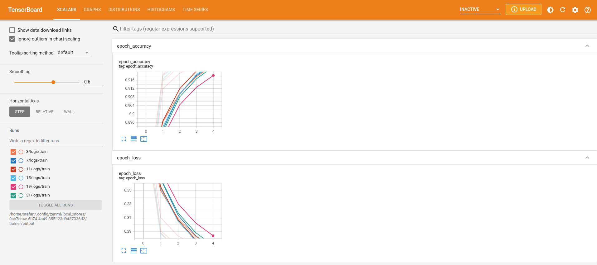
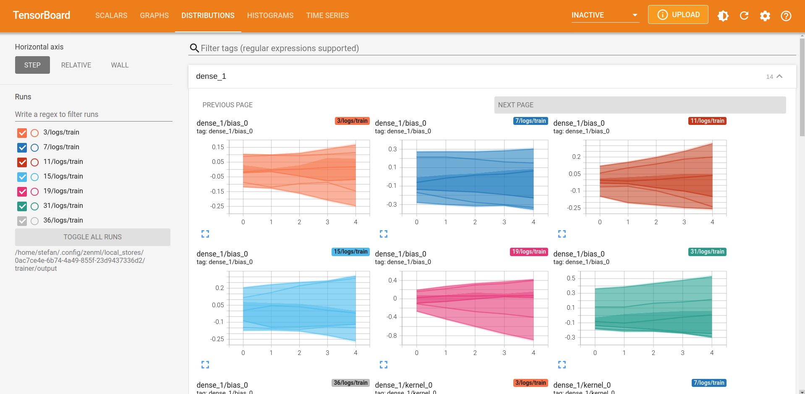
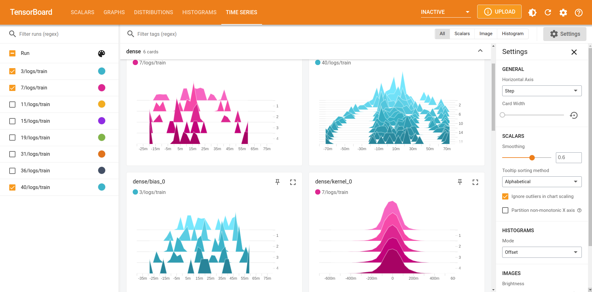
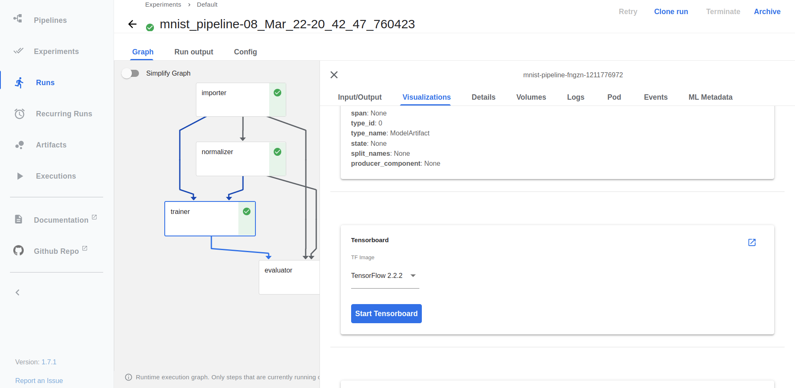
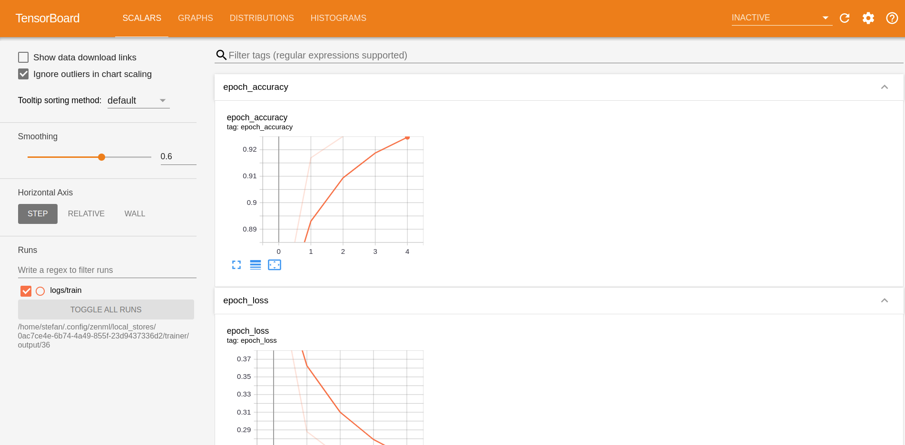

# 🏃 Run pipelines in production using Kubeflow Pipelines

When developing ML models, you probably develop your pipelines on your local
machine initially as this allows for quicker iteration and debugging. However,
at a certain point when you are finished with its design, you might want to 
transition to a more production-ready setting and deploy the pipeline to a more
robust environment.

You can also watch a video of this example [here](https://www.youtube.com/watch?v=b5TXRYkdL3w).

# 🖥 Run it locally

## 👣 Step-by-Step

### 📄 Prerequisites

In order to run this example, we have to install a few tools that allow ZenML to
spin up a local Kubeflow Pipelines 
setup:

* [K3D](https://k3d.io/v5.2.1/#installation) to spin up a local Kubernetes
cluster
* The Kubernetes command-line tool [Kubectl](https://kubernetes.io/docs/tasks/tools/#kubectl)
to deploy Kubeflow Pipelines
* [Docker](https://docs.docker.com/get-docker/) to build docker images that run
your pipeline in Kubernetes pods (**Note**: the local Kubeflow Pipelines
deployment requires more than 2 GB of RAM, so if you're using Docker Desktop
make sure to update the resource limits in the preferences)
* [Terraform](https://www.terraform.io/downloads.html) to deploy a local Kubernetes
cluster using K3D and install Kubeflow Pipelines on it.


Next, we will install ZenML, get the code for this example and initialize a
ZenML repository:

```bash
# Install python dependencies
pip install "zenml[server]"
pip install notebook  # if you want to run the example on the notebook

# Install ZenML integrations
zenml integration install kubeflow tensorflow tensorboard

# Pull the kubeflow example
zenml example pull kubeflow_pipelines_orchestration
cd zenml_examples/kubeflow_pipelines_orchestration

# Initialize a ZenML repository
zenml init

# Start the ZenServer to enable dashboard access
zenml up
```

## 📓 Use the notebook 
As an alternate to running the below commands, you can also simply use the notebook version and see the story unfold there:

```shell
jupyter notebook
```

Otherwise, please continue reading if you want to run it straight in Python scripts.

## 🏃 Run the pipeline **without** kubeflow pipelines

We can now run the pipeline by simply executing the python script:

```bash
python run.py
```

The script will run the pipeline locally and will start a TensorBoard
server that can be accessed to visualize the information for the trained model.

Re-running the example with different hyperparameter values will re-train
the model and the TensorBoard server will be updated automatically to include
the new model information, e.g.:

```shell
python run.py --lr=0.02
python run.py --epochs=10
```





### 🧽 Clean up

Once you're done experimenting, you can stop the TensorBoard server running
in the background by running the command below. However, you may want to keep
it running if you want to continue on to the next step and run the same
pipeline on a local Kubeflow Pipelines deployment.

```bash
python run.py --stop-tensorboard
```

## 🏃️ Use Kubeflow Pipelines on a local K3D cluster with ZenML Stack Recipes

As ZenML continued to expand, we found that supporting more and more 
orchestration tools, model deployment platforms, and other technologies that 
require a Kubernetes cluster to operate, can be complex and prone to errors. 
To simplify this process, we introduced the concept of **[stack recipes](https://docs.zenml.io/advanced-guide/practical-mlops/stack-recipes)**. 
A stack recipe is a pre-configured collection of orchestrators, artifact-stores,
and container registries that work together seamlessly. This allows you to 
quickly spin up a Kubernetes cluster and install all the necessary tools to run 
your pipeline with just a few commands, and support all three major 
cloud providers (AWS, GCP, and Azure).

### 🥞 Let's cook up a Local Kubeflow stack recipe

To run the pipeline on a local Kubeflow Pipelines deployment, you can use the
ZenML Stack recipes to spin up a local Kubernetes cluster and install Kubeflow
Pipelines on it. The stack recipe is called `k3d-modular` and is available in the ZenML
[stack recipe repository](https://github.com/zenml-io/mlops-stacks/tree/main/k3d-modular).
The recipe is modular, meaning that you can configured it to use different
orchestrators, Model Deployers, and other tools. By default, the recipe will
install the following tools:

* The **Minio Artifact Store** as a remote alternative to the local file system
for storing artifacts, the Minio server is deployed as a Kubernetes pod.
* The docker images that are created to run your pipeline are stored in a local
docker **Container Registry**.
* The **Kubeflow Orchestrator** is responsible for running your ZenML pipeline
in Kubeflow Pipelines.
* The **MLFlow Experiment Tracker** is used to track the experiments and
metrics of your pipeline runs. The MLFlow server is deployed as a Kubernetes
pod.

```bash
zenml stack recipe deploy k3d-modular
```
>**Note**:
> This recipe comes with MLflow, Kubeflow and Minio enabled by default. If you want any other components like KServe, Seldon or Tekton, you can specify that using the `--install/-i` flag.

#### 🏁 Deploy the stack using ZenML CLI

The flow to get started for this example can be the following:

1. Pull the `k3d-modular` recipe to your local system. Learn more about what 
this recipe does from its [README](https://github.com/zenml-io/mlops-stacks/blob/main/k3d-modular/README.md).

```shell
zenml stack recipe pull k3d-modular
```

2. (Optional) 🎨 Customize your deployment by editing the default values in the `locals.tf` file.

3. Deploy the stack using the ZenML CLI:

```shell
zenml stack recipe deploy k3d-modular -i kubeflow -i minio --no-server
```

> **Note**
    > This command can also automatically import the resources created as a ZenML stack for you. Just run it with the `--import` flag and optionally provide a `--stack-name` and you're set! Keep in mind, in that case, you'll need all integrations for this example installed before you run this command.


4. You'll notice that a ZenML stack configuration file gets created 🤯! You can run the following command to import the resources as a ZenML stack, manually.

```shell
zenml stack import <STACK_NAME> -f <PATH_TO_THE_CREATED_STACK_CONFIG_YAML>

# set the imported stack as the active stack
zenml stack set <STACK_NAME>
```

5. Get the endpoints of the deployed services UIs:

```shell
kubectl get ingress -A  -o jsonpath='{.items[*].spec.rules[*].host}'

# Output:
kubeflow.<EXTERNAL-IP>.nip.io mlflow.<EXTERNAL-IP>.nip.io minio-console.<EXTERNAL-IP>.nip.io
```

#### ⛽️ Deploy individual stack components using ZenML CLI

As an alternative to deploying the entire stack, you can also deploy individual
components using the `zenml <STACK_COMPONENT> deploy` command. As an
illustration, the Kubeflow orchestrator could be deployed in the following way:

```shell
zenml orchestrator deploy kubeflow --flavor kubeflow ...
```

For more information on this `deploy`
subcommand, please refer to the
[documentation](https://docs.zenml.io/advanced-guide/practical-mlops/stack-recipes#deploying-stack-components-directly).

### ▶️ Run the pipeline
We can now run the pipeline by simply executing the python script:

```bash
python run.py
```

This will build a docker image containing all the necessary python packages and
files, push it to the local container registry and schedule a pipeline run in
Kubeflow Pipelines. Once the script is finished, you should be able to see the
pipeline run in the Kubeflow Pipelines UI:

```bash
# Get the Kubeflow Pipelines UI endpoint
kubectl get ingress -n kubeflow  -o jsonpath='{.items[0].spec.rules[0].host}'
```

The TensorBoard logs for the model trained in every pipeline run can be viewed
directly in the Kubeflow Pipelines UI by clicking on the "Visualization" tab
and then clicking on the "Open TensorBoard" button.




At the same time, the script will start a local TensorBoard server that can be
accessed to visualize the information for all past and future versions of the
trained model.

Re-running the example with different hyperparameter values will re-train
the model and the TensorBoard server will be updated automatically to include
the new model information, e.g.:

```shell
python run.py --learning_rate=0.02
python run.py --epochs=10
```

### 🧽 Clean up
Once you're done experimenting, you can stop the TensorBoard server running
in the background with the command:

```bash
python run.py --stop-tensorboard
```

1. 🗑️ Once you're done running your pipelines, there's only a single command 
you need to execute that will take care of cleaning up all the resources 
that you had created on your local machine.

```bash
zenml stack recipe destroy <STACK_RECIPE_NAME>
```

2. (Optional) 🧹 You can also remove all the downloaded recipe files from 
the `pull` execution by using the `clean` command.

```
zenml stack recipe clean
```

## ☁️ Run the same pipeline on Kubeflow Pipelines deployed to GCP

We will now run the same pipeline in Kubeflow Pipelines deployed to a Google 
Kubernetes Engine cluster. As you can see from the long list of additional 
pre-requisites, this requires lots of external setup steps at the moment. 
In future releases ZenML will be able to automate most of these steps for you, 
so make sure to revisit this guide if this is something you're interested in!

### 📄 Additional pre-requisites

* A remote ZenML deployment to store metadata related to your pipeline runs. 
See [here](https://docs.zenml.io/getting-started/deploying-zenml) for more 
information on how to deploy ZenML on GCP.
* Kubectl can [access](https://cloud.google.com/kubernetes-engine/docs/how-to/cluster-access-for-kubectl) 
your GCP Kubernetes cluster.
* An existing [GCP container registry](https://cloud.google.com/container-registry/docs).
* An existing [GCP bucket](https://cloud.google.com/storage/docs/creating-buckets).
* [Kubeflow Pipelines](https://www.kubeflow.org/docs/distributions/gke/deploy/overview/) 
deployed to a Google Kubernetes Engine cluster.
* The local docker client has to be [authorized](https://cloud.google.com/container-registry/docs/advanced-authentication) 
to access the GCP container registry.

### 🥞 Create a GCP Kubeflow Pipelines stack

To run our pipeline on Kubeflow Pipelines deployed to GCP, we will create a new 
stack with these components:

* The **artifact store** stores step outputs in a GCP Bucket. 
* The docker images that are created to run your pipeline are stored in GCP 
**container registry**.
* The **Kubeflow orchestrator** is responsible for running your ZenML pipeline 
in Kubeflow Pipelines. We need to configure it with the right kubernetes 
* context so ZenML can run pipelines in your GCP cluster.
* Kubectl can [access](https://cloud.google.com/kubernetes-engine/docs/how-to/cluster-access-for-kubectl) 
your GCP Kubernetes cluster.
* An ***Image Builder** component that is responsible for building Docker images
for your pipeline steps. We need to configure it with the right container
registry so ZenML can push the images to your GCP container registry.

### Manually setting up the stack

You can also choose to register your stack and components manually by running
the commands below. When doing so, make sure to replace 
`<PATH_TO_YOUR_CONTAINER_REGISTRY>` and `<PATH_TO_YOUR_GCP_BUCKET>` with the 
actual URIs of your container registry and bucket. You will also need to replace
`<NAME_OF_GCP_KUBERNETES_CONTEXT>` with the kubernetes context pointing to 
your gcp cluster.

```bash
# In order to create the GCP artifact store, we need to install one additional ZenML integration:
zenml integration install gcp

# Create and activate the stack and its components
zenml container-registry register gcr_registry --flavor=gcp --uri=<PATH_TO_YOUR_CONTAINER_REGISTRY>
zenml artifact-store register gcp_artifact_store --flavor=gcp --path=<PATH_TO_YOUR_GCP_BUCKET>
zenml orchestrator register gcp_kubeflow_orchestrator --flavor=kubeflow --kubernetes_context=<NAME_OF_GCP_KUBERNETES_CONTEXT>
zenml image-builder register local_builder --flavor=local
zenml stack register gcp_kubeflow_stack \
    -a gcp_artifact_store \
    -o gcp_kubeflow_orchestrator \
    -c gcr_registry \
    -i local_builder \
    --set

```

### Setting up the stack using a recipe

Alternatively, you can also use the `zenml stack recipe` command to create the
stack and its components. Just as the local k3d stack, the GCP Kubeflow stack
recipe is also available in the ZenML repository. You can pull it using the
following command:

```bash
zenml stack recipe pull gcp_kubeflow_stack
```

You can follow the same steps as above to create and activate the stack and its
components:

Deploy the stack using the ZenML CLI:

```shell
zenml stack recipe deploy gcp_kubeflow_stack
```

> **Note**
    > This command can also automatically import the resources created as a ZenML stack for you. Just run it with the `--import` flag and optionally provide a `--stack-name` and you're set! Keep in mind, in that case, you'll need all integrations for this example installed before you run this command.


You can run the following command to import the resources as a ZenML stack, manually.

```shell
zenml stack import <STACK_NAME> -f <PATH_TO_THE_CREATED_STACK_CONFIG_YAML>

# set the imported stack as the active stack
zenml stack set <STACK_NAME>
```

### ▶️ Run the pipeline

Configuring and activating the new stack is all that's necessary to switch from running your pipelines locally 
to running them on GCP:

```bash
python run.py
```

That's it! If everything went as planned this pipeline should now be running in the cloud, and we are one step 
closer to a production pipeline!

### 💻 Specifying per-step resources

If you're using the Kubeflow orchestrator and some of your pipelines steps have certain
hardware requirements, you can specify them using the step decorator as follows:

```python
from zenml import step
from zenml.steps import ResourceSettings

@step(settings={"resources": ResourceSettings(cpu_count=8, memory="16GB")})
def my_step(...) -> ...:
    ...
```

This will make sure that your step runs on a machine with the specified resources as long
as such a machine is available in the Kubernetes cluster you're using.

### 🧽 Clean up
Once you're done experimenting, delete the example files by calling:

```bash
rm -rf zenml_examples
```

If you have created the GCP Kubeflow stack using the recipe, you can delete it using the following command:

```bash
zenml stack recipe destroy gcp_kubeflow_stack
```

To destroy any resources deployed using the ZenML `deploy` subcommand, use the
`destroy` subcommand to delete each individual stack component, as in the
following example:

```shell
# replace with the name of the component you want to destroy
zenml artifact-store destroy s3_artifact_store
```

# ⚠️ Important note for multi-tenant Kubeflow deployments

Kubeflow has a notion of [multi-tenancy](https://www.kubeflow.org/docs/components/multi-tenancy/overview/) 
built into its deployment. Kubeflow’s multi-user isolation simplifies user 
operations because each user only views and edits the Kubeflow components 
and model artifacts defined in their configuration.

Using a multi-tenant deployment of Kubeflow involves a bit more configuration than is shown in this example.
For details, refer to the [Kubeflow stack component docs](https://docs.zenml.io/component-gallery/orchestrators/kubeflow).

# 📜 Learn more

Our docs regarding the Kubeflow orchestrator integration can be found [here](https://docs.zenml.io/component-gallery/orchestrators/kubeflow).

If you want to learn more about orchestrators in general or about how to build your own orchestrators in ZenML
check out our [docs](https://docs.zenml.io/component-gallery/orchestrators/custom).
