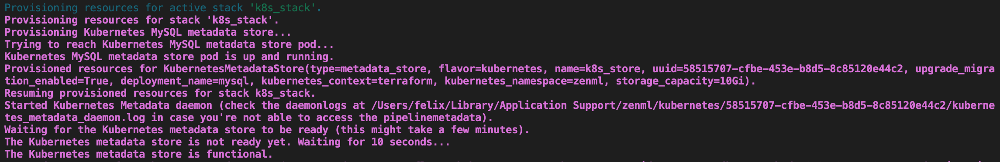
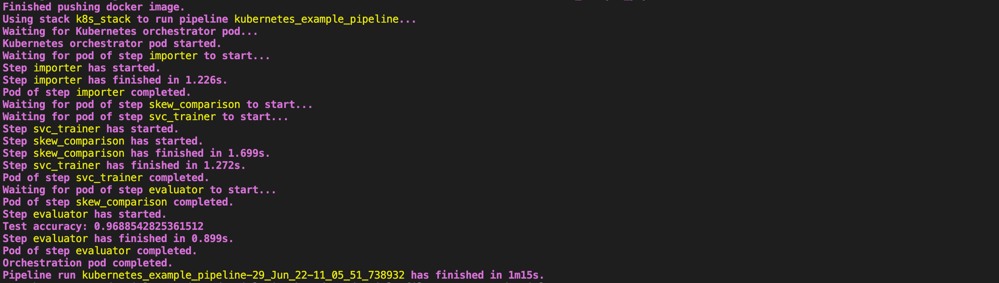
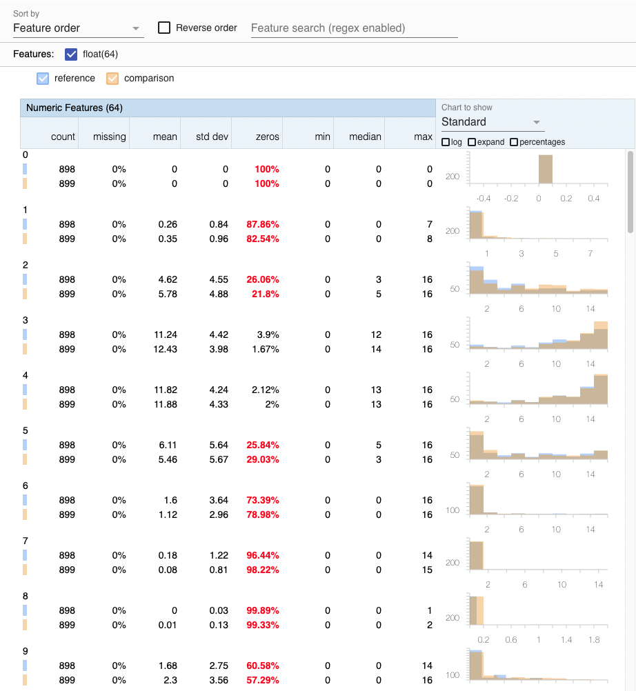
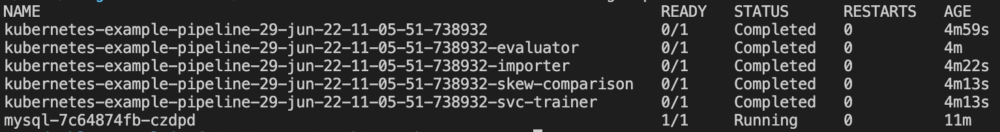

# :dango: Pipeline Orchestration on Kubernetes

Using the ZenML `kubernetes` integration, you can orchestrate and scale your
ML pipelines on Kubernetes without writing a single line of Kubernetes code.

This Kubernetes-native orchestrator is a minimalist, lightweight alternative 
to other distributed orchestrators like Airflow or Kubeflow.

Overall, the Kubernetes orchestrator is quite similar to the Kubeflow
orchestrator in that it runs each pipeline step in a separate
Kubernetes pod. However, the orchestration of the different pods is not done
by Kubeflow but by a separate master pod that orchestrates the step execution
via topological sort.

Compared to Kubeflow, this means that the Kubernetes-native orchestrator is
faster and much simpler to start with since you do not need to install 
and maintain Kubeflow on your cluster.
The Kubernetes-native orchestrator is an ideal choice for teams new to 
distributed orchestration that do not want to go with a fully-managed offering.

However, since Kubeflow is much more mature, you should, in most cases, aim to
move your pipelines to Kubeflow in the long run.
A smooth way to production-grade orchestration could be to set up a Kubernetes
cluster first and get started with the Kubernetes-native orchestrator.
If needed, you can then install and set up Kubeflow later and simply switch out
the orchestrator of your stack as soon as your full setup is ready.

In this example, we will build a simple, four-step pipeline and orchestrate it
in a Kubernetes cluster running in the cloud.
To do so, we will use an AWS cloud stack, consisting of an EKS cluster,
an ECR container registry, and a S3 bucket for artifact storage.


## :heavy_check_mark: Requirements

If you want to follow this example line by line, you need to spin up each of
the corresponding AWS resources first.
You can provision these resources manually by following the
[ZenML cloud guide](../../docs/book/stack-deployment-guide/overview.md).
For detailed instructions, see our
[Kubernetes orchestrator blog post](https://blog.zenml.io/k8s-orchestrator/).

Regardless of your cloud provider choice, you will also need to have the
following additional software installed on your local machine:

* [Docker](https://www.docker.com/)
* [kubectl](https://kubernetes.io/docs/tasks/tools/)
* [AWS CLI](https://docs.aws.amazon.com/cli/latest/userguide/getting-started-install.html)

Alternatively, you can also use any other cloud provider, spin up the
respective resources there, and adjust all `zenml ... register` commands below
accordingly.

### 🚅 That seems like a lot of infrastructure work. Is there a Zen 🧘 way to run this example?

Yes! With [ZenML Stack Recipes](../../docs/book/stack-deployment-guide/stack-recipes.md), you can now provision all the infrastructure you need to run your ZenML pipelines with just a few simple commands.

The flow to get started for this example can be the following:

1. Pull the `aws_minimal` recipe to your local system. Learn more about what this recipe does from its README.

    ```shell
    zenml stack recipe pull aws_minimal
    ```
2. (Optional) 🎨 Customize your deployment by editing the default values in the `locals.tf` file.

3. 🚀 Deploy the recipe with this simple command.

    ```shell
    zenml stack recipe deploy aws_minimal
    ```
    > **Note**
    > This command can also automatically import the resources created as a ZenML stack for you. Just run it with the `--import` flag and optionally provide a `--stack-name` and you're set! Keep in mind, in that case, you'll need all integrations for this example installed before you run this command.

    > **Note**
    > You should also have [kubectl](https://kubernetes.io/docs/tasks/tools/#kubectl) and [docker](https://docs.docker.com/engine/install/) installed on your local system with the local [docker client authorized](https://cloud.google.com/sdk/gcloud/reference/auth/configure-docker) to push to your cloud registry.
    
4. You'll notice that a ZenML stack configuration file gets created 🤯! You can run the following command to import the resources as a ZenML stack, manually. You either need to have the `aws`, `mlflow` and `seldon` integrations installed before importing the stack or you can go into the YAML file and delete the sections on the `experiment_tracker` and `model_deployer` to not have them importer at all.

    ```shell
    zenml stack import <STACK_NAME> -f <PATH_TO_THE_CREATED_STACK_CONFIG_YAML>

    # set the imported stack as the active stack
    zenml stack set <STACK_NAME>
    ```

5. You should now create a secret for the RDS MySQL instance that will allow ZenML to connect to it. Use the following command:

    ```bash
    zenml secret register aws_rds_secret \
        --schema=mysql \
        --user=<user> \
        --password=<password>
    ```

    The values for the username and password can be obtained by running the following commands inside your recipe directory.

    ```bash
    terraform output metadata-db-username

    terraform output metadata-db-password
    ```

You can now jump straight to the [section on running the pipeline](#computer-run-pipeline)!

### Setup and Register Kubernetes Orchestrator
After spinning up your Kubernetes cluster in the cloud, you will first need
to connect it to your local kubectl as a new Kubernetes context.

How to do this depends on your cloud provider. For AWS EKS, you can do the
following:

```bash
aws eks --region <AWS_REGION> update-kubeconfig
    --name <AWS_EKS_CLUSTER>
    --alias <KUBE_CONTEXT>
```

**Note:** It does not matter what you use as `KUBE_CONTEXT` here, as long as it
is a unique name.

Next, register your Kubernetes orchestrator with the respective Kubernetes 
context:

```bash
zenml orchestrator register k8s_orchestrator
    --flavor=kubernetes
    --kubernetes_context=<KUBE_CONTEXT>
    --kubernetes_namespace=zenml
    --synchronous=True
```

### Setup and Register Metadata Store

If you want to store your metadata locally within the Kubernetes cluster, you
can use the `KubernetesMetadataStore`, which automatically spins up a MySQL 
deployment in your cluster if you call `zenml stack up`.

We can register this metadata store as follows:

```bash
zenml metadata-store register k8s_store 
    --flavor=kubernetes
    --kubernetes_context==<KUBE_CONTEXT>
    --kubernetes_namespace=zenml
    --deployment_name=mysql
```

### Register Container Registry
Next, we need to register a container registry where the Docker images for all
Kubernetes pods will be stored.

To do so, we first need to authorize our local Docker to access the registry.
This is again specific to your cloud provider. 
For Amazon ECR, you could do the following:

```bash
aws ecr get-login-password --region <AWS_REGION> | docker login 
    --username AWS 
    --password-stdin 
    <ECR_REGISTRY_NAME>
```

Now we can register the container registry like this:

```bash
zenml container-registry register ecr_registry 
    --flavor=default 
    --uri=<ECR_REGISTRY_NAME>
```

### Setup Artifact Store
Lastly, we also need to register a remote artifact store (e.g. Amazon S3):

```bash
zenml artifact-store register s3_store 
    --flavor=s3 
    --path=<REMOTE_ARTIFACT_STORE_PATH>
```

### Register and Spin Up Stack

Finally, let us bring everything together and register our stack:

```bash
zenml stack register k8s_stack 
    -m k8s_store 
    -a s3_store 
    -o k8s_orchestrator 
    -c ecr_registry
```

Let's set this stack as active, so we use it by default for the remainder of
this example:

```bash
zenml stack set k8s_stack
```

Next, provision and start the metadata store with the following command:

```bash
zenml stack up
```

This will also create a connection from your local machine to the metadata
store so that you can access it locally.
If everything went well, you should see log messages similar to the following
in your terminal:



## :computer: Run Pipeline
Now that our stack is set up, all of our ML code will automatically be executed
on the Kubernetes cluster in the cloud. Let's run the example pipeline:

```bash
python run.py
```

If all went well, you should now see the logs of all Kubernetes pods in your
terminal, similar to what is shown below.



Additionally, a window should have opened in your local browser where you can
see a training-serving skew analysis in Facets like the following:



When running `kubectl get pods -n zenml`, you should now also be able to see
that a pod was created in your cluster for each pipeline step:



### Interacting with pods via kubectl

For debugging, it can sometimes be handy to interact with the Kubernetes pods
directly via kubectl. 
To make this easier, we have added the following labels to all pods:
- `run`: the name of the ZenML run.
- `pipeline`: the name of the ZenML pipeline associated with this run.

E.g., you can use these labels to get a list of all pods related to the 
pipeline used in this example by running the following:

```
kubectl get pods -n zenml -l pipeline=kubernetes_example_pipeline
```

## :sponge: Clean Up

### Delete Run Pods
If you just want to delete the pods created by the example run, execute the
following command:

```bash
kubectl delete pod -n zenml -l pipeline=kubernetes_example_pipeline
```

### Deprovision Stack

**WARNING**: This will permanently delete your metadata store, so all metadata
will be lost. Never do this for production settings!

If you also want to delete the MySQL metadata store, run:

```bash
zenml stack down --force
```

### Delete Infrastructure Resources
Lastly, if needed, spin down the infrastructure you created.
How to do this depends on which cloud provider you were using to run this
example.

If you have used our Terraform script to spin up the resources, simply run

```bash
terraform destroy
```