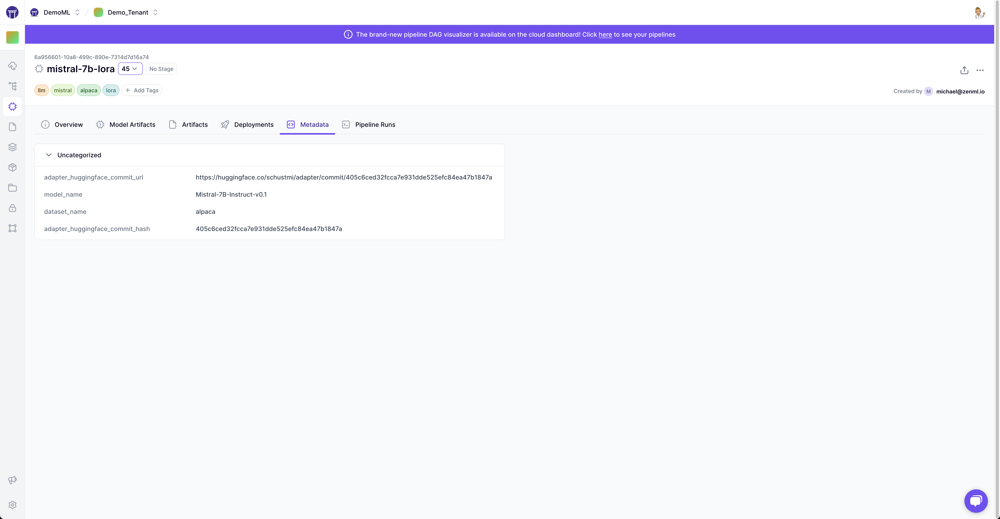
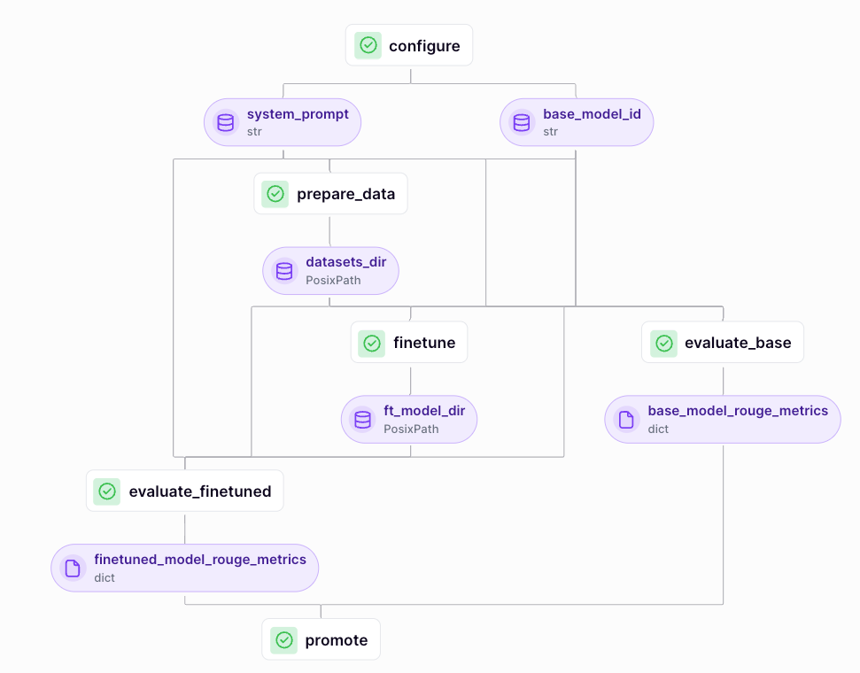

# ☮️ Fine-tuning open source LLMs using MLOps pipelines with PEFT

Welcome to your newly generated "ZenML LLM PEFT Finetuning project" project! This is
a great way to get hands-on with ZenML using production-like template. 
The project contains a collection of ZenML steps, pipelines and other artifacts
and useful resources that can serve as a solid starting point for finetuning open-source LLMs using ZenML.

Using these pipelines, we can run the data-preparation and model finetuning with a single command while using YAML files for [configuration](https://docs.zenml.io/user-guide/production-guide/configure-pipeline) and letting ZenML take care of tracking our metadata and [containerizing our pipelines](https://docs.zenml.io/how-to/customize-docker-builds).

<div align="center">
  <br/>
    <a href="https://cloud.zenml.io">
      
    </a>
  <br/>
</div>

## 🌎 Inspiration and Credit

This project heavily relies on the [PEFT project](https://huggingface.co/docs/peft/en/index) by the amazing people at Hugging Face and the [`microsoft/phi-2`](https://huggingface.co/microsoft/phi-2) model from the amazing people at microsoft.

## 🏃 How to run

In this project, we provide a predefined configuration file to finetune models on the [gem/viggo](https://huggingface.co/datasets/gem/viggo) dataset. Before we're able to run any pipeline, we need to set up our environment as follows:

```bash
# Set up a Python virtual environment, if you haven't already
python3 -m venv .venv
source .venv/bin/activate

# Install requirements
pip install -r requirements.txt
```

### 👷 Combined feature engineering and finetuning pipeline

The easiest way to get started with just a single command is to run the finetuning pipeline with the `orchestrator_finetune.yaml` configuration file, which will do data preparation, model finetuning, evaluation with [Rouge](https://huggingface.co/spaces/evaluate-metric/rouge) and promotion:

```shell
python run.py --config orchestrator_finetune.yaml
```

When running the pipeline like this, the trained model will be stored in the ZenML artifact store.

<div align="center">
  <br/>
    <a href="https://cloud.zenml.io">
      
    </a>
  <br/>
</div>

## ☁️ Running with a step operator in the stack

To finetune an LLM on remote infrastructure, you can either use a remote orchestrator or a remote step operator. Follow these steps to set up a complete remote stack:
- Register the [orchestrator](https://docs.zenml.io/stack-components/orchestrators) (or [step operator](https://docs.zenml.io/stack-components/step-operators)) and make sure to configure it in a way so that the finetuning step has access to a GPU with at least 24GB of VRAM. Check out our docs for more [details](https://docs.zenml.io/stack-components/component-guide).
    - To access GPUs with this amount of VRAM, you might need to increase your GPU quota ([AWS](https://docs.aws.amazon.com/servicequotas/latest/userguide/request-quota-increase.html), [GCP](https://console.cloud.google.com/iam-admin/quotas), [Azure](https://learn.microsoft.com/en-us/azure/machine-learning/how-to-manage-quotas?view=azureml-api-2#request-quota-and-limit-increases)).
    - The GPU instance that your finetuning will be running on will have CUDA drivers of a specific version installed. If that CUDA version is not compatible with the one provided by the default Docker image of the finetuning pipeline, you will need to modify it in the configuration file. See [here](https://hub.docker.com/r/pytorch/pytorch/tags) for a list of available PyTorch images.
- Register a remote [artifact store](https://docs.zenml.io/stack-components/artifact-stores) and [container registry](https://docs.zenml.io/stack-components/container-registries).
- Register a stack with all these components
    ```shell
    zenml stack register llm-finetuning-stack -o <ORCHESTRATOR_NAME> \
        -a <ARTIFACT_STORE_NAME> \
        -c <CONTAINER_REGISTRY_NAME> \
        [-s <STEP_OPERATOR_NAME>]
    ```

## 🗂️ Bring Your Own Data

To fine-tune an LLM using your own datasets, consider adjusting the [`prepare_data` step](steps/prepare_datasets.py) to match your needs:
- This step loads, tokenizes, and stores the dataset from an external source to the artifact store defined in the ZenML Stack.
- The dataset can be loaded from Hugging Face by adjusting the `dataset_name` parameter in the configuration file. By default, the step code expects the dataset to have at least three splits: `train`, `validation`, and `test`. If your dataset uses different split naming, you'll need to make the necessary adjustments.
- If you want to retrieve the dataset from other sources, you'll need to create the relevant code and prepare the splits in a Hugging Face dataset format for further processing.
- Tokenization occurs in the utility function [`generate_and_tokenize_prompt`](utils/tokenizer.py). It has a default way of formatting the inputs before passing them into the model. If this default logic doesn't fit your use case, you'll also need to adjust this function.
- The return value is the path to the stored datasets (by default, `train`, `val`, and `test_raw` splits). Note: The test set is not tokenized here and will be tokenized later during evaluation.

## 📜 Project Structure

The project loosely follows [the recommended ZenML project structure](https://docs.zenml.io/how-to/setting-up-a-project-repository/best-practices):

```
.
├── configs                         # pipeline configuration files
│   ├── orchestrator_finetune.yaml  # default local or remote orchestrator
│   └── remote_finetune.yaml        # default step operator configuration
├── materializers
│   └── directory_materializer.py   # custom materializer to push whole directories to the artifact store and back
├── pipelines                       # `zenml.pipeline` implementations
│   └── train.py                    # Finetuning and evaluation pipeline
├── steps                           # logically grouped `zenml.steps` implementations
│   ├── evaluate_model.py           # evaluate base and finetuned models using Rouge metrics
│   ├── finetune.py                 # finetune the base model
│   ├── prepare_datasets.py         # load and tokenize dataset
│   └── promote.py                  # promote good models to target environment
├── utils                           # utility functions
│   ├── callbacks.py                # custom callbacks
│   ├── cuda.py                     # helpers for CUDA
│   ├── loaders.py                  # loaders for models and data
│   ├── logging.py                  # logging helpers
│   └── tokenizer.py                # load and tokenize
├── .dockerignore
├── README.md                       # this file
├── requirements.txt                # extra Python dependencies 
└── run.py                          # CLI tool to run pipelines on ZenML Stack
```
