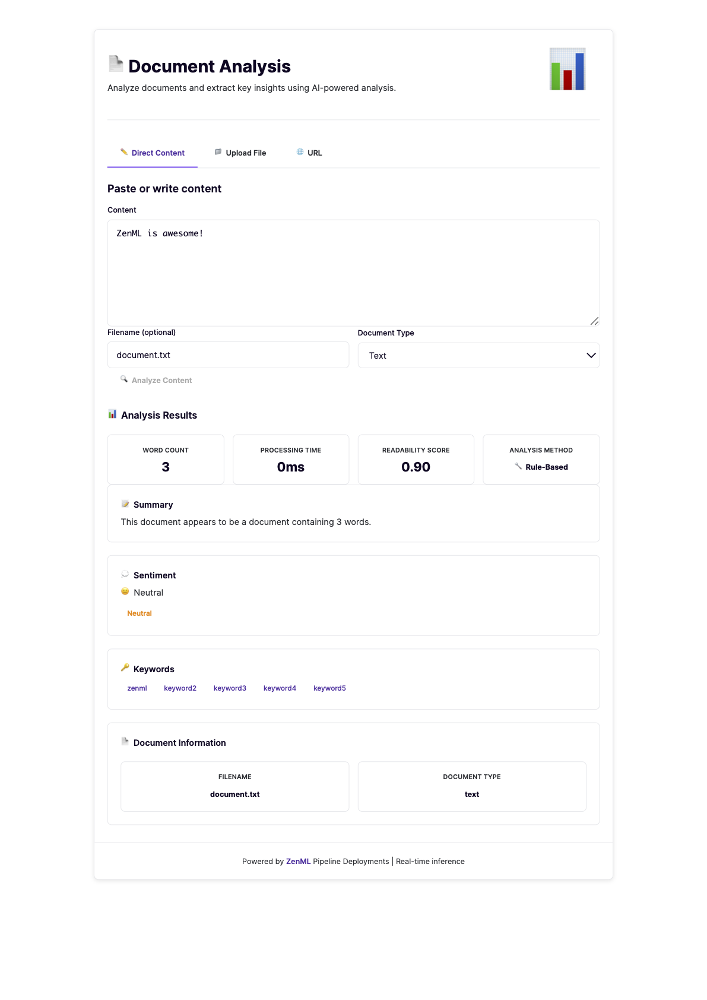

# Deploying Agents with ZenML: Document Analysis Pipeline

This example shows how to build and deploy a minimal **LLM-powered document analysis** agentic workflow as a **production HTTP endpoint** using ZenML. You'll get structured insights (summary, keywords, sentiment, readability) from text-like inputs via an interactive web UI built directly into your deployment.

## 🎯 What You'll Build

A [deployed ZenML pipeline](https://docs.zenml.io/concepts/deployment) with an embedded frontend application that:

- **Ingests text** from direct input, file uploads, or URLs (HTML is lightly cleaned)
- **Extracts structured insights**: summary, top keywords, sentiment, readability score
- **Runs online or offline**: uses OpenAI if `OPENAI_API_KEY` is set, otherwise a rule-based fallback
- **Surfaces metrics**: word count, latency, analysis method (AI or Rule-Based)
- **Provides interactive UI**: modern web interface embedded in the deployment
- **Returns an HTML report** for the ZenML dashboard.

The deployed pipeline application looks like this:



## 🚀 Get Started

### Prerequisites

```bash
pip install "zenml[server]"
export OPENAI_API_KEY=sk-xxx   # Optional: if absent, the pipeline falls back to a deterministic analyzer
````

### Setup

```bash
git clone --depth 1 https://github.com/zenml-io/zenml.git
cd zenml/examples/minimal_agent_production
pip install -r requirements.txt
zenml init
zenml login
```

### Phase 1: Deploy the Analysis Pipeline

Deploy the pipeline as a managed HTTP endpoint:

```bash
zenml pipeline deploy pipelines.doc_analyzer.doc_analyzer
```

Find your endpoint URL:

```bash
zenml deployment describe doc_analyzer
```

### Phase 2: Analyze a Document

#### Use the ZenML CLI

```bash
zenml deployment invoke doc_analyzer \
  --content="Artificial Intelligence is transforming how we work..." \
  --filename="ai-overview.txt" \
  --document_type="text"
```

#### Call the HTTP endpoint directly

If you prefer `curl`/`requests`, send a JSON body with **parameters**:

```bash
ENDPOINT=http://localhost:8000   # replace with your deployment URL
curl -X POST "$ENDPOINT/invoke" \
  -H "Content-Type: application/json" \
  -d '{
    "parameters": {
      "content": "Your text here...",
      "filename": "document.txt",
      "document_type": "text"
    }
  }'
```

If your deployment requires auth, include:

```bash
-H "Authorization: Bearer <YOUR_KEY>"
```

### Phase 3: Use the Web Interface

Visit the interactive UI at your deployment URL:

```
http://localhost:8000
```

The UI provides:
- **Direct Content Tab**: Paste or write content directly in the interface
- **Upload File Tab**: Upload text files, markdown, code, or HTML documents
- **URL Tab**: Provide a URL to analyze web pages or remote documents

Select the input method, review your content, and click the analyze button to get insights.

## 🤖 How It Works

The pipeline orchestrates three steps:

```python
@pipeline(settings={"docker": docker_settings}, enable_cache=False)
def doc_analyzer(content=None, url=None, path=None, filename=None, document_type="text"):
    document = ingest_document_step(content, url, path, filename, document_type)
    analysis = analyze_document_step(document)          # OpenAI or deterministic fallback
    render_analysis_report_step(analysis)               # HTML report for the dashboard
    return analysis
```

* **LLM path**: When `OPENAI_API_KEY` is present, `analyze_document_step` calls OpenAI chat completions and parses a structured JSON response.
* **Fallback path**: A rule‑based analyzer produces a summary, keywords, and readability without external calls.

## 🌐 Embedded Web UI

The example includes a modern, responsive SPA (Single Page Application) that is automatically embedded in your deployment. Key features:

- **Multi-tab interface**: Direct content input, file upload, or URL analysis
- **Real-time feedback**: Loading states and clear error messages
- **Metrics display**: Word count, processing time, readability score, analysis method
- **Rich results**: Summary, sentiment analysis, keyword extraction, document metadata
- **Responsive design**: Works seamlessly on desktop and mobile devices
- **Zero configuration**: Automatically served at your deployment URL

The UI is defined in `ui/index.html` and configured via the `DeploymentSettings` in the pipeline. ZenML automatically serves this interface alongside your API endpoint.

## 🔧 Production Notes

The pipeline comes pre-configured with Docker and deployment settings in `pipelines/doc_analyzer.py`:

```python
docker_settings = DockerSettings(
    requirements="requirements.txt",
    environment={"OPENAI_API_KEY": "${OPENAI_API_KEY}"},
)

deployment_settings = DeploymentSettings(
    app_title="Document Analysis Pipeline",
    dashboard_files_path="ui",
    cors=CORSConfig(allow_origins=["*"]),
)
```

These settings are automatically applied when you deploy:
- **Docker**: Installs dependencies and passes the OpenAI API key
- **Deployment**: Configures the UI title, serves files from the `ui/` directory, and enables CORS for cross-origin requests

If you need to override settings or add deployer-specific options (like authentication), create a YAML config file:

```yaml
# my_config.yaml (optional)
settings:
  deployer:
    generate_auth_key: true
```

Then deploy with:

```bash
zenml pipeline deploy pipelines.doc_analyzer.doc_analyzer --config my_config.yaml
```

> Scaling & concurrency options vary by orchestrator/deployment target; consult the [ZenML deployment docs](https://docs.zenml.io/how-to/deployment/deployment) for deployment configuration options.

## 📁 Project Structure

```
examples/minimal_agent_production/
├── pipelines/
│   └── doc_analyzer.py          # Pipeline definition with DeploymentSettings
├── steps/
│   ├── analyze.py               # LLM analysis + deterministic fallback
│   ├── ingest.py                # Text/URL/path ingestion
│   ├── render.py                # HTML report renderer
│   ├── utils.py                 # Text cleaning & heuristics
│   └── templates/
│       ├── report.css           # Report styling
│       └── report.html          # Report template
├── ui/
│   └── index.html               # Embedded SPA web interface
├── constants.py                  # Tunables & UI constants
├── models.py                     # Pydantic models for I/O
├── prompts.py                    # LLM prompt builder
└── requirements.txt              # Extra deps (OpenAI)
```

## 🎯 The Big Picture

This is the same **steps → pipeline → artifacts** pattern you use for classic ML, now applied to an LLM workflow. You get deployable endpoints, reproducibility, and dashboard artifacts without building a bespoke web service.

---

**Want to learn more?**

- 📖 [Full ZenML Documentation](https://docs.zenml.io/)
- 🔗 [ZenML Pipelines](https://docs.zenml.io/concepts/steps_and_pipelines)
- 🚀 [Pipeline Deployments](https://docs.zenml.io/concepts/deployment)
- 💬 [Join our Community](https://zenml.io/slack)
- 🏢 [ZenML Pro](https://zenml.io/pro)
