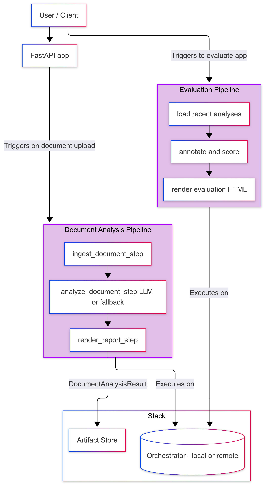
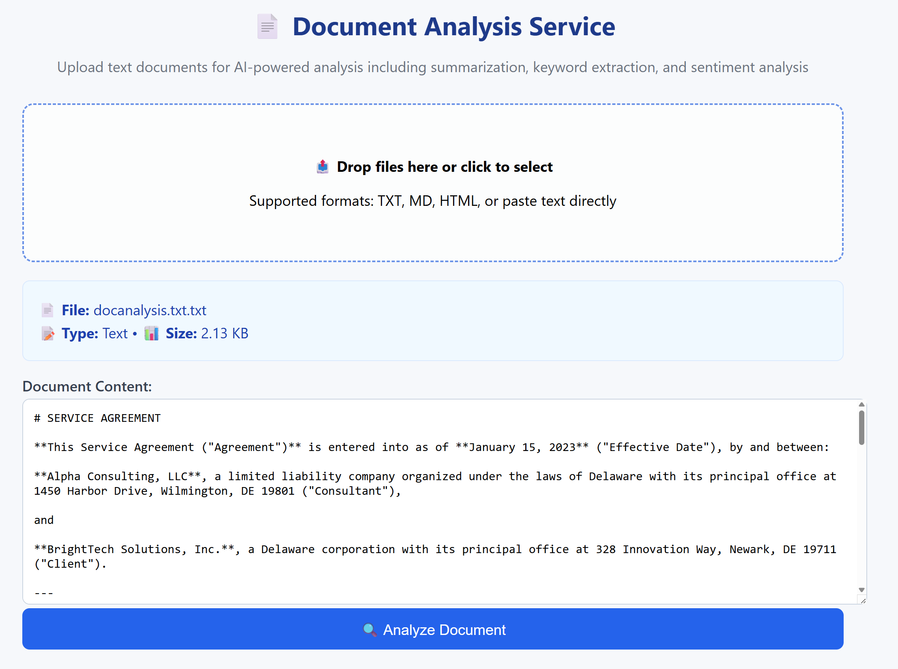
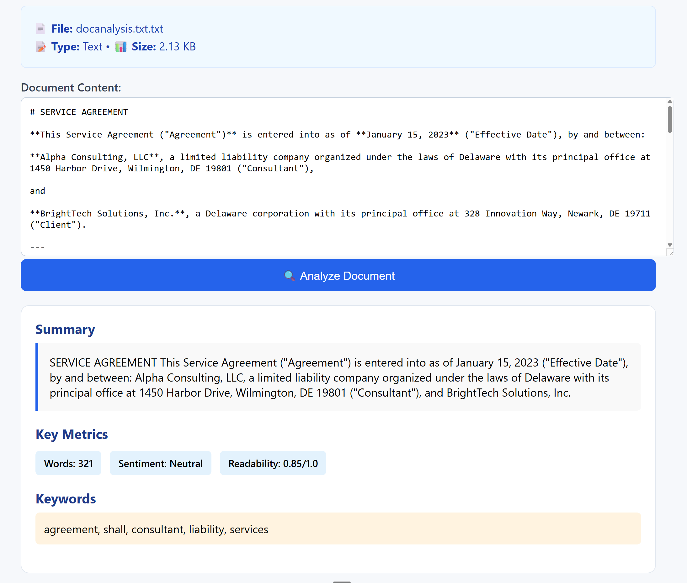
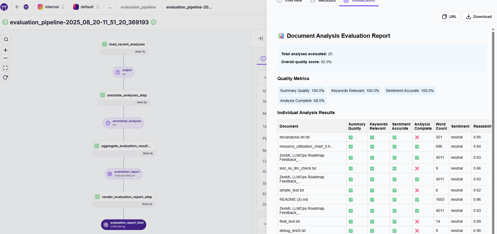
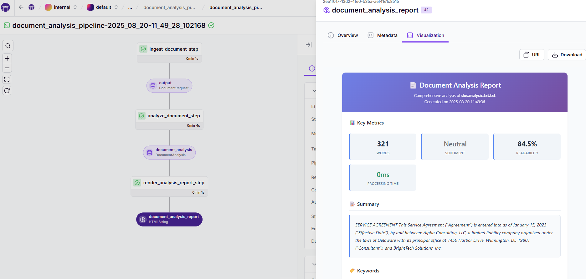

## Document Analysis Pipeline (with Tracing, Annotation, and Evaluation)

This example shows how to:

- Create a document analysis pipeline using ZenML
- Trigger it from a FastAPI app for production usage
- Analyze documents with summarization, keyword extraction, and sentiment analysis
- Capture lightweight traces for every analysis
- Annotate and evaluate past runs with a separate evaluation pipeline

The analysis pipeline is designed for batch processing: it takes document content as input and performs comprehensive analysis including summarization, keyword extraction, sentiment analysis, and readability scoring. It can run with a real LLM (via [LiteLLM](https://github.com/BerriAI/litellm)) if API keys are available, or fall back to deterministic analysis for offline demos.

### Why pipelines (for ML and AI engineers)

- Reproducible & portable: versioned steps and artifacts that run locally or on the cloud without code changes
- Unified for models and agents: the same primitives work for scikit-learn and LLM/agent workflows
- Evaluate & observe by default: step metadata (tokens, latency), lineage, and quality reports are first-class

Modeling agents as pipelines makes non-deterministic systems shippable: prompts, tools, and routing become explicit steps; outputs become versioned artifacts you can evaluate and compare. The same development and production practices you trust for classical ML apply 1:1 to agent workflows.

### Architecture



### What's Included

- **Document Analysis Pipeline**: `document_analysis_pipeline` that processes documents and stores analysis results
- **FastAPI Web App**: `app/main.py` provides a web interface for document upload and analysis
- **Evaluation Pipeline**: loads recent analysis traces, annotates them with quality checks, aggregates metrics, and renders HTML reports
- **Optional LLM Integration**: via LiteLLM for enhanced analysis quality

### Prerequisites

```bash
pip install "zenml[server]"
zenml init
```

Optional for real LLMs and tracing:

```bash
# Use any LiteLLM-supported provider (OpenAI shown as example)
export OPENAI_API_KEY="your-key"

```

### Get the example & install dependencies

If you don't have this repository locally yet:

```bash
git clone --depth 1 https://github.com/zenml-io/zenml.git
cd zenml/examples/minimal_agent_production
```

Then install example dependencies:

```bash
pip install -r requirements.txt
```

### Run the FastAPI app (Document Analysis Service)

```bash
cd examples/minimal_agent_production
uvicorn app.main:app --reload --port 8010
```

Open your browser to `http://localhost:8010` to access the document analysis interface. You can:

- **Upload files**: Drag and drop text files, markdown files, or other documents
- **Paste text**: Directly paste document content into the textarea
- **Choose document type**: Select from text, markdown, report, or article
- **Get analysis**: Receive summary, keywords, sentiment, and readability scores



Alternatively, send a request programmatically:

```bash
curl -X POST http://localhost:8010/analyze \
  -H 'Content-Type: application/json' \
  -d '{
        "filename": "sample-report.txt",
        "content": "This is a sample document for analysis. It contains multiple sentences to demonstrate the document processing capabilities. The system will extract key information and provide insights about the content quality and characteristics.",
        "document_type": "report",
        "analysis_type": "full"
      }'
```

The endpoint triggers a ZenML pipeline run that analyzes the document and stores detailed results and metadata you can inspect in the ZenML dashboard.



## 🚀 Pipeline Deployment (Serving Mode)

For production use cases or when you need always-warm endpoints, deploy the pipeline as a serving endpoint:

### Deploy the Pipeline

```bash
# Deploy the document analysis pipeline as an HTTP endpoint
zenml pipeline deploy pipelines.production.document_analysis_pipeline
```

### Test the Deployed Endpoint

```bash
# Test with different input methods
python test_serving.py --url <your-endpoint-url>

# Or run example scenarios
python example_clients.py
```

### API Modes

The deployed endpoint supports three input methods:

**1. Direct Content Analysis**
```json
{
  "content": "Your document content here...",
  "filename": "document.txt",
  "document_type": "text",
  "analysis_type": "full"
}
```

**2. URL-based Analysis**
```json
{
  "url": "https://example.com/document.txt",
  "document_type": "text", 
  "analysis_type": "full"
}
```

**3. Path-based Analysis**
```json
{
  "path": "documents/report.md",
  "document_type": "markdown",
  "analysis_type": "full"  
}
```

### Deployment Configuration

For production deployments, create a config file (`production.yaml`):

```yaml
settings:
  docker:
    requirements: requirements.txt
    python_package_installer: uv
  resources:
    memory: "2GB"
    cpu_count: 2
    min_replicas: 1
    max_replicas: 5
    max_concurrency: 10
  deployer:
    generate_auth_key: true
```

Then deploy with:
```bash
zenml pipeline deploy pipelines.production.document_analysis_pipeline --config production.yaml
```

### Monitoring Deployed Services

```bash
# List recent analysis artifacts (automatically tagged)
zenml artifact list --name document_analysis --tag analysis

# View specific analysis
zenml artifact show <artifact_id>
```

### Evaluate quality

```bash
python run_evaluation.py
```

This loads recent document analyses, annotates them with quality checks (summary quality, keyword relevance, sentiment accuracy, analysis completeness), aggregates metrics, and writes an HTML report artifact.



### View results

```bash
zenml login --local  # Start ZenML dashboard locally
```

Open the ZenML dashboard to see:
- **Document Analysis Pipeline**: Processing traces with input documents and analysis outputs
- **Evaluation Pipeline**: Quality assessment reports with scoring metrics
- **HTML Reports**: Rich visualizations of analysis results and quality assessments



### Analysis Features

The document analysis pipeline provides:

1. **Summarization**: Concise 2-3 sentence summaries of document content
2. **Keyword Extraction**: Top 5 relevant keywords or phrases
3. **Sentiment Analysis**: Overall document sentiment (positive/negative/neutral)
4. **Readability Scoring**: Quantitative readability assessment (0-1 scale)
5. **Processing Metrics**: Word count, processing time, token usage

### Remote and Run Templates (Production Story)

- **Open-source users**: Configure your pipeline to use a remote stack (e.g., remote orchestrator) and trigger via the FastAPI app. The code works unchanged; you only need to configure your stack.
- **ZenML Pro users**: Create a run template from `document_analysis_pipeline` and trigger it via the ZenML UI/API/Webhooks. The FastAPI app can be modified to call the run template endpoint instead of running locally.

### Structure

```
examples/minimal_agent_production/
├── app/
│   └── main.py                  # FastAPI document analysis service
├── pipelines/
│   ├── evaluation.py            # Evaluation pipeline for quality assessment
│   └── production.py            # Document analysis pipeline
├── steps/
│   ├── analyze.py               # Document analysis with LLM and fallback
│   ├── evaluate.py              # Quality evaluation and annotation
│   ├── ingest.py                # Document ingestion utilities
│   ├── render.py                # HTML report rendering
│   └── utils.py                 # Text processing utilities
├── static/
│   ├── css/                     # CSS stylesheets for HTML reports
│   │   ├── evaluation.css       # Evaluation report styles
│   │   ├── main.css            # Main interface styles
│   │   └── report.css          # Analysis report styles
│   ├── js/
│   │   └── main.js             # Frontend JavaScript for document analysis UI
│   └── templates/
│       └── index.html          # HTML template for main interface
├── models.py                    # Pydantic models for DocumentRequest/Analysis/Eval
├── run_production.py            # CLI way to run the document analysis pipeline
├── run_evaluation.py            # CLI way to run the evaluation pipeline
├── example_clients.py           # Example client implementations
├── requirements.txt             # Dependencies
└── README.md                    # This file
```

### Use Cases

This document analysis pipeline is ideal for:

- **Content Management**: Batch processing of documents for categorization
- **Research Analysis**: Automated analysis of papers, reports, and articles
- **Content Quality Assessment**: Systematic evaluation of document quality
- **Knowledge Management**: Extracting insights from document repositories
- **Compliance Review**: Batch processing of documents for regulatory compliance

### Why Document Analysis vs. Chatbot?

Document analysis is better suited for ZenML pipelines because:

- **Batch-oriented**: Natural fit for pipeline processing paradigms
- **Asynchronous**: Users expect longer processing times for document analysis
- **Scalable**: Can easily process multiple documents in parallel
- **Traceable**: Rich artifacts and metadata for each analysis
- **Evaluatable**: Clear metrics for analysis quality assessment

### Notes

- The evaluation rubric focuses on analysis quality (summary completeness, keyword relevance, sentiment accuracy)
- Analysis results are stored as ZenML artifacts (Pydantic-serialized) for full traceability
- For production deployments, consider using run templates and remote orchestrators
- The system gracefully falls back to deterministic analysis when no LLM API keys are available