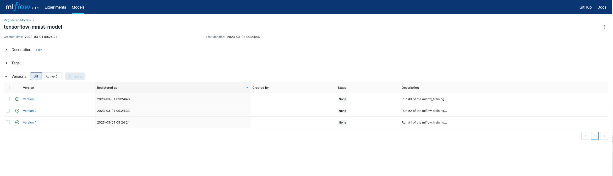

# 🛤️ Manage Model Versions with MLflow Model Registry

[MLflow](https://www.mlflow.org/docs/latest/tracking.html) is a popular
tool that helps you track experiments, manage models and even deploy them to
different environments. ZenML already provides a [MLflow Experiment Tracker]()
that you can use to track your experiments, and an [MLflow Model Deployer]() that
you can use to deploy your models locally. In this example, we will see the newest
addition to the MLflow integration, the [MLflow Model Registry](). This component
allows you to manage and track your model versions, and enables you to deploy
them to different environments with ease.

## 🗺 Overview

This example showcases how easily MLflow Model Registry can be integrated into
your ZenML pipelines and how you can use it to manage your model versions.

We'll be using the
[MNIST-digits](https://keras.io/api/datasets/mnist/) and
will train a classifier using [Tensorflow (Keras)](https://www.tensorflow.org/).
We will run three experiments with different parameters (epochs and learning rate)
and log these experiments and the models into a local MLflow backend.

This example uses an MLflow setup that is based on the local filesystem for
things like the artifact store. See the [MLflow
documentation](https://www.mlflow.org/docs/latest/tracking.html#scenario-1-mlflow-on-localhost) 
for details.

In the example script the [MLflow autologger for
Keras](https://www.mlflow.org/docs/latest/tracking.html#tensorflow-and-keras) is
used within the training step to directly hook into the TensorFlow training, and
it will log out all relevant parameters, metrics and output files. Additionally,
we explicitly log the test accuracy within the evaluation step.

This example uses an MLflow setup that is based on the local filesystem as
orchestrator and artifact store. See the [MLflow
documentation](https://www.mlflow.org/docs/latest/tracking.html#scenario-1-mlflow-on-localhost)
for details.

The example consists of two individual pipelines:

1. `train_pipeline`: Trains a model with different parameters and logs the
   results to MLflow and finishes by registering the model with the MLflow model
    registry using a built-in ZenML step.
2. `deploy_inference_pipeline`: Deploys a model from the MLflow model registry to a local
    MLflow server using a built-in ZenML step that takes the model name and
    version as input. Then it runs inference on the deployed model.

Note: Please note that the current version of the MLflow quickstart requires
Python version 3.8 or higher.


## 🧰 How the example is implemented
This example contains two very important aspects that should be highlighted.

### 🛠️ Model Version Registration within a ZenML pipeline 

ZenML provides a built-in step that allows you to register your model with the
MLflow Model Registry. This step is called `mlflow_model_register_step` and can
be used as follows:

Define a pipeline with a `mlflow_model_register_step`:

 ```python
@pipeline(enable_cache=False, settings={"docker": docker_settings})
def mlflow_training_pipeline(
    importer,
    normalizer,
    trainer,
    evaluator,
    model_register,
):
    # Link all the steps artifacts together
    x_train, y_train, x_test, y_test = importer()
    x_trained_normed, x_test_normed = normalizer(
        x_train=x_train, x_test=x_test
    )
    model = trainer(x_train=x_trained_normed, y_train=y_train)
    evaluator(x_test=x_test_normed, y_test=y_test, model=model)
    model_register(model)
```

When referencing the step in the pipeline, you can pass list of parameters that
will be passed to the `mlflow_model_register_step` that will be used to register
the model with the MLflow Model Registry. By default, the step can extract some
of the parameters from the pipeline context, but you can also pass them
explicitly. The following code shows an example of how you can use the step:

```python
from zenml.integrations.mlflow.steps.mlflow_deployer import (
    MLFlowDeployerParameters,
    mlflow_model_registry_deployer_step,
)

mlflow_training_pipeline(
    importer=loader_mnist(),
    normalizer=normalizer(),
    trainer=tf_trainer(params=TrainerParameters(epochs=5, lr=0.003)),
    evaluator=tf_evaluator(),
    model_register=mlflow_register_model_step(
        params=MLFlowRegistryParameters(
            name="tensorflow-mnist-model",
            description="A simple MNIST model trained with ZenML",
            tags={"framework": "tensorflow", "dataset": "mnist"},
            tags={"lr": 0.003},
            description=f"The 1st run of the mlflow_training_pipeline.",
        )
    ),
).run()

# The list of parameters that can be passed to the mlflow_model_register_step:
"""
    name: Name of the registered model.
    experiment_name: Name of the MLflow experiment to be used for the run.
    run_name: Name of the MLflow run to be created.
    run_id: ID of the MLflow run to be used.
    model_source_uri: URI of the model source. If not provided, the model
        will be fetched from the MLflow tracking server.
    description: Description of the model.
    metadata: Tags to be added to the model.
"""
```

### 🚀 Deploying a model from the Model Registry to a local MLflow server

Once you have registered your model with the MLflow Model Registry, you can
deploy it to a local MLflow server using the `mlflow_model_registry_deployer_step` step.

```python

from zenml.integrations.mlflow.steps.mlflow_deployer import (
    MLFlowDeployerParameters,
    mlflow_model_registry_deployer_step,
)

deployment_inference_pipeline(
    mlflow_model_deployer=mlflow_model_registry_deployer_step(
        params=MLFlowDeployerParameters(
            registry_model_name="tensorflow-mnist-model",
            registry_model_version="1",
            # or you can use the model stage if you have set it in the mlflow registry
            # registered_model_stage="Staging",
        )
    ),
    dynamic_importer=dynamic_importer(),
    predict_preprocessor=tf_predict_preprocessor(),
    predictor=predictor(),
).run()
```
# 🖥 Run it locally

## ⏩ SuperQuick `mlflow_registry` run

If you're really in a hurry and just want to see this example pipeline run
without wanting to fiddle around with all the individual installation and
configuration steps, just run the following:

```shell
zenml example run mlflow_registry
```

## 👣 Step-by-Step
### 📄 Prerequisites 
In order to run this example, you need to install and initialize ZenML:

```shell
# install CLI
pip install "zenml[server]"

# install ZenML integrations
zenml integration install mlflow tensorflow

# pull example
zenml example pull mlflow_registry
cd zenml_examples/mlflow_registry

# Initialize ZenML repo
zenml init

# Start the ZenServer to enable dashboard access
zenml up

# Create and activate the stack with the MLflow model registry, tracker and deployer stack components.
zenml experiment-tracker register mlflow_tracker --flavor=mlflow
zenml model-registry register mlflow_registry --flavor=mlflow
zenml model-deployer register mlflow_deployer --flavor=mlflow
zenml stack register mlflow_stack \
    -a default \
    -o default \
    -e mlflow_tracker \
    -r mlflow_registry \
    -d mlflow_deployer \
    --set
```

### ▶️ Run the Code
Now we're ready. Execute:

```bash
python run.py
```

## Running on a local Kubernetes cluster

## 📄 Infrastructure Requirements (Pre-requisites)

You don't need to set up any infrastructure to run your pipelines with MLflow on
a Kubernetes cluster, locally. However, you need the following tools installed:
  * Docker must be installed on your local machine.
  * Install k3d by running `curl -s https://raw.githubusercontent.com/rancher/k3d/main/install.sh | bash`.

## Create a local MLflow Stack

To get a stack with MLflow installed with authentication and potential other
components, you can make use of [ZenML's Stack Recipes](https://github.com/zenml-io/mlops-stacks)
that are a set of Terraform-based modules that take care of setting up a cluster
with MLflow among other things.

Run the following command to deploy the local MLflow stack:

```bash
zenml stack recipe deploy k3d-modular
```

>**Note**:
> This recipe comes with MLflow, Kubeflow and Minio enabled by default. If you
> want any other components like Seldon or Tekton, you can specify that using
> the relevant flag (i.e. `-o` for orchestrators and so on).

This will deploy a local Kubernetes cluster with MLflow installed. 
It will also generate a stack YAML file that you can import as a ZenML stack by running:

```bash
zenml stack import -f <PATH_TO_STACK_YAML>
```
Once the stack is set, you can then simply proceed to running your pipelines.

### 🔮 See results
Now we just need to start the MLflow UI to have a look at our two pipeline runs.
To do this we need to run:

```shell
mlflow ui --backend-store-uri <SPECIFIC_MLRUNS_PATH_GOES_HERE>
```

Check the terminal output of the pipeline run to see the exact path appropriate
in your specific case. This will start MLflow at `localhost:5000`. If this port
is already in use on your machine you may have to specify another port:

```shell
 mlflow ui --backend-store-uri <SPECIFIC_MLRUNS_PATH_GOES_HERE> -p 5001
 ```

In the following screenshot you can see the MLflow UI with the registered model
and its versions.




You can also use the ZenML CLI to interact with registered models and their
versions. 

The `zenml model-registry models list` command will list all registered models in the
configured model registry. 

```shell
$ zenml model-registry models list

┏━━━━━━━━━━━━━━━━━━━━━━━━┯━━━━━━━━━━━━━┯━━━━━━━━━━┓
┃          NAME          │ DESCRIPTION │ METADATA ┃
┠────────────────────────┼─────────────┼──────────┨
┃ tensorflow-mnist-model │             │          ┃
┗━━━━━━━━━━━━━━━━━━━━━━━━┷━━━━━━━━━━━━━┷━━━━━━━━━━┛
```

To list all versions of a specific model, you can use the `zenml model-registry models list-versions REGISTERED_MODEL_NAME` command:


```shell
$ zenml model-registry models list-versions tensorflow-mnist-model
┏━━━━━━━━━━━━━━━━━━━━━━━━┯━━━━━━━━━━━━━━━┯━━━━━━━━━━━━━━━━━━━━━━━━━━━━━━━━━━━━━━━━━┯━━━━━━━━━━━━━━━━━━━━━━━━━━━━━━━━━━━━━━━━━━━━━━━━━━━━━━━━━━━━━━━━━━━━━━━━━━━━━━━━━━━━━━━━━━━━━━━━━━━━━━━━━━━━━━━━━━━━━━━━━━━━━━━━━━━━━━━━━━━━━━━━━━━━━━━━━━━━━━━━━━━━━━━━━━━━━━━━━━━━━━┓
┃          NAME          │ MODEL_VERSION │ VERSION_DESCRIPTION                     │ METADATA                                                                                                                                                                             ┃
┠────────────────────────┼───────────────┼─────────────────────────────────────────┼──────────────────────────────────────────────────────────────────────────────────────────────────────────────────────────────────────────────────────────────────────────────────────┨
┃ tensorflow-mnist-model │ 3             │ Run #3 of the mlflow_training_pipeline. │ {'zenml_version': '0.34.0', 'zenml_run_name': 'mlflow_training_pipeline-2023_03_01-08_09_23_672599', 'zenml_pipeline_name': 'mlflow_training_pipeline',                       ┃
┃                        │               │                                         │ 'zenml_pipeline_run_uuid': 'a5d4faae-ef70-48f2-9893-6e65d5e51e98', 'zenml_workspace': '10e060b3-2f7e-463d-9ec8-3a211ef4e1f6', 'epochs': '5', 'optimizer': 'Adam', 'lr': '0.005'}     ┃
┠────────────────────────┼───────────────┼─────────────────────────────────────────┼──────────────────────────────────────────────────────────────────────────────────────────────────────────────────────────────────────────────────────────────────────────────────────┨
┃ tensorflow-mnist-model │ 2             │ Run #2 of the mlflow_training_pipeline. │ {'zenml_version': '0.34.0', 'zenml_run_name': 'mlflow_training_pipeline-2023_03_01-08_09_08_467212', 'zenml_pipeline_name': 'mlflow_training_pipeline',                       ┃
┃                        │               │                                         │ 'zenml_pipeline_run_uuid': '11858dcf-3e47-4b1a-82c5-6fa25ba4e037', 'zenml_workspace': '10e060b3-2f7e-463d-9ec8-3a211ef4e1f6', 'epochs': '5', 'optimizer': 'Adam', 'lr': '0.003'}     ┃
┠────────────────────────┼───────────────┼─────────────────────────────────────────┼──────────────────────────────────────────────────────────────────────────────────────────────────────────────────────────────────────────────────────────────────────────────────────┨
┃ tensorflow-mnist-model │ 1             │ Run #1 of the mlflow_training_pipeline. │ {'zenml_version': '0.34.0', 'zenml_run_name': 'mlflow_training_pipeline-2023_03_01-08_08_52_398499', 'zenml_pipeline_name': 'mlflow_training_pipeline',                       ┃
┃                        │               │                                         │ 'zenml_pipeline_run_uuid': '29fb22c1-6e0b-4431-9e04-226226506d16', 'zenml_workspace': '10e060b3-2f7e-463d-9ec8-3a211ef4e1f6', 'epochs': '5', 'optimizer': 'Adam', 'lr': '0.001'}     ┃
┗━━━━━━━━━━━━━━━━━━━━━━━━┷━━━━━━━━━━━━━━━┷━━━━━━━━━━━━━━━━━━━━━━━━━━━━━━━━━━━━━━━━━┷━━━━━━━━━━━━━━━━━━━━━━━━━━━━━━━━━━━━━━━━━━━━━━━━━━━━━━━━━━━━━━━━━━━━━━━━━━━━━━━━━━━━━━━━━━━━━━━━━━━━━━━━━━━━━━━━━━━━━━━━━━━━━━━━━━━━━━━━━━━━━━━━━━━━━━━━━━━━━━━━━━━━━━━━━━━━━━━━━━━━━━┛
```

For more details on a specific model version, you can use the `zenml model-registry models get-version REGISTERED_MODEL_NAME -v VERSION` command:

```shell
$ zenml model-registry models get-version tensorflow-mnist-model -v 1

┏━━━━━━━━━━━━━━━━━━━━━━━━┯━━━━━━━━━━━━━━━━━━━━━━━━━━━━━━━━━━━━━━━━━━━━━━━━━━━━━━━━━━━━━━━━━━━━━━━━━━━━━━━━━━━━━━━━━━━━━━━━━━━━━━━━━━━━━━━━━━━━━━━━━━━━━━━━━━━━━━━━━━━━━━━━━━━━━━━━━━━━━━━━━━━━━━━━━━━━━━━━━━━━━━━━━━━━━━━━━━━━━━━━━━━━━━━━━━━━━━━━━━━━━━━━━━━━━━━━━━━━━━━━┓
┃ MODEL VERSION PROPERTY │ VALUE                                                                                                                                                                                                                                          ┃
┠────────────────────────┼────────────────────────────────────────────────────────────────────────────────────────────────────────────────────────────────────────────────────────────────────────────────────────────────────────────────────────────────────────────────┨
┃ REGISTERED_MODEL_NAME  │ tensorflow-mnist-model                                                                                                                                                                                                                         ┃
┠────────────────────────┼────────────────────────────────────────────────────────────────────────────────────────────────────────────────────────────────────────────────────────────────────────────────────────────────────────────────────────────────────────────────┨
┃ VERSION                │ 1                                                                                                                                                                                                                                              ┃
┠────────────────────────┼────────────────────────────────────────────────────────────────────────────────────────────────────────────────────────────────────────────────────────────────────────────────────────────────────────────────────────────────────────────────┨
┃ VERSION_DESCRIPTION    │ Run #1 of the mlflow_training_pipeline.                                                                                                                                                                                                        ┃
┠────────────────────────┼────────────────────────────────────────────────────────────────────────────────────────────────────────────────────────────────────────────────────────────────────────────────────────────────────────────────────────────────────────────────┨
┃ CREATED_AT             │ 2023-03-01 09:09:06.899000                                                                                                                                                                                                                     ┃
┠────────────────────────┼────────────────────────────────────────────────────────────────────────────────────────────────────────────────────────────────────────────────────────────────────────────────────────────────────────────────────────────────────────────────┨
┃ UPDATED_AT             │ 2023-03-01 09:09:06.899000                                                                                                                                                                                                                     ┃
┠────────────────────────┼────────────────────────────────────────────────────────────────────────────────────────────────────────────────────────────────────────────────────────────────────────────────────────────────────────────────────────────────────────────────┨
┃ METADATA               │ {'zenml_version': '0.34.0', 'zenml_run_name': 'mlflow_training_pipeline-2023_03_01-08_08_52_398499', 'zenml_pipeline_name': 'mlflow_training_pipeline', 'zenml_pipeline_run_uuid': '29fb22c1-6e0b-4431-9e04-226226506d16',              ┃
┃                        │ 'zenml_workspace': '10e060b3-2f7e-463d-9ec8-3a211ef4e1f6', 'lr': '0.001', 'epochs': '5', 'optimizer': 'Adam'}                                                                                                                                  ┃
┠────────────────────────┼────────────────────────────────────────────────────────────────────────────────────────────────────────────────────────────────────────────────────────────────────────────────────────────────────────────────────────────────────────────────┨
┃ MODEL_SOURCE_URI       │ file:///Users/safoine-zenml/Library/Application Support/zenml/local_stores/0902a511-117d-4152-a098-b2f1124c4493/mlruns/489728212459131640/293a0d2e71e046999f77a79639f6eac2/artifacts/model                                                     ┃
┠────────────────────────┼────────────────────────────────────────────────────────────────────────────────────────────────────────────────────────────────────────────────────────────────────────────────────────────────────────────────────────────────────────────────┨
┃ STAGE                  │ None                                                                                                                                                                                                                                           ┃
┗━━━━━━━━━━━━━━━━━━━━━━━━┷━━━━━━━━━━━━━━━━━━━━━━━━━━━━━━━━━━━━━━━━━━━━━━━━━━━━━━━━━━━━━━━━━━━━━━━━━━━━━━━━━━━━━━━━━━━━━━━━━━━━━━━━━━━━━━━━━━━━━━━━━━━━━━━━━━━━━━━━━━━━━━━━━━━━━━━━━━━━━━━━━━━━━━━━━━━━━━━━━━━━━━━━━━━━━━━━━━━━━━━━━━━━━━━━━━━━━━━━━━━━━━━━━━━━━━━━━━━━━━━━┛
```

Finally to delete a registered model or a specific model version, 
you can use the `zenml model-registry models delete REGISTERED_MODEL_NAME` and 
`zenml model-registry models delete-version REGISTERED_MODEL_NAME -v VERSION` 
commands respectively.

```shell

### 🧽 Clean up
In order to clean up, delete the remaining ZenML references.

```shell
zenml stack recipe destroy <STACK_RECIPE_NAME>
rm -rf zenml_examples
rm -rf <SPECIFIC_MLRUNS_PATH_GOES_HERE>
```

# 📜 Learn more

Our docs regarding the MLflow model registry integration can be found 
[here](https://docs.zenml.io/user-guide/component-guide/model-registries/mlflow).


If you want to learn more about model registries in general or about how to 
build your own model registry in ZenML check out our 
[docs](https://docs.zenml.io/user-guide/component-guide/model-registries/custom).
