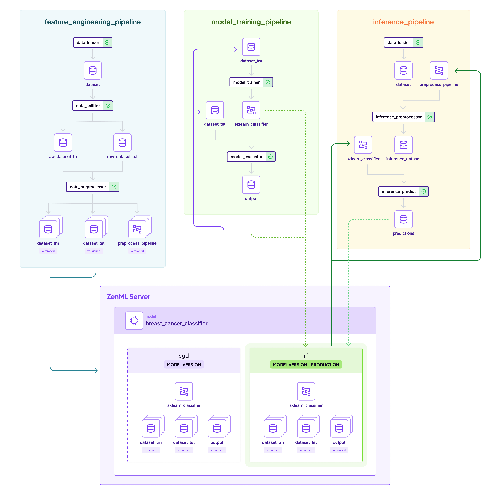

# :running: MLOps 101 with ZenML

Build your first MLOps pipelines with ZenML.

## :earth_americas: Overview

This repository is a minimalistic MLOps project intended as a starting point to learn how to put ML workflows in production. It features: 

- A feature engineering pipeline that loads data and prepares it for training.
- A training pipeline that loads the preprocessed dataset and trains a model.
- A batch inference pipeline that runs predictions on the trained model with new data.

This is a representation of how it will all come together: 



Along the way we will also show you how to:

- Structure your code into MLOps pipelines.
- Automatically version, track, and cache data, models, and other artifacts.
- Transition your ML models from development to production.

## 🏃 Run on Colab

You can use Google Colab to see ZenML in action, no signup / installation required!

<a href="https://colab.research.google.com/github/zenml-io/zenml/blob/main/examples/mlops_starter/quickstart.ipynb" target="_parent"></a>

## :computer: Run Locally

To run locally, install ZenML and pull this quickstart:

```shell
# Install ZenML
pip install "zenml[server]"

# clone the ZenML repository
git clone https://github.com/zenml-io/zenml.git
cd zenml/examples/mlops_starter
```

Now we're ready to start. You have two options for running the quickstart locally:

#### Option 1 - Interactively explore the quickstart using Jupyter Notebook:
```bash
pip install notebook
jupyter notebook
# open quickstart.ipynb
```

#### Option 2 - Execute the whole ML pipeline from a Python script:
```bash
# Install required zenml integrations
zenml integration install sklearn pandas -y

# Initialize ZenML
zenml init

# Start the ZenServer to enable dashboard access
zenml login --local

# Run the feature engineering pipeline
python run.py --feature-pipeline

# Run the training pipeline
python run.py --training-pipeline

# Run the training pipeline with versioned artifacts
python run.py --training-pipeline --train-dataset-version-name=1 --test-dataset-version-name=1

# Run the inference pipeline
python run.py --inference-pipeline
```

## 🌵 Learning MLOps with ZenML

This project is also a great source of learning about some fundamental MLOps concepts. In sum, there are four exemplary steps happening, that can be mapped onto many other projects:

<details>
  <summary>🥇 Step 1: Load your data and execute feature engineering</summary>

We'll start off by importing our data. In this project, we'll be working with
[the Breast Cancer](https://archive.ics.uci.edu/dataset/17/breast+cancer+wisconsin+diagnostic) dataset
which is publicly available on the UCI Machine Learning Repository. The task is a classification
problem, to predict whether a patient is diagnosed with breast cancer or not.

When you're getting started with a machine learning problem you'll want to do
something similar to this: import your data and get it in the right shape for
your training. Here are the typical steps within a feature engineering pipeline.

The steps can be found defined the [steps](steps/) directory, while the [pipelines](pipelines/) directory has the pipeline code to connect them together.


To execute the feature engineer pipelines, run:

```python
python run.py --feature-pipeline
```

After the pipeline has run, the pipeline will produce some logs like:

```shell
The latest feature engineering pipeline produced the following artifacts: 

1. Train Dataset - Name: dataset_trn, Version Name: 1 
2. Test Dataset: Name: dataset_tst, Version Name: 1
```

We will use these versions in the next pipeline.

</details>

<details>
  <summary>⌚ Step 2: Training pipeline</summary>

Now that our data is prepared, it makes sense to train some models to get a sense of how difficult the task is. The Breast Cancer dataset is sufficiently large and complex  that it's unlikely we'll be able to train a model that behaves perfectly since the problem is inherently complex, but we can get a sense of what a reasonable baseline looks like.

We'll start with two simple models, a SGD Classifier and a Random Forest
Classifier, both batteries-included from `sklearn`. We'll train them on the
same data and then compare their performance.


Run it by using the ID's from the first step:

```python
# You can also ignore the `--train-dataset-version-name` and `--test-dataset-version-name` to use 
#  the latest versions
python run.py --training-pipeline --train-dataset-version-name 1 --test-dataset-version-name 1
```

To track these models, ZenML offers a *Model Control Plane*, which is a central register of all your ML models.
Each run of the training pipeline will produce a ZenML Model Version.

```shell
zenml model list
```

This will show you a new `breast_cancer_classifier` model with two versions, `sgd` and `rf` created. You can find out how this was configured in the [YAML pipeline configuration files](configs/).

If you are a [ZenML Pro](https://zenml.io/pro) user, you can see all of this visualized in the dashboard:


There is a lot more you can do with ZenML models, including the ability to
track metrics by adding metadata to it, or having them persist in a model
registry. However, these topics can be explored more in the
[ZenML docs](https://docs.zenml.io).

</details>

<details>
  <summary>💯 Step 3: Promoting the best model to production</summary>

For now, we will use the ZenML model control plane to promote our best
model to `production`. You can do this by simply setting the `stage` of
your chosen model version to the `production` tag.

```shell
zenml model version update breast_cancer_classifier rf --stage production
```

While we've demonstrated a manual promotion process for clarity, a more in-depth look at the [promoter code](steps/model_promoter.py) reveals that the training pipeline is designed to automate this step. It evaluates the latest model against established production metrics and, if the new model outperforms the existing one based on test set results, it will automatically promote the model to production. Here is an overview of the process:


Again, if you are a [ZenML Pro](https://zenml.io/pro) user, you would be able to see all this in the cloud dashboard.

</details>

<details>
  <summary>🫅 Step 4: Consuming the model in production</summary>

Once the model is promoted, we can now consume the right model version in our
batch inference pipeline directly. Let's see how that works.

The batch inference pipeline simply takes the model marked as `production` and runs inference on it
with `live data`. The critical step here is the `inference_predict` step, where we load the model in memory and generate predictions. Apart from the loading the model, we must also load the preprocessing pipeline that we ran in feature engineering,
so that we can do the exact steps that we did on training time, in inference time. Let's bring it all together:

ZenML automatically links all artifacts to the `production` model version as well, including the predictions
that were returned in the pipeline. This completes the MLOps loop of training to inference:


You can also see all predictions ever created as a complete history in the dashboard (Again only for [ZenML Pro](https://zenml.io/pro) users):


</details>

## :bulb: Learn More

You're a legit MLOps engineer now! You trained two models, evaluated them against
a test set, registered the best one with the ZenML model control plane,
and served some predictions. You also learned how to iterate on your models and
data by using some of the ZenML utility abstractions. You saw how to view your
artifacts and stacks via the client as well as the ZenML Dashboard.

If you want to learn more about ZenML as a tool, then the
[:page_facing_up: **ZenML Docs**](https://docs.zenml.io/) are the perfect place
to get started. In particular, the [Production Guide](https://docs.zenml.io/user-guide/production-guide/)
goes into more detail as to how to transition these same pipelines into production on the cloud.

The best way to get a production ZenML instance up and running with all batteries included is the [ZenML Pro](https://zenml.io/pro). Check it out!

Also, make sure to join our <a href="https://zenml.io/slack" target="_blank">
    
    <b>Slack Community</b> 
</a> to become part of the ZenML family!
