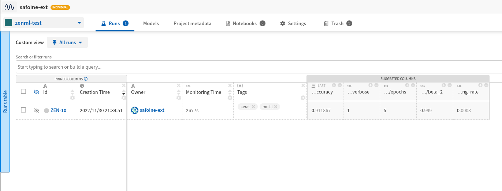
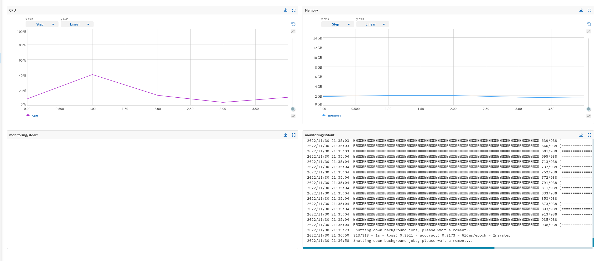

# 🏋️ Track your runs with Neptune

[Neptune](https://neptune.ai/product/experiment-tracking) is a popular tool that
you would normally use in the iterative ML experimentation phase to track and
visualize experiment results or as a model registry for your production-ready
models. Neptune can also track and visualize the results produced by your
automated pipeline runs, as you make the transition towards a more production
oriented workflow.

## 🗺 Overview
This example showcases how to use the Neptune Experiment Tracker flavor to log and visualize information from your pipeline steps (e.g. models, parameters, metrics).

We'll be using the [MNIST](http://yann.lecun.com/exdb/mnist/) dataset and
will train a classifier using [Tensorflow (Keras)](https://www.tensorflow.org/).
We will run two experiments with different parameters (epochs and learning rate)
and log these experiments into a neptune platform. 

In the example script, the [neptune-tensorflow-keras](https://docs.neptune.ai/integrations/keras/) is
used within the training step to directly hook into the TensorFlow training.  
It will log out all relevant parameters, metrics and output files Automatically. . Additionally, we explicitly log the test accuracy within the evaluation step.

Note that despite `neptune` being used in different steps within a pipeline, ZenML handles initializing `neptune` and ensures the experiment name is the same as the pipeline name, and the experiment run is the same name as the pipeline run name. This establishes a lineage between pipelines in ZenML and experiments in `neptune`.

# 🖥 Run it locally

### 📄 Prerequisites 

### Set up a free Neptune account
To get this example running, you need to set up a Neptune account. You can do this for free [here](https://app.neptune.ai/register).

### Pre-requisites
In order to run this example, you need to install and initialize ZenML:

```shell
# install CLI
pip install "zenml[server]"

# install ZenML integrations
zenml integration install tensorflow neptune
pip install neptune-client[tensorflow-keras]

# pull example
zenml example pull neptune_tracking
cd zenml_examples/neptune_tracking

# initialize
zenml init

# Start the ZenServer to enable dashboard access
zenml up
```

### 🥞 Create the stack with the Neptune experiment tracker component

In order to use an experiment tracking tool like Neptune, you need to create a new `StackComponent`,  and 
subsequently a new `Stack` with the type `neptune`. The Neptune tracker stack component has the following options:

* `api_token`: [API key token](https://docs.neptune.ai/setup/setting_api_token) of your Neptune account. If left blank, Neptune will
attempt to retrieve it from your environment variables.
* `project`: The name of the project where you're sending the new run, in the form "workspace-name/project-name".
If the project is not specified, Neptune will attempt to retrieve it from your environment variables.

Note that project_name and entity are optional in the below command:

```shell
zenml experiment-tracker register neptune_experiment_tracker --flavor=neptune \ 
    --project=<project_name> --api_token=<token>

zenml stack register neptune_stack \
    -a default \
    -o default \
    -e neptune_experiment_tracker \
    --set
```

### ▶ Run the project
Now we're ready. Execute:

```shell
python run.py
```

### 🔮 See results
The results should be available at the URL: https://app.neptune.ai/{ACCOUNT_USERNAME}/{PROJECT_NAME}

Each pipeline run will be logged as a separate experiment run in Neptune. You can see the results of the pipeline run in the Neptune UI.

For example, here are the runs 'raw:




For each run, you should see the following visualizations:




### Using `neptune.Settings`

You can pass a set of tags to the Neptune run by using the `NeptuneExperimentTrackerSettings` class, like in the example
below:

```python
import numpy as np

import tensorflow as tf

from zenml import step
from zenml.integrations.neptune.experiment_trackers.run_state import (
    get_neptune_run,
)
from zenml.integrations.neptune.flavors import NeptuneExperimentTrackerSettings

neptune_settings = NeptuneExperimentTrackerSettings(tags={"keras", "mnist"})

@step(
    experiment_tracker="<NEPTUNE_TRACKER_STACK_COMPONENT_NAME>",
    settings={
        "experiment_tracker.neptune": neptune_settings
    }
)
def my_step(
        x_test: np.ndarray,
        y_test: np.ndarray,
        model: tf.keras.Model,
) -> float:
    """Log metadata to Neptune run"""
    neptune_run = get_neptune_run()
    ...
```

### 🧽 Clean up
In order to clean up, delete the remaining ZenML references:

```shell
rm -rf zenml_examples
```

# 📜 Learn more

Our docs regarding the Neptune integration can be found [here](https://docs.zenml.io/component-gallery/experiment-trackers/neptune).

If you want to learn more about experiment trackers in general or about how to build your own experiment trackers in ZenML
check out our [docs](https://docs.zenml.io/component-gallery/experiment-trackers/custom).
