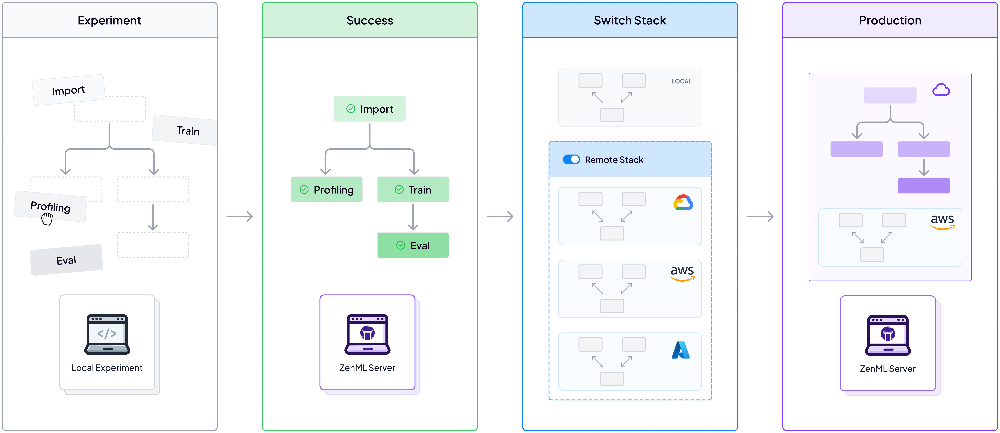
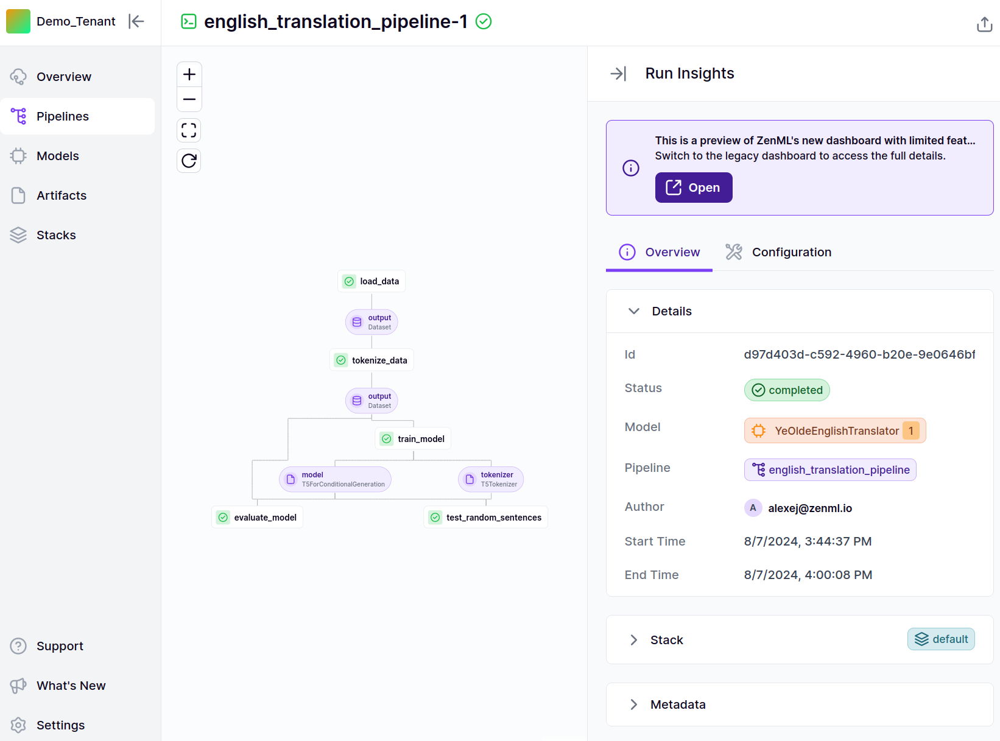
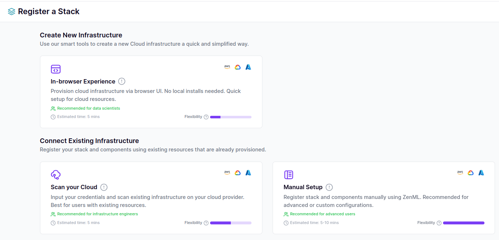

# :running: MLOps 101 with ZenML

Build your first MLOps pipelines with ZenML.

## :earth_americas: Overview

This repository is a minimalistic MLOps project intended as a starting point to learn how to put ML workflows in production. 

This is a representation of how it will all come together: 



We'll run a pipeline on our local environment to verify our pipeline works as intended. 
Then we'll switch stack to a production environment and run our pipeline there.

As a prerequisite to this guid you will need access to one of the big three cloud providers.

## 🏃 Run on Colab

You can use Google Colab to see ZenML in action, no signup / installation required!

<a href="https://colab.research.google.com/github/zenml-io/zenml/blob/main/examples/quickstart/quickstart.ipynb" target="_parent"></a>

## :computer: Run Locally

To run locally, install ZenML and pull this quickstart:

```shell
# Install ZenML
pip install "zenml[server]"

# clone the ZenML repository
git clone https://github.com/zenml-io/zenml.git
cd zenml/examples/quickstart
```

Now we're ready to start. You have two options for running the quickstart locally:

#### Option 1 - Interactively explore the quickstart using Jupyter Notebook:
```bash
pip install notebook
jupyter notebook
# open notebooks/quickstart.ipynb
```

#### Option 2 - Execute the whole training pipeline from a Python script:

To run this quickstart you need to connect to a ZenML Server. You can deploy it 
[yourself on your own infrastructure](https://docs.zenml.io/getting-started/deploying-zenml) or try it
out for free, no credit-card required in our [ZenML Pro managed service](https://zenml.io/pro).

```bash
# Install required zenml integrations
pip install -r requirements.txt

# Initialize ZenML
zenml init

# Start the ZenServer to enable dashboard access
zenml connect --url="INSERT_YOUR_SERVER_URL_HERE"
```

To run our pipeline locally, you can do so with the following command. 
To understand what this pipeline does, you can inspect the pipeline definition in the [pipelines](pipelines) directory.

```bash
# Run the pipeline locally
python run.py --model_type=t5-small --orchestration_environment local
```

As you can see the pipeline has run successfully. It also printed out some examples - however it seems the model is not 
yet able to solve the task well. But we validated that the pipeline works.



Above you can see what the dashboard view of the pipeline in the ZenML Dashboard.
You can find the URL for this in the logs above. 

### 🌵 Running Remotely

Our last section confirmed to us, that the pipeline works. Let's now run the pipeline in the environment of your choice.

For you to be able to try this next section, you will need to have access to a cloud environment (AWS, GCP, AZURE). ZenML wraps around all the major cloud providers and orchestration tools and lets you easily deploy your code onto them.

To do this lets head over to the `Stack` section of your ZenML Dashboard. Here you'll be able to either connect to an existing or deploy a new environment. Choose on of the options presented to you there and come back when you have a stack ready to go. Then proceed to the appropirate section below. **Do not** run all three. Also be sure that you are running with a remote ZenML server (see Step 1 above).




#### AWS

For AWS you will need to install some aws requirements in your local environment. You will also 
need an AWS stack registered in ZenML. 

```bash
!zenml integration install aws s3 -y

zenml stack set <INSERT_YOUR_STACK_NAME_HERE>
python run.py --model_type=t5-small --orchestration_environment aws
```

You can edit `configs/training_aws.yaml` to adjust the settings.

#### GCP

For GCP you will need to install some aws requirements in your local environment. You will also 
need an AWS stack registered in ZenML. 
```bash
!zenml integration install gcp

zenml stack set <INSERT_YOUR_STACK_NAME_HERE>
python run.py --model_type=t5-small --orchestration_environment gcp
```

You can edit `configs/training_gcp.yaml` to adjust the settings.

#### Azure
```bash
!zenml integration install azure skypilot

zenml stack set <INSERT_YOUR_STACK_NAME_HERE>
python run.py --model_type=t5-small --orchestration_environment azure
```

You can edit `configs/training_azure.yaml` to adjust the settings.

## Further exploration

This was just the tip of the iceberg of what ZenML can do; check out the [**docs**](https://docs.zenml.io/) to learn more
about the capabilities of ZenML. For example, you might want to:

- [Deploy ZenML](https://docs.zenml.io/user-guide/production-guide/connect-deployed-zenml) to collaborate with your colleagues.
- Run the same pipeline on a [cloud MLOps stack in production](https://docs.zenml.io/user-guide/production-guide/cloud-stack).
- Track your metrics in an experiment tracker like [MLflow](https://docs.zenml.io/stacks-and-components/component-guide/experiment-trackers/mlflow).

## What next?

* If you have questions or feedback... join our [**Slack Community**](https://zenml.io/slack) and become part of the ZenML family!
* If you want to quickly get started with ZenML, check out [ZenML Pro](https://zenml.io/pro).