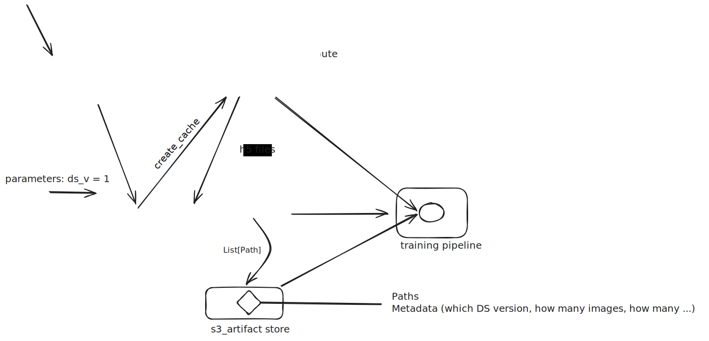

# Fashion MNIST Training Pipeline (ZenML)




This is demo ZenML Pipeline demonstrating how to design of an ML pipeline when input dataset size is huge. In this demo, we are using Fashion MNIST dataset which is already uploaded to S3. We are using ZenML PVC to store the data and run the pipeline on Kubernetes.

## Prerequisites

To reproduce this pipeline, you need to have –

- You need an external S3 bucket to store the data.

-  ZenML Server running with K8s configured Stack. The stack we are using has following components:
   -  Container Registry (ECR)
   -  Artifact Store (S3)
   -  Image Builder (AWS Codebuild)
   -  Orchestrator (EKS Cluster)
   -  A Service Connector that has access to the S3 bucket.


## Get Started

1. For demostration purposes, we are manually uploading the data to S3.

   ```shell
   AWS_PROFILE=zenml-dev uv run scripts/upload_mnist_to_s3.py --bucket persistent-data-store
   ```

2. Create a Persistant Volume Claim in your Kubernetes cluster.

   - A persistent volume (PV) is the "physical" volume on the host machine that stores your persistent data.
   
   - A persistent volume claim (PVC) is a request for the platform to create a PV for you, and you attach PVs to your pods via a PVC.

   ```shell
   # You may first want to check the storage class of your cluster.
   kubectl get storageclass

   # Based on your storage class, modify the `k8s/pvc.yaml` file.
   # Create the PVC
   kubectl apply -f k8s/pvc.yaml

   # Check if the PVC is created
   kubectl get pvc <pvc-name> -n <namespace>
   ```

3. Install dependencies and login to ZenML Server.

   ```shell
   uv venv --seed
   source .venv/bin/activate
   pip install -r requirements.txt

   # Login to ZenML Server
   zenml login <workspace-name>

   # Set the stack & project
   zenml init && zenml stack set <kubernetes-stack-name>
   zenml project set <project-name>

   # Install integrations
   zenml integration install aws s3 kubernetes --uv
   ```

4. Run the pipeline.

   ```shell
   # Run the pipeline with the default configuration
   python run.py

   # Run the pipeline with a custom configuration
   python run.py --config <path-to-config-file>
   ```

