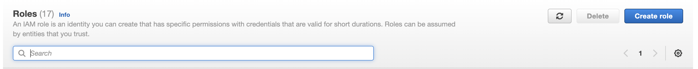
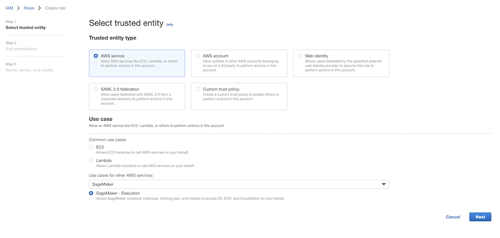
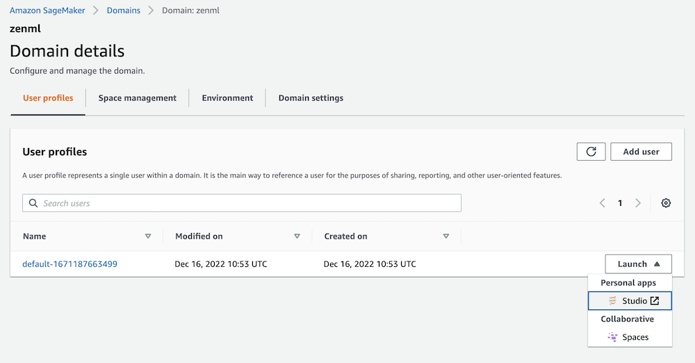
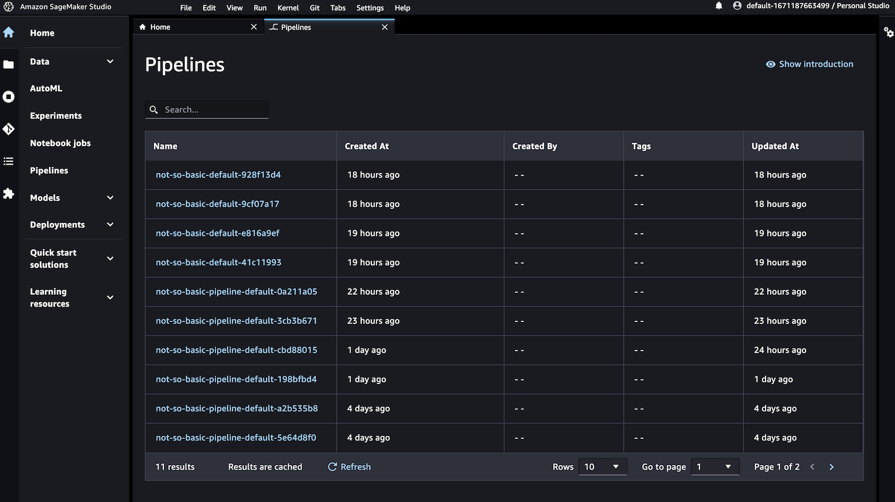

# 🏃 Run pipelines in production using Sagemaker

[Sagemaker Pipelines](https://aws.amazon.com/sagemaker/pipelines?tag=soumet-20)
is a serverless ML workflow tool running on AWS. It is
an easy way to quickly run your code in a production-ready, repeatable 
cloud orchestrator that requires minimal setup without provisioning and paying 
for standby compute.

## 📄 Pre-requisites

In order to run on Sagemaker you will need to do some configuration
within AWS to create all the required resources and permissions. In total, you will need to have:

- [ECR container registry](https://docs.zenml.io/component-gallery/container-registries/amazon-ecr)
- [S3 artifact store](https://docs.zenml.io/component-gallery/artifact-stores/amazon-s3)

On top of having these resources and setting them up for ZenML, you will also
need to do some permission tuning.

You will need to
[authorize](https://docs.zenml.io/component-gallery/container-registries/amazon-ecr#how-to-use-it)
your local Docker client to have access the ECR container registry, as explained
in our docs:

```shell
aws ecr get-login-password --region <YOUR_AWS_REGION> | docker login --username AWS --password-stdin <YOUR_ECR_REGISTRY_URI>
```

To handle the relevant permissions, you will need to create an IAM role that
has access to the relevant parts of your AWS account. You can do this directly
in the AWS console, or using the AWS CLI.



When creating the role, make sure to add Sagemaker-specific permissions:



## 🥞 Create a Sagemaker stack

Before registering the stack, you need to deploy a remote ZenML server 
on AWS. See the [deployment guide](https://docs.zenml.io/getting-started/deploying-zenml) 
for more information.

Once everything is done on the AWS side, we will need to configure a
stack with all of these components.

* The **artifact store** to store step outputs in an S3 Bucket.
* The Docker images that are created to run your pipeline are stored in ECR
  **container registry**.
* The **Sagemaker orchestrator** is responsible for running your ZenML pipeline
  in Sagemaker.
* An **Image Builder** is responsible for building the Docker images that are
  used to run your pipeline steps.

When running the upcoming commands, make sure to
replace all the <PLACEHOLDERS> with the correct values from how you set things
up with AWS.

```bash
# install CLI
pip install "zenml[server]"

# install ZenML integrations
zenml integration install aws pytorch s3

# pull example
zenml example pull sagemaker_orchestration
cd zenml_examples/sagemaker_orchestration

# Create a zenml repository
zenml init

# You'll need to register a secret to use for your artifact-store authentication
zenml secret create s3_secret --aws_access_key_id=<YOUR_ACCESS_KEY_ID> --aws_secret_access_key=<YOUR_SECRET_ACCESS_KEY>

# or this if you are using a session token
# zenml secret create s3_secret --aws_access_key_id=<YOUR_ACCESS_KEY_ID> --aws_secret_access_key=<YOUR_SECRET_ACCESS_KEY> --aws_session_token=<YOUR_AWS_SESSION_TOKEN>

# The CONTAINER_REGISTRY_URI will have a format like this: xxx.dkr.ecr.REGION.amazonaws.com
zenml container-registry register aws_registry --flavor=aws --uri=<CONTAINER_REGISTRY_URI>

# The PATH_TO_YOUR_S3_BUCKET is the path to your S3 bucket: s3://xxx
zenml artifact-store register aws_artifact_store --flavor=s3 --path=<PATH_TO_YOUR_S3_BUCKET> --authentication_secret=s3_secret

# register the orchestrator
zenml orchestrator register sagemaker_orchestrator --flavor=sagemaker --execution_role=<AWS_ROLE_ARN_CREATED_EARLIER>

# register the image builder
zenml image-builder register local_builder --flavor=local

# Now we're ready to assemble our stack
zenml stack register sagemaker_stack -a aws_artifact_store -o sagemaker_orchestrator -c aws_registry -i local_builder --set
```

Note that if you want an easy way to deploy the required cloud resources for
this example via the ZenML CLI, you can do so using the `zenml <STACK_COMPONENT>
deploy` command. For example, to deploy the S3 artifact store, you can
run:

```shell
zenml artifact-store deploy aws_artifact_store --flavor=s3
```

You could also deploy the Sagemaker orchestrator itself as well as the ECR
container registry. For more information on this `deploy` subcommand, please
refer to the
[documentation](https://docs.zenml.io/advanced-guide/practical-mlops/stack-recipes#deploying-stack-components-directly).

### ▶️ Run the pipeline

Once your stack is fully set up, you should be good to go. 

```bash
python run.py
```

That's it! If everything went as planned this pipeline should now be running in
the cloud! To access the Sagemaker Pipelines UI, you will have to launch
Sagemaker Studio via the AWS Sagemaker UI. Make sure that you are launching it
from within your desired AWS region.



Once the Studio UI is launched, click on the 'Pipeline' button on the left-hand
side and from there you can view the pipelines that have been launched via
ZenML:



### 💻 Specifying per-step resources

If you're using the Sagemaker orchestrator and some of your pipelines steps have 
certain custom requirements, you can specify them using the step decorator as 
follows:

```python
from zenml import step
from zenml.integrations.aws.flavors.sagemaker_orchestrator_flavor import (
    SagemakerOrchestratorSettings,
)

@step(settings={"orchestrator.sagemaker": SagemakerOrchestratorSettings(volume_size_in_gb=35)})
def my_step(...) -> ...:
    ...
```

For full details on which settings are configurable, please refer to [the API
docs](https://apidocs.zenml.io/latest/integration_code_docs/integrations-aws/#zenml.integrations.aws.flavors.sagemaker_step_orchestrator_flavor.SagemakerOrchestratorSettings) for full information.

### 🧽 Clean up

Once you're done experimenting, you can delete the example files by calling:

```bash
rm -rf zenml_examples
```

Additionally, you might have to clean up your cloud resources to avoid running 
costs for storage of artifacts or containers.

To destroy any resources deployed using the ZenML `deploy` subcommand, use the
`destroy` subcommand to delete each individual stack component, as in the
following example:

```shell
# replace with the name of the component you want to destroy
zenml artifact-store destroy s3_artifact_store
```

# 📜 Learn more

Our docs regarding the Sagemaker integration can be found 
[here](https://docs.zenml.io/component-gallery/orchestrators/sagemaker).

If you want to learn more about orchestrators in general or about how to build
your own orchestrators in ZenML check out our 
[docs](https://docs.zenml.io/component-gallery/orchestrators/custom).
