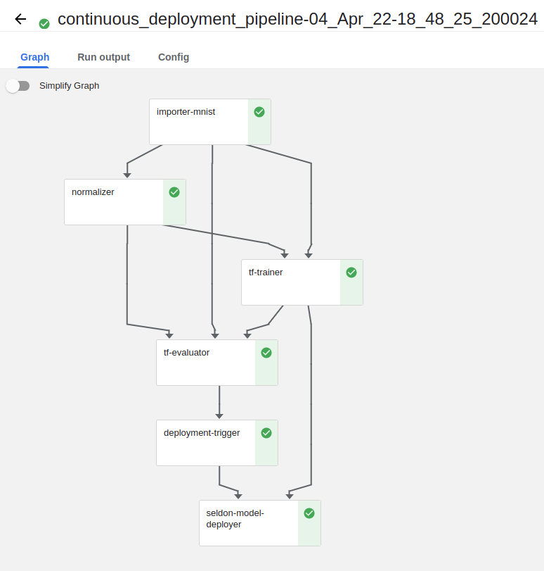
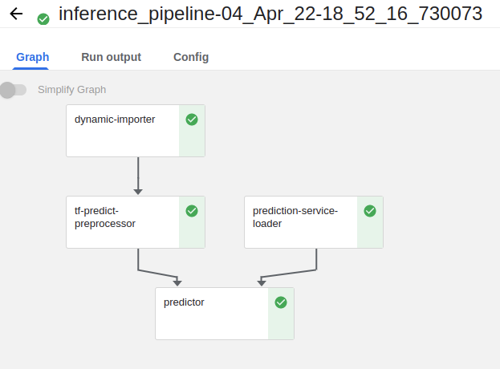

# ZenML continuous model deployment with Seldon Core

[Seldon Core](https://github.com/SeldonIO/seldon-core) is a production grade
open source model serving platform. It packs a wide range of features built
around deploying models to REST/GRPC microservices that include monitoring and
logging, model explainers, outlier detectors and various continuous deployment
strategies such as A/B testing, canary deployments and more.

Seldon Core also comes equipped with a set of built-in model server
implementations designed to work with standard formats for packaging ML models
that greatly simplify the process of serving models for real-time inference.

This example demonstrates how easy it is to build a continuous deployment
pipeline that trains a model and then serves it with Seldon Core as the
industry-ready model deployment tool of choice.

After [serving models locally with MLflow](../mlflow_deployment), switching to
a ZenML MLOps stack that features Seldon Core as a model deployer component
makes for a seamless transition from running experiments locally to deploying
models in production.

## Overview

The example uses the
[Fashion-MNIST](https://github.com/zalandoresearch/fashion-mnist) dataset to
train a classifier using either [Tensorflow (Keras)](https://www.tensorflow.org/)
or [scikit-learn](https://scikit-learn.org/stable/). Different
hyperparameter values (e.g. the number of epochs and learning rate for the Keras
model, solver and penalty for the scikit-learn logical regression) can be
supplied as command line arguments to the `run.py` Python script.

The example consists of two individual pipelines:

  * a deployment pipeline that implements a continuous deployment workflow. It
  ingests and processes input data, trains a model and then (re)deploys the
  prediction server that serves the model if it meets some evaluation
  criteria
  * an inference pipeline that interacts with the prediction server deployed
  by the continuous deployment pipeline to get online predictions based on live
  data

You can control which pipeline to run by passing the `--deploy` and/or the
`--predict` flag to the `run.py` launcher.

In the deployment pipeline, ZenML's Seldon Core integration is used to serve
the trained model directly from the Artifact Store where it is automatically
saved as an artifact by the training step. A Seldon Core deployment server
is launched to serve the latest model version if its accuracy is above a
configured threshold (also customizable through a command line argument).

The Seldon Core deployment server is provisioned remotely as a Kubernetes
resource that continues to run after the deployment pipeline run is complete.
Subsequent runs of the deployment pipeline will reuse the existing deployment
server and merely update it to serve the more recent model version.

The deployment pipeline has caching enabled to avoid re-training and
re-deploying the model if the training data and hyperparameter values don't
change. When a new model is trained that passes the accuracy threshold
validation, the pipeline automatically updates the currently running Seldon Core
deployment server so that the new model is being served instead of the old one.

The inference pipeline simulates loading data from a dynamic external source,
then uses that data to perform online predictions using the running Seldon
Core prediction server.

## Running the example

### Pre-requisites

For the ZenML Seldon Core deployer to work, three basic things are required:

1. access to a Kubernetes cluster. The example accepts a `--kubernetes-context`
command line argument. This Kubernetes context needs to point to the Kubernetes
cluster where Seldon Core model servers will be deployed. If the context is not
explicitly supplied to the example, it defaults to using the locally active
context.

2. Seldon Core needs to be preinstalled and running in the target Kubernetes
cluster (read below for a brief explanation of how to do that).

3. models deployed with Seldon Core need to be stored in some form of
persistent shared storage that is accessible from the Kubernetes cluster where
Seldon Core is installed (e.g. AWS S3, GCS, Azure Blob Storage, etc.).

In order to run this example, you need to install and initialize ZenML:

```shell
# install CLI
pip install zenml

# install ZenML integrations
zenml integration install tensorflow sklearn seldon

# pull example
zenml example pull seldon_deployment
cd zenml_examples/seldon_deployment

# initialize a local ZenML Repository
zenml init
```

#### Installing Seldon Core (e.g. in an EKS cluster)

This section is a trimmed up version of the
[official Seldon Core installation instructions](https://github.com/SeldonIO/seldon-core/tree/master/examples/auth#demo-setup)
applied to a particular type of Kubernetes cluster, EKS in this case. It assumes
that an EKS cluster is already set up and configured with IAM access.

To configure EKS cluster access locally, e.g:

```bash
aws eks --region us-east-1 update-kubeconfig --name zenml-cluster --alias zenml-eks
```

Install Istio 1.5.0 (required for the latest Seldon Core version):

```bash
curl -L [https://istio.io/downloadIstio](https://istio.io/downloadIstio) | ISTIO_VERSION=1.5.0 sh -
cd istio-1.5.0/
bin/istioctl manifest apply --set profile=demo
```

Set up an Istio gateway for Seldon Core:

```bash
curl https://raw.githubusercontent.com/SeldonIO/seldon-core/master/notebooks/resources/seldon-gateway.yaml | kubectl apply -f -
```

Finally, install Seldon Core:

```bash
helm install seldon-core seldon-core-operator \
    --repo https://storage.googleapis.com/seldon-charts \
    --set usageMetrics.enabled=true \
    --set istio.enabled=true \
    --namespace seldon-system
```

To test that the installation is functional, you can use this sample Seldon
deployment:

```yaml
apiVersion: machinelearning.seldon.io/v1
kind: SeldonDeployment
metadata:
  name: iris-model
  namespace: default
spec:
  name: iris
  predictors:
  - graph:
      implementation: SKLEARN_SERVER
      modelUri: gs://seldon-models/v1.14.0-dev/sklearn/iris
      name: classifier
    name: default
    replicas: 1
```

```bash
kubectl apply -f iris.yaml
```

Extract the URL where the model server exposes its prediction API:

```bash
export INGRESS_HOST=$(kubectl -n istio-system get service istio-ingressgateway -o jsonpath='{.status.loadBalancer.ingress[0].hostname}')
```

Use curl to send a test prediction API request to the server:

```bash
curl -X POST http://$INGRESS_HOST/seldon/default/iris-model/api/v1.0/predictions \
         -H 'Content-Type: application/json' \
         -d '{ "data": { "ndarray": [[1,2,3,4]] } }'
```

You should see something like this as the prediction response:

```json
{"data":{"names":["t:0","t:1","t:2"],"ndarray":[[0.0006985194531162835,0.00366803903943666,0.995633441507447]]},"meta":{"requestPath":{"classifier":"seldonio/sklearnserver:1.13.1"}}}
```

### Setting up the ZenML Stack

Before you run the example, a ZenML Stack needs to be set up with all the proper
components. Two different examples of stacks featuring AWS infrastructure
components are described in this document, but similar stacks may be set up
using different backends and used to run the example as long as the basic Stack
prerequisites are met.

#### Local orchestrator with S3 artifact store and EKS Seldon Core installation

This stack consists of the following components:

* an AWS S3 artifact store
* the local orchestrator
* the local metadata store
* a Seldon Core model deployer

To have access to the AWS S3 artifact store from your local workstation, the
AWS client credentials needs to be properly set up locally as documented in
[the official AWS documentation](https://docs.aws.amazon.com/cli/latest/userguide/cli-configure-files.html).

In addition to the stack components, Seldon Core must be installed in a
Kubernetes cluster that is locally accessible through a Kubernetes configuration
context. The reference used in this example is a Seldon Core installation
running in an EKS cluster, but any other type of Kubernetes cluster can be used,
managed or otherwise.

To configure EKS cluster access locally, e.g:

```bash
aws eks --region us-east-1 update-kubeconfig --name zenml-cluster --alias zenml-eks
```

Set up a namespace for ZenML Seldon Core workloads:

```bash
kubectl create ns zenml-workloads
```

Extract the URL where the Seldon Core model server exposes its prediction API, e.g.:

```bash
export INGRESS_HOST=$(kubectl -n istio-system get service istio-ingressgateway -o jsonpath='{.status.loadBalancer.ingress[0].hostname}')
```

Give Seldon Core access to the S3 artifact store in the configured namespace:

```bash
kubectl -n zenml-workloads create secret generic seldon-init-container-secret \
    --from-literal=RCLONE_CONFIG_S3_PROVIDER='aws' \
    --from-literal=RCLONE_CONFIG_S3_TYPE='s3' \
    --from-literal=RCLONE_CONFIG_S3_ENV_AUTH=true
```

The name of the created secret also needs to be passed to the `run.py` example
launcher script via its `--secret` command line argument.

NOTE: this is based on the assumption that Seldon Core is running in an EKS
cluster that already has IAM access enabled and doesn't need any explicit AWS
credentials. If that is not the case, you will need to set up credentials
differently. Please look up the variables relevant to your use-case in the
[official Seldon Core documentation](https://docs.seldon.io/projects/seldon-core/en/latest/servers/overview.html#handling-credentials).

Configuring the stack can be done like this:

```
zenml integration install s3 seldon
zenml model-deployer register seldon_eks --type=seldon \
  --kubernetes_context=zenml-eks --kubernetes_namespace=zenml-workloads \
  --base_url=http://abb84c444c7804aa98fc8c097896479d-377673393.us-east-1.elb.amazonaws.com
zenml artifact-store register aws --type s3 --path s3://mybucket
zenml stack register local_with_aws_storage -m default -a aws -o default -d seldon_eks
zenml stack set local_with_aws_storage
```

#### Full AWS stack

This stack has all components running in the AWS cloud:

* an AWS S3 artifact store
* a Kubeflow orchestrator installed in an AWS EKS Kubernetes cluster
* a metadata store that uses the same database as the Kubeflow deployment as
a backend
* an AWS ECR container registry

To have access to the AWS S3 artifact store from your local workstation, the
AWS client credentials needs to be properly set up locally as documented in
[the official AWS documentation](https://docs.aws.amazon.com/cli/latest/userguide/cli-configure-files.html).

In addition to the stack components, Seldon Core must be installed in *the same*
Kubernetes cluster as Kubeflow. The cluster must also be locally accessible
through a Kubernetes configuration context. The reference used in this example
is a Kubeflow and Seldon Core installation running in an EKS cluster, but any
other type of Kubernetes cluster can be used, managed or otherwise.

To configure EKS cluster access locally, run e.g:

```bash
aws eks --region us-east-1 update-kubeconfig --name zenml-cluster --alias zenml-eks
```

To configure ECR registry access locally, run e.g.:

```bash
aws ecr get-login-password --region us-east-1 | docker login --username AWS \
  --password-stdin 715803424590.dkr.ecr.us-east-1.amazonaws.com
```

Extract the URL where the Seldon Core model server exposes its prediction API, e.g.:

```bash
export INGRESS_HOST=$(kubectl -n istio-system get service istio-ingressgateway \
  -o jsonpath='{.status.loadBalancer.ingress[0].hostname}')
```

Give Seldon Core access to the S3 artifact store in the Kubeflow namespace:

```bash
kubectl -n kubeflow create secret generic seldon-init-container-secret \
    --from-literal=RCLONE_CONFIG_S3_PROVIDER='aws' \
    --from-literal=RCLONE_CONFIG_S3_TYPE='s3' \
    --from-literal=RCLONE_CONFIG_S3_ENV_AUTH=true
```

The name of the created secret also needs to be passed to the `run.py` example
launcher script via its `--secret` command line argument.

NOTE: this is based on the assumption that Seldon Core is running in an EKS
cluster that already has IAM access enabled and doesn't need any explicit AWS
credentials. If that is not the case, you will need to set up credentials
differently. Please look up the variables relevant to your use-case in the
[official Seldon Core documentation](https://docs.seldon.io/projects/seldon-core/en/latest/servers/overview.html#handling-credentials).

Configuring the stack can be done like this:

```
zenml integration install s3 kubeflow seldon

zenml artifact-store register aws --type=s3 --path=s3://mybucket
zenml model-deployer register seldon_aws --type=seldon \
  --kubernetes_context=zenml-eks --kubernetes_namespace=kubeflow \
  --base_url=http://abb84c444c7804aa98fc8c097896479d-377673393.us-east-1.elb.amazonaws.com
zenml container-registry register aws --type=default --uri=715803424590.dkr.ecr.us-east-1.amazonaws.com
zenml metadata-store register aws --type=kubeflow
zenml orchestrator register aws --type=kubeflow --kubernetes_context=zenml-eks --synchronous=True
zenml stack register aws -m aws -a aws -o aws -c aws -d seldon_aws
zenml stack set aws
```

### Run the project
To run the continuous deployment pipeline:

```shell
python run.py --secret seldon-init-container-secret --deploy
```

Example output when run with the local orchestrator stack:

```
zenml/seldon_deployment$ python run.py --secret seldon-init-container-secret --deploy --min-accuracy 0.80 --model-flavor sklearn

2022-04-06 15:40:28.903233: W tensorflow/stream_executor/platform/default/dso_loader.cc:64] Could not load dynamic library 'libcudart.so.11.0'; dlerror: libcudart.so.11.0: cannot open shared object file: No such file or directory
2022-04-06 15:40:28.903253: I tensorflow/stream_executor/cuda/cudart_stub.cc:29] Ignore above cudart dlerror if you do not have a GPU set up on your machine.
Creating run for pipeline: `continuous_deployment_pipeline`
Cache disabled for pipeline `continuous_deployment_pipeline`
Using stack `local_with_aws_storage` to run pipeline `continuous_deployment_pipeline`...
Step `importer_mnist` has started.
INFO:botocore.credentials:Found credentials in shared credentials file: ~/.aws/credentials
Step `importer_mnist` has finished in 20.012s.
Step `normalizer` has started.
Step `normalizer` has finished in 24.177s.
Step `sklearn_trainer` has started.
Step `sklearn_trainer` has finished in 23.150s.
Step `sklearn_evaluator` has started.
Step `sklearn_evaluator` has finished in 10.511s.
Step `deployment_trigger` has started.
Step `deployment_trigger` has finished in 4.965s.
Step `seldon_model_deployer` has started.
INFO:asyncio:Loading last service deployed by step model_deployer and pipeline continuous_deployment_pipeline...
Creating a new Seldon deployment service
Seldon deployment service started and reachable at:
    http://abb84c444c7804aa98fc8c097896479d-377673393.us-east-1.elb.amazonaws.com/seldon/zenml-workloads/zenml-1
6241824-7e17-42d8-bed3-070b51ba29d2/api/v0.1/predictions

Step `seldon_model_deployer` has finished in 39.095s.
Pipeline run `continuous_deployment_pipeline-06_Apr_22-15_40_31_886832` has finished in 2m2s.
The Seldon prediction server is running remotely as a Kubernetes service and accepts inference requests at:
    http://abb84c444c7804aa98fc8c097896479d-377673393.us-east-1.elb.amazonaws.com/seldon/zenml-workloads/zenml-1
6241824-7e17-42d8-bed3-070b51ba29d2/api/v0.1/predictions
To stop the service, re-run the same command and supply the `--stop-service` argument.
```

Example Kubeflow pipeline when run with the remote Kubeflow stack:




Re-running the example with different hyperparameter values will re-train
the model and update the deployment server to serve the new model:

```shell
python run.py --secret seldon-init-container-secret --deploy --epochs=10 --lr=0.1
```

If the input hyperparameter argument values are not changed, the pipeline
caching feature will kick in, a new model will not be re-trained and the Seldon
Core deployment will not be updated with the new model. Similarly, if a new model
is trained in the deployment pipeline but the model accuracy doesn't exceed the
configured accuracy threshold, the new model will not be deployed.

The inference pipeline will use the currently running Seldon Core deployment
server to perform an online prediction. To run the inference pipeline:

```shell
python run.py --secret seldon-init-container-secret --predict
```

Example output when run with the local orchestrator stack:

```
zenml/seldon_deployment$ python run.py --predict --model-flavor sklearn
2022-04-06 15:48:02.346731: W tensorflow/stream_executor/platform/default/dso_loader.cc:64] Could not load dynamic library 'libcudart.so.11.0'; dlerror: libcudart.so.11.0: cannot open shared object file: No such file or directory
2022-04-06 15:48:02.346762: I tensorflow/stream_executor/cuda/cudart_stub.cc:29] Ignore above cudart dlerror if you do not have a GPU set up on your machine.
Creating run for pipeline: `inference_pipeline`
Cache disabled for pipeline `inference_pipeline`
Using stack `local_with_aws_storage` to run pipeline `inference_pipeline`...
Step `dynamic_importer` has started.
INFO:botocore.credentials:Found credentials in shared credentials file: ~/.aws/credentials
Step `dynamic_importer` has finished in 6.284s.
Step `prediction_service_loader` has started.
Step `prediction_service_loader` has finished in 7.104s.
Step `sklearn_predict_preprocessor` has started.
Step `sklearn_predict_preprocessor` has finished in 5.180s.
Step `predictor` has started.
Prediction:  [7 2 1 0 4 1 4 9 6 9 0 6 9 0 1 5 9 7 3 4 9 6 6 5 4 0 7 4 0 1 3 1 3 6 7 2 7
 1 2 1 1 7 4 2 3 5 1 2 4 4 6 3 5 5 6 0 4 1 9 5 7 8 9 2 7 4 7 4 3 0 7 0 2 9
 1 7 3 2 9 7 7 6 2 7 8 4 7 3 6 1 3 6 9 3 1 4 1 7 6 9]
Step `predictor` has finished in 8.009s.
Pipeline run `inference_pipeline-06_Apr_22-15_48_05_308089` has finished in 26.702s.
The Seldon prediction server is running remotely as a Kubernetes service and accepts inference requests at:
    http://abb84c444c7804aa98fc8c097896479d-377673393.us-east-1.elb.amazonaws.com/seldon/zenml-workloads/zenml-162
41824-7e17-42d8-bed3-070b51ba29d2/api/v0.1/predictions
To stop the service, re-run the same command and supply the `--stop-service` argument.
```

Example Kubeflow pipeline when run with the remote Kubeflow stack:



To switch from Tensorflow to sklearn as the libraries used for model
training and the Seldon Core model server implementation, the `--model-flavor`
command line argument can be used:

```
python run.py --secret seldon-init-container-secret --deploy --predict --model-flavor sklearn --penalty=l2
```

The `zenml served-models list` CLI command can be run to list the active model servers:

```shell
$ zenml served-models list
┏━━━━━━━━┯━━━━━━━━━━━━━━━━━━━━━━━━━━━━━━━━━━━━━━┯━━━━━━━━━━━━━━━━━━━━━━━━━━━━━━━━┯━━━━━━━━━━━━━━━━━━━━━━━━━━━━┓
┃ STATUS │ UUID                                 │ PIPELINE_NAME                  │ PIPELINE_STEP_NAME         ┃
┠────────┼──────────────────────────────────────┼────────────────────────────────┼────────────────────────────┨
┃   ✅   │ 8cbe671b-9fce-4394-a051-68e001f92765 │ continuous_deployment_pipeline │ seldon_model_deployer_step ┃
┗━━━━━━━━┷━━━━━━━━━━━━━━━━━━━━━━━━━━━━━━━━━━━━━━┷━━━━━━━━━━━━━━━━━━━━━━━━━━━━━━━━┷━━━━━━━━━━━━━━━━━━━━━━━━━━━━┛
```

To get more information about a specific model server, such as the prediction URL,
the `zenml served-models describe <uuid>` CLI command can be run:

```shell
$ zenml served-models describe 8cbe671b-9fce-4394-a051-68e001f92765
                          Properties of Served Model 8cbe671b-9fce-4394-a051-68e001f92765                          
┏━━━━━━━━━━━━━━━━━━━━━━━━┯━━━━━━━━━━━━━━━━━━━━━━━━━━━━━━━━━━━━━━━━━━━━━━━━━━━━━━━━━━━━━━━━━━━━━━━━━━━━━━━━━━━━━━━━┓
┃ MODEL SERVICE PROPERTY │ VALUE                                                                                  ┃
┠────────────────────────┼────────────────────────────────────────────────────────────────────────────────────────┨
┃ MODEL_NAME             │ mnist                                                                                  ┃
┠────────────────────────┼────────────────────────────────────────────────────────────────────────────────────────┨
┃ MODEL_URI              │ s3://zenfiles/seldon_model_deployer_step/output/884/seldon                             ┃
┠────────────────────────┼────────────────────────────────────────────────────────────────────────────────────────┨
┃ PIPELINE_NAME          │ continuous_deployment_pipeline                                                         ┃
┠────────────────────────┼────────────────────────────────────────────────────────────────────────────────────────┨
┃ PIPELINE_RUN_ID        │ continuous_deployment_pipeline-11_Apr_22-09_39_27_648527                               ┃
┠────────────────────────┼────────────────────────────────────────────────────────────────────────────────────────┨
┃ PIPELINE_STEP_NAME     │ seldon_model_deployer_step                                                             ┃
┠────────────────────────┼────────────────────────────────────────────────────────────────────────────────────────┨
┃ PREDICTION_URL         │ http://abb84c444c7804aa98fc8c097896479d-377673393.us-east-1.elb.amazonaws.com/seldon/… ┃
┠────────────────────────┼────────────────────────────────────────────────────────────────────────────────────────┨
┃ SELDON_DEPLOYMENT      │ zenml-8cbe671b-9fce-4394-a051-68e001f92765                                             ┃
┠────────────────────────┼────────────────────────────────────────────────────────────────────────────────────────┨
┃ STATUS                 │ ✅                                                                                     ┃
┠────────────────────────┼────────────────────────────────────────────────────────────────────────────────────────┨
┃ STATUS_MESSAGE         │ Seldon Core deployment 'zenml-8cbe671b-9fce-4394-a051-68e001f92765' is available       ┃
┠────────────────────────┼────────────────────────────────────────────────────────────────────────────────────────┨
┃ UUID                   │ 8cbe671b-9fce-4394-a051-68e001f92765                                                   ┃
┗━━━━━━━━━━━━━━━━━━━━━━━━┷━━━━━━━━━━━━━━━━━━━━━━━━━━━━━━━━━━━━━━━━━━━━━━━━━━━━━━━━━━━━━━━━━━━━━━━━━━━━━━━━━━━━━━━━┛
```

The prediction URL can sometimes be more difficult to make out in the detailed
output, so there is a separate CLI command available to retrieve it:

```shell
$ zenml served-models get-url 8cbe671b-9fce-4394-a051-68e001f92765
  Prediction URL of Served Model 8cbe671b-9fce-4394-a051-68e001f92765 is:
  http://abb84c444c7804aa98fc8c097896479d-377673393.us-east-1.elb.amazonaws.com/seldon/zenml-workloads/zenml-8cbe67
1b-9fce-4394-a051-68e001f92765/api/v0.1/predictions
```

Finally, a model server can be deleted with the `zenml served-models delete <uuid>`
CLI command:

```shell
$ zenml served-models delete 8cbe671b-9fce-4394-a051-68e001f92765
```

### Clean up

To stop any prediction servers running in the background, use the `zenml model-server list`
and `zenml model-server delete <uuid>` CLI commands.:

```shell
zenml served-models delete 8cbe671b-9fce-4394-a051-68e001f92765
```

Then delete the remaining ZenML references.

```shell
rm -rf zenml_examples
```
