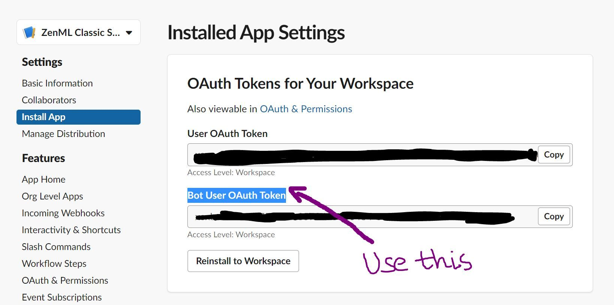
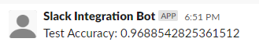
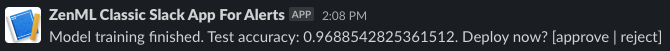

# ⏭ Send alerts to Slack from within your ZenML pipelines

This example showcases how to use the ZenML `Slack` integration to send alerts
to one of your Slack channels as part of your ML pipelines.
The integration includes an `alerter` component with two methods:
- `post()` takes a string as input, posts it to a Slack channel according to
  the alerter configuration, and returns whether the operation was successful.
- `ask()` also posts a given message to a Slack channel, but waits for user
  feedback, and only returns `True` if a user explicitly approved the operation.

These functionalities are very useful in practice:
- `post()` allows you to get notified immediately when failures happen 
  (e.g., model performance degradation, data drift, ...)
- `ask()` allows you to integrate a human-in-the-loop into your pipeline before
  executing critical steps.

The following are two very simple examples where we build a pipeline that trains 
and evaluates a sklearn SVC model on the digits datasets, and:
- posts the evaluation result (test accuracy) to Slack.
- posts the evaluation result (test accuracy) to Slack, 
  then deploys with MLflow if the user approved it in Slack.

## 🖥 Run it locally

### 📄 Prerequisites

In order to run this example, you need to have a Slack workspace set up
with a channel that you want your pipelines to post to.
Open the channel in a browser, then copy out the last part of the URL 
('C....').
This is the `<SLACK_CHANNEL_ID>` you will need when registering the
slack alerter component.

Then, you need to [create a Slack App](https://api.slack.com/apps?new_app=1)
with a bot in your workspace.
Under `OAuth & Permissions` you can find the `<SLACK_TOKEN>` of your bot,
which you will need later when defining the slack alerter stack component.
Also, under `Scopes` in the `OAuth & Permissions` tab, give your
bot `chat:write` and `chat:write.public` permissions.

**IMPORTANT**: Please make sure that the token is the `Bot User OAuth Token` not the 
`User OAuth Token`. See reference image attached:



Now you can get started with this example. 
Run the following code to install and initialize ZenML and create the stack.
Make sure to replace `<SLACK_TOKEN>` and `<SLACK_CHANNEL_ID>` first.

```shell
# install CLI
pip install "zenml[server]"

# install ZenML integrations
zenml integration install sklearn slack -y

# pull example
zenml example pull slack_alert
cd zenml_examples/slack_alert

# initialize
zenml init

# Start the ZenServer to enable dashboard access
zenml up

# register slack alerter
zenml alerter register slack_alerter --flavor=slack --slack_token=<SLACK_TOKEN> --default_slack_channel_id=<SLACK_CHANNEL_ID>

# register new stack with slack alerter and set it active
zenml stack register slack_stack -o default -a default -al slack_alerter --set

# add mlflow
zenml integration install mlflow -y
zenml model-deployer register mlflow --flavor=mlflow
zenml experiment-tracker register mlflow --flavor=mlflow
zenml stack update slack_stack -d mlflow -e mlflow
```

### ▶️ Run the Code

Now we're ready. Execute on of the following:

#### `post()` example

```shell
python run.py -c post
```

You should see the following output in your Slack channel:



#### `ask()` example

```shell
python run.py -c ask
```

You should see the following output in your Slack channel:



Respond with "approve" to deploy the model (or "reject" to abort)

### 🧽 Clean up

In order to clean up, delete the remaining ZenML references.

```shell
rm -rf zenml_examples
```

### ❓ Common Errors

If you experience trouble running `run_ask.py`, where the script halts and seems to wait for a
message from a Slack channel but in the first place does not send anything to the Slack channel,
please refer to this [issue](https://github.com/zenml-io/zenml/issues/1364).

You can quickly fix this by ensuring that the alerter is configured with the right `slack_token` (See [prerequisites](#-prerequisites)).

# 📜 Learn more

If you want to learn more about alerters in zenml in general or about how to 
build your own alerter steps in ZenML check out our 
[docs](https://docs.zenml.io/component-gallery/alerters/alerters).
