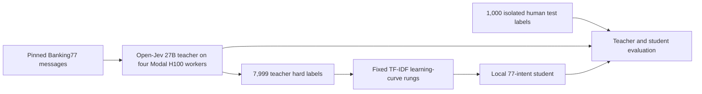

# Train a local decision model from an open System One teacher

This example tests Sean Goedecke's proposal that a System One model can generate the supervision for a smaller replacement. A pinned open-weight [`ZefanCai/Open-Jev-27B-v1.1`](https://huggingface.co/ZefanCai/Open-Jev-27B-v1.1/tree/28cf73067d5b337860bbef3c85b8b82ba8730956) teacher routes public Banking77 support messages across 77 intents. ZenML records its labels and runtime, trains a local TF-IDF classifier on those labels, and evaluates both models against human labels that never enter student training.

This is a fully public experiment. It does **not** call TypeSafe Jev, use the TypeSafe SDK, or require `TYPESAFE_API_KEY`. The teacher is an independently published open checkpoint served by the pinned [Open-Jev code](https://github.com/Zefan-Cai/Open-Jev/tree/3308a15ccd7eea1df7a37d6ddc39b023b801ba16).



## What the experiment proves

The experiment asks a narrow question: after an open System One teacher has classified a finite set of messages, how much of that behavior can a cheap task-specific classifier recover? The teacher emits a complete probability distribution for every decision, which ZenML preserves for audit and teacher evaluation. The current student deliberately learns only the teacher's top-choice hard label, making the first result simple to reproduce and interpret.

The pinned checkpoint's [training provenance](https://huggingface.co/ZefanCai/Open-Jev-27B-v1.1/blob/28cf73067d5b337860bbef3c85b8b82ba8730956/provenance/original-training-mixture-manifest.json) does not list Banking77 as a training source, but its [published verification](https://huggingface.co/ZefanCai/Open-Jev-27B-v1.1/blob/28cf73067d5b337860bbef3c85b8b82ba8730956/verification/jevbench.json) includes public JevBench tasks. Treat the teacher's held-out score here as context for the distillation result, not as a new independent benchmark of Open-Jev.

The source is the `banking77` configuration of [`Praveenrajus/jev-bench`](https://huggingface.co/datasets/Praveenrajus/jev-bench/tree/59d35a0ea406d75c55b3030cd52d9177abfde466), pinned to commit `59d35a0ea406d75c55b3030cd52d9177abfde466`. The loader validates the exact choice question and 77-label taxonomy from that revision before making any teacher call.

The split is fixed before inference:

- The source provides 8,000 training messages. One normalized training message duplicates a test message, so the loader removes `banking77/train/6419` and leaves 7,999 teacher-labeling inputs.
- The source's 500 validation messages and human labels form the teacher pilot. Any validation message whose normalized text matches the final test set is removed as a complete input-and-label record. The teacher receives only the retained messages and public taxonomy; its validation labels remain isolated until evaluation.
- All 1,000 final-test messages and human gold labels remain in their original order and untouched until the fixed full run. The teacher sees only each message and the public taxonomy. The student sees neither test messages nor test labels during fitting.
- Student rungs use predetermined nested prefixes of 250, 500, 1,000, 2,000, 4,000, and 7,999 teacher-labeled training messages. The 7,999-example rung is designated as the final model before test metrics are computed.

Every rung is reported on the same human test set to show the learning curve, but test performance does not select a rung, alter a hyperparameter, or promote a different model. The pilot uses only the separate validation split, so the final test remains untouched until every teacher, student, and rung setting is fixed.

## Requirements

Create a local environment and install the public data, ZenML, and student dependencies:

```bash
uv venv --python 3.12
uv pip install -r examples/system_one_distillation/requirements.txt
zenml integration install modal --uv -y
```

Select a ZenML project and a stack whose orchestrator is Modal. The reference run used a Modal `dev` environment and four parallel H100 workers for the open 27B teacher. Each independently cached shard loads the same pinned checkpoint and labels one contiguous quarter of the fixed cohort. The TF-IDF training and evaluation steps run without a GPU.

```bash
zenml project set <your-project>
zenml stack set <your-modal-stack>
zenml stack describe
```

The first remote run builds an image containing the Open-Jev package pinned to code commit `3308a15ccd7eea1df7a37d6ddc39b023b801ba16`; the runner also pins the Hugging Face model to commit `28cf73067d5b337860bbef3c85b8b82ba8730956`. You can pass `--runtime-image` with a compatible prebuilt image to skip that build. The remote environment needs ordinary Hugging Face download access, but the public checkpoint does not require a private API credential.

## Run the teacher pilot

Run the small validation pilot first to confirm that the model downloads, the H100 can load the checkpoint, all 77 probabilities are returned, and ZenML materializes the evaluation artifact without opening the final test set:

```bash
uv run python -m examples.system_one_distillation.run pilot \
  --evaluation-limit 100 \
  --batch-size 32 \
  --gpu H100
```

Keep prefix caching disabled for the reference result. The Open-Jev model card identifies uncached inference as its conservative validated path; `--prefix-cache` is available as an explicit performance experiment rather than part of the baseline.

## Run the full distillation experiment

The full pipeline labels the 7,999 training messages and 1,000 test messages once, trains every fixed nested student rung, evaluates the open teacher and students against the isolated human test labels, and returns the final 7,999-example student as a ZenML artifact:

```bash
uv run python -m examples.system_one_distillation.run full \
  --batch-size 32 \
  --gpu H100
```

The H100 steps can take substantially longer than an ordinary API-backed example because the teacher scores every candidate intent locally. Four deterministic shards reduce wall time and allow a failed shard to resume from the other three cached artifacts. Keep the Modal timeout and GPU allocation in `run_banking77.py` when adapting the command to another stack.

## Results

<!-- BANKING77_RESULTS_START -->

The reference ZenML run completed on September 25, 2026. The final student matched the teacher's human-grounded performance while agreeing with 82.5% of its decisions. Its 0.1 percentage-point accuracy advantage is too small to interpret as evidence that the student is better; the useful result is that a local linear model recovered the 27B teacher's task performance.

| Model | Teacher labels | Human-test accuracy | Human-test macro F1 | Teacher agreement | Measured decisions/s |
| --- | ---: | ---: | ---: | ---: | ---: |
| Open-Jev 27B teacher | N/A | 67.5% | 65.9% | N/A | 2.41 |
| TF-IDF student | 250 | 32.1% | 28.0% | 39.3% | N/A |
| TF-IDF student | 500 | 44.5% | 41.3% | 52.5% | N/A |
| TF-IDF student | 1,000 | 51.8% | 49.8% | 62.6% | N/A |
| TF-IDF student | 2,000 | 58.2% | 56.6% | 71.9% | N/A |
| TF-IDF student | 4,000 | 64.8% | 62.9% | 78.8% | N/A |
| TF-IDF student, predetermined final rung | 7,999 | 67.6% | 66.0% | 82.5% | 15,341 |

<!-- BANKING77_RESULTS_END -->

Accuracy and macro F1 measure agreement with the original human labels. Teacher agreement measures imitation and cannot establish that the student is correct. Teacher throughput divides all 8,999 decisions by the slowest shard's measured inference time. That parallel figure comes from four H100 workers; one H100 alone labels about 0.61 decisions per second. Four H100 workers took 3,733 seconds of parallel inference wall time and 14,828 total worker-seconds with batch size 32 and prefix caching disabled. This excludes Modal provisioning, image startup, checkpoint download and loading, worker start skew, artifact materialization, and downstream training.

The final student artifact is 70,090,823 bytes (66.8 MiB). Its throughput is the median of five warm batch predictions over the same 1,000 test messages on an Apple M5 Pro MacBook Pro with 24 GB RAM and Python 3.14.4: 65.2 milliseconds per batch, or 15,341 decisions per second. Teacher and student throughput therefore describe different hardware and execution modes; they show the serving-cost change rather than a controlled hardware benchmark. The ZenML report also records negative log likelihood, Brier score, top-label calibration error, exact dataset and model revisions, and duplicate removal.

## Train a small-LLM student from the same teacher labels

The TF-IDF student shows how little model the decision needs. A second experiment asks what a pretrained language model adds. It fine-tunes the text backbone of [`Qwen/Qwen3.5-0.8B`](https://huggingface.co/Qwen/Qwen3.5-0.8B/tree/2fc06364715b967f1860aea9cf38778875588b17) with a new 77-way head, using the same teacher hard labels, the same six nested rungs, and the same rule that the largest rung is final.

The teacher does not run again. The pipeline takes the finished run's stored artifact versions as inputs: the training cohort, the gold test cohort, the merged teacher labels, and the TF-IDF report. Both student families therefore learn from, and are graded on, identical data:

```bash
uv run python -m examples.system_one_distillation.run qwen \
  --source-run <completed-full-run-id> \
  --gpu L40S \
  --runtime-image <the image built by the full run>
```

The training recipe in `banking77_qwen_student.py` was fixed before any test evaluation: learning rates of 2e-5 for the backbone and 1e-3 for the head, batch size 16, and at least three epochs or 150 optimizer steps per rung, whichever is larger. Training uses bfloat16 autocast; evaluation and the saved weights stay in float32, so reported metrics describe the stored model exactly.

### Qwen student results

The reference run trained all six Qwen rungs on one L40S in 56 minutes, reusing the stored teacher labels from the full run.

| Teacher labels | Qwen accuracy | Qwen macro F1 | Qwen teacher agreement | TF-IDF accuracy |
| ---: | ---: | ---: | ---: | ---: |
| 250 | 37.0% | 34.1% | 43.5% | 32.1% |
| 500 | 52.3% | 50.0% | 62.9% | 44.5% |
| 1,000 | 62.0% | 60.5% | 73.1% | 51.8% |
| 2,000 | 65.3% | 63.9% | 78.0% | 58.2% |
| 4,000 | 67.4% | 65.8% | 82.5% | 64.8% |
| 7,999 (final) | 68.6% | 67.8% | 82.3% | 67.6% |

The Qwen student learns faster: at 2,000 labels it matches the TF-IDF student at 4,000. At the final rung, the teacher (67.5%) and both students are statistically tied. Qwen is right on 65 test messages the teacher misses and wrong on 54 the teacher gets right (exact McNemar p = 0.36; bootstrap 95% interval for the accuracy difference, -1.1 to +3.3 points). Against TF-IDF the split is 57 to 47 (p = 0.38).

Qwen's probabilities are less trustworthy: top-label calibration error is 0.258 against 0.112 for TF-IDF, and Brier score is 0.557 against 0.503. The final student is 3.0 GB of float32 weights. Reloaded from ZenML on an Apple M5 Pro MacBook Pro, it reproduced the reported 68.6% accuracy exactly and routed the 1,000 test messages in a median 18.2 seconds on the built-in GPU (55 decisions per second).

## Why ZenML is useful here

ZenML turns the demonstration into a reproducible sequence of typed artifacts: pinned label-free inputs, teacher decisions, a fixed learning curve, the reloadable student, and human-grounded metrics. Each complete cohort and teacher shard is one Pydantic collection artifact, so the remote artifact store writes one JSON document instead of one object for every message. A later run cannot silently follow a new dataset or model revision, expose training labels to the teacher, move a duplicate into the test set, or select a flattering student rung without changing the recorded inputs and lineage.

The resulting student is small enough to run locally and specializes in one stable decision. This differs from training another general 27B decision model: the expensive teacher is used to create a bounded dataset once, while the replacement serves the repeated application decision.

Primary references: [System One models can train their own replacements](https://www.seangoedecke.com/system-one-models-can-train-their-own-replacements/), [jev-bench Banking77 source and provenance](https://huggingface.co/datasets/Praveenrajus/jev-bench/tree/59d35a0ea406d75c55b3030cd52d9177abfde466), [Open-Jev model revision](https://huggingface.co/ZefanCai/Open-Jev-27B-v1.1/tree/28cf73067d5b337860bbef3c85b8b82ba8730956), [Open-Jev code revision](https://github.com/Zefan-Cai/Open-Jev/tree/3308a15ccd7eea1df7a37d6ddc39b023b801ba16), and [ZenML's Modal orchestrator documentation](https://docs.zenml.io/stacks/stack-components/orchestrators/modal).
