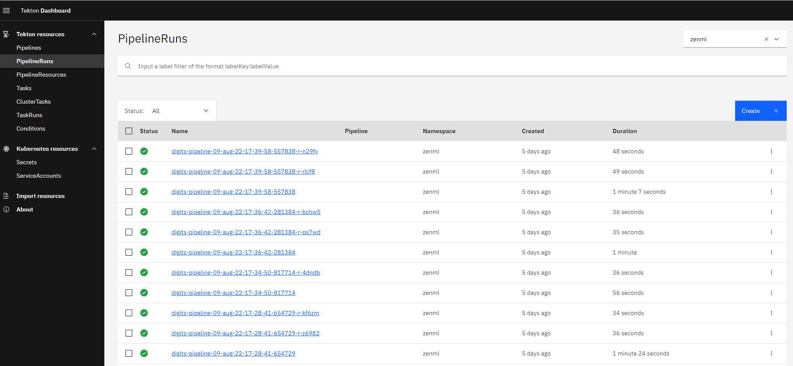
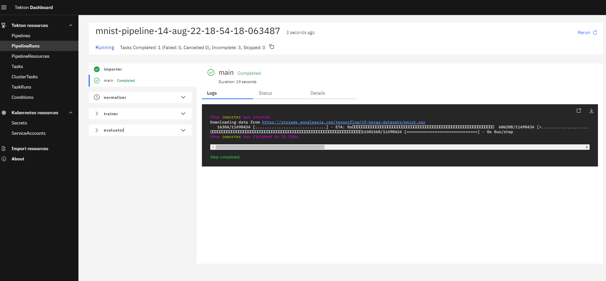
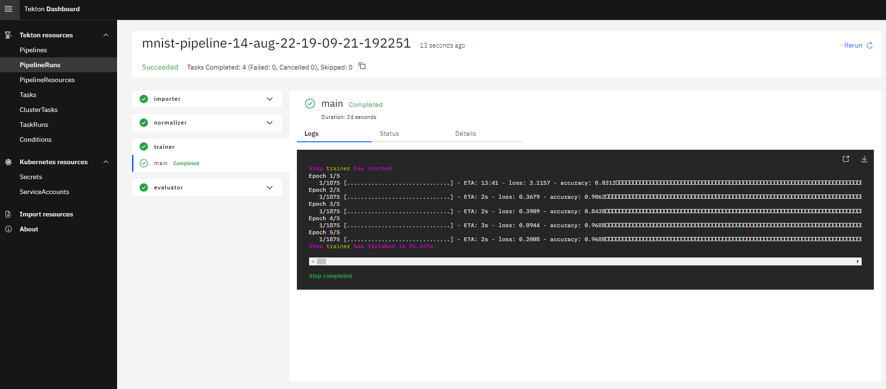

# 🏃 Run pipelines in production using Tekton Pipelines

When developing ML models, you probably develop your pipelines on your local
machine initially as this allows for quicker iteration and debugging. However,
at a certain point when you are finished with its design, you might want to 
transition to a more production-ready setting and deploy the pipeline to a more
robust environment.

[Tekton](https://tekton.dev/) is a powerful and flexible open-source framework 
for creating CI/CD systems, allowing developers to build, test, and deploy 
across cloud providers and on-premise systems. This examples shows you how easy 
it is to deploy ZenML pipelines on Tekton.

# 🖥 Run it

## 📄 Prerequisites

In order to run this example, we have to install a few tools that allow ZenML to
spin up a Tekton Pipelines setup:

* The Kubernetes command-line tool [Kubectl](https://kubernetes.io/docs/tasks/tools/#kubectl)
to deploy Tekton Pipelines
* [Docker](https://docs.docker.com/get-docker/) to build docker images that run
your pipeline in Kubernetes pods 

Next, we will install ZenML, get the code for this example and initialize a
ZenML repository:

```bash
# Install python dependencies
pip install "zenml[server]"

# Install ZenML integrations
zenml integration install tekton tensorflow

# Pull the tekton example
zenml example pull tekton_pipelines_orchestration
cd zenml_examples/tekton_pipelines_orchestration

# Initialize a ZenML repository
zenml init
```

## 🏃 Run the pipeline **without** tekton pipelines

We can now run the pipeline by simply executing the python script:

```bash
python run.py
```

The script will run the pipeline locally.

Re-running the example with different hyperparameter values will re-train
the model.

```shell
python run.py --lr=0.02
python run.py --epochs=10
```

## Run the same pipeline on a local Tekton Pipelines deployment

### 📄 Infrastructure Requirements (Pre-requisites)

You don't need to set up any infrastructure to run the pipeline locally. However, you need the following tools installed:
  * Docker must be installed on your local machine.
  * Install k3d by running `curl -s https://raw.githubusercontent.com/rancher/k3d/main/install.sh | bash`.

## Create a local Tekton Pipelines Stack

To get a stack with Tekton Pipelines and potential other components, you can make use of ZenML's Stack Recipes that are a set of terraform based modules that take care of setting up a cluster with Tekton among other things.

Run the following command to deploy the local Tekton Pipelines stack:

```bash
zenml stack recipe deploy k3d-modular --install tekton
```

>**Note**:
> This recipe comes with MLflow, Kubeflow and Minio enabled by default. If you want any other components like KServe, or Seldon, you can specify that using the `--install/-i` flag.

This will deploy a local Kubernetes cluster with Tekton Pipelines installed. You can verify this by running `kubectl get pods` and checking if the Tekton Pipelines pods are running.
It will also generate a stack YAML file that you can import as a ZenML stack by running 

```bash
zenml stack import -f <path-to-stack-yaml>
```
Once the stack is set, you can then simply proceed to running your pipelines.

## 🏃️ Run the same pipeline on a cloud-based Tekton Pipelines deployment

### 📄 Infrastructure Requirements (Pre-requisites)

Now with all the installation and initialization out of the way, all that's left
to do is configuring our ZenML [stack](https://docs.zenml.io/getting-started/core-concepts). For
this example, we will use GCP, but any other cloud provider of choice can be used instead. We require the following infrastructure set up:

* A remote ZenML server deployed to the cloud. See the 
[deployment guide](https://docs.zenml.io/getting-started/deploying-zenml) for
more information.
* An existing [GCP container registry](https://cloud.google.com/container-registry/docs).
* An existing [GCP bucket](https://cloud.google.com/storage/docs/creating-buckets).
* [Tekton Pipelines](https://tekton.dev/docs/pipelines/install/#installing-tekton-pipelines-on-kubernetes) deployed to a Google 
Kubernetes Engine cluster.
* The local docker client has to be [authorized](https://cloud.google.com/container-registry/docs/advanced-authentication) 
to access the GCP container registry.
* Kubectl can [access](https://cloud.google.com/kubernetes-engine/docs/how-to/cluster-access-for-kubectl) your GCP 
Kubernetes cluster.

Note that you can deploy the GCP container
registry, the artifact store and the Tekton orchestrator using the ZenML CLI as
well, using the `zenml <STACK_COMPONENT> deploy` command. For more information
on this `deploy` subcommand, please refer to the
[documentation](https://docs.zenml.io/advanced-guide/practical-mlops/stack-recipes#deploying-stack-components-directly).

### 🥞 Create a Tekton Pipelines Stack

To run our pipeline on Tekton Pipelines deployed to GCP, we will create a new 
stack with these components:

* The **artifact store** stores step outputs in a GCP Bucket.
* The docker images that are created to run your pipeline are stored in 
GCP **container registry**.
* The **Tekton orchestrator** is responsible for running your ZenML pipeline 
in Tekton Pipelines. We need to configure it with the right kubernetes context 
so ZenML can run pipelines in your GCP cluster. 
* An **Image Builder** that builds Docker images for your pipeline steps.

When running the upcoming commands, make sure to replace 
`<PATH_TO_YOUR_CONTAINER_REGISTRY>` and `<PATH_TO_YOUR_GCP_BUCKET>` with the 
actual URIs of your container registry and bucket. You will also need to replace
`<NAME_OF_GCP_KUBERNETES_CONTEXT>` with the kubernetes context pointing to your 
gcp cluster.

```bash
# In order to create the GCP artifact store, we need to install one additional ZenML integration:
zenml integration install gcp

# Create and activate the stack and its components
zenml container-registry register gcr_registry --flavor=gcp --uri=<PATH_TO_YOUR_CONTAINER_REGISTRY>

zenml artifact-store register gcp_artifact_store --flavor=gcp --path=<PATH_TO_YOUR_GCP_BUCKET>

zenml orchestrator register gcp_tekton_orchestrator --flavor=tekton --kubernetes_context=<NAME_OF_GCP_KUBERNETES_CONTEXT>

zenml image-builder register local_builder --flavor=local

zenml stack register gcp_tekton_stack \
    -a gcp_artifact_store \
    -o gcp_tekton_orchestrator \
    -c gcr_registry \
    -i local_builder \
    --set
```

### 🏁 See the Tekton Pipelines UI locally

To get the Tekton Pipelines UI endpoint, we can use the following command:

```bash
kubectl get ingress -n tekton-pipelines  -o jsonpath='{.items[0].spec.rules[0].host}'
```




### ▶️ Run the pipeline

Configuring and activating the new stack is all that's necessary to switch from 
running your pipelines locally to running them on GCP:

```bash
python run.py
```



That's it! If everything went as planned this pipeline should now be running in 
the cloud, and we are one step closer to a production pipeline!



### 💻 Specifying per-step resources

If you're using the Tekton orchestrator and some of your pipelines steps have 
certain hardware requirements, you can specify them using the step decorator as 
follows:

```python
from zenml import step
from zenml.steps import ResourceSettings

@step(settings={"resources": ResourceSettings(cpu_count=8, memory="16GB")})
def my_step(...) -> ...:
    ...
```

This will make sure that your step runs on a machine with the specified 
resources as long as such a machine is available in the Kubernetes cluster 
you're using.

### 🧽 Clean up

Once you're done experimenting, you can delete the example files by calling:

```bash
rm -rf zenml_examples
```

To destroy any resources deployed using the ZenML `deploy` subcommand, use the
`destroy` subcommand to delete each individual stack component, as in the
following example:

```shell
# replace with the name of the component you want to destroy
zenml artifact-store destroy gcp_artifact_store
```

# 📜 Learn more

Our docs regarding the Tekton orchestrator integration can be found 
[here](https://docs.zenml.io/component-gallery/orchestrators/tekton).

If you want to learn more about orchestrators in general or about how to build 
your own orchestrators in ZenML check out our 
[docs](https://docs.zenml.io/component-gallery/orchestrators/custom).
