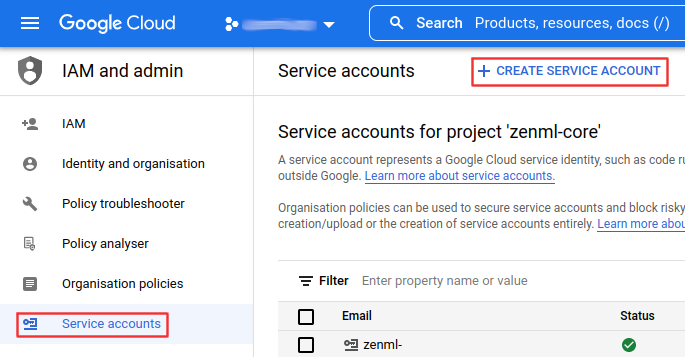
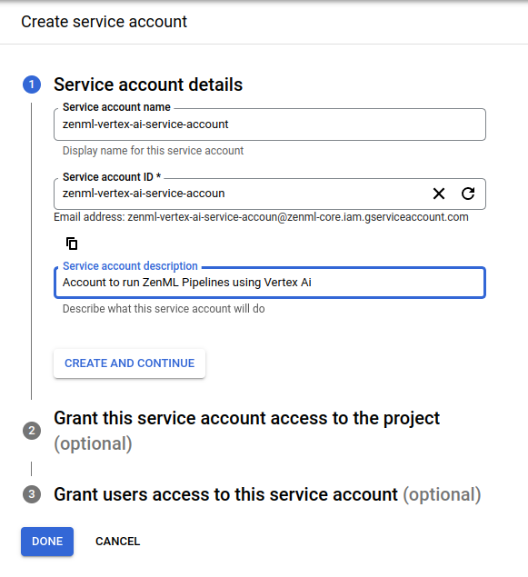
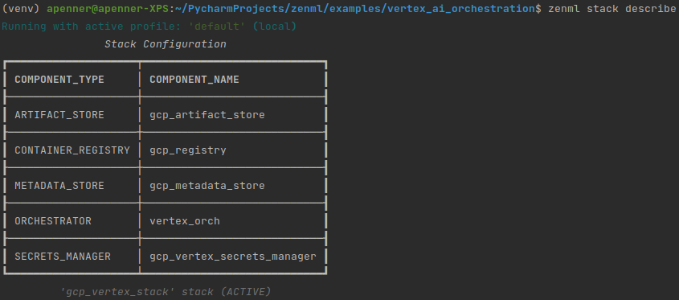
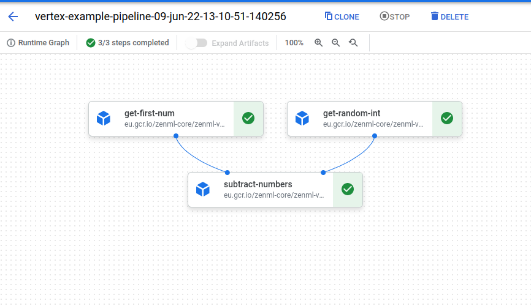

# 🏃 Run pipelines in production using Vertex AI

[Vertex AI Pipelines](https://cloud.google.com/vertex-ai/docs/pipelines/introduction)
is a serverless ML workflow tool running on the Google Cloud Platform. It is
an easy way to quickly run your code in a production-ready, repeatable 
cloud orchestrator that requires minimal setup without provisioning and paying 
for standby compute. 

## 📄 Pre-requisites

In order to run on Vertex AI you will need to do quite a bit of configuration
within GCP to create all the required resources. In sum you will need to have a
[GCP container registry](https://cloud.google.com/container-registry/docs), a
[GCP bucket](https://cloud.google.com/storage/docs/creating-buckets),
[CloudSQL database](https://cloud.google.com/sql/docs/mysql/create-instance) and
a [GCP Secret Manager](https://cloud.google.com/secret-manager). Additionally,
the [Vertex AI API](https://cloud.google.com/vertex-ai/?hl=en_GB&_ga=2.241201409.-205697788.1651483076)
needs to be enabled.

On top of having these resources you will also need to do some permission
tuning.

First, you will need to authenticate yourself using the
[gcloud cli](https://cloud.google.com/sdk/gcloud/reference/auth/login):

```shell
gcloud auth login
```

Then you will need to
[authorize](https://cloud.google.com/container-registry/docs/advanced-authentication)
your local Docker client to have access the GCP container registry.

```shell
gcloud auth configure-docker
```

You will also need to 
[create a service account](https://cloud.google.com/iam/docs/creating-managing-service-accounts).



This service account will need permissions to run Vertex AI jobs, and access 
secrets as Admin. Additionally, your user account will need to have permissions to use the service 
account.



For your CloudSQL database it is also recommended to enable SSL authentication. 
You will need to create a client certificate and download all three certificates. 
Save these, you will need them at a later point.

## 🚅 That seems like a lot of infrastructure work. Is there a Zen 🧘 way to run this example?

Yes! With [ZenML Stack Recipes](../../docs/book/stack-deployment-guide/stack-recipes.md), you can now provision all the infrastructure you need to run your ZenML pipelines with just a few simple commands.

The flow to get started for this example can be the following:

1. Pull the `vertex-ai` recipe to your local system. Learn more about what this recipe does from its README.

    ```shell
    zenml stack recipe pull vertex-ai
    ```
2. (Optional) 🎨 Customize your deployment by editing the default values in the `locals.tf` file.

3. 🚀 Deploy the recipe with this simple command.

    ```shell
    zenml stack recipe deploy vertex-ai
    ```
    > **Note**
    > This command can also automatically import the resources created as a ZenML stack for you. Just run it with the `--import` flag and optionally provide a `--stack-name` and you're set! Keep in mind, in that case, you'll need all integrations for this example installed before you run this command.

    > **Note**
    > You should also have [kubectl](https://kubernetes.io/docs/tasks/tools/#kubectl) and [docker](https://docs.docker.com/engine/install/) installed on your local system with the local [docker client authorized](https://cloud.google.com/sdk/gcloud/reference/auth/configure-docker) to push to your cloud registry.
    
4. You'll notice that a ZenML stack configuration file gets created 🤯! You can run the following command to import the resources as a ZenML stack, manually.

    ```shell
    zenml stack import <STACK_NAME> -f <PATH_TO_THE_CREATED_STACK_CONFIG_YAML>

    # set the imported stack as the active stack
    zenml stack set <STACK_NAME>
    ```

5. You should now create a secret for the CloudSQL instance that will allow ZenML to connect to it. Use the following command:

    ```bash
    zenml secrets-manager secret register gcp_mysql_secret --schema=mysql --user=<DB_USER> --password=<PWD> \
      --ssl_ca=@</PATH/TO/DOWNLOADED/SERVER-CERT> \
      --ssl_cert=@</PATH/TO/DOWNLOADED/CLIENT-CERT> \
      --ssl_key=@</PATH/TO/DOWNLOADED/CLIENT-KEY>
    ```

    The values for the username and password can be obtained by running the following commands inside your recipe directory.

    ```bash
    terraform output metadata-db-username

    terraform output metadata-db-password
    ```

    For the certificates, visit the Google Cloud Console to [create a certificate and download the files](https://cloud.google.com/sql/docs/mysql/configure-ssl-instance#:~:text=Cloud%20SQL%20Instances-,To%20open%20the%20Overview%20page%20of%20an%20instance%2C%20click%20the,Click%20Create%20client%20certificate.) to your system.

You can now skip directly to [running the pipeline](#%EF%B8%8F-run-the-pipeline)!

## 🥞 Create a GCP Kubeflow Pipelines stack

Once everything is done on the GCP side, we will need to configure a
stack with all of these components.

* The **artifact store** to store step outputs in a GCP Bucket.
* The **metadata store** to track metadata inside a MySQL database.
* The Docker images that are created to run your pipeline are stored in GCP
  **container registry**.
* The **Vertex orchestrator** is responsible for running your ZenML pipeline
  in Vertex AI.
* The **secrets manager** contains the secrets to allow access to the metadata
  store.

When running the upcoming commands, make sure to
replace all the <PLACEHOLDERS> with the correct values from your GCP project.

```bash
# install CLI
pip install zenml

# install ZenML integrations
zenml integration install gcp

# pull example
zenml example pull vertex_ai_orchestration
cd zenml_examples/vertex_ai_orchestration

# Create a zenml repository
zenml init
 
# In order to create the GCP stack components, we'll need to install one 
# additional ZenML integration:
zenml integration install gcp

# The CONTAINER_REGISTRY_URI will have a format like this: eu.gcr.io/xxx/xxx
zenml container-registry register gcp_registry --flavor=gcp --uri=<CONTAINER_REGISTRY_URI>

# The DB_HOST_IP is the public IP Address of your Database: xx.xx.xxx.xxx
#  The DB_PORT is 3306 by default - set this in case this default does not apply
#  The DB_NAME is the name of the database that you have created in GCP as the
#  metadata store. The `mysql_secret` will be created once the secrets manager
#  is created and the stack is active.
zenml metadata-store register gcp_metadata_store --flavor=mysql --host=<DB_HOST_IP> --port=<DB_PORT> --database=<DB_NAME> --secret=mysql_secret
  
# The PATH_TO_YOUR_GCP_BUCKET is the path to your GCP bucket: gs://xxx
zenml artifact-store register gcp_artifact_store --flavor=gcp --path=<PATH_TO_YOUR_GCP_BUCKET>

# The orchestrator needs the PROJECT_ID and the GCP_LOCATION in which to
#  run the Vertex AI pipeline. Additionally you might need to set the 
#  WORKLOAD_SERVICE_ACCOUNT to the service account you created with secret
#  manager access, it will be in the format: xxx@xxx.iam.gserviceaccount.com
zenml orchestrator register vertex_orch --flavor=vertex --project=<PROJECT_ID> --location=<GCP_LOCATION>

# For the secrets manager, all we'll need it the gcp PROJECT_ID
zenml secrets-manager register gcp_secrets_manager --flavor=gcp_secrets_manager --project_id=<PROJECT_ID>

# Now we're ready to assemble our stack
zenml stack register gcp_vertex_stack -m gcp_metadata_store -a gcp_artifact_store -o vertex_orch -c gcp_registry -x gcp_secrets_manager --set

# With the stack up and running, we can now supply the credentials for the 
#  mysql metadata store. The SSL certificates have to be generated and downloaded
#  from within the CloudSQL UI
zenml secrets-manager secret register mysql_secret --schema=mysql --user=<DB_USER> --password=<PWD> \
  --ssl_ca=@</PATH/TO/DOWNLOADED/SERVER-CERT> \
  --ssl_cert=@</PATH/TO/DOWNLOADED/CLIENT-CERT> \
  --ssl_key=@</PATH/TO/DOWNLOADED/CLIENT-KEY>
```

Your stack should look something like this when you're done:



### ▶️ Run the pipeline

Once your stack is fully set up, you should be good to go. 

```bash
python run.py
```

That's it! If everything went as planned this pipeline should now be running in
the cloud! You should be able to access the Vertex AI Pipelines UI with the link
returned to the run logs. It will look something like this:



### 💻 Specifying per-step resources

If you're using the Vertex orchestrator and some of your pipelines steps have certain
hardware requirements, you can specify them using the step decorator as follows:

```python
from zenml.steps import step, ResourceConfiguration

@step(resource_configuration=ResourceConfiguration(cpu_count=8, memory="16GB"))
def my_step(...) -> ...:
    ...
```

### 🧽 Clean up

Once you're done experimenting, you can stop the port forwarding and delete the
example files by calling:

```bash
zenml stack down --force
rm -rf zenml_examples
```

Additionally, you might have to clean up your cloud resources to avoid running 
costs for storage of artifacts, containers, metadata or secrets.

# 📜 Learn more

Our docs regarding the VertexAI integration can be found [here](https://docs.zenml.io/mlops-stacks/orchestrators/gcloud-vertexai).

If you want to learn more about orchestrators in general or about how to build
your own orchestrators in ZenML
check out our [docs](https://docs.zenml.io/mlops-stacks/orchestrators/custom).
