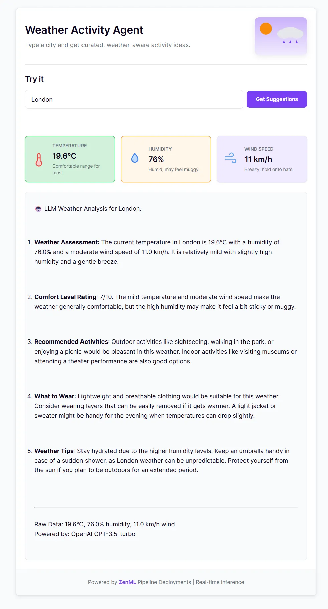
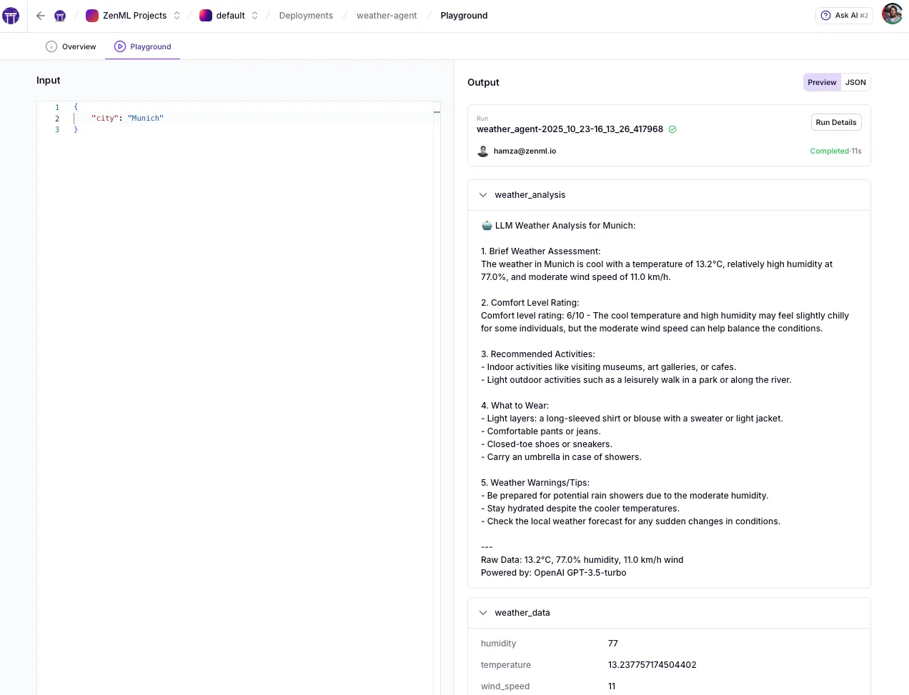

# Build LLM-Powered Weather Analysis Agents

Learn how to deploy an intelligent weather agent pipeline that uses OpenAI or rule-based logic to provide weather recommendations and analysis.

## 🎯 What You'll Learn



- Create multi-step pipelines for LLM-powered agents
- Integrate OpenAI for intelligent analysis with fallback logic
- Deploy agent pipelines as real-time HTTP services
- Handle graceful degradation when external APIs are unavailable
- Track agent reasoning and outputs with full ZenML lineage

## 🏃 Quickstart

```bash
pip install -r requirements.txt
zenml init
zenml login
python run.py
```

Deploy the agent pipeline as a real-time service ([see code](pipelines/weather_agent.py)):

```bash
# See service at http://localhost:8000
zenml pipeline deploy pipelines.weather_agent.weather_agent
```

**Make predictions via API**

```bash
curl -X POST http://localhost:8000/invoke \
  -H "Content-Type: application/json" \
  -d '{
    "parameters": {
      "city": "Paris"
    }
  }'
```

Visit `http://localhost:8000` for the interactive UI ([see code](ui/index.html)).

**Use the ZenML Deployment Playground**



The ZenML dashboard includes a built-in playground for deployed pipelines, allowing you to test your service directly from the UI without writing any code. Simply navigate to your deployment in the dashboard, fill in the input parameters interactively, and send requests to see real-time predictions. This makes it easy to validate your deployment, debug issues, and share working examples with your team—all without leaving the browser or crafting curl commands.

**View API documentation**
Visit `http://localhost:8000/docs` for interactive Swagger documentation.

## 📋 Prerequisites

- OpenAI API key (optional, for LLM analysis). Set as: `export OPENAI_API_KEY="your-key"`

## 🏗️ What's Inside

```
weather_agent/
├── pipelines/
│   ├── weather_agent.py        - Main agent pipeline orchestration
│   └── hooks.py                - LLM client initialization and cleanup
├── steps/
│   └── weather_agent.py        - Weather data fetching and analysis steps
├── ui/
│   └── index.html              - Interactive web interface (optional)
├── run.py                      - CLI for batch and real-time execution
└── requirements.txt            - Dependencies
```

**How it works**: The pipeline fetches weather data for a city, then uses OpenAI GPT-3.5-turbo to provide intelligent recommendations. If the API is unavailable, it gracefully falls back to rule-based analysis. Both paths produce consistent outputs (comfort ratings, activity suggestions, clothing advice).

## 🔑 Key Concepts

### **Pipeline Deployments**

Configure the deployed service UI, title, and CORS using `DeploymentSettings`:

```python
from zenml.pipelines import pipeline
from zenml.config import DeploymentSettings, CORSConfig

@pipeline(
    settings={
        "deployment": DeploymentSettings(
            app_title="Weather Agent API",
            dashboard_files_path="ui",
            cors=CORSConfig(allow_origins=["*"]),
        ),
    }
)
def weather_agent_pipeline(city: str) -> Dict[str, Any]:
    return format_response(analyze_weather(fetch_weather(city)))
```

### **Warm Container Pattern**

Use `on_init` to set up shared resources (e.g., LLM client) once at startup and reuse them across requests:

```python
@pipeline(
    on_init=init_llm_client,      # Runs once at deployment startup
    on_cleanup=cleanup_llm_client # Clean shutdown
)
def weather_agent_pipeline(city: str) -> Dict[str, Any]:
    return format_response(analyze_weather(fetch_weather(city)))
```

### **Agent as Pipeline**

Model agent workflows using ZenML's pipeline abstraction. Each step is a distinct operation (fetch data, analyze, format output) with typed inputs/outputs:

```python
@pipeline
def weather_agent_pipeline(city: str) -> Dict[str, Any]:
    """Multi-step agent that analyzes weather and provides recommendations."""
    weather_data = fetch_weather(city)
    analysis = analyze_weather(weather_data)
    return format_response(analysis)
```

This makes agents reproducible, versionable, and observable—the same as classical ML pipelines.

### **Graceful Fallback Logic**

Handle external API failures without breaking the service by falling back to deterministic rules:

```python
@step
def analyze_weather(weather_data: Dict) -> Dict[str, Any]:
    """Analyze weather with LLM, fall back to rules if unavailable."""
    try:
        return llm_analysis(weather_data)  # OpenAI analysis
    except APIError:
        return rule_based_analysis(weather_data)  # Deterministic fallback
```

## 📚 Learn More

- [Pipeline Deployments Guide](https://docs.zenml.io/how-to/deployment/deployment)
- [Pipeline Hooks](https://docs.zenml.io/how-to/steps-pipelines/advanced_features#pipeline-and-step-hooks)
- [Custom Steps Guide](https://docs.zenml.io/how-to/steps-pipelines/steps_and_pipelines)
- [OpenAI Integration](https://docs.zenml.io/integrations/openai)
- [Related Example: Classical ML Deployment](../deploying_ml_model/README.md)
