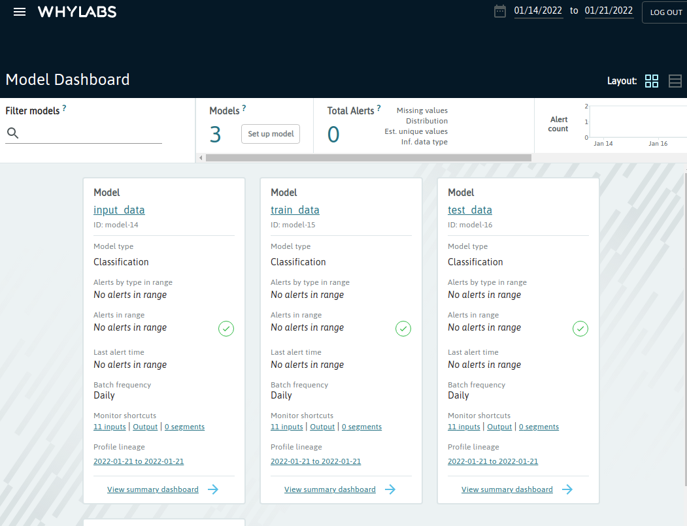
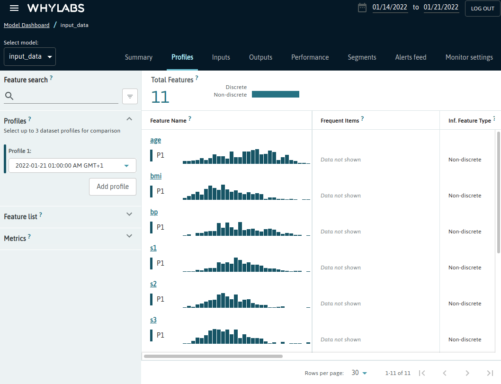

# 📊 Profiling Datasets with whylogs/WhyLabs
Data logging and profiling is an important part of any production ML
pipeline. [whylogs](https://whylabs.ai/whylogs) is an open source library
that analyzes your data and creates statistical summaries called whylogs
profiles. whylogs profiles can be visualized locally or uploaded to the
[WhyLabs](https://whylabs.ai/) platform where more comprehensive analysis 
can be carried out.

## 🗺 Overview
ZenML integrates seamlessly with whylogs and WhyLabs. This example shows
how easy it is to enhance steps in an existing ML pipeline with whylogs
profiling features. Changes to the user code are minimal while ZenML takes
care of all aspects related to whylogs serialization, versioning and persistence
and even uploading generated profiles to WhyLabs.

The ZenML whylogs integration includes a predefined `WhylogsProfilerStep` ZenML 
step class that can be
instantiated and inserted into any pipeline to generate a whylogs profile
out of a Pandas DataFrame and return the profile as a step output artifact.
Instantiating this type of step is simplified even further through the
use of the `whylogs_profiler_step` utility function.

## 🧰 How the example is implemented
The ZenML pipeline in this example is rather simple, consisting of a couple
of steps involving some processing of datasets. How these datasets are used in
the pipeline is irrelevant for the example - it could be data ingestion, feature
engineering, data processing, model training and validation or inference. What
is important is how ZenML allows you to effortlessly add whylogs profiling
capabilities to all the points in your ML pipeline where data is involved.

The first step in the pipeline shows how whylogs data profiles can be generated
and returned as step artifacts which will be versioned and persisted in the
Artifact Store just as any other artifacts.

It also shows how to automatically log all returned whylogs data profiles to
the Whylabs platform. This needs to be combined with configuring secrets 
in the whylogs Data Validator stack component to work, as detailed in the
[Run it locally](#-run-it-locally) section.

```python
from zenml import step
from zenml.steps import Output
from whylogs.core import DatasetProfileView
from zenml.integrations.whylogs.flavors.whylogs_data_validator_flavor import (
    WhylogsDataValidatorSettings,
)


@step(
    settings={
        "data_validator.whylogs": WhylogsDataValidatorSettings(
            enable_whylabs=True, dataset_id="model-1"
        )
    }
)
def data_loader() -> Output(data=pd.DataFrame, profile=DatasetProfileView,):
    ...

    dataset = load(...)

    ...
    profile = why.log(pandas=dataset).profile().view()
    return dataset, profile
```

If you want to enable Whylabs logging when using the class-based API, 
simply configure your step as follows:

```python
from zenml.steps import Output, BaseStep
from whylogs.core import DatasetProfileView

class DataLoader(BaseStep):
    def entrypoint(
        self,
    ) -> Output(data=pd.DataFrame, profile=DatasetProfileView,):
        ...

        dataset = load(...)

        ...
        profile = why.log(pandas=dataset).profile().view()
        return dataset, profile

step_instance = DataLoader()
step_instance.configure(
    settings={
        "data_validator.whylogs": WhylogsDataValidatorSettings(
            enable_whylabs=True, dataset_id="model-1"
        )
    }
)
```

Additional whylogs profiling steps can also be created using the
`whylogs_profiler_step` shortcut:

```python
from zenml.integrations.whylogs.steps import WhylogsProfilerParameters, whylogs_profiler_step

train_data_profiler = whylogs_profiler_step(
    step_name="train_data_profiler",
    params=WhylogsProfilerParameters(),
    dataset_id="model-2",
)
test_data_profiler = whylogs_profiler_step(
    step_name="test_data_profiler",
    params=WhylogsProfilerParameters(),
    dataset_id="model-3",
)
```

All the generated profiles are uploaded to WhyLabs automatically for steps with 
Whylabs logging enabled if the Whylabs credentials have been configured in the 
whylogs Data Validator stack component.

The `dataset_id` tags set for the profiles are used to associate
the datasets models with the models in the WhyLabs platform.




# ☁️ Run in Colab
If you have a Google account, you can get started directly with 
Google colab - [](https://colab.research.google.com/github/zenml-io/zenml/blob/main/examples/whylogs_data_profiling/whylogs.ipynb)

# 🖥 Run it locally

## 👣 Step-by-Step
### 📄 Prerequisites 
In order to run this example, you need to install and initialize ZenML:

```shell
# install CLI
pip install "zenml[server]"

# install ZenML integrations
zenml integration install whylogs sklearn

# pull example
zenml example pull whylogs_data_profiling
cd zenml_examples/whylogs_data_profiling

# Initialize ZenML repo
zenml init

# Start the ZenServer to enable dashboard access
zenml up
```

### 🥞 Set up your stack for whylogs/Whylabs

You need to have a whylogs Data Validator component to your stack to be able to
use whylogs data profiling in your ZenML pipelines. Creating such a stack is
easily accomplished:  

```shell
zenml data-validator register whylogs -f whylogs
zenml stack register whylogs_stack -o default -a default -dv whylogs --set
```

Adding Whylabs logging capabilities to that (in addition to the use of the base
whylogs data validation) is just a bit more complicated, as you
also need to configure a secret for the whylogs Data Validator component.:

```shell
zenml secret create whylabs_secret \
    --whylabs_default_org_id=<your-whylogs-organization-id> \
    --whylabs_api_key=<your-whylogs-api-key>

zenml data-validator register whylogs -f whylogs --authentication_secret=whylabs_secret --enable_whylabs=True
zenml stack register whylogs_stack -o default -a default -dv whylogs --set
```

### ▶️ Run the Code
Now we're ready. Execute:

```bash
python run.py
```

### 🧽 Clean up
In order to clean up, delete the remaining ZenML references.

```shell
rm -rf zenml_examples
```
