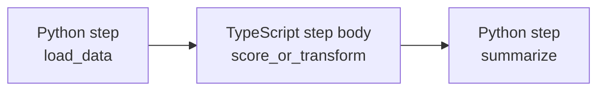
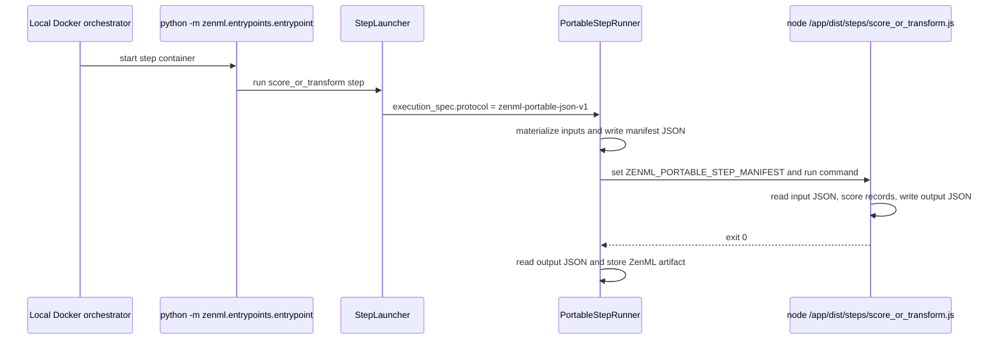

# ZenBabel mixed static pipeline

This example demonstrates the experimental ZenBabel portable JSON path with a small mixed-language static pipeline:

```text
Python load_data → TypeScript score_or_transform → Python summarize
```

The important claim is deliberately narrow: **the TypeScript step body runs, but the ZenML control plane is still Python**. Python still defines and submits the pipeline, the active ZenML stack still schedules the step containers, and ZenML still loads and stores artifacts through the existing Python materializer path.

## Why this matters

The useful v1 story is: a team can keep ZenML's existing Python orchestration model, but move one simple step body into another language when that language is a better fit. Imagine a frontend/platform team already owns a small TypeScript scoring rule. ZenBabel lets ZenML run that rule as a step without asking the team to rewrite it in Python first.

For now, the bridge is intentionally small. The step boundary is JSON files, not arbitrary Python objects.

## What this example proves

The pipeline has three steps:



The data crossing the language boundary is JSON-compatible only:

1. `load_data` returns a `list[dict[str, Any]]`.
2. `PortableStepRunner` materializes that Python artifact, validates that it is strict portable JSON, and writes it to an input JSON file.
3. The TypeScript process reads `ZENML_PORTABLE_STEP_MANIFEST`, reads the input JSON file, writes the output JSON file, and exits.
4. `PortableStepRunner` reads the output JSON back into Python and stores it through ZenML's normal built-in materializers.
5. `summarize` consumes the TypeScript output as an ordinary ZenML artifact.

## Runtime path

With the Local Docker orchestrator, the outer container path is unchanged. The step container still starts the normal ZenML Python entrypoint. The switch happens inside the step launcher:



## What v1 supports

This example is honest about the current scope:

- Static pipelines only.
- TypeScript step body only, not a full TypeScript SDK.
- Python-backed ZenML control plane.
- JSON-compatible inputs, outputs, and parameters only.
- Existing Python materializers store the artifacts after the TypeScript process returns JSON.
- Local Docker is the intended end-to-end demo path.

## What v1 does not support

ZenBabel portable JSON v1 does **not** support:

- Python-free pipeline submission.
- Dynamic pipelines with portable steps.
- pandas, NumPy, model objects, images, files, pickle/cloudpickle, or custom materializers across the TypeScript boundary.
- A stable public TypeScript SDK.
- Broad orchestrator-specific behavior beyond the existing container entrypoint path.

## Why there is a Python placeholder step

ZenML does not yet expose a public API where a Python pipeline can directly call a TypeScript step. This example therefore uses a small demo-only compiler bridge:

1. The Python pipeline is compiled normally with a placeholder Python step named `score_or_transform`.
2. `zenml.zenbabel.build_steps(...)` imports the external TypeScript step spec and creates a portable ZenML step description.
3. During compilation, the bridge patches only two fields on the compiled placeholder step:
   - `spec.source`, so the step points at `PortableStepAdapter` instead of the placeholder Python function.
   - `spec.execution_spec`, so `StepLauncher` routes the step to `PortableStepRunner`.
4. The bridge keeps the normal compiled inputs, upstreams, output shape, parameters, and Docker settings.

In other words: the normal Python compiler builds the train tracks, and ZenBabel swaps the engine for one step.

## Files

```text
zenbabel_mixed_static/
├── run.py                         # Python pipeline and demo compiler bridge
├── Dockerfile                     # Python + ZenML + Node image for the TS step
├── package.json                   # TypeScript build/smoke scripts
├── package-lock.json              # Reproducible TypeScript tool install
├── tsconfig.json
└── ts/src/
    ├── portable.ts                # Manifest/input/output helper
    ├── smoke.ts                   # Local TypeScript smoke test
    └── steps/score_or_transform.ts
```

## Run the TypeScript smoke test

From this directory:

```bash
npm ci
npm run build
npm run smoke
```

This does not start ZenML. It proves that the TypeScript helper can read a portable manifest, read input JSON, execute the step body, and write output JSON.

## Compile the ZenML snapshot without Docker

From the repository root, with the feature branch installed in your environment:

```bash
uv run python examples/zenbabel_mixed_static/run.py --compile-only
```

This compiles the Python pipeline with the demo bridge active and checks that `score_or_transform` was routed to `zenml-portable-json-v1` while preserving the Python `load_data` upstream wiring.

## Run with Local Docker

The intended end-to-end path uses a stack with the Local Docker orchestrator and a local artifact store. The TypeScript step has step-level `DockerSettings` pointing at the example `Dockerfile`.

```bash
# From the repository root
# Use an existing stack whose orchestrator flavor is `local_docker`, or create one.
zenml orchestrator register zenbabel_local_docker --flavor=local_docker
zenml stack register zenbabel_local_docker_stack \
  -o zenbabel_local_docker \
  -a <your-local-artifact-store> \
  --set

uv run python examples/zenbabel_mixed_static/run.py
```

The Dockerfile builds an image that contains:

- Python 3.12,
- the current ZenML worktree installed from `src/`, including the ZenBabel feature branch code,
- Node/npm,
- the compiled TypeScript step under `/app/dist/steps/score_or_transform.js`.

If Docker is too heavy for your local machine or the stack is not configured, run the TypeScript smoke test and the `--compile-only` check instead. Those checks prove the portable contract and the Python snapshot routing, but they do not prove container execution.

## The portable manifest contract

`PortableStepRunner` writes a temporary manifest and sets:

```text
ZENML_PORTABLE_STEP_MANIFEST=/tmp/.../manifest.json
```

The manifest shape used by the TypeScript helper is:

```json
{
  "protocol": "zenml-portable-json-v1",
  "step_name": "score_or_transform",
  "source_identity": "examples/zenbabel_mixed_static/ts/src/steps/score_or_transform.ts#scoreOrTransform",
  "parameters": {"threshold": 0.64},
  "inputs": {"records": "/tmp/.../inputs/input_0.json"},
  "outputs": {"output": "/tmp/.../outputs/output_0.json"}
}
```

The TypeScript process must exit with code `0` after writing every expected output. If it exits non-zero, writes invalid JSON, or misses an output file, the ZenML step fails through normal step failure handling.
